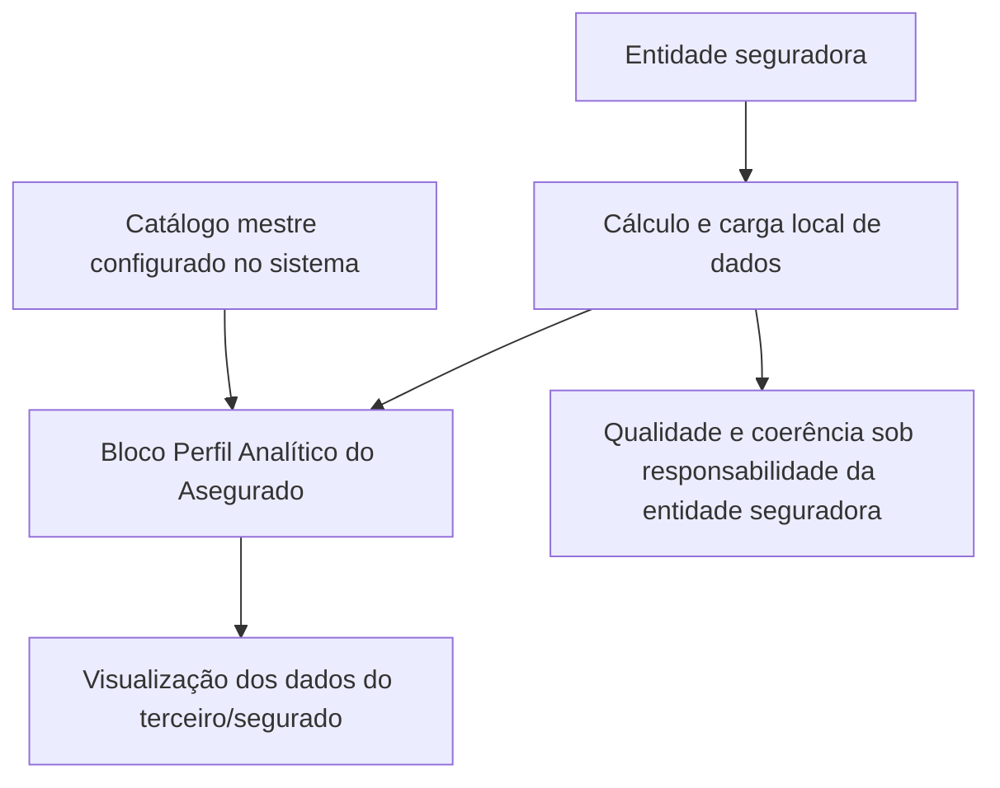

# Perfil Analítico do Asegurado — Atributos, Cálculos e Comportamento Digital MAPFRE

## 1. Metadados do Documento
- **Arquivo de Origem:** Não identificado no conteúdo fornecido
- **Tipo de Documento:** Especificação Técnica / Manual Funcional
- **Domínio / Sistema:** Perfil Analítico do Terceiro / Asegurado — MAPFRE
- **Público-Alvo:** Desenvolvedores, Arquitetos, Analistas Funcionais, Operação e equipes de dados das entidades seguradoras
- **Data/Versão Identificada:** Não identificada

---

## 2. Resumo Executivo & Contexto de Negócio

O documento descreve o bloco de informação **Perfil Analítico do Asegurado**, destinado à visualização de dados analíticos associados a um terceiro/segurado. A informação é calculada e carregada localmente pela entidade seguradora, que permanece como responsável final pela qualidade e coerência dos dados disponibilizados.

O perfil reúne indicadores de valor, retenção, propensão comercial, relacionamento, comportamento digital, preferências de contato, presença em redes sociais e segmentação de clientes. Entre os indicadores estão C.L.T.V., probabilidade de abandono, probabilidades de *up selling* e *cross selling* para os produtos Motor, Hogar e Salud, número de contatos, número de apólices, beneficiários e uso de canais digitais.

O documento estabelece dependências de catálogo para determinados atributos. Os dados **Canal Preferido**, **Dispositivo Preferido**, **Dispositivo na Web** e **Segmentação Cliente** devem conter códigos compatíveis com os valores existentes no catálogo mestre configurado no sistema.

A especificação não apresenta contratos de API, modelos físicos de dados, métodos HTTP, formatos JSON, periodicidade de carga, regras de cálculo numérico detalhadas ou critérios de validação além das relações com catálogos. A entidade seguradora deve aplicar seus próprios modelos estatísticos e procedimentos de cálculo nos atributos cuja origem analítica é explicitamente local.

---

## 3. Arquitetura, Componentes & Tecnologias Envolvidas

Os elementos identificados no conteúdo são:

- **Bloco de Informação Perfil Analítico:** estrutura destinada a visualizar os dados analíticos do terceiro/segurado.
- **Entidade seguradora:** responsável pelo cálculo local, carga, qualidade e coerência dos dados.
- **Sistema com catálogo mestre configurado:** referência para os códigos aceitos em determinados atributos.
- **MAPFRE:** organização referenciada nos indicadores de relacionamento, navegação web, aplicações e produtos/serviços.
- **Modelos estatísticos da entidade:** base para a atribuição da probabilidade de abandono.
- **Procedimentos de cálculo da entidade seguradora:** referência para a quantidade de *followers*.



**Nota de Análise:** o conteúdo não detalha tecnologias de implementação, bancos de dados, microsserviços, APIs, protocolos de integração, ambientes, endpoints ou mecanismos de autenticação.

---

## 4. Regras de Negócio, Especificações Funcionais & Processos

### 4.1 Responsabilidade pela informação

1. Os dados do Perfil Analítico do Terceiro devem ser visualizados de acordo com o cálculo e a carga de informação realizados localmente pela entidade seguradora.
2. A entidade seguradora é a responsável final pela qualidade e pela coerência dos dados fornecidos.
3. A especificação não define uma fórmula centralizada para os indicadores; quando aplicável, a entidade utiliza seus próprios modelos estatísticos ou procedimentos de cálculo.

### 4.2 Regras para códigos de catálogo

Os seguintes atributos devem utilizar códigos correspondentes aos valores existentes no catálogo mestre configurado no sistema:

- Canal Preferido;
- Dispositivo Preferido;
- Dispositivo na Web;
- Segmentação Cliente.

O documento menciona a existência de catálogos associados, porém não apresenta os códigos, as descrições dos valores nem as regras de manutenção desses catálogos.

### 4.3 Regras para valor do cliente

- **C.L.T.V.** representa o *Customer Lifetime Value*, ou valor do tempo de vida do cliente.
- O C.L.T.V. é uma previsão do montante de dinheiro que a empresa espera receber de um usuário durante todo o período em que o usuário permanecer cliente.
- Se o valor de C.L.T.V. não estiver disponível, deve ser incluída a **margem de contribuição**.
- Se a margem de contribuição também não estiver disponível, deve ser incluído o **ratio combinado**.

### 4.4 Regras para abandono e propensão comercial

- **Probabilidade de Abandono:** a entidade atribui um valor ao segurado segundo seus modelos estatísticos para representar a probabilidade de o consumidor deixar de ser cliente.
- **Probabilidade Up Selling MOTOR:** representa a probabilidade de venda adicional para o ramo técnico de Automóveis.
- **Probabilidade Cross Selling MOTOR:** representa a probabilidade de venda cruzada de produtos complementares para o ramo técnico de Automóveis.
- **Probabilidade Up Selling Hogar:** segue o conceito de *up selling* de Motor, aplicado ao produto Hogar.
- **Probabilidade Cross Selling Hogar:** segue o conceito de *cross selling* de Motor, aplicado ao produto Hogar.
- **Probabilidade Up Selling Salud:** segue o conceito de *up selling* de Motor, aplicado ao produto Salud.
- **Probabilidade Cross Selling Salud:** segue o conceito de *cross selling* de Motor, aplicado ao produto Salud.

### 4.5 Regras para relacionamento e contratação

- **Indicador Saturação:** informa o número total de contatos recebidos pelo cliente por parte da MAPFRE, considerando todos os produtos e serviços contratados.
- **Índice Relación:** informa o número de apólices contratadas pelo cliente, independentemente do ramo em que foram emitidas.
- **Integralidad:** informa o número de produtos e apólices de diferentes ramos contratados pelo cliente.
- **Cantidad de Beneficiarios:** informa a quantidade de beneficiários do cliente.

### 4.6 Regras para comportamento digital e preferência de contato

- **Canal Preferido:** identifica o canal de contato preferido pelo cliente para interagir com a MAPFRE.
- **Dispositivo Preferido:** identifica o dispositivo preferido utilizado pelo cliente para interagir com a MAPFRE.
- **Hora Día:** informa a faixa horária do dia na qual o segurado navega pela internet.
- **Recurrencia:** informa a faixa horária de maior recorrência na qual o cliente navega pela internet.
- **Frecuencia Visita:** informa o número de vezes que o cliente visita a página web da MAPFRE.
- **Visitantes Multi Dispositivo:** indica se o segurado visitou a página web da MAPFRE a partir de mais de um dispositivo diferente.
- **Tiempo en la Web:** mede, em segundos, o tempo durante o qual o cliente navega na web da MAPFRE.
- **Sections Site:** informa a seção da página web na qual o cliente contratou o produto ou serviço da MAPFRE.
- **Dispositivo en la Web:** registra o dispositivo utilizado pelo cliente para acessar os serviços ou a página web da MAPFRE.
- **App Engagement:** mede o número de aplicações diferentes da MAPFRE utilizadas pelo cliente.

### 4.7 Regras para informações complementares

- **Credit Score:** pontuação numérica baseada na análise de arquivos de crédito de uma pessoa, utilizada para representar sua solvência; a informação é baseada principalmente em um relatório de crédito geralmente obtido em escritórios de crédito.
- **Followers:** quantidade de seguidores do segurado, conforme os procedimentos de cálculo da entidade seguradora.
- **Suscriptores:** número de inscritos que o cliente possui em seu canal de YouTube.
- **Segmentación Cliente:** identifica a segmentação atual do cliente.

---

## 5. Tabelas de Parâmetros, Ambientes e Estruturas de Dados

| Item / Parâmetro | Descrição / Função | Tipo / Valores / Formato | Ambiente / Observações |
| :--- | :--- | :--- | :--- |
| Perfil Analítico | Bloco de informação para visualização de dados analíticos do terceiro/segurado. | Não especificado. | Calculado e carregado localmente pela entidade seguradora. |
| C.L.T.V. | Previsão do valor que a empresa espera receber do cliente durante todo o período de relacionamento. | Valor não especificado. | Usar margem de contribuição se C.L.T.V. não estiver disponível; usar ratio combinado se ambos não estiverem disponíveis. |
| Margem de contribuição | Valor alternativo quando o C.L.T.V. não estiver disponível. | Não especificado. | Alternativa prioritária ao ratio combinado. |
| Ratio combinado | Valor alternativo quando não houver C.L.T.V. nem margem de contribuição. | Não especificado. | Última alternativa definida para o indicador de valor. |
| Probabilidade de Abandono | Valor que representa a probabilidade de o segurado deixar de ser cliente. | Valor não especificado. | Atribuído pela entidade segundo seus modelos estatísticos. |
| Probabilidade Up Selling MOTOR | Probabilidade de venda adicional para Automóveis. | Valor não especificado. | Referenciada ao ramo técnico de Automóveis. |
| Probabilidade Cross Selling MOTOR | Probabilidade de venda cruzada para Automóveis. | Valor não especificado. | Referenciada ao ramo técnico de Automóveis. |
| Probabilidade Up Selling Hogar | Probabilidade de venda adicional para Hogar. | Valor não especificado. | Conceito equivalente ao *up selling* de Motor, aplicado a Hogar. |
| Probabilidade Cross Selling Hogar | Probabilidade de venda cruzada para Hogar. | Valor não especificado. | Conceito equivalente ao *cross selling* de Motor, aplicado a Hogar. |
| Probabilidade Up Selling Salud | Probabilidade de venda adicional para Salud. | Valor não especificado. | Conceito equivalente ao *up selling* de Motor, aplicado a Salud. |
| Probabilidade Cross Selling Salud | Probabilidade de venda cruzada para Salud. | Valor não especificado. | Conceito equivalente ao *cross selling* de Motor, aplicado a Salud. |
| Indicador Saturação | Número total de contatos recebidos pelo cliente da MAPFRE. | Número não especificado. | Considera todos os produtos e serviços contratados. |
| Índice Relación | Número de apólices contratadas pelo cliente. | Número não especificado. | Independe do ramo em que as apólices foram emitidas. |
| Integralidad | Número de produtos e apólices contratados em diferentes ramos. | Número não especificado. | Relacionado à diversidade de ramos contratados. |
| Cantidad de Beneficiarios | Número de beneficiários do cliente. | Número não especificado. | Sem regra de cálculo detalhada. |
| Canal Preferido | Canal de contato preferido para interação com a MAPFRE. | Código de catálogo. | Os valores possíveis estão no catálogo associado. |
| Dispositivo Preferido | Dispositivo preferido para interação com a MAPFRE. | Código de catálogo. | Os valores possíveis estão no catálogo associado. |
| Credit Score | Pontuação de crédito que representa a solvência de um indivíduo. | Expressão numérica. | Baseada principalmente em relatório de crédito obtido em escritórios de crédito. |
| Hora Día | Faixa horária do dia em que o segurado navega pela internet. | Faixa horária não especificada. | Sem catálogo ou formato apresentado. |
| Recurrencia | Faixa horária com maior recorrência de navegação do cliente na internet. | Faixa horária não especificada. | Sem método de cálculo apresentado. |
| Frecuencia Visita | Número de vezes que o cliente visita a página web da MAPFRE. | Número não especificado. | Não informa janela temporal de contagem. |
| Visitantes Multi Dispositivo | Indica se o segurado acessou a web da MAPFRE por mais de um dispositivo diferente. | Indicador lógico não especificado. | Não define valores nem critérios para identificar dispositivos distintos. |
| Tiempo en la Web | Tempo de navegação do cliente na web da MAPFRE. | Segundos. | Não informa período de agregação. |
| Sections Site | Seção do site na qual o cliente contratou produto ou serviço da MAPFRE. | Não especificado. | Sem catálogo ou lista de seções apresentada. |
| Dispositivo en la Web | Dispositivo utilizado para acessar serviços ou a página web da MAPFRE. | Código de catálogo. | Os valores possíveis estão no catálogo associado. |
| Followers | Número de seguidores do segurado em redes sociais. | Número não especificado. | Calculado segundo procedimentos da entidade seguradora. |
| Suscriptores | Número de inscritos no canal de YouTube do cliente. | Número não especificado. | O documento usa o termo “subscriptores”. |
| App Engagement | Número de aplicações diferentes da MAPFRE utilizadas pelo cliente. | Número não especificado. | Não define período de medição. |
| Segmentación Cliente | Segmentação atual do cliente. | Código de catálogo. | Os valores possíveis estão no catálogo associado. |

---

## 6. Bateria de Perguntas & Respostas para RAG (FAQ Sintético)

### P1: Qual é a responsabilidade da entidade seguradora sobre os dados do Perfil Analítico do Asegurado?
**R:** A entidade seguradora realiza localmente o cálculo e a carga das informações do Perfil Analítico do Terceiro. Além disso, a entidade seguradora é a responsável final pela qualidade e pela coerência dos dados disponibilizados.

### P2: Qual é a regra de contingência para o atributo C.L.T.V.?
**R:** O C.L.T.V. deve conter o valor de vida do cliente, entendido como uma previsão do dinheiro que a empresa espera receber durante o relacionamento. Se esse valor não estiver disponível, deve ser incluída a margem de contribuição. Se nem o C.L.T.V. nem a margem de contribuição estiverem disponíveis, deve ser incluído o ratio combinado.

### P3: Quais atributos devem utilizar valores do catálogo mestre configurado no sistema?
**R:** Os atributos Canal Preferido, Dispositivo Preferido, Dispositivo na Web e Segmentação Cliente devem conter códigos conforme a relação de valores existente no catálogo mestre configurado no sistema.

### P4: Como é definida a Probabilidade de Abandono do segurado?
**R:** A Probabilidade de Abandono é o valor que a entidade atribui ao segurado, de acordo com seus modelos estatísticos, para representar a probabilidade de o consumidor deixar de ser cliente da empresa.

### P5: Qual a diferença entre Probabilidade Up Selling MOTOR e Probabilidade Cross Selling MOTOR?
**R:** A Probabilidade Up Selling MOTOR está associada à venda adicional, na qual se busca vender itens mais caros, atualizações ou complementos para aumentar a receita, com referência ao ramo técnico de Automóveis. A Probabilidade Cross Selling MOTOR está associada à venda cruzada de produtos complementares aos produtos que o cliente consome ou pretende consumir, também com referência ao ramo técnico de Automóveis.

### P6: O que mede o Indicador Saturação?
**R:** O Indicador Saturação mede o número total de contatos recebidos pelo cliente por parte da MAPFRE, considerando todos os produtos e serviços contratados pelo cliente.

### P7: Como o Índice Relación difere do atributo Integralidad?
**R:** O Índice Relación mostra o número de apólices contratadas pelo cliente, independentemente do ramo em que foram emitidas. A Integralidad mostra o número de produtos e apólices de diferentes ramos contratados pelo cliente, enfatizando a presença em múltiplos ramos.

### P8: O que o atributo Visitantes Multi Dispositivo informa?
**R:** O atributo Visitantes Multi Dispositivo indica se o segurado visitou a página web da MAPFRE a partir de mais de um dispositivo diferente. O documento não especifica os valores técnicos do indicador nem a regra para determinar dispositivos distintos.

### P9: Em qual unidade o atributo Tiempo en la Web é medido?
**R:** Tiempo en la Web mede, em segundos, o tempo durante o qual o cliente está navegando na web da MAPFRE.

### P10: Qual a finalidade do atributo Sections Site?
**R:** Sections Site mostra a seção da página web em que o cliente contratou o produto ou serviço da MAPFRE. O documento não fornece a lista de seções possíveis nem um catálogo associado para esse atributo.

### P11: Como é obtido o valor de Followers?
**R:** Followers representa o número de seguidores do segurado. O valor é calculado de acordo com os procedimentos de cálculo adotados pela entidade seguradora.

### P12: O que mede App Engagement?
**R:** App Engagement mede o número de aplicações diferentes da MAPFRE utilizadas pelo cliente. O documento não informa o período de observação ou o critério para caracterizar uma aplicação como utilizada.

---

## 7. Glossário de Termos, Siglas & Conceitos-Chave

- **C.L.T.V.:** *Customer Lifetime Value*; valor do tempo de vida do cliente, representado pela previsão de dinheiro que a empresa espera receber enquanto o usuário permanecer cliente.
- **Credit Score:** pontuação numérica utilizada para representar a solvência de uma pessoa, principalmente baseada em relatórios de crédito.
- **Cross Selling:** venda cruzada; tática de venda de produtos complementares aos que o cliente já consome ou pretende consumir.
- **Follower:** pessoa interessada em algo ou alguém, especialmente em redes sociais, que acompanha sua evolução, trabalho ou trajetória.
- **Hogar:** produto ou ramo relacionado a residência/lar, conforme a nomenclatura utilizada no documento.
- **Índice Relación:** indicador que mostra o número de apólices contratadas pelo cliente, sem distinção por ramo.
- **Integralidad:** indicador que mostra o número de produtos e apólices de diferentes ramos contratados pelo cliente.
- **MAPFRE:** organização referenciada como fornecedora de produtos, serviços, página web, aplicações e interações com o cliente.
- **MOTOR:** referência ao ramo técnico de Automóveis.
- **Probabilidade de Abandono:** valor atribuído pela entidade seguradora, segundo seus modelos estatísticos, para indicar a chance de perda do cliente.
- **Ratio combinado:** indicador utilizado como alternativa quando não houver C.L.T.V. nem margem de contribuição.
- **Salud:** produto ou ramo relacionado a saúde, conforme a nomenclatura utilizada no documento.
- **Segmentación Cliente:** segmentação atual do cliente, codificada segundo catálogo associado.
- **Up Selling:** venda adicional; técnica que incentiva a aquisição de artigos mais caros, atualizações ou complementos.
- **Web MAPFRE:** página web ou serviços web da MAPFRE acessados pelo cliente.

---

## 8. Notas Críticas, Riscos & Limitações

- O documento não identifica o arquivo-fonte, a versão, a data de emissão ou o responsável pela especificação.
- Não são apresentados contratos de interface, endpoints, métodos HTTP, modelos JSON, campos obrigatórios, tipos técnicos, limites numéricos, regras de nulidade ou validações de formato.
- Os códigos permitidos para Canal Preferido, Dispositivo Preferido, Dispositivo na Web e Segmentação Cliente não são enumerados; a consulta ao catálogo mestre configurado no sistema é necessária para validar valores concretos.
- Não há fórmulas, escalas ou faixas de valores para C.L.T.V., margem de contribuição, ratio combinado, probabilidades, Credit Score e indicadores de contagem.
- A especificação delega à entidade seguradora os modelos estatísticos de abandono e os procedimentos de cálculo de seguidores, sem padronizar metodologia, periodicidade ou critérios de auditoria.
- Os atributos de comportamento digital não definem janelas temporais de medição para visitas, recorrência, tempo na web, utilização de aplicações ou múltiplos dispositivos.
- **Nota de Análise:** o conteúdo descreve um bloco funcional de dados, mas não detalha arquitetura técnica, persistência, integrações, segurança, APIs, processamento em lote ou processos de governança de dados.

---

## 9. Conteúdo Bruto Estruturado (Referência Fiel)

```text
--- [PÁGINA 1 DE 4] ---

MODIFICAR Perfil Analítico del Asegurado
Objetivo
El propósito de este Bloque de Información es poder visualizar los datos del Perfil Analítico del
Tercero de acuerdo con el cálculo y carga de información efectuada localmente por la Entidad
aseguradora, responsable última de la calidad y coherencia de los Datos.
Los valores de los Datos: Canal y Dispositivo Preferido, Dispositivo en la Web y
Segmentación Cliente deben contener determinados códigos de acuerdo con la relación de los
valores existentes en el catálogo maestro configurado en el Sistema.
Perfil Analítico
IMPORTANTE
 / 
 CF
Home Solutions APIs Documentation Zeus
EN


--- [PÁGINA 2 DE 4] ---

C.L.T.V
Contendrá el El customer lifetime value o valor del tiempo de vida del cliente que no es sino un
pronóstico sobre la cantidad de dinero que espera recibir la empresa por parte de un usuario, durante
todo el tiempo en que este siga siendo su cliente.
Si no se dispone de este dato deberá incluirse el margen de contribución y si tampoco se cuenta con
él, el ratio combinado.
Probabilidad de Abandono
La predicción de abandono es una técnica de marketing que busca identificar tempranamente a
aquellos consumidores que tienen una alta probabilidad de dejar de ser clientes de la empresa.
Este Campo contiene el valor que la entidad, de acuerdo con sus modelos estadísticos, asigna al
Asegurado.
Probabilidad Up Selling MOTOR
En Marketing, se denomina 'Venta Adicional' a la técnica de ventas en la que un vendedor invita al
cliente a comprar artículos más caros, actualizaciones u otros complementos para generar mayores
ingresos para la Entidad Aseguradora ... En este caso la probabilidad estaría referenciada al Ramo
Técnico de Automóviles.
Probabilidad Cross Selling MOTOR
En marketing, se llama 'Venta Cruzada' a la táctica mediante la cual un vendedor intenta vender
productos complementarios a los que consume o pretende consumir un cliente, en este caso la
probabilidad está referenciada al Ramo Técnico de Automóviles.
Probabilidad Up Selling Hogar
Similar a lo indicado previamente en el dato de Probabilidad de Up Selling MOTOR pero en esta
ocasión para el Producto de Hogar.
Probabilidad Cross Selling Hogar
Similar a lo indicado previamente en el Atributo de Probabilidad de Cross Selling MOTOR pero en
esta ocasión para el Producto de Hogar.
Probabilidad Up Selling Salud
Similar a lo indicado previamente en el dato de Probabilidad de Up Selling MOTOR pero en esta
ocasión para el Producto de Salud.
Probabilidad Cross Selling Salud


--- [PÁGINA 3 DE 4] ---

Similar a lo indicado previamente en el Atributo de Probabilidad de Cross Selling MOTOR pero en
esta ocasión para el Producto de Salud.
Indicador Saturación
Este Atributo indica el número de contactos totales recibidos por el Cliente por parte de MAPFRE
para todos sus productos y servicios contratados.
Índice Relación
Muestra el número de pólizas contratadas por el Cliente, independientemente del ramo en el que
estén emitidas.
Integralidad
Muestra el número de productos y pólizas de diferentes ramos contratadas por el Cliente.
Cantidad de Beneficiarios
Este Dato muestra el número de beneficiarios del Cliente.
Canal Preferido
Indica el canal preferido de contacto del Cliente para interaccionar con MAPFRE. Los valores
posibles de este atributo se enumeran en su catálogo asociado.
Dispositivo Preferido
Indica el dispositivo preferido utilizado por el Cliente para interaccionar con MAPFRE. Los valores
posibles de este atributo se enumeran en su catálogo asociado
Credit Score
Una puntuación de crédito es una expresión numérica basada en un análisis de nivel de los archivos
de crédito de una persona, para representar la solvencia de un individuo, solvencia basada
principalmente en un informe de crédito que generalmente se obtiene de las oficinas de crédito.
Hora Día
Este Campo deber indicar el tramo horario del día en las cuáles el Asegurado navega por Internet.
Recurrencia
Franja horaria de recurrencia más alta en la que el Cliente navega por Internet.
Frecuencia Visita


--- [PÁGINA 4 DE 4] ---

Muestra el número de veces en las que el Cliente visita la página web de MAPFRE.
Visitantes Multi Dispositivo
Indica si el Asegurado ha visitado la página web de MAPFRE desde más de un dispositivo diferente.
Tiempo en la Web
Mide el tiempo en segundos que el Cliente está navegando por la web de MAPFRE.
Sections Site
Muestra la sección de la página web en la que el Cliente contrató el producto o servicio de MAPFRE.
Dispositivo en la Web
Recoge el dispositivo que utiliza el Cliente para acceder a los servicios o la página web de MAPFRE.
Los valores posibles de este atributo se enumeran en su catálogo asociado.
Followers
Sabiendo que un Follower es una Persona interesada en algo o alguien y que siguen su evolución,
su trabajo o su trayectoria, especialmente en las redes sociales, este dato del Perfil Analítico de los
Asegurados contendrá el número de Followers del mismo (de acuerdo con los procedimientos de
cálculo de la entidad aseguradora)
Suscriptores
Indica el número de subscriptores que tiene el Cliente a su canal de YouTube.
App Engagement
Mide el número de aplicaciones diferentes de MAPFRE que utiliza el Cliente.
Segmentación Cliente
Identifica la segmentación actual del Cliente. Los valores posibles de este atributo se enumeran en
su catálogo asociado.
```
