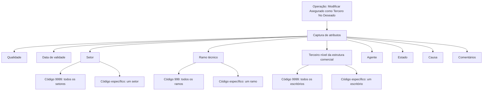

# Operação “Modificar Asegurado como Tercero No Deseado” — Especificação Funcional de Cadastro e Inabilitação

## 1. Metadados do Documento
- **Arquivo de Origem:** Não informado
- **Tipo de Documento:** Especificação Técnica / Manual Funcional
- **Domínio / Sistema:** Gestão de Terceiros Não Desejados para Entidade Seguradora
- **Público-Alvo:** Analistas funcionais, desenvolvedores, operação e negócio
- **Data/Versão Identificada:** Não identificada

---

## 2. Resumo Executivo & Contexto de Negócio

O documento descreve a operação intitulada **“Modificar Asegurado como Tercero No Deseado”**, destinada a modificar ou complementar informações previamente registradas para um segurado/cliente classificado como **Terceiro Não Desejado** em uma entidade seguradora.

A operação organiza a captura de informações segundo uma sequência de atributos apresentada da esquerda para a direita e de cima para baixo. Os atributos abrangem qualidade, vigência, estrutura de produtos, estrutura comercial, agente, estado, causa e comentários.

A classificação de Terceiro Não Desejado pode ser aplicada de maneira abrangente ou restrita. Os códigos genéricos permitem estender a marcação a todos os setores, ramos ou escritórios existentes; códigos específicos restringem a identificação às operações associadas ao respectivo elemento da estrutura.

O documento não detalha métodos HTTP, contratos JSON, persistência, integrações, regras de autorização, mensagens de erro, catálogos completos de valores ou comportamento de auditoria. Também não explica a diferença operacional entre as ações listadas como **CREAR** e **MODIFICAR**.

---

## 3. Arquitetura, Componentes & Tecnologias Envolvidas

Os componentes e conceitos identificados são:

- Operação funcional **Modificar Asegurado como Tercero No Deseado**.
- Sistema corporativo da entidade seguradora.
- Catálogo mestre do sistema.
- Estrutura de produtos configurada no sistema.
- Estrutura comercial configurada no sistema.
- Catálogo de intermediários.
- Núcleo do sistema.
- Catálogos de causas ou motivos de inabilitação por código de atividade.
- Elementos de navegação ou contexto textual: **Inicio**, **Soluciones**, **APIs**, **Documentación**, **Zeus**, **RS** e **ES**.



**Nota de Análise:** O documento descreve atributos funcionais e códigos genéricos, mas não fornece uma arquitetura técnica de serviços, banco de dados, APIs, interfaces ou infraestrutura.

---

## 4. Regras de Negócio, Especificações Funcionais & Processos

1. A operação permite modificar ou complementar informações de um segurado/cliente já registrado como Terceiro Não Desejado para a entidade seguradora.
2. O documento lista as ações **CREAR** e **MODIFICAR**, porém não detalha os critérios, permissões ou comportamentos associados a cada ação.
3. Os atributos devem ser capturados na sequência apresentada no sistema: da esquerda para a direita e de cima para baixo.
4. O campo **Calidad** captura o código de qualidade associado ao Terceiro, conforme valores previamente codificados no catálogo mestre do sistema.
5. A **Fecha de Validez** informa a data a partir da qual o Terceiro será identificado como Terceiro Não Desejado. O uso correto da data permite manter histórico das alterações realizadas nas informações do Terceiro.
6. O campo **Sector** deve conter um código de setor conforme a estrutura de produtos configurada:
   - O código genérico **9999** marca o Terceiro como Não Desejado para todos os setores existentes.
   - Um código de setor específico marca o Terceiro como Não Desejado apenas para operações daquele setor.
   - O sistema permite marcar o Terceiro como Não Desejado para somente um setor entre os setores existentes.
7. O campo **Ramo** deve conter o código do ramo técnico conforme a estrutura de produtos definida:
   - O código genérico **999** marca o Terceiro como Não Desejado para todos os ramos existentes.
   - Um código de ramo técnico específico marca o Terceiro como Não Desejado somente para aquele ramo.
8. O campo **Tercer Nivel de la Estructura Comercial** deve conter o código do terceiro nível da estrutura comercial, de acordo com a relação de valores configurada:
   - O código genérico **9999** marca o Terceiro como Não Desejado para todos os escritórios existentes.
   - Um código de escritório específico marca o Terceiro como Não Desejado somente para aquele escritório.
9. O campo **Agente** deve registrar o código do agente conforme os valores configurados no catálogo de intermediários.
10. O atributo **Estado** contém uma classificação fornecida pelo núcleo do sistema sobre condições e situações que identificam o Terceiro como Não Desejado.
11. O campo **Causa** contém o motivo da inabilitação do Terceiro, conforme causas ou motivos configurados por código de atividade no sistema.
12. O atributo **Comentarios** permite inserir texto livre para ampliar ou detalhar o motivo pelo qual o Terceiro é considerado uma pessoa física ou jurídica indesejável.

---

## 5. Tabelas de Parâmetros, Ambientes e Estruturas de Dados

| Item / Parâmetro | Descrição / Função | Tipo / Valores / Formato | Ambiente / Observações |
| :--- | :--- | :--- | :--- |
| Operação | Modificar ou complementar informações de segurado/cliente previamente registrado como Terceiro Não Desejado | Operação funcional | Aplicável à entidade seguradora |
| CREAR | Ação listada no documento | Não detalhado | O documento não explica seu comportamento |
| MODIFICAR | Ação listada no documento | Não detalhado | O documento não explica seu comportamento |
| Calidad | Código de qualidade associado ao Terceiro | Código do catálogo mestre | Valores previamente codificados no sistema |
| Fecha de Validez | Data desde a qual o Terceiro será identificado como Não Desejado | Data | Permite histórico de alterações da informação do Terceiro |
| Sector | Código do setor conforme estrutura de produtos | Código específico ou `9999` | `9999` aplica a todos os setores; código específico aplica a um setor |
| Ramo | Código do ramo técnico conforme estrutura de produtos | Código específico ou `999` | `999` aplica a todos os ramos; código específico aplica a um ramo |
| Tercer Nivel de la Estructura Comercial | Código do terceiro nível da estrutura comercial | Código específico ou `9999` | `9999` aplica a todos os escritórios; código específico aplica a um escritório |
| Agente | Código do agente | Código do catálogo de intermediários | Relação de valores configurada no sistema |
| Estado | Classificação de condições e situações do Terceiro Não Desejado | Não detalhado | Classificação fornecida pelo núcleo do sistema |
| Causa | Motivo de inabilitação do Terceiro | Código de atividade / causa configurada | Configurado por código de atividade |
| Comentarios | Detalhamento complementar do motivo da classificação | Texto plano | Permite registrar motivo para pessoa física ou jurídica indesejável |

---

## 6. Bateria de Perguntas & Respostas para RAG (FAQ Sintético)

### P1: Qual é o objetivo da operação “Modificar Asegurado como Tercero No Deseado”?
**R:** A operação permite modificar ou complementar as informações de um segurado/cliente que já tenha sido previamente registrado como Terceiro Não Desejado para a entidade seguradora.

### P2: Qual código deve ser usado para marcar um Terceiro como Não Desejado em todos os setores?
**R:** O campo **Sector** deve receber o código genérico `9999` para marcar o Terceiro como Não Desejado para todos os setores existentes.

### P3: Como restringir a classificação de Terceiro Não Desejado a um único setor?
**R:** Deve-se informar no campo **Sector** o código específico do setor desejado. Nesse caso, a identificação como Terceiro Não Desejado aplica-se apenas às operações daquele setor.

### P4: Qual é o código genérico para aplicar a classificação a todos os ramos técnicos?
**R:** O campo **Ramo** utiliza o código genérico `999` para identificar o Terceiro como Não Desejado em todos os ramos existentes.

### P5: Como funciona a seleção de um ramo técnico específico?
**R:** Para restringir a classificação a um ramo técnico, deve-se informar o código daquele ramo no campo **Ramo**. A identificação como Terceiro Não Desejado ficará limitada ao ramo informado.

### P6: Para que serve a Fecha de Validez?
**R:** A **Fecha de Validez** indica a data a partir da qual o Terceiro será identificado como Terceiro Não Desejado. O uso correto desse atributo permite manter histórico das mudanças realizadas nas informações do Terceiro.

### P7: Como aplicar a classificação de Terceiro Não Desejado a todos os escritórios?
**R:** No campo **Tercer Nivel de la Estructura Comercial**, deve-se utilizar o código genérico `9999`, que aplica a marcação a todas as oficinas ou escritórios existentes.

### P8: De onde vem o código do agente?
**R:** O código informado no campo **Agente** deve seguir a relação de valores configurada no catálogo de intermediários do sistema.

### P9: O que representa o atributo Estado?
**R:** O atributo **Estado** contém uma classificação disponibilizada pelo núcleo do sistema, representando possíveis condições e situações que identificam o Terceiro como Terceiro Não Desejado.

### P10: Como é definida a Causa da inabilitação?
**R:** A **Causa** contém o motivo pelo qual o Terceiro está sendo inabilitado, conforme as causas ou motivos de inabilitação configurados no sistema por código de atividade.

### P11: O campo Comentarios possui formato estruturado?
**R:** Não. O atributo **Comentarios** permite a captura de texto plano para ampliar ou detalhar o motivo pelo qual o Terceiro é considerado uma pessoa física ou jurídica indesejável.

### P12: O documento detalha APIs ou contratos JSON da operação?
**R:** Não. O documento não apresenta métodos HTTP, endpoints, contratos JSON, payloads, códigos de resposta ou mecanismos de integração para a operação.

---

## 7. Glossário de Termos, Siglas & Conceitos-Chave

- **Asegurado:** Segurado; entidade identificada no título da operação.
- **Tercero No Deseado:** Terceiro classificado como não desejado no contexto da entidade seguradora.
- **Calidad:** Código de qualidade associado ao Terceiro e obtido a partir do catálogo mestre do sistema.
- **Fecha de Validez:** Data a partir da qual o Terceiro é identificado como Não Desejado.
- **Sector:** Elemento da estrutura de produtos configurada no sistema.
- **Ramo:** Ramo técnico integrante da estrutura de produtos.
- **Tercer Nivel de la Estructura Comercial:** Nível da estrutura comercial usado para identificar escritórios.
- **Agente:** Agente identificado por código presente no catálogo de intermediários.
- **Estado:** Classificação fornecida pelo núcleo do sistema para condições e situações do Terceiro.
- **Causa:** Motivo da inabilitação configurado por código de atividade.
- **RS / ES / Zeus:** Termos exibidos no conteúdo bruto; o documento não fornece definição.

---

## 8. Notas Críticas, Riscos & Limitações

- O documento não identifica arquivo de origem, autor, data, versão ou responsável.
- As ações **CREAR** e **MODIFICAR** são listadas, mas sem especificação operacional.
- Não há definição dos formatos de dados, obrigatoriedade dos campos, valores permitidos, validações, dependências entre atributos ou mensagens de erro.
- Não há detalhamento de permissões, aprovação, auditoria, trilha de alterações, persistência ou integração.
- O uso dos códigos genéricos `9999` e `999` possui impacto abrangente, pois aplica a classificação a todos os elementos da dimensão correspondente.
- Os blocos “Consejo:” aparecem sem conteúdo complementar no texto extraído.

---

## 9. Conteúdo Bruto Estruturado (Referência Fiel)

```text
--- [PÁGINA 1 DE 3] ---

MODIFICAR Asegurado como Tercero No
Deseado
Objetivo
Esta Operación permite Modificar o Complementar la información del Asegurado/Cliente registrada
previamente como Tercero No Deseado para la Entidad Aseguradora.
Acciones habilitadas
 CREAR ( )  MODIFICAR ( )
Datos Terceros No Deseados
De Izquierda a Derecha y de Arriba hacia Abajo, los siguientes atributos marcan la secuencia de
captura de la Información en el sistema.
Calidad (  )
 / 
 RS
Inicio Soluciones APIs Documentación Zeus
ES


--- [PÁGINA 2 DE 3] ---

Este Campo va a permitir capturar el código de calidad que se va a asociar al Tercero de acuerdo
con los valores previamente codificados en el catálogo maestro del Sistema, en el momento de
registrarlo como Tercero No Deseado.
Fecha de Validez ( )
Esta propiedad le indica al sistema la fecha a partir de la cual el Tercero va a ser identificado como
Tercero No Deseado por lo que su correcto uso permite tener un histórico de los cambios efectuados
en la Información del Tercero.
Sector (  )
Este Campo contiene el código del sector de acuerdo con la estructura de productos configurada en
el Sistema.
Utilizando el valor genérico en este atributo (código 9999) el sistema permite marcar al Tercero
como Tercero no Deseado para todos los Sectores existentes o bien al utilizar el código de un
Sector en concreto, identificar al Tercero como Tercero no Deseado únicamente para las
Operaciones de este Sector.
De esta manera el sistema contempla la posibilidad de marcaje de un Tercero como Tercero No
Deseado para un único Sector de los n existentes.
Ramo (  )
Este Campo deber contener el código del ramo técnico de acuerdo con la estructura de productos
definida en el Sistema.
Utilizando el valor genérico en este atributo (código 999) el sistema permite marcar al Tercero
como Tercero no Deseado para todos los Ramos existentes o bien al utilizar el código de un
Ramo Técnico de los n existentes, identificar al Tercero como Tercero no Deseado únicamente
para ese Ramo.
Tercer Nivel de la Estructura Comercial (  )
Este Campo ha de contener el código del tercer nivel de la Estructura Comercial, de acuerdo con la
relación de valores configurada en el Sistema.
Consejo:
Consejo:


--- [PÁGINA 3 DE 3] ---

Utilizando el valor genérico en este atributo (código 9999), el sistema permite marcar al Tercero
como Tercero no Deseado para todas las Oficinas existentes o bien al utilizar el código de una
Oficina en Particular, identificar al Tercero como Tercero no Deseado únicamente para esa
Oficina.
Agente (  )
Este Campo tiene que registrar el código del agente de acuerdo con la relación de posibles valores
configurada en el catálogo de Intermediarios en el Sistema.
Estado (   )
Este atributo contiene una clasificación proporcionada por el núcleo del Sistema, de las posibles
condiciones y situaciones que identifican al Tercero como Tercero No Deseado.
Causa (   )
Este Campo contiene el motivo por el cual se está Inhabilitando al Tercero, de acuerdo con las
causas o motivos de inhabilitación que se hayan configurado por código de actividad en el Sistema.
Comentarios (  )
Este Atributo permite capturar texto plano para ampliar o detallar el motivo por el que se está
considerando al Tercero como una Persona Física o Jurídica indeseable.
Consejo:
```
