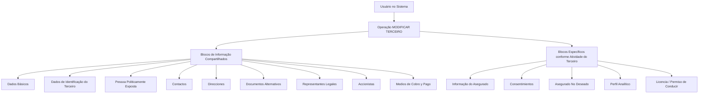

# Operação MODIFICAR TERCEIRO — Atualização de Informações de Asegurado/Cliente

## 1. Metadados do Documento
- **Arquivo de Origem:** Não identificado
- **Tipo de Documento:** Procedimento
- **Domínio / Sistema:** Gestão de Terceiros, Asegurados e Clientes
- **Público-Alvo:** Operação, Negócio e usuários do sistema
- **Data/Versão Identificada:** Não identificada

---

## 2. Resumo Executivo & Contexto de Negócio

O documento descreve a operação **MODIFICAR TERCEIRO**, também apresentada como operação de modificação de **Asegurado/Cliente**. A finalidade declarada é atualizar informações previamente registradas para os Asegurados.

O processo organiza a manutenção cadastral em blocos de informação compartilhados e blocos específicos relacionados à atividade do Terceiro. Entre os blocos compartilhados estão dados básicos, identificação, contatos, endereços, documentos alternativos, representantes legais, acionistas e meios de cobrança e pagamento.

A obrigatoriedade e a habilitação dos campos não são uniformes. O comportamento pode variar conforme o código de atividade do Terceiro, conforme o Terceiro seja Pessoa Física ou Pessoa Jurídica e conforme personalizações implementadas na aplicação.

O documento também registra que a ordem de captura dos dados nos diferentes blocos pode variar segundo o critério adotado pelo usuário no sistema. Não são detalhados contratos técnicos, métodos HTTP, integrações, validações por campo, tecnologias, URLs de ambientes ou persistência de dados.

---

## 3. Arquitetura, Componentes & Tecnologias Envolvidas

O conteúdo apresenta um fluxo funcional de atualização cadastral, mas não descreve uma arquitetura de software, microsserviços, bancos de dados, APIs, tecnologias, ambientes ou mecanismos de integração.

Os componentes funcionais explicitamente citados são:

- Operação **MODIFICAR TERCEIRO**.
- Informação de **Asegurado**.
- **Consentimentos**.
- **Asegurado No Deseado**.
- **Perfil Analítico**.
- **Licencia / Permiso de Conducir**.
- Blocos de informação compartilhados.
- Blocos de informação específicos segundo a atividade do Terceiro.



> **Nota de Análise:** o diagrama representa exclusivamente a organização funcional indicada no documento. Não há evidência de comunicação técnica entre componentes, APIs, serviços, bancos de dados ou ambientes.

---

## 4. Regras de Negócio, Especificações Funcionais & Processos

### Objetivo da operação

A operação **MODIFICAR TERCEIRO** permite modificar informações de Asegurados previamente registradas.

### Premissas de obrigatoriedade e habilitação

1. A obrigatoriedade e/ou habilitação dos campos em cada bloco ou estrutura de informação compartilhada pode variar conforme o **código de atividade do Terceiro**.
2. A obrigatoriedade e/ou habilitação dos campos pode variar conforme o tipo de Terceiro:
   - **Persona Física**;
   - **Persona Jurídica**.
3. Personalizações implementadas podem afetar o comportamento da aplicação em relação à obrigatoriedade de registro dos Dados do Terceiro.
4. A ordem de captura de dados nos diferentes blocos de informação pode variar conforme o critério seguido pelo usuário no sistema.

### Processo funcional identificado

1. O usuário acessa a operação **MODIFICAR TERCEIRO**.
2. O usuário trabalha com blocos de informação compartilhados do Terceiro.
3. O usuário pode trabalhar com blocos específicos relacionados à atividade do Terceiro.
4. A aplicação aplica comportamento de habilitação e obrigatoriedade condicionado pelo código de atividade, tipo de Terceiro e eventuais personalizações.
5. A sequência de preenchimento dos blocos não é definida como fixa no documento.

> **Nota de Análise:** o documento não define quais campos pertencem a cada bloco, quais são obrigatórios em cada combinação de atividade e tipo de Terceiro, nem descreve critérios de validação, mensagens de erro ou regras de gravação.

---

## 5. Tabelas de Parâmetros, Ambientes e Estruturas de Dados

| Item / Parâmetro | Descrição / Função | Tipo / Valores / Formato | Ambiente / Observações |
| :--- | :--- | :--- | :--- |
| Operação MODIFICAR TERCEIRO | Permite modificar informações previamente registradas de Asegurados. | Operação funcional | Também apresentada como “MODIFICAR Asegurado/Cliente”. |
| Código de atividade do Terceiro | Pode influenciar a obrigatoriedade e/ou habilitação dos campos. | Código de atividade | Valores não detalhados. |
| Tipo de Terceiro | Pode influenciar a obrigatoriedade e/ou habilitação dos campos. | Persona Física; Persona Jurídica | Critérios específicos não detalhados. |
| Personalizações implementadas | Podem afetar a obrigatoriedade de registro dos Dados do Terceiro. | Personalizações da aplicação | Personalizações não identificadas. |
| Ordem de captura de dados | Pode variar entre blocos de informação. | Sequência definida pelo usuário | Não há fluxo obrigatório de preenchimento descrito. |
| Datos Básicos | Bloco de informação compartilhado. | Bloco funcional | Campos não detalhados. |
| Datos Identificación Tercero | Bloco de informação compartilhado. | Bloco funcional | Campos não detalhados. |
| Persona Políticamente Expuesta | Bloco de informação compartilhado. | Bloco funcional | Critérios e campos não detalhados. |
| Contactos | Bloco de informação compartilhado. | Bloco funcional | Campos não detalhados. |
| Direcciones | Bloco de informação compartilhado. | Bloco funcional | Campos não detalhados. |
| Documentos Alternativos | Bloco de informação compartilhado. | Bloco funcional | Campos não detalhados. |
| Representantes Legales | Bloco de informação compartilhado. | Bloco funcional | Campos não detalhados. |
| Accionistas | Bloco de informação compartilhado. | Bloco funcional | Campos não detalhados. |
| Medios de Cobro y Pago | Bloco de informação compartilhado. | Bloco funcional | Campos não detalhados. |
| Información del Asegurado | Bloco específico conforme atividade do Terceiro. | Bloco funcional | Campos não detalhados. |
| Consentimientos | Bloco específico conforme atividade do Terceiro. | Bloco funcional | O documento apresenta o ícone `:fontawesome-regular-square-plus`. |
| Asegurado No Deseado | Bloco específico conforme atividade do Terceiro. | Bloco funcional | Critérios não detalhados. |
| Perfil Analítico | Bloco específico conforme atividade do Terceiro. | Bloco funcional | Critérios não detalhados. |
| Licencia / Permiso de Conducir | Bloco específico conforme atividade do Terceiro. | Bloco funcional | Campos e validade não detalhados. |

---

## 6. Bateria de Perguntas & Respostas para RAG (FAQ Sintético)

### P1: Qual é a finalidade da operação MODIFICAR TERCEIRO?
**R:** A operação MODIFICAR TERCEIRO permite modificar informações de Asegurados que já foram registradas previamente no sistema. O documento também a apresenta como operação de modificação de Asegurado/Cliente.

### P2: A obrigatoriedade dos campos é igual para todos os Terceiros?
**R:** Não. O documento informa que a obrigatoriedade e/ou a habilitação dos campos pode variar de acordo com o código de atividade do Terceiro, o tipo de Terceiro e personalizações implementadas na aplicação.

### P3: Como o tipo de Terceiro influencia o preenchimento cadastral?
**R:** A obrigatoriedade e/ou habilitação dos campos pode variar quando o tipo de Terceiro é Persona Física ou Persona Jurídica. O documento não detalha quais campos mudam para cada tipo.

### P4: Quais são os blocos de informação compartilhados na operação MODIFICAR TERCEIRO?
**R:** Os blocos compartilhados apresentados são: Datos Básicos, Datos Identificación Tercero, Persona Políticamente Expuesta, Contactos, Direcciones, Documentos Alternativos, Representantes Legales, Accionistas e Medios de Cobro y Pago.

### P5: Quais blocos específicos podem ser tratados de acordo com a atividade do Terceiro?
**R:** Os blocos específicos listados são Información del Asegurado, Consentimientos, Asegurado No Deseado, Perfil Analítico e Licencia / Permiso de Conducir.

### P6: O usuário deve preencher os blocos em uma ordem obrigatória?
**R:** Não há uma ordem obrigatória definida no documento. A ordem de captura dos dados nos diferentes blocos de informação pode variar conforme o critério seguido pelo usuário no sistema.

### P7: Personalizações da aplicação podem alterar o comportamento da operação?
**R:** Sim. O documento afirma que personalizações implementadas podem afetar o comportamento da aplicação quanto à obrigatoriedade do registro dos Dados do Terceiro.

### P8: O documento descreve os campos de cada bloco de informação?
**R:** Não. O documento apenas lista os blocos de informação compartilhados e específicos; não detalha os campos, tipos, formatos, regras de validação ou valores permitidos dentro de cada bloco.

### P9: O documento informa métodos HTTP, contratos JSON ou APIs para MODIFICAR TERCEIRO?
**R:** Não. O conteúdo não especifica métodos HTTP, contratos JSON, endpoints, APIs, integrações técnicas ou microsserviços associados à operação.

### P10: Há informações sobre ambientes, URLs, servidores ou rotas de log?
**R:** Não. O documento não apresenta URLs de ambientes, servidores, portas, caminhos de logs ou variáveis técnicas de configuração.

---

## 7. Glossário de Termos, Siglas & Conceitos-Chave

- **Asegurado:** entidade cujas informações previamente registradas podem ser modificadas pela operação descrita.
- **Cliente:** termo apresentado junto de Asegurado no título da operação “MODIFICAR Asegurado/Cliente”.
- **Terceiro:** entidade para a qual são organizados blocos de informação compartilhados e específicos.
- **Persona Física:** tipo de Terceiro citado como fator que pode alterar obrigatoriedade e habilitação de campos.
- **Persona Jurídica:** tipo de Terceiro citado como fator que pode alterar obrigatoriedade e habilitação de campos.
- **Persona Políticamente Expuesta:** bloco de informação compartilhado listado no processo.
- **Consentimientos:** bloco específico de informação listado conforme a atividade do Terceiro.
- **Asegurado No Deseado:** bloco específico de informação listado conforme a atividade do Terceiro.
- **Perfil Analítico:** bloco específico de informação listado conforme a atividade do Terceiro.
- **Licencia / Permiso de Conducir:** bloco específico de informação relacionado à licença ou permissão de condução.
- **Medios de Cobro y Pago:** bloco compartilhado relacionado a meios de cobrança e pagamento.

---

## 8. Notas Críticas, Riscos & Limitações

- O documento não identifica arquivo de origem, data, versão, autor, sistema proprietário ou ambiente.
- Não há detalhamento de campos, tipos de dados, obrigatoriedade por cenário, regras de validação ou mensagens de erro.
- Não há especificação de contratos técnicos, APIs, integrações, tecnologias, persistência, segurança, auditoria ou logs.
- As personalizações podem alterar a obrigatoriedade de dados, mas o documento não identifica as personalizações existentes nem seus impactos.
- O código de atividade do Terceiro influencia habilitação e obrigatoriedade, porém os códigos e suas regras correspondentes não são apresentados.
- A ausência de ordem fixa para captura dos dados exige que usuários e operadores conheçam o critério operacional aplicável ao processo.
- O documento lista o bloco **Asegurado No Deseado**, mas não define condições, consequências ou critérios para essa classificação.

---

## 9. Conteúdo Bruto Estruturado (Referência Fiel)

```text
--- [PÁGINA 1 DE 2] ---

OPERACIÓN MODIFICAR Asegurado/Cliente
¿En que consiste?
Esta operación permite Modificar la Información de los Asegurados registrada previamente.
Premisas
La obligatoriedad y/o la habilitación de los campos en el registro de los datos de cada uno de
los bloques o estructuras de información compartidas puede variar de acuerdo con el código de
actividad del Tercero:
La obligatoriedad y/o la habilitación de los campos en el registro de los datos de cada uno de
los bloques o estructuras de información pueden variar si el tipo de Tercero es una Persona
Física o una Persona Jurídica:
Las personalizaciones que se hubieran podido implementar a su vez pueden afectar el
comportamiento de la aplicación en relación con la obligatoriedad en el registro de los Datos del
Tercero.
Por último, el orden de captura de los datos en los distintos bloques de Información puede
variar de acuerdo con el criterio seguido por el Usuario en el Sistema.
Ejemplo:
Ejemplo:
 /
RS
Inicio Soluciones APIs Documentación Zeus
ES

--- [PÁGINA 2 DE 2] ---

Proceso
MODIFICAR
TERCERO
Información
Asegurado Consentimientos Asegurado
No Deseado
Perfil
Analítico
Licencia
de Conducir
Bloques de Información Compartidos (MODIFICAR TERCERO)
 Datos Básicos ( )
 Datos Identificación Tercero ( )
 Persona Políticamente Expuesta(   )
 Contactos (   )
 Direcciones (   )
 Documentos Alternativos (   )
 Representantes Legales (   )
 Accionistas (   )
 Medios de Cobro y Pago (   )
Bloques de Información Específicos de acuerdo con la
Actividad del Tercero.
 Información del Asegurado (  )
 Consentimientos (:fontawesome-regular-square-plus  )
 Asegurado No Deseado (  )
 Perfil Analítico ( )
 Licencia / Permiso de Conducir ( )
```
