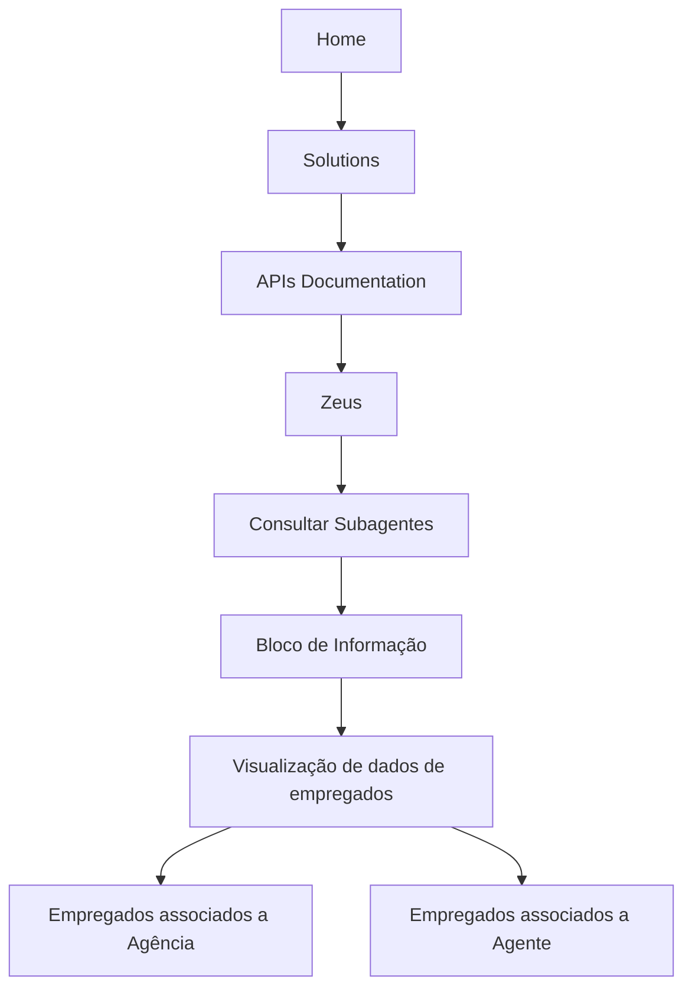

# Operação de Consulta de Informações de Empregados da Agência ou Agente

## 1. Metadados do Documento
- **Arquivo de Origem:** `Não identificado no conteúdo fornecido`
- **Tipo de Documento:** `Procedimento`
- **Domínio / Sistema:** `Consulta de Subagentes / Zeus`
- **Público-Alvo:** `Operação, Negócio`
- **Data/Versão Identificada:** `Não identificada`

---

## 2. Resumo Executivo & Contexto de Negócio

O documento descreve uma operação de consulta destinada à visualização de informações de empregados associados a uma Agência ou a um Agente. O conteúdo identifica essa capacidade como parte de um “Bloco de Informação”.

O objetivo declarado é permitir consultar os dados dos empregados que pertençam ao Agente ou à Agência associados. O documento também menciona a funcionalidade ou seção “Consultar Subagentes”.

A navegação ou contexto de acesso apresentado inclui as referências “Home”, “Solutions”, “APIs Documentation”, “Zeus” e o idioma “EN”. Não há detalhamento sobre autenticação, campos de pesquisa, contratos de API, métodos HTTP, critérios de associação ou formato dos dados retornados.

---

## 3. Arquitetura, Componentes & Tecnologias Envolvidas

Os elementos explicitamente citados são:

| Componente / Elemento | Papel identificado |
| :--- | :--- |
| Bloco de Informação | Área funcional destinada à visualização de dados de empregados. |
| Agência | Entidade à qual empregados podem estar associados. |
| Agente | Entidade à qual empregados podem estar associados. |
| Consultar Subagentes | Funcionalidade ou seção mencionada no conteúdo. |
| Zeus | Referência apresentada no caminho de navegação ou documentação. |
| APIs Documentation | Referência a documentação de APIs. |
| Home / Solutions | Referências de navegação. |
| CF | Sigla apresentada sem definição contextual. |



**Nota de Análise:** O conteúdo não descreve arquitetura de software, integrações, microsserviços, protocolos, endpoints, tecnologias de implementação ou contratos de dados.

---

## 4. Regras de Negócio, Especificações Funcionais & Processos

1. A operação pertence a um Bloco de Informação.
2. O propósito do Bloco de Informação é visualizar dados de empregados.
3. Os empregados consultados devem estar associados a um Agente ou a uma Agência.
4. O conteúdo menciona “Consultar Subagentes”, mas não especifica a relação entre subagentes, empregados, agentes e agências.
5. O documento apresenta referências de navegação para “Home”, “Solutions”, “APIs Documentation” e “Zeus”.
6. O documento apresenta o idioma “EN”.
7. Não são informados critérios de filtro, campos obrigatórios, regras de autorização, mensagens de erro, formato de resposta ou etapas operacionais detalhadas.

---

## 5. Tabelas de Parâmetros, Ambientes e Estruturas de Dados

| Item / Parâmetro | Descrição / Função | Tipo / Valores / Formato | Ambiente / Observações |
| :--- | :--- | :--- | :--- |
| Operação de consulta | Permite visualizar informações de empregados associados. | Operação funcional | Não detalhado. |
| Empregado | Entidade cujos dados podem ser visualizados. | Entidade de negócio | Não há campos descritos. |
| Agência | Entidade que pode possuir empregados associados. | Entidade de negócio | Não há identificador ou estrutura descritos. |
| Agente | Entidade que pode possuir empregados associados. | Entidade de negócio | Não há identificador ou estrutura descritos. |
| Subagentes | Item citado como “Consultar Subagentes”. | Funcionalidade ou seção | Relação funcional não detalhada. |
| Zeus | Referência no caminho apresentado. | Sistema, módulo ou contexto não especificado | Sem detalhes adicionais. |
| APIs Documentation | Referência a documentação de APIs. | Recurso de documentação | Nenhuma API, rota ou contrato foi informado. |
| CF | Sigla citada no conteúdo. | Não identificado | Significado não informado. |
| EN | Idioma exibido. | Código de idioma | Provavelmente indicador de idioma; não há confirmação adicional. |

---

## 6. Bateria de Perguntas & Respostas para RAG (FAQ Sintético)

### P1: Qual é o objetivo da operação de consulta de informações?
**R:** O objetivo é visualizar os dados dos empregados associados a um Agente ou a uma Agência.

### P2: Quais empregados podem ser visualizados no Bloco de Informação?
**R:** Podem ser visualizados os empregados que tenham associação com o Agente ou com a Agência.

### P3: O documento descreve quais dados de empregados são retornados?
**R:** Não. O conteúdo informa apenas que os dados dos empregados podem ser visualizados, sem listar campos, atributos ou estrutura de retorno.

### P4: O documento informa como identificar um Agente ou uma Agência na consulta?
**R:** Não. Não são apresentados identificadores, parâmetros de busca, filtros ou critérios para localizar um Agente ou uma Agência.

### P5: Existe uma funcionalidade mencionada para consultar subagentes?
**R:** Sim. O conteúdo cita “Consultar Subagentes”, mas não detalha seu comportamento, entradas, saídas ou relação com a consulta de empregados.

### P6: Qual sistema ou contexto é citado junto à documentação de APIs?
**R:** O conteúdo apresenta a sequência “Home Solutions APIs Documentation Zeus”, indicando uma referência a documentação de APIs no contexto de “Zeus”.

### P7: O documento especifica métodos HTTP ou endpoints de API?
**R:** Não. Embora “APIs Documentation” seja citado, não há métodos HTTP, URLs, rotas, parâmetros técnicos, exemplos JSON ou contratos de integração.

### P8: A operação possui regras de autorização ou permissões descritas?
**R:** Não. O documento não apresenta perfis de acesso, matriz de permissões, autenticação ou regras de autorização.

### P9: O que significa a sigla CF no documento?
**R:** O significado de “CF” não é definido no conteúdo fornecido. A sigla é apenas apresentada junto à referência “Consultar Subagentes / CF”.

### P10: Qual idioma é mostrado no conteúdo?
**R:** O conteúdo apresenta “EN”, sem fornecer explicação adicional sobre configuração de idioma ou localização.

---

## 7. Glossário de Termos, Siglas & Conceitos-Chave

- **Agência:** Entidade mencionada como possível associação de empregados.
- **Agente:** Entidade mencionada como possível associação de empregados.
- **APIs Documentation:** Referência a documentação de APIs.
- **Bloco de Informação:** Área ou bloco cujo objetivo é permitir a visualização de dados de empregados associados.
- **CF:** Sigla citada sem significado definido no conteúdo.
- **EN:** Código de idioma citado sem detalhamento adicional.
- **Subagentes:** Entidade ou funcionalidade citada na expressão “Consultar Subagentes”.
- **Zeus:** Nome citado no caminho de navegação ou documentação, sem definição adicional.

---

## 8. Notas Críticas, Riscos & Limitações

- O conteúdo é resumido e não detalha os dados retornados para cada empregado.
- Não há informações sobre autenticação, autorização, perfis de usuário ou controles de acesso.
- Não são informados endpoints, URLs, métodos HTTP, parâmetros de consulta ou contratos JSON.
- A relação entre “Consultar Subagentes” e a visualização de empregados não é explicada.
- A sigla “CF” não possui definição no conteúdo fornecido.
- Não foram identificados ambiente, versão, data, proprietário do sistema, dependências externas ou procedimentos de erro.

---

## 9. Conteúdo Bruto Estruturado (Referência Fiel)

```text
--- [PÁGINA 1 DE 1] ---

OPERACIÓN CONSULTAR Información
Empleados de la AGENCIA o del AGENTE
Objetivo
El propósito de este Bloque de Información es poder visualizar los datos de los Empleados que
tengan el Agente o la Agencia asociados.
Consultar Subagentes
 / 
 CF
Home Solutions APIs Documentation Zeus
EN
```
