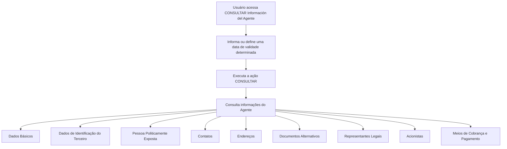

# Consulta de Información del Agente — Operación de Consulta

## 1. Metadados do Documento
- **Arquivo de Origem:** Não identificado
- **Tipo de Documento:** Especificação funcional resumida
- **Domínio / Sistema:** Soluciones APIs / Zeus
- **Público-Alvo:** Desenvolvedores, analistas funcionais e operação
- **Data/Versão Identificada:** Não identificada

---

## 2. Resumo Executivo & Contexto de Negócio

O documento descreve a operação **“CONSULTAR Información del Agente”**, destinada a consultar informações de um agente em uma determinada data de validade. O conteúdo identifica explicitamente a ação disponível como **CONSULTAR**.

A consulta pode abranger múltiplas estruturas de informação do agente: dados básicos, identificação do terceiro, condição de pessoa politicamente exposta, contatos, endereços, documentos alternativos, representantes legais, acionistas e meios de cobrança e pagamento.

O conteúdo disponível possui caráter resumido e não apresenta contratos de integração, métodos HTTP, campos de entrada ou saída, regras de autorização, mensagens de erro, URLs de serviço ou detalhes técnicos de implementação.

A navegação exibida no conteúdo menciona **Inicio**, **Soluciones**, **APIs**, **Documentación**, **Zeus**, **ES** e **RS**. Não há detalhamento adicional que permita afirmar a função técnica ou operacional de cada item.

---

## 3. Arquitetura, Componentes & Tecnologias Envolvidas

Os componentes e termos explicitamente citados são:

| Componente / Termo | Papel identificado no conteúdo |
| :--- | :--- |
| CONSULTAR Información del Agente | Operação para consulta de informações de agente por data de validade. |
| Agente | Entidade cuja informação pode ser consultada. |
| Soluciones | Item de navegação mencionado. |
| APIs | Item de navegação mencionado. |
| Documentación | Item de navegação mencionado. |
| Zeus | Termo exibido na navegação. O documento não detalha sua função. |
| ES | Indicador exibido na navegação, sem explicação adicional. |
| RS | Indicador exibido no conteúdo, sem explicação adicional. |

O documento não descreve arquitetura de software, camadas, microsserviços, bancos de dados, protocolos, tecnologias, integrações ou fluxo técnico entre componentes.

> **Nota de Análise:** O documento apresenta uma operação de consulta e estruturas informacionais associadas, mas não detalha endpoints, métodos HTTP, contratos JSON, autenticação, autorização ou topologia de integração.

---

## 4. Regras de Negócio, Especificações Funcionais & Processos

### Operação identificada

A operação permite consultar a informação do agente para uma **data de validade determinada**.

### Ação disponível

- **CONSULTAR:** ação explicitamente listada no documento.
- O documento não descreve pré-condições, critérios de permissão, dados obrigatórios, formato da data de validade ou comportamento após a execução da ação.

### Estruturas de informação consultáveis

A operação lista as seguintes estruturas de informação do agente:

1. Dados Básicos.
2. Dados de Identificação do Terceiro.
3. Pessoa Politicamente Exposta.
4. Contatos.
5. Endereços.
6. Documentos Alternativos.
7. Representantes Legais.
8. Acionistas.
9. Meios de Cobrança e Pagamento.

### Fluxo funcional identificável



> **Nota de Análise:** O fluxo acima representa apenas a sequência funcional explícita ou diretamente inferível do texto: consulta de informação do agente em uma data de validade e as estruturas listadas. O documento não especifica se todas as estruturas são retornadas obrigatoriamente, se podem ser selecionadas individualmente ou quais dados são exibidos em cada estrutura.

---

## 5. Tabelas de Parâmetros, Ambientes e Estruturas de Dados

| Item / Parâmetro | Descrição / Função | Tipo / Valores / Formato | Ambiente / Observações |
| :--- | :--- | :--- | :--- |
| Operação | Consulta de informação do agente. | `CONSULTAR Información del Agente` | Não há ambiente informado. |
| Ação disponível | Executa a consulta listada no documento. | `CONSULTAR` | O documento não define comportamento técnico da ação. |
| Data de validade | Referência temporal para a consulta da informação do agente. | Data; formato não informado | Obrigatoriedade e regras de validação não informadas. |
| Dados Básicos | Estrutura de informação do agente. | Conteúdo não detalhado | Listada como estrutura consultável. |
| Dados de Identificação do Terceiro | Estrutura de informação do agente. | Conteúdo não detalhado | Listada como estrutura consultável. |
| Pessoa Politicamente Exposta | Estrutura de informação do agente. | Conteúdo não detalhado | Listada como estrutura consultável. |
| Contatos | Estrutura de informação do agente. | Conteúdo não detalhado | Listada como estrutura consultável. |
| Endereços | Estrutura de informação do agente. | Conteúdo não detalhado | Listada como estrutura consultável. |
| Documentos Alternativos | Estrutura de informação do agente. | Conteúdo não detalhado | Listada como estrutura consultável. |
| Representantes Legais | Estrutura de informação do agente. | Conteúdo não detalhado | Listada como estrutura consultável. |
| Acionistas | Estrutura de informação do agente. | Conteúdo não detalhado | Listada como estrutura consultável. |
| Meios de Cobrança e Pagamento | Estrutura de informação do agente. | Conteúdo não detalhado | Listada como estrutura consultável. |
| Zeus | Termo de navegação ou sistema citado. | Não informado | Função não detalhada. |
| Soluciones APIs Documentación | Termos exibidos na navegação. | Não informado | Não há URLs, rotas ou ambientes associados. |

---

## 6. Bateria de Perguntas & Respostas para RAG (FAQ Sintético)

### P1: Qual é o objetivo da operação “CONSULTAR Información del Agente”?
**R:** A operação permite consultar a informação de um agente para uma data de validade determinada. O documento identifica a ação disponível como **CONSULTAR**.

### P2: Qual ação está disponível para a consulta de informações do agente?
**R:** A única ação explicitamente apresentada no documento é **CONSULTAR**. Não há descrição de ações de criação, alteração, exclusão ou exportação.

### P3: A consulta de informações do agente considera uma referência temporal?
**R:** Sim. O documento informa que a consulta é realizada para uma **data de validade determinada**. Contudo, não apresenta o formato da data nem regras de validação.

### P4: Quais estruturas de dados do agente são listadas para consulta?
**R:** O documento lista Dados Básicos, Dados de Identificação do Terceiro, Pessoa Politicamente Exposta, Contatos, Endereços, Documentos Alternativos, Representantes Legais, Acionistas e Meios de Cobrança e Pagamento.

### P5: A operação documenta quais campos compõem os Dados Básicos do agente?
**R:** Não. O documento somente lista **Dados Básicos** como uma estrutura de informação do agente, sem detalhar campos, tipos, obrigatoriedade ou valores possíveis.

### P6: O documento especifica como são consultadas informações de Pessoa Politicamente Exposta?
**R:** Não. **Pessoa Politicamente Exposta** é listada como uma estrutura de informação do agente, mas o documento não descreve atributos, regras de negócio ou critérios de consulta para essa estrutura.

### P7: Existem endpoints, URLs ou métodos HTTP documentados para a operação?
**R:** Não. O conteúdo menciona “APIs” e “Documentación” na navegação, mas não apresenta endpoint, URL, método HTTP, cabeçalhos, autenticação ou exemplo de requisição e resposta.

### P8: O documento descreve quais dados são retornados para representantes legais e acionistas?
**R:** Não. **Representantes Legales** e **Accionistas** são apenas listados como estruturas de informação do agente. Não existem detalhes sobre campos, relacionamento com o agente ou regras de retorno.

### P9: A consulta documenta meios de cobrança e pagamento do agente?
**R:** Sim, **Medios de Cobro y Pago** é uma das estruturas listadas. Entretanto, o documento não informa modalidades de cobrança, formas de pagamento, identificadores ou regras de validação.

### P10: Qual é a relação de Zeus com a operação de consulta do agente?
**R:** O termo **Zeus** aparece na navegação do conteúdo, junto de “Inicio”, “Soluciones”, “APIs” e “Documentación”. O documento não fornece informações suficientes para definir a função de Zeus na arquitetura ou na operação.

---

## 7. Glossário de Termos, Siglas & Conceitos-Chave

- **Agente:** Entidade cuja informação pode ser consultada por data de validade determinada.
- **CONSULTAR:** Ação listada para realização da consulta de informações do agente.
- **Data de validade:** Referência temporal informada para consulta da informação do agente; formato e regras não especificados.
- **Dados Básicos:** Estrutura de informação do agente citada sem detalhamento de conteúdo.
- **Dados de Identificação do Terceiro:** Estrutura de informação do agente relacionada à identificação de terceiro, sem campos especificados.
- **Pessoa Politicamente Exposta:** Estrutura de informação do agente citada no documento, sem definição ou regras adicionais.
- **Documentos Alternativos:** Estrutura de informação do agente mencionada sem detalhamento.
- **Representantes Legais:** Estrutura de informação do agente mencionada sem detalhamento.
- **Acionistas:** Estrutura de informação do agente mencionada sem detalhamento.
- **Meios de Cobrança e Pagamento:** Estrutura de informação do agente mencionada sem detalhamento.
- **APIs:** Termo exibido na navegação; o documento não informa interfaces, contratos ou protocolos.
- **Zeus:** Termo exibido na navegação; significado e papel não identificados.
- **ES:** Indicador exibido na navegação; significado não identificado.
- **RS:** Indicador exibido no conteúdo; significado não identificado.

---

## 8. Notas Críticas, Riscos & Limitações

- O documento não identifica arquivo de origem, autor, data, versão ou responsável pelo conteúdo.
- Não há endpoint, URL, método HTTP, protocolo, autenticação, autorização ou contrato de integração.
- Não há definição de campos, tipos de dados, formatos, cardinalidade ou obrigatoriedade para nenhuma estrutura de informação do agente.
- A **data de validade determinada** é mencionada, mas não possui formato, origem, timezone, comportamento para datas inválidas ou regra de ausência documentados.
- O documento não esclarece se as estruturas listadas são retornadas integralmente, opcionalmente, sob demanda ou conforme permissões.
- Não há catálogo de erros, códigos de resposta, critérios de auditoria, rastreabilidade ou requisitos de desempenho.
- Os termos **Zeus**, **ES** e **RS** aparecem sem definição contextual suficiente.

---

## 9. Conteúdo Bruto Estruturado (Referência Fiel)

```text
--- [PÁGINA 1 DE 1] ---

CONSULTAR Información del Agente
¿En qué consiste?
Esta Operación permite Consultar la información del Agente a una fecha de validez determinada.
Posibles Acciones
 CONSULTAR ( )
Estructuras de Información del Agente
 Datos Básicos ( )
 Datos Identificación del Tercero ( )
 Persona Políticamente Expuesta ( )
 Contactos ( )
 Direcciones ( )
 Documentos Alternativos ( )
 Representantes Legales ( )
 Accionistas ( )
 Medios de Cobro y Pago ( )
 /
 RS
Inicio Soluciones APIs Documentación Zeus
ES
```
