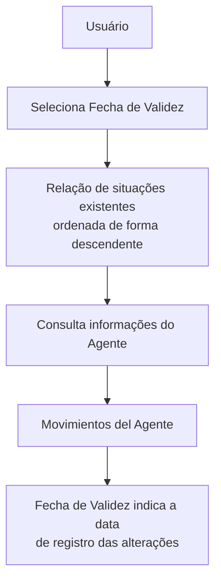

# Consulta de Agente por Fecha de Validez

## 1. Metadados do Documento
- **Arquivo de Origem:** Não identificado
- **Tipo de Documento:** Procedimento
- **Domínio / Sistema:** Consulta de informações do Agente
- **Público-Alvo:** Não identificado
- **Data/Versão Identificada:** Não identificada

---

## 2. Resumo Executivo & Contexto de Negócio

O conteúdo descreve a operação **“CONSULTAR Agente por Fecha de Validez”**, destinada à consulta de informações de um agente considerando uma situação temporal selecionada.

A operação permite escolher a **Fecha de Validez** que será usada como referência para recuperar os dados do agente. As situações existentes são exibidas em ordem descendente.

O documento também define que, em **Movimientos del Agente**, o campo **Fecha de Validez** informa a data em que alterações do agente foram registradas no sistema.

Não há detalhamento sobre telas, critérios de busca adicionais, métodos HTTP, contratos de integração, persistência de dados ou regras de autorização.

---

## 3. Arquitetura, Componentes & Tecnologias Envolvidas

Componentes e conceitos identificados:

| Componente / Conceito | Descrição |
| :--- | :--- |
| Agente | Entidade cujas informações são consultadas. |
| Fecha de Validez | Referência temporal selecionada para a consulta. |
| Situaciones existentes | Relação de situações temporais disponíveis para seleção, ordenada de forma descendente. |
| Movimientos del Agente | Contexto no qual a Fecha de Validez indica quando mudanças foram registradas no sistema. |
| Sistema | Plataforma não identificada onde os dados e mudanças do agente são registrados. |



**Nota de Análise:** O documento não identifica arquitetura de software, microsserviços, banco de dados, protocolos, URLs ou tecnologias utilizadas pela operação.

---

## 4. Regras de Negócio, Especificações Funcionais & Processos

1. A operação permite consultar informações de um agente.
2. A consulta deve considerar uma **Fecha de Validez** ou situação temporal escolhida.
3. A seleção da situação temporal deve ocorrer a partir de uma relação de situações existentes.
4. A relação de situações existentes é apresentada em ordem descendente.
5. No contexto de **Movimientos del Agente**, a **Fecha de Validez** representa a data em que mudanças do agente foram registradas no sistema.
6. O documento não informa quais situações temporais podem ser selecionadas, quais são os filtros disponíveis, nem quais dados do agente são retornados.

---

## 5. Tabelas de Parâmetros, Ambientes e Estruturas de Dados

| Item / Parâmetro | Descrição / Função | Tipo / Valores / Formato | Ambiente / Observações |
| :--- | :--- | :--- | :--- |
| Fecha de Validez | Permite selecionar a data ou situação temporal de referência para a consulta de informações do agente. | Data; formato não informado. | Situações existentes são exibidas de forma descendente. |
| Movimientos del Agente | Contexto que apresenta informações sobre mudanças associadas ao agente. | Não informado. | A Fecha de Validez indica quando as mudanças foram registradas no sistema. |
| Situaciones existentes | Relação de referências temporais disponíveis para consulta. | Não informado. | Ordenadas de maneira descendente. |
| Agente | Entidade alvo da consulta. | Não informado. | O documento não detalha atributos, identificadores ou critérios de localização. |

---

## 6. Bateria de Perguntas & Respostas para RAG (FAQ Sintético)

### P1: Em que consiste a operação “CONSULTAR Agente por Fecha de Validez”?
**R:** A operação permite consultar informações de um agente a partir da seleção de uma Fecha de Validez, isto é, uma data ou situação temporal de referência.

### P2: Qual é a finalidade da Fecha de Validez na consulta do agente?
**R:** A Fecha de Validez define a situação temporal usada para realizar a consulta das informações do agente.

### P3: Como as situações disponíveis para consulta são apresentadas?
**R:** As situações existentes são mostradas de forma ordenada descendente.

### P4: O que significa Fecha de Validez em Movimientos del Agente?
**R:** Em Movimientos del Agente, a Fecha de Validez indica a data em que as mudanças do agente foram registradas no sistema.

### P5: O documento informa quais dados do agente são retornados pela consulta?
**R:** Não. O conteúdo somente informa que a operação consulta informações do agente conforme a Fecha de Validez selecionada.

### P6: O documento especifica o formato da Fecha de Validez?
**R:** Não. A Fecha de Validez é descrita como uma data, mas o formato não é informado.

### P7: Existem métodos HTTP ou contratos de API documentados?
**R:** Não. O documento não detalha métodos HTTP, endpoints, contratos JSON, autenticação ou integrações técnicas.

### P8: A consulta é baseada em uma data de alteração do agente?
**R:** Sim. O documento estabelece que, em Movimientos del Agente, a Fecha de Validez mostra a data em que mudanças do agente foram registradas no sistema.

---

## 7. Glossário de Termos, Siglas & Conceitos-Chave

- **Agente:** Entidade cujas informações são objeto da consulta.
- **Fecha de Validez:** Data ou situação temporal selecionada como referência para consultar informações do agente.
- **Movimientos del Agente:** Contexto que registra ou apresenta mudanças associadas ao agente.
- **Situaciones existentes:** Relação de situações temporais disponíveis para seleção na operação de consulta.

---

## 8. Notas Críticas, Riscos & Limitações

- O arquivo de origem, a data e a versão do documento não foram identificados.
- Não há especificação de campos retornados, filtros, regras de acesso ou mensagens de erro.
- Não há detalhes sobre infraestrutura, ambientes, tecnologias, URLs, integrações ou APIs.
- Não são definidos o formato da Fecha de Validez nem os valores possíveis para as situações existentes.
- **Nota de Análise:** O documento descreve a intenção funcional da operação, mas não apresenta detalhamento técnico ou operacional adicional.

---

## 9. Conteúdo Bruto Estruturado (Referência Fiel)

```text
--- [PÁGINA 1 DE 1] ---

CONSULTAR Agente por Fecha de Validez
¿En que consiste?
Esta operación permite seleccionar la Fecha de Validez o situación temporal a la que se quiere
realizar la consulta de la información del agente de acuerdo con la relación de situaciones existentes
mostradas ordenadamente de manera descendente.
Movimientos del Agente
Fecha de Validez
Este dato muestra la fecha en la que se registraron los cambios del Agente en el Sistema.
Ejemplo:
 /
 RS
Inicio Soluciones APIs Documentación Zeus
ES
```
