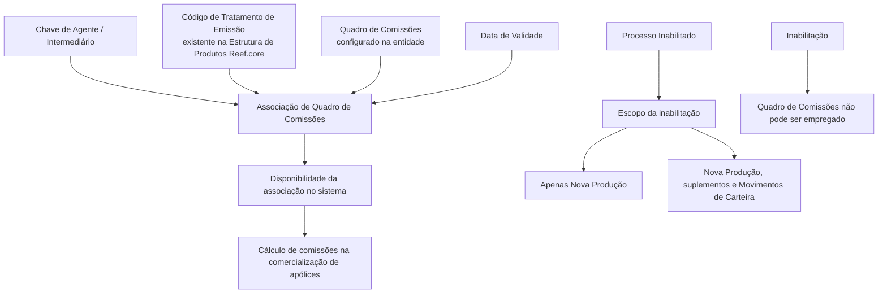

# Criação de Quadros de Comissões para Agentes no Reef.core

## 1. Metadados do Documento
- **Arquivo de Origem:** Não identificado no conteúdo fornecido
- **Tipo de Documento:** Especificação Funcional
- **Domínio / Sistema:** Reef.core — gestão de agentes, tratamentos de emissão e quadros de comissões
- **Público-Alvo:** Operação, negócio e equipes responsáveis pela configuração de comissões
- **Data/Versão Identificada:** Não identificada

---

## 2. Resumo Executivo & Contexto de Negócio

O documento descreve a operação de **criação de Quadros de Comissões para um Agente** no sistema Reef.core. O objetivo é registrar a relação entre um agente, um código de tratamento de emissão e um quadro de comissões que poderá ser utilizado no cálculo das comissões relativas à comercialização de apólices.

A configuração estabelece uma associação funcional composta pela **Chave de Agente**, pelo **Código de Tratamento de Emissão**, pelo **Quadro de Comissões** e pela **Data de Validade**. Essa associação determina quando uma configuração de comissionamento torna-se disponível no sistema e permite manter histórico das alterações efetuadas nas definições configuradas.

O documento diferencia comissões de **Nova Produção** e comissões de **Carteira**. As comissões de nova produção são percebidas exclusivamente durante o primeiro ano de vigência da apólice e, em geral, possuem valor maior para estimular a captação de novas operações. As comissões de carteira decorrem de apólices vigentes em anos subsequentes e permanecem enquanto as apólices subscritas por meio da gestão comercial do agente estiverem vigentes.

Também são descritos os campos de inabilitação da associação. O campo **Processo Inabilitado** define o escopo de impacto da inabilitação, enquanto o campo **Inabilitação** determina que o quadro de comissões do agente, para o tratamento definido, não poderá ser utilizado. O documento ressalta que o uso do campo Inabilitação não faz sentido durante a operação de criação.

---

## 3. Arquitetura, Componentes & Tecnologias Envolvidas

Os componentes e conceitos explicitamente citados são:

- **Reef.core:** sistema no qual são configurados tratamentos de emissão, estruturas de produtos, agentes e quadros de comissões.
- **Agente / Intermediário:** entidade identificada pela Chave de Agente.
- **Tratamento de Emissão:** código previamente existente na Estrutura de Produtos da entidade no Reef.core.
- **Quadro de Comissões:** configuração identificada por uma chave configurada na entidade.
- **Apólice:** objeto sobre o qual incidem comissões de nova produção ou de carteira.
- **Nova Produção:** comissões relativas exclusivamente ao primeiro ano de vigência da apólice.
- **Carteira:** comissões relacionadas a apólices vigentes em anos sucessivos.
- **GDC:** sigla exibida junto ao item “Cuadros de Comisiones”; o conteúdo não apresenta sua expansão ou função adicional.
- **Zeus:** termo exibido na navegação extraída, sem detalhamento funcional no conteúdo.



> **Nota de Análise:** O conteúdo não detalha métodos HTTP, contratos JSON, persistência de dados, interfaces técnicas, integrações, URLs de ambiente, autenticação ou tecnologias de implementação do Reef.core.

---

## 4. Regras de Negócio, Especificações Funcionais & Processos

### Objetivo funcional

A operação de criação registra a relação de Quadros de Comissões que podem ser empregados pelo Agente para calcular comissões associadas à comercialização de suas apólices.

### Sequência de captura

O documento estabelece que, no bloco de informação de Quadros de Comissões, os atributos devem ser capturados da esquerda para a direita e de cima para baixo.

### Regras da Chave de Agente

1. A **Chave de Agente** identifica a chave do intermediário.
2. A chave do intermediário deve estar de acordo com a definição previamente realizada no sistema.

### Regras do Código de Tratamento de Emissão

1. O **Código de Tratamento de Emissão** deve conter uma das chaves dos Tratamentos de Emissão existentes.
2. Os Tratamentos de Emissão devem existir na Estrutura de Produtos da entidade no Reef.core.

### Regras do Quadro de Comissões

1. O campo **Quadro de Comissões** identifica uma das chaves dos Quadros de Comissões configurados na entidade.
2. O quadro associado é empregado para o cálculo de comissões do agente na comercialização de apólices.

### Regras do Processo Inabilitado

1. O campo **Processo Inabilitado** define como a inabilitação do Quadro de Comissões do Agente afetará a emissão.
2. O impacto pode restringir-se exclusivamente às apólices de **Nova Produção**.
3. O impacto também pode abranger os movimentos de Nova Produção, os suplementos emitidos sobre essas apólices e os **Movimentos de Carteira**.

### Regras da Inabilitação

1. A marcação do campo **Inabilitação** implica que o Quadro de Comissões do Agente, para o Tratamento de Emissão definido, está inabilitado para ser empregado.
2. A inabilitação deve ser coerente com o valor informado em **Processo Inabilitado**.
3. Na operação de **Criação**, o uso do campo Inabilitação não faz sentido.

### Regras da Data de Validade

1. A **Data de Validade** define a data a partir da qual a associação entre Agente, Código de Tratamento de Emissão e Quadro de Comissões está disponível para uso no sistema.
2. O uso correto da Data de Validade permite manter um histórico das alterações efetuadas nas definições configuradas.

### Classificação de comissões

1. **Comissões de Nova Produção** são percebidas exclusivamente durante o primeiro ano de vigência da apólice.
2. Em geral, comissões de Nova Produção possuem valor maior do que comissões de Carteira, com a finalidade de estimular a captação de novas operações.
3. **Comissões de Carteira** originam-se da carteira de quem as percebe.
4. As comissões de Carteira aplicam-se a apólices vigentes em anos sucessivos.
5. As comissões de Carteira existem enquanto as apólices subscritas por meio da gestão comercial do agente permanecerem vigentes.

---

## 5. Tabelas de Parâmetros, Ambientes e Estruturas de Dados

| Item / Parâmetro | Descrição / Função | Tipo / Valores / Formato | Ambiente / Observações |
| :--- | :--- | :--- | :--- |
| Operação | Registra a relação de Quadros de Comissões que podem ser empregados pelo Agente. | Criação | O documento identifica a operação como “CREAR”. |
| Chave de Agente | Identifica a chave do intermediário. | Chave previamente definida no sistema | Deve estar de acordo com a definição já realizada no sistema. |
| Código de Tratamento de Emissão | Identifica o tratamento de emissão associado ao agente e ao quadro de comissões. | Uma das chaves de Tratamentos de Emissão existentes | Deve existir na Estrutura de Produtos da entidade no Reef.core. |
| Quadro de Comissões | Identifica a chave de um quadro de comissões configurado na entidade. | Chave de Quadro de Comissões | Utilizado na associação para cálculo de comissões. |
| Processo Inabilitado | Define o escopo afetado pela inabilitação do Quadro de Comissões do Agente para o tratamento de emissão. | Nova Produção; ou Nova Produção, suplementos e Movimentos de Carteira | O documento não apresenta valores codificados para o campo. |
| Inabilitação | Indica que o Quadro de Comissões do Agente não pode ser empregado para o Tratamento definido. | Check | Deve ser coerente com o Processo Inabilitado. Não faz sentido na operação de Criação. |
| Data de Validade | Define a partir de quando a associação entre Agente, Tratamento e Quadro de Comissões pode ser utilizada. | Data | Permite manter histórico das alterações nas definições configuradas. |
| Nova Produção | Classificação de comissão relacionada ao primeiro ano de vigência da apólice. | Comissão | Geralmente possui valor mais elevado para incentivar captação de novas operações. |
| Carteira | Classificação de comissão relacionada a apólices vigentes em anos sucessivos. | Comissão | Existe enquanto as apólices subscritas via gestão comercial do agente permanecerem vigentes. |
| Reef.core | Sistema citado como repositório de tratamentos de emissão e estrutura de produtos da entidade. | Sistema | Não há detalhamento técnico adicional. |
| GDC | Sigla apresentada junto a “Cuadros de Comisiones”. | Não detalhado | A expansão e a finalidade não são definidas no conteúdo. |
| RS | Termo exibido junto ao Código de Tratamento de Emissão. | Não detalhado | O conteúdo não explica o significado ou uso de “RS”. |
| Zeus | Termo apresentado na navegação extraída. | Não detalhado | Não há descrição funcional ou técnica. |

---

## 6. Bateria de Perguntas & Respostas para RAG (FAQ Sintético)

### P1: Qual é o objetivo da operação de criação de Quadros de Comissões para Agentes?
**R:** A operação registra a relação de Quadros de Comissões que podem ser utilizados por um Agente para calcular comissões na comercialização das suas apólices.

### P2: Quais informações formam a associação de comissão disponível para um agente?
**R:** A associação envolve a Chave de Agente, o Código de Tratamento de Emissão, o Quadro de Comissões e a Data de Validade. A Data de Validade determina a partir de quando a associação pode ser utilizada no sistema.

### P3: O que representa a Chave de Agente no processo de configuração de comissões?
**R:** A Chave de Agente identifica a chave do intermediário, conforme a definição previamente realizada no sistema.

### P4: Qual é a restrição para o Código de Tratamento de Emissão?
**R:** O Código de Tratamento de Emissão deve conter uma das chaves dos Tratamentos de Emissão existentes na Estrutura de Produtos da entidade no Reef.core.

### P5: O que o campo Quadro de Comissões identifica?
**R:** O campo Quadro de Comissões identifica no sistema uma das chaves dos Quadros de Comissões configurados na entidade.

### P6: Para que serve o campo Processo Inabilitado?
**R:** O campo Processo Inabilitado define se a inabilitação do Quadro de Comissões do Agente, para o tratamento de emissão definido, afeta somente apólices de Nova Produção ou se afeta também os movimentos de Nova Produção, suplementos emitidos sobre essas apólices e Movimentos de Carteira.

### P7: Qual é o efeito de marcar o campo Inabilitação?
**R:** A marcação do campo Inabilitação torna o Quadro de Comissões do Agente inabilitado para uso no Tratamento de Emissão definido, em coerência com o escopo estabelecido no campo Processo Inabilitado.

### P8: O campo Inabilitação deve ser utilizado durante a operação de criação?
**R:** Não. O documento declara que, na operação de Criação, o emprego do campo Inabilitação não faz sentido.

### P9: Qual é a finalidade da Data de Validade na associação entre agente e quadro de comissões?
**R:** A Data de Validade estabelece a data a partir da qual a associação do Agente ao Código de Tratamento de Emissão e ao Quadro de Comissões estará disponível para uso no sistema. O uso correto da data permite manter histórico das mudanças efetuadas nas definições configuradas.

### P10: O que são comissões de Nova Produção no Reef.core?
**R:** Comissões de Nova Produção são aquelas percebidas exclusivamente durante o primeiro ano de vigência da apólice. Em geral, possuem valor mais elevado do que as comissões de Carteira para estimular a captação de novas operações.

### P11: O que são comissões de Carteira no Reef.core?
**R:** Comissões de Carteira têm origem na carteira de quem as recebe, correspondendo a apólices vigentes em anos sucessivos. Essas comissões existem enquanto as apólices subscritas por meio da gestão comercial do agente permanecerem vigentes.

### P12: O documento especifica métodos HTTP ou contratos JSON para a criação de Quadros de Comissões?
**R:** Não. O conteúdo fornecido descreve atributos e regras funcionais da operação de criação, mas não detalha métodos HTTP, endpoints, contratos JSON ou integrações técnicas.

---

## 7. Glossário de Termos, Siglas & Conceitos-Chave

- **Agente:** entidade para a qual são registrados Quadros de Comissões empregados no cálculo de comissões de apólices.
- **Intermediário:** entidade identificada pela Chave de Agente.
- **Apólice:** contrato cuja comercialização pode gerar comissões para o agente.
- **Carteira:** conjunto de apólices vigentes em anos sucessivos que pode gerar comissões enquanto permanecer em vigência.
- **Comissão de Carteira:** comissão originada na carteira de quem a percebe e existente enquanto as apólices correspondentes estiverem vigentes.
- **Comissão de Nova Produção:** comissão percebida exclusivamente durante o primeiro ano de vigência da apólice.
- **Código de Tratamento de Emissão:** chave de um Tratamento de Emissão existente na Estrutura de Produtos da entidade no Reef.core.
- **Data de Validade:** data a partir da qual a associação entre Agente, Tratamento de Emissão e Quadro de Comissões pode ser utilizada.
- **GDC:** sigla exibida junto a “Cuadros de Comisiones”; o significado não é definido no conteúdo.
- **Movimentos de Carteira:** movimentos relacionados à Carteira, citados como possível escopo de impacto da inabilitação.
- **Nova Produção:** classificação aplicável ao primeiro ano de vigência da apólice.
- **Processo Inabilitado:** campo que define o escopo da inabilitação do Quadro de Comissões do Agente.
- **Quadro de Comissões:** configuração identificada por chave e associada ao agente para cálculo de comissões.
- **Reef.core:** sistema mencionado como referência para Tratamentos de Emissão e Estrutura de Produtos.
- **RS:** termo apresentado na extração do documento sem definição funcional.
- **Suplementos:** emissões realizadas sobre apólices de Nova Produção, citadas como possível escopo de impacto da inabilitação.

---

## 8. Notas Críticas, Riscos & Limitações

- A associação somente pode utilizar Códigos de Tratamento de Emissão existentes na Estrutura de Produtos da entidade no Reef.core.
- O Quadro de Comissões deve corresponder a uma chave configurada na entidade.
- A configuração inadequada de **Processo Inabilitado** pode resultar em um escopo de inabilitação diferente do esperado, pois o impacto pode atingir somente Nova Produção ou também suplementos e Movimentos de Carteira.
- O uso do campo **Inabilitação** durante a operação de Criação é explicitamente considerado sem sentido pelo documento.
- A **Data de Validade** é necessária para controlar a disponibilidade temporal da associação e preservar o histórico de alterações.
- O documento não detalha validações de formato, obrigatoriedade dos campos, códigos de erro, permissões, persistência, integrações, endpoints, contratos de serviço ou ambientes.
- **Nota de Análise:** O documento apresenta os termos GDC, RS e Zeus, mas não fornece expansão, propósito técnico ou regras associadas a esses termos.

---

## 9. Conteúdo Bruto Estruturado (Referência Fiel)

```text
--- [PÁGINA 1 DE 2] ---

CREAR Cuadros de Comisiones para el Agente
Objetivo
Registrar la relación de Cuadros de Comisiones que pueden ser empleados por el Agente para el
cálculo de las comisiones en la comercialización de sus pólizas.
Acciones habilitadas
 CREAR ( )
Cuadros de Comisiones (GDC)
De Izquierda a Derecha y de Arriba hacia Abajo, los siguientes atributos marcan la secuencia de
captura en este Bloque de Información.
Clave de Agente
Esta propiedad identifica la clave del intermediario de acuerdo con la definición de las mismas
previamente realizada en el Sistema.
Código de Tratamiento de Emisión (  )
 / 
 RS
Inicio Soluciones APIs Documentación Zeus
ES


--- [PÁGINA 2 DE 2] ---

Este atributo ha de contener una de las claves de los Tratamientos de Emisión de Reef.core
existentes en la Estructura de Productos de la Entidad.
Cuadro de Comisiones (  )
Este atributo identifica en el sistema una de las claves de los Cuadros de Comisiones configurados
en la entidad.
Proceso Inhabilitado ( )
Este campo establece si la inhabilitación del Cuadro de Comisiones del Agente para el tratamiento de
emisión definido va a afectar únicamente a las pólizas de Nueva Producción o afecta tanto a los
Movimientos de Nueva Producción como a los suplementos emitidos sobre ellas o Movimientos
de Cartera.
Inhabilitación ( )
El Check sobre este campo implica que el Cuadro de Comisiones del Agente y para el Tratamiento
definido está inhabilitado para poder ser empleado (en coherencia con el valor del Proceso
Inhabilitado que se haya indicado)
En la OPERACIÓN de CREACIÓN no tiene sentido su empleo.
Fecha de Validez ( )
Esta propiedad establece la fecha a partir de la cual la asociación del Agente al Código del
Tratamiento y al Cuadro de Comisiones está disponible en el sistema para ser utilizada por lo que su
correcto uso permite tener un histórico de los cambios efectuados en las definiciones configuradas.
Preguntas frecuentes
(1) ¿Qué implican en Reef.core los Términos Nueva Producción y Cartera?
Atendiendo al momento temporal en el que se generan las comisiones en el proceso de emisión,
puede establecerse la siguiente clasificación:
Las Comisiones de nueva producción son aquellas que se perciben exclusivamente durante el primer
año de vigencia de la póliza. Generalmente y a fin de estimular la labor de captación de nuevas
operaciones, este tipo de comisión suele ser de importe más elevado que la de cartera.
Las Comisiones de cartera en cambio tienen su origen en la cartera de quien la percibe (pólizas
vigentes en años sucesivos) y son comisiones que existen mientras tengan vigencia las pólizas
suscritas a través de la gestión comercial del agente.
```
