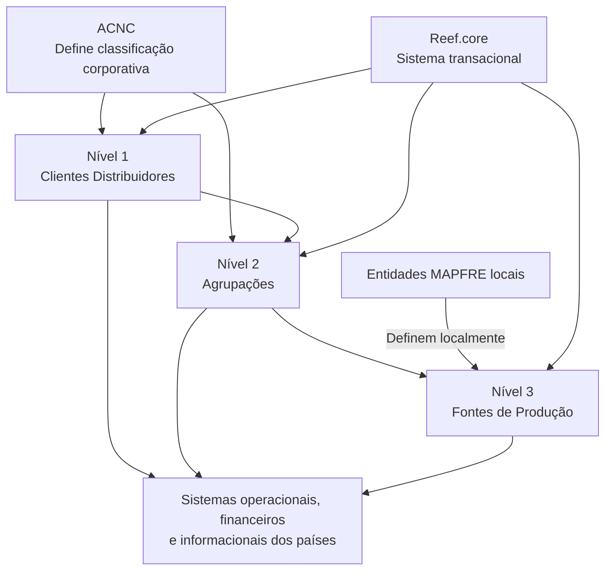

# Definição da Estrutura de Canais no Reef.core

## 1. Metadados do Documento
- **Arquivo de Origem:** `test_prompt_canales.txt`
- **Tipo de Documento:** Especificação Funcional
- **Domínio / Sistema:** Reef.core; estrutura de canais MAPFRE
- **Público-Alvo:** Negócio, Desenvolvedores, Arquitetos e Operação
- **Data/Versão Identificada:** Não identificada

---

## 2. Resumo Executivo & Contexto de Negócio

O documento descreve a funcionalidade de definição da estrutura de canais no sistema transacional Reef.core para as companhias MAPFRE locais. A iniciativa decorre de uma classificação operacional de clientes distribuidores estabelecida pela Área Corporativa de Negócio e Clientes (ACNC).

A classificação deve ser considerada pelos sistemas operacionais, financeiros e informacionais dos países. O propósito informado é facilitar a obtenção e o reporte de indicadores de produtividade e rentabilidade por canal, incluindo margem de contribuição.

A estrutura de canais é organizada como uma pirâmide de três níveis: clientes distribuidores, agrupações e fontes de produção. Os dois primeiros níveis constituem uma relação finita e definida corporativamente; as entidades MAPFRE podem definir localmente apenas a relação de fontes de produção.

O Reef.core disponibiliza repositórios específicos para codificar essa estrutura. As instalações recebem inicialmente informações da estrutura, exceto pelo terceiro nível, que deve ser definido localmente.

---

## 3. Arquitetura, Componentes & Tecnologias Envolvidas

| Componente / Entidade | Papel descrito |
| :--- | :--- |
| ACNC | Estabelece a classificação operacional de clientes distribuidores e participa do consenso sobre os dois primeiros níveis da estrutura. |
| Direção de Soluções Tecnológicas | Implementou a funcionalidade no sistema transacional Reef.core. |
| Reef.core | Sistema transacional que disponibiliza a funcionalidade de classificação e repositórios específicos para a estrutura de canais. |
| Companhias MAPFRE locais | Utilizam a funcionalidade e definem localmente a relação de fontes de produção. |
| Sistemas operacionais, financeiros e informacionais dos países | Devem contemplar a nova classificação operacional. |
| Clientes distribuidores | Representam o nível 1 da estrutura de canais. |
| Agrupações | Representam o nível 2 da estrutura de canais. |
| Fontes de produção | Representam o nível 3 da estrutura de canais. |



> **Nota de Análise:** O documento não detalha interfaces, APIs, contratos de dados, tecnologias de implementação, métodos de integração ou ambientes técnicos do Reef.core.

---

## 4. Regras de Negócio, Especificações Funcionais & Processos

1. A ACNC estabeleceu uma nova classificação operacional para clientes distribuidores.
2. A classificação deve ser contemplada por sistemas operacionais, financeiros e informacionais dos países.
3. A classificação busca facilitar a obtenção e o reporte de informações sobre:
   - Ratios de produtividade por canal.
   - Rentabilidade por canal.
   - Margem de contribuição.
4. O Reef.core disponibiliza às companhias MAPFRE locais a funcionalidade de classificar clientes distribuidores e suas agrupações conforme as diretrizes da ACNC.
5. A estrutura de canais possui três níveis piramidais:
   1. Clientes distribuidores.
   2. Agrupações.
   3. Fontes de produção.
6. Os dois primeiros níveis — clientes distribuidores e agrupações — são uma relação finita definida pelo corporativo.
7. As entidades MAPFRE possuem autonomia apenas para definir a relação de fontes de produção utilizada localmente.
8. O processo indicado pelo documento segue esta ordem:
   1. Definir clientes distribuidores.
   2. Definir agrupações.
   3. Definir fontes de produção.
9. As instalações recebem inicialmente informações dos repositórios da estrutura, com exceção do terceiro nível.

---

## 5. Tabelas de Parâmetros, Ambientes e Estruturas de Dados

| Item / Parâmetro | Descrição / Função | Tipo / Valores / Formato | Ambiente / Observações |
| :--- | :--- | :--- | :--- |
| Estrutura de canais | Estrutura funcional para classificação operacional de canais. | Estrutura piramidal de três níveis. | Codificada em repositórios específicos do Reef.core. |
| Nível 1 — Clientes distribuidores | Primeiro nível da estrutura de canais. | Relação finita definida pelo corporativo. | Deve ser definido antes dos demais níveis. |
| Nível 2 — Agrupações | Segundo nível da estrutura de canais. | Relação finita definida pelo corporativo. | Deve ser definido após clientes distribuidores. |
| Nível 3 — Fontes de produção | Terceiro nível da estrutura de canais. | Relação definida localmente pelas entidades MAPFRE. | Não é entregue inicialmente nas instalações. |
| Ratios de produtividade | Informação cuja obtenção e reporte são facilitados pela classificação. | Não detalhado. | Avaliação por canal. |
| Rentabilidade | Informação cuja obtenção e reporte são facilitados pela classificação. | Não detalhado. | Avaliação por canal; inclui margem de contribuição. |
| Margem de contribuição | Indicador citado no contexto de rentabilidade por canal. | Não detalhado. | Sem fórmula, fonte ou critério de cálculo informado. |

---

## 6. Bateria de Perguntas & Respostas para RAG (FAQ Sintético)

### P1: Qual é o objetivo da definição da estrutura de canais no Reef.core?
**R:** O objetivo é permitir a codificação de uma estrutura de canais da entidade MAPFRE em três níveis — clientes distribuidores, agrupações e fontes de produção — para suportar a classificação operacional e facilitar a obtenção e o reporte de indicadores de produtividade e rentabilidade por canal.

### P2: Quais sistemas devem considerar a classificação operacional de clientes distribuidores?
**R:** A classificação deve ser contemplada pelos sistemas operacionais, financeiros e informacionais dos países.

### P3: Quem estabeleceu a nova classificação operacional de clientes distribuidores?
**R:** A nova classificação operacional foi estabelecida pela Área Corporativa de Negócio e Clientes, identificada no documento pela sigla ACNC.

### P4: Quais são os níveis da estrutura de canais?
**R:** A estrutura de canais é piramidal e possui três níveis: nível 1, clientes distribuidores; nível 2, agrupações; e nível 3, fontes de produção.

### P5: Quem define os clientes distribuidores e as agrupações?
**R:** Os clientes distribuidores e as agrupações, correspondentes aos dois primeiros níveis, formam uma relação finita e definida pelo corporativo, em consenso com a ACNC.

### P6: Qual parte da estrutura de canais pode ser definida pelas entidades MAPFRE locais?
**R:** As entidades MAPFRE locais podem definir a relação de fontes de produção utilizada localmente, que corresponde ao terceiro nível da estrutura.

### P7: Em qual ordem o processo de definição da estrutura de canais deve ocorrer?
**R:** A ordem definida no documento é: primeiro definir clientes distribuidores, depois definir agrupações e, por último, definir fontes de produção.

### P8: O que é entregue inicialmente às instalações do Reef.core?
**R:** As instalações recebem inicialmente informações nos repositórios específicos da estrutura de canais, exceto o terceiro nível, correspondente às fontes de produção.

### P9: Qual benefício de negócio é associado à estrutura de canais?
**R:** A estrutura busca facilitar a obtenção e o reporte de informações sobre ratios de produtividade e rentabilidade por canal, incluindo margem de contribuição.

### P10: O documento detalha como calcular a margem de contribuição ou os ratios de produtividade?
**R:** Não. O documento cita ratios de produtividade, rentabilidade e margem de contribuição como informações que a classificação busca suportar, mas não apresenta fórmulas, critérios de cálculo, fontes de dados ou regras de apuração.

---

## 7. Glossário de Termos, Siglas & Conceitos-Chave

- **ACNC:** Área Corporativa de Negócio e Clientes; área que estabeleceu a nova classificação operacional de clientes distribuidores.
- **Reef.core:** Sistema transacional no qual a Direção de Soluções Tecnológicas implementou a funcionalidade de classificação da estrutura de canais.
- **Cliente distribuidor:** Elemento do nível 1 da estrutura de canais.
- **Agrupação:** Elemento do nível 2 da estrutura de canais.
- **Fonte de produção:** Elemento do nível 3 da estrutura de canais, cuja relação pode ser definida pelas entidades MAPFRE locais.
- **Margem de contribuição:** Indicador citado pelo documento no contexto da rentabilidade por canal.
- **Estrutura piramidal:** Organização de canais em três níveis sequenciais: clientes distribuidores, agrupações e fontes de produção.

---

## 8. Notas Críticas, Riscos & Limitações

- O documento não apresenta modelo de dados, atributos, chaves, regras de validação ou relacionamentos técnicos entre os três níveis.
- O documento não informa APIs, integrações, formatos de mensagens, rotas de log, URLs, ambientes ou mecanismos de sincronização.
- Não há detalhamento sobre permissões, governança, aprovação ou auditoria da definição local de fontes de produção.
- Os cálculos de produtividade, rentabilidade e margem de contribuição não são especificados.
- A ausência inicial do terceiro nível nas instalações implica dependência de configuração local das fontes de produção pelas entidades MAPFRE.

---

## 9. Conteúdo Bruto Estruturado (Referência Fiel)

```text
--- [PÁGINA 1 DE 2] ---

DEFINICIÓN de la ESTRUCTURA de CANALES
Contexto
El área corporativa de negocio y clientes (ACNC) ha establecido una nueva clasificación operativa de
clientes distribuidores que debe ser contemplada en los sistemas operacionales, financieros e
informacionales de los países, facilitando el proceso de obtención y reporte de la información de
ratios de productividad y de rentabilidad por canal (margen de contribución).
Por dicha razón, desde la Dirección de Soluciones Tecnológicas se ha implementado en el sistema
transaccional de Reef.core poniendo a disposición de las compañías MAPFRE locales la
funcionalidad de clasificar los clientes Distribuidores y sus Agrupaciones según las pautas indicadas
por el ACNC.
Se ha consensuado conjuntamente con el Área Corporativa de Negocio y Clientes (ACNC) el que los
dos primeros niveles de la estructura, los niveles correspondientes a los clientes distribuidores y a
sus agrupaciones sean una relación finita y definida por el corporativo, delegando en las entidades
MAPFRE únicamente la facultad de definir la relación de fuentes de producción que utilizan
localmente.
Objetivo
Funcionalmente, el núcleo del Sistema cuenta con la posibilidad de codificar la estructura de Canales
de la entidad MAPFRE en una estructura piramidal de tres niveles en repositorios de información
específicos que se entregan inicialmente a las instalaciones con información excepto el tercer nivel
de la estructura.
 / 
 CF
Home Solutions APIs Documentation Zeus
EN


--- [PÁGINA 2 DE 2] ---

Proceso a seguir
DEFINIR Clientes Distribuidores (1) DEFINIR Agrupaciones (2) DEFINIR Fuentes de Producción (3)
DEFINIR Nivel 1 - Clientes Distribuidores
DEFINIR Nivel 2 - Agrupaciones
DEFINIR Nivel 3 - Fuentes de Producción
```
