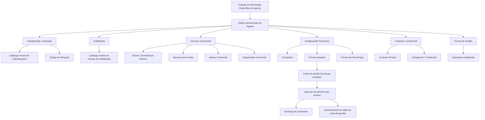

# Especificação Funcional — Criação de Informação Específica do Agente Segurador

## 1. Metadados do Documento
- **Arquivo de Origem:** Não identificado
- **Tipo de Documento:** Especificação Funcional
- **Domínio / Sistema:** Configuração operacional de Agentes em entidade seguradora
- **Público-Alvo:** Operação, Negócio, Administração de Catálogos, Desenvolvedores e Arquitetos
- **Data/Versão Identificada:** Não identificada

---

## 2. Resumo Executivo & Contexto de Negócio

O documento descreve a ação habilitada **CREAR**, destinada à criação de informações específicas de um Agente em uma entidade seguradora. O propósito da estrutura é identificar, detalhar e classificar informações de âmbito operacional do Agente, permitindo que processos corporativos considerem ou não essas circunstâncias.

Os atributos descritos são aplicáveis tanto a **Pessoas Físicas** quanto a **Pessoas Jurídicas**, salvo indicação expressa em contrário. A captura segue uma sequência visual indicada como “da esquerda para a direita e de cima para baixo”, embora o documento não forneça a representação completa da tela ou campos obrigatórios.

A configuração reúne dados de situação, classificação, inabilitação, vínculos comerciais, retenção, comissões, cobrança, envio de documentação, agrupamento comercial, contrato, credencial profissional e forma de gestão. Diversos atributos dependem de valores previamente definidos em catálogos mestres ou configurados localmente pela entidade seguradora.

Um ponto central é a governança operacional do Agente: a configuração pode determinar se o Agente está ativo, inativo, retirado, inabilitado, autorizado a comercializar nova produção, autorizado a atuar sobre suplementos, elegível para pagamento de comissões ou habilitado para cobrar primas avisadas.

O documento também estabelece regras explícitas de coerência entre a **Forma de Gestão** atribuída e as operativas habilitadas para o Agente. Entretanto, o texto não detalha validações sistêmicas, contratos de API, persistência de dados, métodos HTTP, integrações técnicas ou requisitos de segurança.

---

## 3. Arquitetura, Componentes & Tecnologias Envolvidas

O conteúdo descreve uma estrutura funcional de cadastro e configuração de Agentes. Não há tecnologias, bancos de dados, APIs, endpoints, protocolos, servidores ou ambientes técnicos identificados.

Os componentes funcionais e fontes de referência citados são:

- Estrutura de captura de Dados do Agente.
- Catálogo mestre de Classificações.
- Catálogo mestre de Causas de Inabilitação.
- Catálogo mestre de Tipos de Intermediários.
- Catálogo mestre de Oficinas Comerciais.
- Catálogo mestre de Agentes.
- Catálogo mestre de Fontes de Produção.
- Tipos de Retenção configurados localmente.
- Catálogo mestre de Compensações.
- Catálogo mestre de Códigos de Qualidade.
- Catálogo mestre de Códigos de Envio.
- Catálogo mestre de Agrupações.
- Conta de gestão de primas avisadas.
- Processo de Pagamento da Liquidação de Comissões.
- Processos de Nova Produção e Suplementos de carteira.



> **Nota de Análise:** O documento identifica catálogos mestres e processos operacionais, mas não especifica a arquitetura técnica, mecanismos de integração, proprietários dos catálogos, estruturas de banco de dados ou interfaces de consumo.

---

## 4. Regras de Negócio, Especificações Funcionais & Processos

### 4.1 Aplicabilidade dos atributos

- Caso não exista especificação ou indicação expressa em sentido contrário, os atributos devem ser empregados tanto para **Pessoas Físicas** quanto para **Pessoas Jurídicas**.

### 4.2 Vigência operacional do Agente

- A **Fecha de Validez** indica a data a partir da qual o Agente está plenamente operativo no sistema.
- A utilização correta da data de validade permite à entidade seguradora manter histórico das alterações efetuadas na configuração e nas informações dos Agentes.

### 4.3 Situação do Agente

- O campo **Situación** atribui um código de situação ao Agente.
- A entidade seguradora deve avaliar a conveniência de uso transversal do código de situação nos processos corporativos.
- Quando o idioma de definição é espanhol, os valores listados são:
  - `1`: Agente Activo.
  - `2`: Agente Inactivo.
  - `3`: Agente Retirado.

### 4.4 Inabilitação do Agente

- O atributo **Inhabilitación** informa ao sistema que o Agente está inabilitado.
- A partir do momento da inabilitação, o Agente não deve ser empregado, contemplado ou considerado em parte ou na totalidade dos processos operacionais da entidade.
- Quando o Agente está inabilitado, o atributo **Causa de Inhabilitación** deve conter o código de uma causa definida no catálogo mestre do sistema.
- O atributo **Proceso Inhabilitado** determina se a inabilitação se aplica:
  - à comercialização de pólizas ou aplicações de Nova Produção; ou
  - à intermediação de pólizas e aplicações de Nova Produção, bem como de Suplementos da carteira de pólizas e aplicações.

### 4.5 Vínculos comerciais e requisitos de atividade

- A **Oficina Comercial por Defecto** deve corresponder a uma Oficina Comercial previamente definida na estrutura comercial da companhia.
- O **Ejecutivo de Cuenta** deve corresponder a um código de Tercero configurado no sistema com **Código de Actividad 11**.
- O **Asesor Comercial** e o **Organizador Comercial** devem corresponder a códigos de Terceros configurados no sistema com **Código de Actividad 2**.
- O documento não especifica se os vínculos comerciais são obrigatórios, exclusivos ou sujeitos a validação de vigência.

### 4.6 Comissões, cobrança e retenção

- **Exclusión de Comisiones** exclui o Agente, por questões comerciais, do Processo de Pagamento da Liquidação de Comissões configurado na entidade.
- **Tipo de Retención** deve conter o código de um dos tipos de retenção configurados localmente pela entidade seguradora.
- **Forma de Cobro/Pago** deve indicar um código de forma de cobrança/pagamento conforme as possíveis Formas de Compensação definidas no catálogo mestre de Compensações.

### 4.7 Primas Avisadas

- O atributo **Primas Avisadas** somente tem efeito caso a entidade seguradora tenha o conceito de Primas Avisadas operativo.
- A configuração qualifica o Agente para poder ou não executar essa tarefa administrativa.
- A operativa permite que Agentes cobrem recibos contra uma conta de gestão de primas avisadas sem gerar o devengo de comissões ao Agente.
- Quando o Agente ingressa o dinheiro dos recibos:
  1. As comissões correspondentes são devengadas.
  2. O valor pendente é cancelado na conta de gestão de primas avisadas contra o efetivo entregue pelo Agente.

### 4.8 Contrato, colegiação e credencial

- **Contrato** contém o código ou chave do contrato privado celebrado entre a entidade seguradora e o Agente.
- **Fecha de Efecto del Contrato** habilita o Agente a exercer comercialmente como tal.
- **Fecha de Vencimiento del Contrato** registra a data de baixa do contrato celebrado.
- **Número de Colegiación** contém a chave ou código da cédula profissional que habilita o Agente, por pertencer a colégio profissional ou associação oficial semelhante, a exercer como mediador de seguros.
- **Fecha de Efecto de la Credencial** registra a data de efeito da colegiação.
- **Fecha de Vencimiento de la Credencial** registra a data de baixa da colegiação.

### 4.9 Forma de Gestão e coerência operacional

- **Forma de Gestión** identifica a forma de gestão atribuída ao Agente de acordo com orientações ou diretrizes das Direções de Clientes, Comercial ou outras áreas da entidade seguradora.
- Exemplos apresentados:
  - `AA1`: No puede Cobrar Primas.
  - `BB1`: Puede Cobrar Primas.
  - `CC1`: Solo a Cuentas Corporativas.
- Deve existir total coerência entre a Forma de Gestão atribuída e as operativas habilitadas para o Agente pela entidade seguradora.

### 4.10 Classificação complementar

- **Tipo de Clasificación** permite associar ao Agente um código de agrupamento que classifica e complementa as informações habilitadas no núcleo do sistema.
- Quando o idioma de definição é espanhol, os valores listados são:
  - `1`: Agente Bueno.
  - `2`: Agente Regular.
  - `3`: Agente Malo.

---

## 5. Tabelas de Parâmetros, Ambientes e Estruturas de Dados

| Item / Parâmetro | Descrição / Função | Tipo / Valores / Formato | Ambiente / Observações |
| :--- | :--- | :--- | :--- |
| Acción habilitada | Permite criar informação específica do Agente. | `CREAR` | Não são detalhadas outras ações. |
| Fecha de Validez | Data a partir da qual o Agente está plenamente operativo. Permite histórico de alterações na configuração e informação do Agente. | Data | Aplicável a Pessoas Físicas e Jurídicas, salvo indicação expressa. |
| ¿Productor Directo? | Qualifica o Agente como Produtor Direto quando ativado. | Marca / indicador | O documento não informa valores técnicos. |
| Situación | Atribui código de situação ao Agente para uso nos processos da seguradora. | `1`, `2`, `3` | `1`: Agente Activo; `2`: Agente Inactivo; `3`: Agente Retirado. Valores apresentados para idioma espanhol. |
| Clasificación | Classificação atribuída ao Agente conforme catálogo mestre de Classificações. | Código de catálogo | O catálogo e seus valores não são detalhados. |
| Inhabilitación | Indica que o Agente está inabilitado no sistema. | Marca / indicador | Após a inabilitação, o Agente não deve ser considerado em parte ou em todos os processos operacionais. |
| Causa de Inhabilitación | Código da causa de inabilitação do Agente. | Código de catálogo | Preenchido quando o Agente está inabilitado; depende do catálogo mestre de Causas de Inabilitação. |
| Proceso Inhabilitado | Determina o escopo da inabilitação comercial. | Opção de processo | Nova Produção; ou Nova Produção e Suplementos de carteira. |
| Tipo de Agente | Tipologia do Agente. | Código de catálogo | Conforme catálogo mestre de Tipos de Intermediários. |
| Oficina Comercial por Defecto | Oficina Comercial atribuída por padrão ao Agente. | Código de catálogo | Deve existir previamente na estrutura comercial da companhia. |
| Ejecutivo de Cuenta | Código do Executivo de Conta vinculado ao Agente. | Código de Tercero | O Tercero deve possuir Código de Actividad `11`. |
| Asesor Comercial | Código do Assessor Comercial vinculado ao Agente. | Código de Tercero | O Tercero deve possuir Código de Actividad `2`. |
| Organizador Comercial | Código do Organizador Comercial vinculado ao Agente. | Código de Tercero | O Tercero deve possuir Código de Actividad `2`. |
| Fuente de Producción por Defecto | Fonte de Produção atribuída por padrão ao Agente. | Código de catálogo | Conforme catálogo mestre de Fuentes de Producción configuradas localmente. |
| Tipo de Retención | Tipo de retenção associado ao Agente. | Código de retenção | Deve ser um dos Tipos de Retención configurados localmente. |
| Exclusión de Comisiones | Exclui o Agente do Processo de Pagamento da Liquidação de Comissões. | Marca / indicador | Exclusão por questões comerciais. |
| Forma de Cobro/Pago | Forma de cobrança ou pagamento do Agente. | Código de compensação | Conforme Formas de Compensación do catálogo mestre de Compensaciones. |
| Calidad del Agente | Classificação qualitativa atribuída ao Agente. | Código de catálogo | Conforme catálogo mestre de Códigos de Calidad. |
| Tipo de Envío | Identifica o método de envio de documentação ao Agente. | Chave / código de envio | Inclui, como exemplo, cópias de CC.PP. de pólizas. Catálogo configurado corporativamente no núcleo do sistema. |
| Agrupamiento Comercial del Agente | Agrupação Comercial atribuída ao Agente. | Código de catálogo | Conforme catálogo mestre de Agrupaciones do sistema. |
| Primas Avisadas? | Habilita ou não o Agente para realizar a tarefa administrativa de Primas Avisadas. | Marca / indicador | Depende de a entidade ter o conceito operativo. |
| Contrato | Código ou chave do contrato privado entre seguradora e Agente. | Código / chave | Não é detalhado formato. |
| Fecha de Efecto del Contrato | Data que habilita o Agente a atuar comercialmente. | Data | Refere-se ao contrato privado do Agente. |
| Fecha de Vencimiento del Contrato | Data de baixa do contrato celebrado. | Data | Refere-se ao contrato privado do Agente. |
| Número de Colegiación | Código ou chave da cédula profissional do Agente mediador de seguros. | Código / chave | Relacionado a colégio profissional ou associação oficial semelhante. |
| Fecha de Efecto de la Credencial | Data de efeito da colegiação do Agente. | Data | Não é detalhado formato. |
| Fecha de Vencimiento de la Credencial | Data de baixa da colegiação do Agente. | Data | Não é detalhado formato. |
| Observaciones | Campo para informação adicional do Agente. | Texto | Conforme orientações das Direções de Clientes ou Comercial. |
| Forma de Gestión | Forma de gestão atribuída ao Agente. | Código de gestão | Deve ser coerente com as operativas habilitadas. |
| Tipo de Clasificación | Código de agrupamento complementar para classificação do Agente. | `1`, `2`, `3` | `1`: Agente Bueno; `2`: Agente Regular; `3`: Agente Malo. Valores apresentados para idioma espanhol. |

---

## 6. Bateria de Perguntas & Respostas para RAG (FAQ Sintético)

### P1: Qual é o objetivo da ação `CREAR` no cadastro de informações específicas do Agente?
**R:** A ação `CREAR` permite criar informações operacionais e de classificação de um Agente. A estrutura busca identificar e detalhar dados de âmbito operativo, permitindo que os processos da entidade seguradora considerem ou deixem de considerar as circunstâncias configuradas para o Agente.

### P2: A configuração descrita vale para Pessoas Físicas e Pessoas Jurídicas?
**R:** Sim. Caso não exista especificação ou indicação expressa em contrário, os atributos da estrutura devem ser utilizados tanto para Pessoas Físicas quanto para Pessoas Jurídicas.

### P3: Qual é a finalidade da Fecha de Validez do Agente?
**R:** A Fecha de Validez indica a data a partir da qual o Agente está plenamente operativo no sistema. A correta utilização dessa data permite manter histórico das alterações realizadas na configuração e nas informações dos Agentes.

### P4: Quais são os códigos de Situación do Agente apresentados para a definição em espanhol?
**R:** O documento apresenta três códigos: `1` para Agente Activo, `2` para Agente Inactivo e `3` para Agente Retirado. O código de situação pode ser usado transversalmente nos processos da companhia conforme avaliação da entidade seguradora.

### P5: O que ocorre quando um Agente é marcado com Inhabilitación?
**R:** A Inhabilitación informa ao sistema que o Agente está inabilitado. A partir desse momento, o Agente não deveria ser empregado, contemplado ou considerado em parte ou em todos os processos operacionais da entidade. A causa deve ser registrada pelo atributo Causa de Inhabilitación, usando código definido no catálogo mestre do sistema.

### P6: Qual é a diferença entre os escopos possíveis de Proceso Inhabilitado?
**R:** O Proceso Inhabilitado define se o Agente está inabilitado apenas para comercializar pólizas ou aplicações de Nova Produção, ou se está inabilitado para intermediar tanto pólizas e aplicações de Nova Produção quanto Suplementos da carteira de suas pólizas e aplicações.

### P7: Que requisitos devem ser atendidos pelos códigos de Executivo de Conta, Assessor Comercial e Organizador Comercial?
**R:** O código do Ejecutivo de Cuenta deve ser um código de Tercero configurado no sistema com Código de Actividad `11`. Os códigos do Asesor Comercial e do Organizador Comercial devem ser códigos de Terceros configurados no sistema com Código de Actividad `2`.

### P8: O que significa Exclusión de Comisiones?
**R:** Exclusión de Comisiones significa que a entidade seguradora exclui o Agente, por questões comerciais, do Processo de Pagamento da Liquidação de Comissões configurado na entidade.

### P9: Como funciona a operativa de Primas Avisadas?
**R:** Quando a entidade possui o conceito de Primas Avisadas operativo e o Agente está qualificado para essa tarefa, o Agente pode cobrar recibos contra uma conta de gestão de primas avisadas sem gerar o devengo de comissões. Posteriormente, quando o Agente entrega o dinheiro dos recibos, as comissões correspondentes são devengadas e o valor é cancelado da conta de gestão de primas avisadas contra o efetivo entregue.

### P10: Qual é a finalidade da Forma de Gestión?
**R:** A Forma de Gestión identifica a forma de gestão atribuída ao Agente conforme diretrizes das Direções de Clientes, Comercial ou outras áreas da entidade seguradora. Deve existir total coerência entre a Forma de Gestión atribuída e as operativas habilitadas para o Agente.

### P11: Quais exemplos de Forma de Gestión são fornecidos?
**R:** São fornecidos três exemplos: `AA1` significa que o Agente não pode cobrar primas; `BB1` significa que o Agente pode cobrar primas; e `CC1` significa que o Agente atua somente com contas corporativas.

### P12: Para que servem as datas de contrato e credencial?
**R:** A Fecha de Efecto del Contrato habilita o Agente a exercer comercialmente, enquanto a Fecha de Vencimiento del Contrato indica a data de baixa do contrato. A Fecha de Efecto de la Credencial registra a vigência da colegiação, e a Fecha de Vencimiento de la Credencial indica a baixa da colegiação do Agente.

---

## 7. Glossário de Termos, Siglas & Conceitos-Chave

- **Agente:** Entidade ou pessoa cuja informação operacional, comercial, contratual e de classificação é configurada no sistema.
- **Asesor Comercial:** Assessor Comercial atribuído ao Agente; deve corresponder a um Tercero com Código de Actividad `2`.
- **CC.PP.:** Sigla apresentada no texto como referência a cópias de documentação de pólizas; o documento não explicita seu significado.
- **Causa de Inhabilitación:** Código de motivo pelo qual um Agente está inabilitado, definido em catálogo mestre.
- **Código de Actividad 2:** Código de atividade exigido para os Terceros usados como Asesor Comercial e Organizador Comercial.
- **Código de Actividad 11:** Código de atividade exigido para o Tercero usado como Ejecutivo de Cuenta.
- **Colegiación:** Condição de pertencimento do Agente a colégio profissional ou associação oficial semelhante que o habilita como mediador de seguros.
- **Devengo de comisiones:** Momento em que as comissões correspondentes são geradas ou reconhecidas para o Agente, no contexto de Primas Avisadas.
- **Ejecutivo de Cuenta:** Executivo de Conta atribuído ao Agente; deve corresponder a um Tercero com Código de Actividad `11`.
- **Forma de Cobro/Pago:** Código da forma de cobrança ou pagamento do Agente, conforme catálogo de Compensações.
- **Forma de Gestión:** Código que identifica a forma de gestão atribuída ao Agente e que deve ser coerente com suas operativas habilitadas.
- **Fuente de Producción:** Fonte de Produção atribuída ao Agente, com valor obtido de catálogo configurado localmente.
- **Inhabilitación:** Estado que informa que o Agente não deve ser empregado ou considerado em parte ou na totalidade dos processos operacionais.
- **Nueva Producción:** Pólizas ou aplicações classificadas pelo documento como nova produção.
- **Organizador Comercial:** Organizador Comercial atribuído ao Agente; deve corresponder a um Tercero com Código de Actividad `2`.
- **Primas Avisadas:** Operativa em que o Agente cobra recibos em conta de gestão específica sem devengo imediato de comissões.
- **Proceso Inhabilitado:** Definição do escopo comercial afetado pela inabilitação do Agente.
- **Retención:** Tipo de retenção configurado localmente e atribuído ao Agente.
- **Suplementos:** Operações associadas à carteira de pólizas e aplicações do Agente.
- **Tercero:** Entidade configurada no sistema cujo código pode ser utilizado para Executivo de Conta, Assessor Comercial ou Organizador Comercial.
- **Tipo de Agente:** Tipologia atribuída ao Agente conforme catálogo mestre de Tipos de Intermediários.

---

## 8. Notas Críticas, Riscos & Limitações

- O documento não identifica o nome do sistema, versão, data, autor, proprietário funcional ou responsável técnico.
- Não há detalhamento de tecnologias, APIs, endpoints, métodos HTTP, contratos JSON, banco de dados, mensageria, autenticação, autorização ou integrações.
- Não são informados formatos técnicos, obrigatoriedade, cardinalidade, regras de preenchimento, valores nulos, validações de data ou mensagens de erro dos campos.
- Diversos valores dependem de catálogos mestres ou configurações locais, mas o conteúdo desses catálogos não é apresentado integralmente.
- Não há definição explícita de precedência entre Situação, Inhabilitación, Proceso Inhabilitado, Forma de Gestión e Exclusión de Comisiones.
- A regra de “total coerência” entre Forma de Gestión e operativas habilitadas é declarada, mas a matriz de compatibilidade não é fornecida.
- A sigla **CC.PP.** é citada, porém não é expandida ou definida.
- O documento não detalha se as operações de Primas Avisadas possuem controles de reconciliação, limites, aprovações, contabilização ou tratamento de inadimplência.

---

## 9. Conteúdo Bruto Estruturado (Referência Fiel)

```text
--- [PÁGINA 1 DE 6] ---

CREAR Información específica del Agente
Objetivo
La captura de la información en esta Estructura obedece a la necesidad de identificar y detallar la
información de ámbito operativo del Agente además de clasificarlo adecuadamente para poder
contemplar o no esta circunstancia en los procesos de la entidad Aseguradora que así lo demanden.
Acciones habilitadas
 CREAR ( )
Datos Agente
De Izquierda a Derecha y de Arriba hacia Abajo, los siguientes atributos marcan la secuencia de
captura de los Datos.
 / 
 RS
Inicio Soluciones APIs Documentación Zeus
ES


--- [PÁGINA 2 DE 6] ---

Si no se especifica o indica expresamente, los Atributos se emplearán tanto en Personas Físicas
como en Personas Jurídicas
Fecha de Validez ( )
Esta propiedad le indica al Sistema la fecha a partir de la cual el Agente está plenamente operativo
en el sistema por lo que su empleo y correcta utilización permite tener en la entidad Aseguradora un
histórico de los cambios efectuados en la configuración e información de los Agentes.
¿Productor Directo? ( )
La activación de esta marca en la captura de la información del Agente califica al Agente como
Productor Directo.
Situación (  )
El sentido de este campo es asignar un código de situación al Agente para que la entidad
aseguradora, tras haber analizado la conveniencia de utilizarlo transversalmente en los procesos de
la compañía, lo utilice adecuadamente en aquellos procesos que así lo puedan demandar.
Si el Idioma utilizado en la definición es el español, sus valores son:
TIPOS de SITUACIÓN DESCRIPCIÓN
1 Agente Activo
2 Agente Inactivo
3 Agente Retirado
Clasificación (  )
Este Campo contendrá la Clasificación que se le otorga al Agente de acuerdo con la relación de
valores existentes en el catálogo maestro de Clasificaciones configurado en el Sistema.
Inhabilitación ( )
Este Campo le indica al Sistema que el Agente está inhabilitado en el Sistema por lo que a partir del
momento de su inhabilitación no debería ser empleado, contemplado o considerado en parte o en
todos los procesos operativos de la entidad.
Causa de Inhabilitación (  )


--- [PÁGINA 3 DE 6] ---

En el supuesto que el Agente estuviera Inhabilitado, este atributo del Agente contendrá el código de
una Causa de Inhabilitación definida en el catálogo maestro del Sistema.
Proceso Inhabilitado ( )
Este campo establece si el Agente está inhabilitado para comercializar pólizas o aplicaciones de
Nueva Producción o bien está inhabilitado para intermediar tanto pólizas y aplicaciones de Nueva
Producción como Suplementos a la cartera de sus pólizas y aplicaciones.
Tipo de Agente (  )
Este dato contendrá la Tipología del Agente de acuerdo con la relación de valores existentes en el
catálogo maestro de Tipos de Intermediarios configurado en el Sistema.
Oficina Comercial por Defecto (  )
Este Campo contendrá la Oficina Comercial que el Agente va a tener asignada por defecto de
acuerdo con la relación de valores existentes en el catálogo maestro de Oficinas Comerciales
definidas previamente en la estructura comercial de la Compañía.
Ejecutivo de Cuenta(  )
Este Campo contendrá el código del Ejecutivo de Cuenta al que estará asignado el Agente, de
acuerdo con la relación existente en el catálogo maestro de Agentes existente en el Sistema.
El Código del Ejecutivo de Cuenta ha de ser un código de Tercero configurado en el Sistema con
el Código de Actividad 11.
Asesor Comercial (  )
Este Campo contendrá el código del Asesor Comercial que tendrá asignado el Agente, de acuerdo
con la relación existente en el catálogo maestro de Agentes existente en el Sistema.
Organizador Comercial (  )
Este Campo contendrá el código del Organizador Comercial al que estará asignado el Agente, de
acuerdo con la relación existente en el catálogo maestro de Agentes existente en el Sistema.
Tanto el Código del Asesor Comercial como el Código del Organizador Comercial han de ser
códigos de Terceros configurados en el Sistema con el Código de Actividad 2.
Ejecutivo de Cuenta
Organizador Comercial


--- [PÁGINA 4 DE 6] ---

Fuente de Producción por Defecto (  )
Este Campo contendrá la Fuente de Producción por defecto que el Agente va a tener asignada de
acuerdo con la relación de valores existentes en el catálogo maestro de Fuentes de Producción
configuradas localmente.
Tipo de Retención (  )
Este Dato contiene el código de uno de los Tipos de Retención configurados localmente por la
Entidad Aseguradora.
Exclusión de Comisiones ( )
Este atributo implica que la entidad Aseguradora excluye por cuestiones comerciales al Agente del
Proceso de Pago de la Liquidación de Comisiones configurado en la Entidad.
Forma de Cobro/Pago (  )
Este Dato indicará el Código de la Forma de Cobro/Pago del Agente de acuerdo con las posibles
Formas de Compensación definidas en el catálogo maestro de Compensaciones.
Calidad del Agente (  )
Este Campo contendrá una clasificación cualitativa del Agente de acuerdo con la relación de valores
existentes en el catálogo maestro de Códigos de Calidad configurado en el Sistema.
Tipo de Envío (  )
Este campo contiene una clave que identifica el método de envío por el cual la entidad aseguradora
dispondrá al Agente de su documentación, como por ejemplo las copias de las CC.PP de sus pólizas,
... todo ello de acuerdo con los valores del catálogo maestro de Códigos de Envío configurado
corporativamente en el núcleo del Sistema.
Agrupamiento Comercial del Agente (  )
Este Campo contendrá la Agrupación Comercial del Agente de acuerdo con la relación de valores
configurados en el catálogo maestro de Agrupaciones del Sistema.
Primas Avisadas? ( )
Siempre y cuando la entidad Aseguradora tenga operativo el concepto de Primas Avisadas, este
Atributo en la configuración del Agente le califica para estar o no en disposición de poder realizar esta
tarea administrativa.


--- [PÁGINA 5 DE 6] ---

La operativa denominada "Primas Avisadas" permite que los Agentes cobren recibos contra una
cuenta de gestión de primas avisadas sin generar el devengo de las comisiones al agente.
Posteriormente cuando el agente ingrese el dinero de los recibos se devengarán las comisiones
correspondientes y se cancelará su importe de la cuenta de gestión de primas avisadas contra el
efectivo que nos entregue.
Contrato ( )
Código o Clave del Contrato Privado celebrado entre la Entidad Aseguradora y el Agente.
Fecha de Efecto del Contrato ( )
Fecha de Efecto del Contrato que habilita al Agente para poder ejercer comercialmente como tal.
Fecha de Vencimiento del Contrato ( )
Fecha en la que causa baja el contrato celebrado previamente entre la entidad Aseguradora y el
Agente.
Número de Colegiación ( )
Este Campo contiene la clave/código de la Cédula Profesional por la que un Agente, por pertenecer a
un colegio profesional o asociación semejante de carácter oficial, está habilitado para ejercer como
mediador de Seguros.
Fecha de Efecto de la Credencial ( )
Fecha de Efecto de la Colegiación del Agente.
Fecha de Vencimiento de la Credencial ( )
Fecha en la que causa baja la Colegiación del Agente.
Observaciones ( )
El propósito de este campo es permitir la captura de información adicional del Agente de acuerdo con
los Planteamientos o directrices que pudieran efectuar las Direcciones de Clientes o Comercial de la
entidad aseguradora.
Forma de Gestión (  )
El propósito de este campo es identificar la Forma de Gestión que tendrá asignado al Agente de
acuerdo con los Planteamientos o directrices que pudieran efectuar las Direcciones de Clientes,
Comercial,... de la entidad aseguradora.


--- [PÁGINA 6 DE 6] ---

A modo de ejemplo y si el Idioma utilizado en la definición es el español:
FORMAS DE GESTIÓN DESCRIPCIÓN
AA1 No puede Cobrar Primas
BB1 Puede Cobrar Primas
CC1 Solo a Cuentas Corporativas
... ...
Debe existir una total coherencia entre las forma de Gestión asignada y las operativas habilitadas
al Agente por parte de la entidad Aseguradora.
Tipo de Clasificación (  )
Este atributo permite a la entidad Aseguradora asociar al Agente un código de Agrupamiento que
clasifique al Agente y que complemente la información que está habilitada en el núcleo del Sistema.
Si el Idioma utilizado en la definición es el español, sus valores son:
CLASIFICACIONES DESCRIPCIÓN
1 Agente Bueno
2 Agente Regular
3 Agente Malo
```
