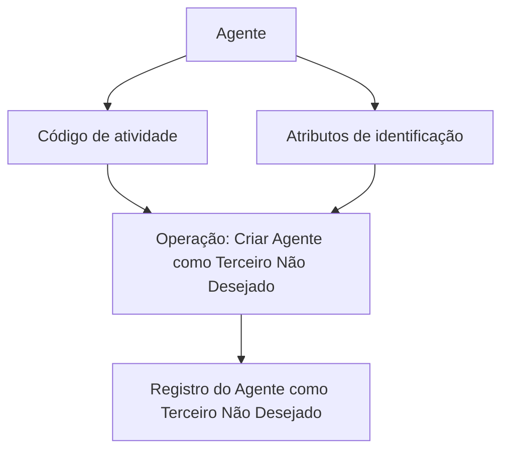

# Operação “Criar Agente como Terceiro Não Desejado”

## 1. Metadados do Documento
- **Arquivo de Origem:** Não identificado
- **Tipo de Documento:** Procedimento
- **Domínio / Sistema:** Zeus — Soluções APIs
- **Público-Alvo:** Operação, Negócio e utilizadores das APIs
- **Data/Versão Identificada:** Não identificada

---

## 2. Resumo Executivo & Contexto de Negócio

O conteúdo descreve a operação **“Criar Agente como Terceiro Não Desejado”**. A finalidade declarada é registrar um Agente na condição de **Terceiro Não Desejado**.

O registro é realizado de acordo com o **código de atividade** do Agente e com os valores dos **atributos que compõem a identificação** desse Agente. O texto não detalha quais são os códigos de atividade aceitos, quais atributos identificam o Agente, nem as regras de validação aplicadas.

A operação está apresentada no contexto de **Soluções APIs**, com referências de navegação a “Início”, “APIs”, “Documentação” e “Zeus”. O material não apresenta contrato de API, método HTTP, endpoint, payload, resposta, autenticação ou tratamento de erros.

---

## 3. Arquitetura, Componentes & Tecnologias Envolvidas

Os elementos explicitamente citados são:

| Componente / Termo | Papel identificado no conteúdo | Detalhamento disponível |
| :--- | :--- | :--- |
| Agente | Entidade que pode ser registrada como Terceiro Não Desejado | Não detalhado |
| Terceiro Não Desejado | Classificação atribuída ao Agente pela operação | Não detalhado |
| Código de atividade | Critério usado no registro do Agente | Valores não informados |
| Atributos de identificação | Valores que compõem a identificação do Agente | Atributos não informados |
| Soluções APIs | Contexto de acesso à operação | Não detalhado |
| Zeus | Referência de sistema ou área de documentação | Não detalhado |
| RS | Referência exibida no conteúdo | Significado não identificado |



**Nota de Análise:** O conteúdo descreve a finalidade operacional, mas não apresenta a arquitetura técnica, os métodos HTTP, os contratos de integração, os ambientes, os serviços internos ou persistências envolvidos.

---

## 4. Regras de Negócio, Especificações Funcionais & Processos

1. A operação permite registrar um **Agente** como um **Terceiro Não Desejado**.
2. O registro deve considerar o **código de atividade** do Agente.
3. O registro deve considerar os valores dos **atributos que conformam a identificação** do Agente.
4. O documento não define:
   - os códigos de atividade existentes;
   - os atributos de identificação exigidos;
   - valores permitidos ou obrigatórios;
   - critérios de rejeição;
   - mensagens de erro;
   - aprovação, revisão ou reversão do registro;
   - responsável pelo cadastro;
   - método de consulta ou remoção de um Agente Não Desejado.

---

## 5. Tabelas de Parâmetros, Ambientes e Estruturas de Dados

| Item / Parâmetro | Descrição / Função | Tipo / Valores / Formato | Ambiente / Observações |
| :--- | :--- | :--- | :--- |
| Agente | Entidade registrada pela operação | Não informado | Pode receber a classificação de Terceiro Não Desejado |
| Terceiro Não Desejado | Classificação resultante da operação | Não informado | O documento não define efeitos dessa classificação |
| Código de atividade | Critério considerado para o registro | Não informado | Não há catálogo de códigos no conteúdo |
| Atributos de identificação | Valores usados para identificar o Agente | Não informado | Os atributos não são enumerados |
| Operação “Criar Agente como Terceiro Não Desejado” | Operação de registro descrita | Não informado | Referência visual: “CREAR Agente No Deseado” |
| Zeus | Sistema ou área referenciada | Não informado | Não há descrição funcional ou técnica |
| Soluções APIs | Área de navegação referenciada | Não informado | Não há URL, endpoint ou ambiente identificado |
| RS | Texto exibido na interface ou navegação | Não informado | Significado não identificado |

---

## 6. Bateria de Perguntas & Respostas para RAG (FAQ Sintético)

### P1: Qual é o objetivo da operação “Criar Agente como Terceiro Não Desejado”?
**R:** A operação permite registrar um Agente como um Terceiro Não Desejado. O registro é realizado considerando o código de atividade e os valores dos atributos que compõem a identificação do Agente.

### P2: Quais informações são consideradas ao registrar um Agente como Terceiro Não Desejado?
**R:** O conteúdo informa que o registro considera o código de atividade do Agente e os valores dos atributos que conformam a identificação do Agente. Os campos específicos desses atributos não são detalhados.

### P3: O documento informa quais códigos de atividade podem ser utilizados?
**R:** Não. O documento menciona que o código de atividade é considerado pela operação, mas não apresenta uma lista, formato ou regra de validação para códigos de atividade.

### P4: Quais atributos de identificação do Agente são obrigatórios?
**R:** O documento informa apenas que existem atributos que compõem a identificação do Agente. Não são identificados os nomes, os tipos, a obrigatoriedade ou os valores permitidos desses atributos.

### P5: Qual sistema ou contexto é mencionado para a operação?
**R:** O conteúdo referencia “Soluções APIs”, “Documentação” e “Zeus”. Não há detalhamento adicional sobre a arquitetura, responsabilidade ou integração desses elementos.

### P6: O conteúdo fornece endpoint, método HTTP ou contrato JSON da operação?
**R:** Não. O documento não apresenta endpoint, URL, método HTTP, cabeçalhos, autenticação, payload de requisição, payload de resposta ou códigos de erro.

### P7: A operação descreve como remover ou reverter o status de Terceiro Não Desejado?
**R:** Não. O conteúdo descreve somente a criação ou registro do Agente como Terceiro Não Desejado e não inclui um processo de atualização, exclusão, reversão ou consulta.

### P8: Quais são os efeitos operacionais de classificar um Agente como Terceiro Não Desejado?
**R:** O documento não descreve os efeitos, restrições, bloqueios, notificações ou impactos associados à classificação de Terceiro Não Desejado.

### P9: O que significa a sigla ou referência “RS” exibida no conteúdo?
**R:** O conteúdo mostra “RS”, mas não fornece definição ou contexto suficiente para determinar seu significado.

### P10: Existe uma regra de validação detalhada para o cadastro do Agente?
**R:** Não. A única regra explicitamente apresentada é que o registro ocorre de acordo com o código de atividade e os valores dos atributos de identificação do Agente.

---

## 7. Glossário de Termos, Siglas & Conceitos-Chave

- **Agente:** Entidade que pode ser registrada como Terceiro Não Desejado.
- **Terceiro Não Desejado:** Classificação atribuída ao Agente pela operação descrita.
- **Código de atividade:** Informação do Agente considerada durante o registro como Terceiro Não Desejado.
- **Atributos de identificação:** Valores que conformam a identificação do Agente.
- **Soluções APIs:** Referência de contexto ou navegação exibida no documento.
- **Zeus:** Referência de sistema, produto ou área exibida no documento; não há definição adicional.
- **RS:** Termo exibido no conteúdo sem definição identificada.

---

## 8. Notas Críticas, Riscos & Limitações

- O conteúdo não identifica o arquivo original, versão, data, autor ou responsável pelo procedimento.
- Não há especificação de API, endpoint, método HTTP, autenticação, exemplos de payload ou códigos de resposta.
- Não são detalhados os códigos de atividade aceitos nem os atributos de identificação necessários.
- Não há descrição de validações, erros, exceções, auditoria, permissões ou critérios de elegibilidade.
- O documento não define o impacto funcional ou operacional da classificação de um Agente como Terceiro Não Desejado.
- A referência **“RS”** não possui significado explicitado.
- **Nota de Análise:** O conteúdo lista a operação “Criar Agente como Terceiro Não Desejado”, porém não detalha contratos técnicos, fluxos de integração ou regras de negócio adicionais.

---

## 9. Conteúdo Bruto Estruturado (Referência Fiel)

```text
--- [PÁGINA 1 DE 1] ---

OPERACIÓN CREAR Agente como Tercero no
Deseado
¿En que consiste?
Esta operación permite registrar al Agente como un Tercero No Deseado, de acuerdo con su código
de actividad y de los valores de los atributos que conforman su identificación.
Información del Agente No Deseado
 CREAR Agente No Deseado ( )
 / 
 RS
Inicio Soluciones APIs Documentación Zeus
ES
```
