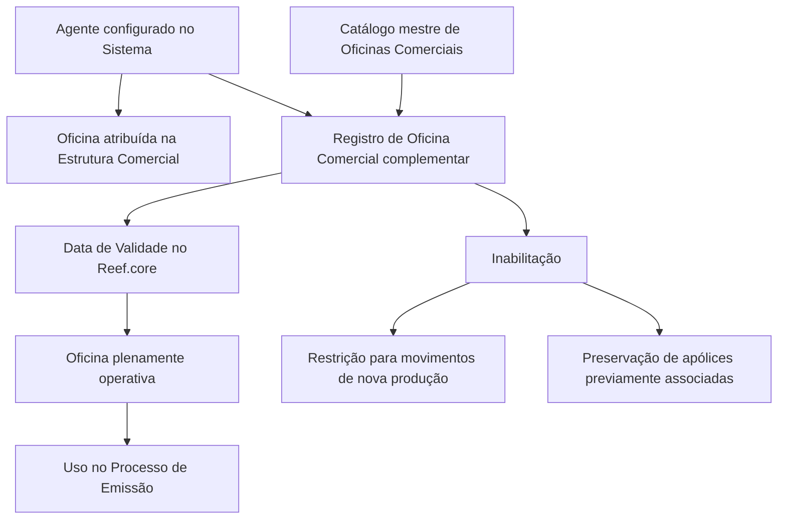

# Criação de Escritórios Habilitados para o Agente

## 1. Metadados do Documento
- **Arquivo de Origem:** Não identificado no conteúdo fornecido
- **Tipo de Documento:** Especificação Funcional
- **Domínio / Sistema:** Estrutura Comercial, Agentes, Reef.core e Processo de Emissão
- **Público-Alvo:** Negócio, Operação, Analistas Funcionais e Desenvolvedores
- **Data/Versão Identificada:** Não identificada

---

## 2. Resumo Executivo & Contexto de Negócio

O documento descreve a funcionalidade de criação e registro de **Escritórios Comerciais habilitados para um Agente**. Todos os Agentes configurados no sistema possuem uma Oficina atribuída dentro da Estrutura Comercial da Companhia.

A atribuição de Oficina a um Agente é normalmente única. Entretanto, por motivos comerciais, a Companhia pode permitir que um Agente emita produção em outras Oficinas complementares.

O objetivo funcional é registrar a relação de Oficinas Complementares da Estrutura Comercial nas quais o Agente está autorizado a comercializar e contabilizar suas apólices. A ação explicitamente habilitada no documento é **CRIAR**.

A habilitação de uma Oficina Comercial depende de uma data de validade registrada no Reef.core. A inabilitação de uma Oficina impede seu uso para movimentos de nova produção no Processo de Emissão, preservando, porém, as apólices que já possuíam aquela Oficina previamente atribuída.

---

## 3. Arquitetura, Componentes & Tecnologias Envolvidas

Os elementos identificados no documento são:

- **Sistema:** Sistema que mantém Agentes configurados e suas associações de Oficina.
- **Agente:** Entidade comercial que possui uma Oficina atribuída e pode receber Oficinas Comerciais complementares.
- **Estrutura Comercial da Companhia:** Fonte organizacional das Oficinas Comerciais disponíveis.
- **Catálogo mestre de Oficinas Comerciais:** Relação de valores permitidos para o campo Oficina Comercial.
- **Reef.core:** Sistema citado como repositório da data a partir da qual a Oficina associada ao Agente está plenamente operacional.
- **Processo de Emissão:** Processo no qual uma Oficina habilitada pode ser utilizada para emissão e onde a inabilitação restringe movimentos de nova produção.
- **Apólices:** Registros preservados quando já possuíam previamente uma Oficina posteriormente inabilitada.



**Nota de Análise:** O documento não detalha interfaces, métodos HTTP, contratos de integração, modelo de dados físico, permissões de usuários, regras de validação de formato de data ou mecanismos técnicos para consultar o catálogo mestre.

---

## 4. Regras de Negócio, Especificações Funcionais & Processos

### Contexto funcional

1. Todos os Agentes configurados no Sistema possuem uma Oficina atribuída na Estrutura Comercial da Companhia.
2. A atribuição de Oficina ao Agente é normalmente única.
3. A Companhia pode permitir, por motivos comerciais, que um Agente emita sua produção em Oficinas complementares.
4. As Oficinas complementares habilitam o Agente a comercializar e contabilizar suas apólices nas Oficinas registradas.
5. A funcionalidade apresentada habilita a ação de **CRIAR** a relação de Oficinas Complementares para o Agente.

### Sequência de captura

O documento determina que os atributos do bloco **Dados Oficinas Habilitadas** devem ser capturados da esquerda para a direita e de cima para baixo. Os atributos apresentados são:

1. **Oficina Comercial**
2. **Data de Validez**
3. **Inhabilitación**

### Regras do campo Oficina Comercial

1. O campo **Oficina Comercial** deve conter uma das Oficinas Comerciais que podem ser associadas ao Agente.
2. Os valores permitidos devem estar de acordo com o catálogo mestre de Oficinas Comerciais.
3. O catálogo mestre de Oficinas Comerciais é definido na Estrutura Comercial da Companhia.

### Regras do campo Data de Validez

1. O valor do campo **Data de Validez** no Reef.core representa a data a partir da qual a Oficina associada ao Agente está plenamente operativa.
2. A partir da data de validade, a Oficina é habilitada para uso no Processo de Emissão.

### Regras do campo Inhabilitación

1. O campo **Inhabilitación** indica que a Oficina Comercial associada ao Agente está inabilitada no Sistema.
2. Uma Oficina inabilitada não pode ser utilizada no Processo de Emissão para movimentos de nova produção.
3. A inabilitação não remove nem altera a utilização da Oficina em apólices que já possuíam aquela Oficina previamente atribuída.

---

## 5. Tabelas de Parâmetros, Ambientes e Estruturas de Dados

| Item / Parâmetro | Descrição / Função | Tipo / Valores / Formato | Ambiente / Observações |
| :--- | :--- | :--- | :--- |
| Agente | Entidade configurada no Sistema que possui uma Oficina atribuída e pode receber Oficinas complementares. | Não detalhado | A associação normal de Oficina é única. |
| Oficina atribuída | Oficina da Estrutura Comercial atribuída ao Agente. | Não detalhado | O documento informa que todos os Agentes possuem uma Oficina atribuída. |
| Oficina Comercial | Oficina Comercial que o Agente pode ter associada como Oficina habilitada. | Valor pertencente ao catálogo mestre de Oficinas Comerciais | Deve respeitar a relação de valores definida na Estrutura Comercial da Companhia. |
| Data de Validez | Data a partir da qual a Oficina associada ao Agente está plenamente operativa. | Data; formato não detalhado | O documento informa que o valor existe no Reef.core. |
| Inhabilitación | Marca que a Oficina Comercial associada ao Agente está inabilitada no Sistema. | Indicador; valores não detalhados | Restringe o uso em nova produção, preservando apólices previamente associadas. |
| Dados Oficinas Habilitadas | Bloco de informação que contém os atributos da Oficina habilitada. | Bloco de captura | A sequência é da esquerda para a direita e de cima para baixo. |
| Catálogo mestre de Oficinas Comerciais | Fonte da relação de valores possíveis para Oficina Comercial. | Catálogo; estrutura não detalhada | Definido na Estrutura Comercial da Companhia. |
| Reef.core | Sistema citado para a data de operação plena da Oficina associada ao Agente. | Sistema | Não há detalhes técnicos adicionais. |
| Processo de Emissão | Processo que utiliza a Oficina habilitada para emissão. | Processo de negócio | A inabilitação afeta movimentos de nova produção. |
| Nova produção | Movimentos do Processo de Emissão afetados pela inabilitação. | Conceito de processo | Uma Oficina inabilitada não pode ser usada nesses movimentos. |
| Apólices previamente atribuídas | Apólices que já possuíam a Oficina antes de sua inabilitação. | Registros de apólices | A associação é respeitada após a inabilitação. |

---

## 6. Bateria de Perguntas & Respostas para RAG (FAQ Sintético)

### P1: Qual é o objetivo da funcionalidade de Oficinas Habilitadas para o Agente?
**R:** O objetivo é registrar a relação de Oficinas Complementares da Estrutura Comercial da Entidade nas quais o Agente pode comercializar e contabilizar suas apólices.

### P2: Todo Agente possui uma Oficina atribuída no sistema?
**R:** Sim. O documento informa que todos e cada um dos Agentes configurados no Sistema possuem uma Oficina atribuída dentro da Estrutura Comercial da Companhia.

### P3: Um Agente pode ter mais de uma Oficina Comercial associada?
**R:** Normalmente, a atribuição de Oficina ao Agente é única. Contudo, por motivos comerciais, o Agente pode ser autorizado a emitir produção em outras Oficinas complementares.

### P4: Qual ação é explicitamente habilitada pela funcionalidade descrita?
**R:** A ação explicitamente indicada no documento é **CRIAR**, destinada ao registro da relação de Oficinas Complementares habilitadas para o Agente.

### P5: Como deve ser selecionado o valor de Oficina Comercial?
**R:** A Oficina Comercial deve ser uma das Oficinas que o Agente pode ter associadas, de acordo com a relação de valores existente no catálogo mestre de Oficinas Comerciais definido na Estrutura Comercial da Companhia.

### P6: O que representa a Data de Validez no Reef.core?
**R:** A Data de Validez representa a data a partir da qual a Oficina associada ao Agente está plenamente operativa e, consequentemente, habilitada para uso no Processo de Emissão.

### P7: Qual é o efeito de inabilitar uma Oficina Comercial associada a um Agente?
**R:** A inabilitação marca a Oficina Comercial como inabilitada no Sistema e impede seu uso no Processo de Emissão para movimentos de nova produção.

### P8: A inabilitação de uma Oficina afeta apólices que já utilizavam essa Oficina?
**R:** Não. O documento determina que as apólices que já possuíam previamente a Oficina atribuída devem ser respeitadas, mesmo após a inabilitação da Oficina para nova produção.

### P9: Qual é a sequência de captura dos atributos no bloco Dados Oficinas Habilitadas?
**R:** Os atributos devem ser capturados da esquerda para a direita e de cima para baixo. O documento apresenta os campos Oficina Comercial, Data de Validez e Inhabilitación.

### P10: O documento define o formato da Data de Validez?
**R:** Não. O documento informa apenas que o campo contém a data a partir da qual a Oficina associada ao Agente está plenamente operativa no Reef.core; não apresenta formato, obrigatoriedade ou regras de validação.

### P11: O documento detalha APIs ou contratos de integração para a funcionalidade?
**R:** Não. O conteúdo cita Reef.core, o catálogo mestre de Oficinas Comerciais e o Processo de Emissão, mas não descreve APIs, métodos HTTP, contratos JSON, endpoints ou mecanismos de integração.

---

## 7. Glossário de Termos, Siglas & Conceitos-Chave

- **Agente:** Entidade configurada no Sistema que possui uma Oficina atribuída e pode ter Oficinas Comerciais complementares associadas.
- **Catálogo mestre de Oficinas Comerciais:** Relação de valores de Oficinas Comerciais definida na Estrutura Comercial da Companhia.
- **Data de Validez:** Data a partir da qual a Oficina associada ao Agente está plenamente operativa e habilitada para uso no Processo de Emissão.
- **Estrutura Comercial:** Estrutura da Companhia onde são definidas as Oficinas Comerciais.
- **Inhabilitación:** Campo que marca uma Oficina Comercial associada ao Agente como inabilitada no Sistema.
- **Movimentos de nova produção:** Movimentos do Processo de Emissão para os quais uma Oficina inabilitada não pode ser utilizada.
- **Oficina Comercial:** Oficina que pode ser associada ao Agente conforme o catálogo mestre de Oficinas Comerciais.
- **Oficina Complementar:** Oficina adicional na qual o Agente pode comercializar, contabilizar e emitir sua produção quando permitido por motivos comerciais.
- **Processo de Emissão:** Processo no qual a Oficina associada ao Agente pode ser utilizada após estar plenamente operativa.
- **Reef.core:** Sistema citado como local onde a Data de Validez estabelece a operação plena da Oficina associada ao Agente.

---

## 8. Notas Críticas, Riscos & Limitações

- O documento não identifica o arquivo de origem, versão, data de publicação, autor ou responsável funcional.
- O documento não detalha se os campos Oficina Comercial, Data de Validez e Inhabilitación são obrigatórios.
- O documento não informa os valores aceitos, formato ou comportamento técnico do campo Inhabilitación.
- O documento não informa o formato de data, fuso horário, regras para data passada, data futura ou conflito de períodos de validade.
- O documento não descreve permissões de usuário, aprovações, trilha de auditoria ou controle de acesso para a ação de criar.
- O documento não explica como o Sistema consulta ou sincroniza o catálogo mestre de Oficinas Comerciais.
- O documento não especifica como a inabilitação é aplicada tecnicamente no Processo de Emissão.
- O documento não apresenta APIs, contratos de dados, banco de dados, mensagens, logs, URLs, ambientes ou procedimentos operacionais.
- **Nota de Análise:** O documento lista Reef.core como origem da Data de Validez, mas não detalha a integração ou o mecanismo de persistência dessa data.

---

## 9. Conteúdo Bruto Estruturado (Referência Fiel)

```text
--- [PÁGINA 1 DE 2] ---

CREAR Oficinas Habilitadas para el Agente
Contexto
Todos y cada uno de los Agentes configurados en el Sistema tienen asignada una Oficina de la
Estructura Comercial de la Compañía. Normalmente esta asignación es única pero en ocasiones y
por motivos comerciales se permite que un agente pueda emitir su producción en otras Oficinas
complementarias.
Objetivo
Registrar la relación de Oficinas Complementarias de la Estructura Comercial de la Entidad en las
que se permite al Agente comercializar y contabilizar sus pólizas.
Acciones habilitadas
 CREAR ( )
Datos Oficinas Habilitadas
De Izquierda a Derecha y de Arriba hacia Abajo, los siguientes atributos marcan la secuencia de
captura en este Bloque de Información.
 / 
 RS
Inicio Soluciones APIs Documentación Zeus
ES


--- [PÁGINA 2 DE 2] ---

Oficina Comercial (  )
Este Campo contendrá una de las Oficinas Comerciales que el Agente puede tener asociadas, de
acuerdo con la relación de valores existentes en el catálogo maestro de Oficinas Comerciales
definidas en la estructura comercial de la Compañía.
Fecha de Validez ( )
El valor de este campo en Reef.core contiene la fecha a partir de la cual la Oficina asociada al
Agente está plenamente operativa y se habilita por tanto su uso en el Proceso de Emisión.
Inhabilitación ( )
Este Campo marca que la Oficina Comercial asociada al Agente está inhabilitada en el Sistema y por
tanto se inhabilita su uso en el Proceso de Emisión para los movimientos de nueva producción
(respetándose en cambio en aquellas pólizas que la tuvieran previamente asignada).
```
