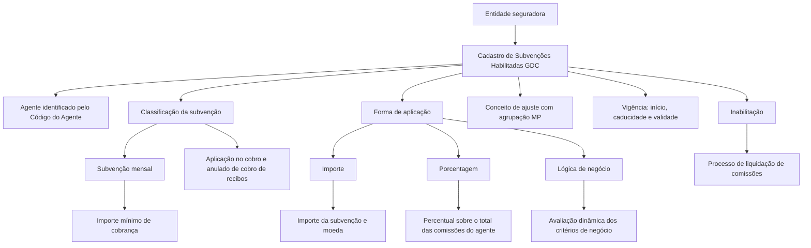

# Cadastro de Subvenções Habilitadas para Agentes no Reef.core

## 1. Metadados do Documento
- **Arquivo de Origem:** `Não informado no conteúdo fornecido`
- **Tipo de Documento:** `Especificação Técnica / Procedimento Funcional`
- **Domínio / Sistema:** `Reef.core — gestão de subvenções e liquidação de comissões de agentes`
- **Público-Alvo:** `Analistas funcionais, desenvolvedores, operação e negócio`
- **Data/Versão Identificada:** `Não identificada`

---

## 2. Resumo Executivo & Contexto de Negócio

O documento descreve a funcionalidade **“Crear Subvenciones Habilitadas para el Agente”**, destinada ao registro da relação de subvenções concedidas a um agente. As subvenções estão associadas à comercialização de apólices e/ou à cobrança dos recibos das apólices do agente.

A ação explicitamente habilitada é **CREAR**, indicando que o conteúdo trata do cadastro de uma nova definição de subvenção habilitada na entidade **Datos Subvenciones Habilitadas (GDC)**. O documento também define a sequência de captura dos atributos na tela de informação: da esquerda para a direita e de cima para baixo.

A configuração da subvenção no **Reef.core** combina classificação, forma de aplicação, conceito de ajuste, vigência, valor ou percentual, moeda e critérios de elegibilidade. Parte dos atributos possui preenchimento condicionado pela classificação ou forma de aplicação selecionada.

A subvenção pode ser mensal, aplicada ao recebimento ou ao cancelamento de recebimento de recibos. A aplicação pode ocorrer por importe monetário, percentual ou por lógica de negócio executada dinamicamente. O registro também pode ser inabilitado para impedir sua utilização no processo de liquidação de comissões definido pela entidade seguradora.

---

## 3. Arquitetura, Componentes & Tecnologias Envolvidas

| Componente / Conceito | Papel identificado no documento |
| :--- | :--- |
| **Reef.core** | Sistema no qual são configurados os valores corporativos para classificação e forma de aplicação da subvenção; também interpreta a inabilitação no processo de liquidação de comissões. |
| **GDC — Datos Subvenciones Habilitadas** | Estrutura ou tela de informação destinada ao cadastro de subvenções habilitadas para agentes. |
| **Agente** | Intermediário identificado pela entidade seguradora e beneficiário da subvenção concedida. |
| **Entidade seguradora** | Organização que identifica o intermediário, estabelece critérios de negócio e define o processo de liquidação de comissões. |
| **Conta corrente do agente** | Local no qual o conceito de ajuste de comissões identifica especificamente a subvenção concedida. |
| **Processo de liquidação de comissões** | Processo estabelecido pela entidade seguradora que pode utilizar ou ignorar o registro de subvenção conforme o campo de inabilitação. |
| **Lógica de negócio** | Mecanismo para obter dinamicamente o importe ou percentual de subvenção conforme critérios considerados pela entidade seguradora. |



**Nota de Análise:** O documento não detalha métodos HTTP, contratos JSON, persistência, URLs, ambientes, serviços técnicos, autenticação ou integração entre sistemas.

---

## 4. Regras de Negócio, Especificações Funcionais & Processos

### 4.1 Objetivo funcional

A funcionalidade permite registrar a relação de subvenções concedidas ao agente por:

1. Comercializar apólices.
2. Cobrar os recibos das apólices.

### 4.2 Ação habilitada

A única ação explicitamente indicada é:

- **CREAR:** criação de um registro de subvenção habilitada para o agente.

### 4.3 Sequência de captura na tela

Os atributos da tela **Datos Subvenciones Habilitadas (GDC)** devem ser capturados:

1. Da esquerda para a direita.
2. De cima para baixo.

### 4.4 Regras por atributo

1. **Código do Agente**
   - Identifica a chave do intermediário.
   - A identificação é realizada pela entidade seguradora.

2. **Classificação da subvenção**
   - Deve corresponder a um valor configurado corporativamente no Reef.core.
   - Valores apresentados:
     1. **SUBVENCIÓN MENSUAL**.
     2. **APLICACIÓN EN EL COBRO Y ANULADO DE COBRO DE LOS RECIBOS**.

3. **Forma de aplicação da subvenção**
   - Deve corresponder a um valor configurado corporativamente no Reef.core.
   - Valores apresentados:
     1. **IMPORTE**, de acordo com a moeda da definição.
     2. **PORCENTAJE**.
     3. **LÓGICA DE NEGOCIO**.

4. **Código do conceito de ajuste**
   - Identifica o conceito de ajuste de comissões.
   - O conceito identifica especificamente, na conta corrente do agente, a subvenção concedida.
   - A agrupação contábil do conceito de ajuste deve ser do tipo **MP**.

5. **Data de início da concessão da subvenção**
   - Identifica a data a partir da qual a subvenção é concedida ao agente.

6. **Data de caducidade da concessão da subvenção**
   - Determina a data de caducidade da subvenção concedida.

7. **Importe da subvenção**
   - Deve ser utilizado quando a forma de aplicação determinar que a subvenção é um **importe**.
   - Identifica o valor da subvenção concedida ao agente.

8. **Moeda**
   - Identifica o código da moeda para a qual a subvenção é concedida.

9. **Importe mínimo de cobrança**
   - Deve ser considerado quando a classificação da subvenção for **subvenção mensal**.
   - Determina o valor mínimo que o agente deve cobrar para receber a subvenção mensal.

10. **Lógica de negócio para obter o importe ou percentual da subvenção**
    - Deve ser utilizada quando a forma de aplicação determinar obtenção por **lógica de negócio**.
    - Permite avaliar dinamicamente os critérios de negócio definidos pela entidade seguradora.
    - A avaliação dinâmica obtém o importe ou percentual de subvenção a aplicar.

11. **Percentual da subvenção**
    - Deve ser utilizado quando a forma de aplicação determinar que a subvenção é uma **porcentagem**.
    - Identifica o percentual aplicado sobre o total das comissões do agente.

12. **Inabilitação**
    - Indica ao Reef.core que o registro de subvenção está inabilitado.
    - Um registro inabilitado não pode ser utilizado no processo de liquidação de comissões estabelecido pela entidade seguradora.

13. **Data de Validade**
    - Estabelece a data a partir da qual a subvenção fica disponível no sistema.
    - Permite que a subvenção seja considerada nos processos aplicáveis.
    - Seu uso correto permite manter histórico das alterações realizadas nas definições de subvenções.

---

## 5. Tabelas de Parâmetros, Ambientes e Estruturas de Dados

| Item / Parâmetro | Descrição / Função | Tipo / Valores / Formato | Ambiente / Observações |
| :--- | :--- | :--- | :--- |
| Ação habilitada | Permite criar um cadastro de subvenção habilitada. | `CREAR` | Nenhuma outra ação é descrita. |
| Código do Agente | Identifica a chave do intermediário. | Não especificado | Identificação realizada pela entidade seguradora. |
| Classificação da subvenção | Determina a classificação da subvenção concedida. | `SUBVENCIÓN MENSUAL`; `APLICACIÓN EN EL COBRO Y ANULADO DE COBRO DE LOS RECIBOS` | Valores configurados corporativamente no Reef.core. |
| Forma de aplicação da subvenção | Determina como a subvenção será aplicada. | `IMPORTE`; `PORCENTAJE`; `LÓGICA DE NEGOCIO` | Valores configurados corporativamente no Reef.core. |
| Código do conceito de ajuste | Identifica o ajuste de comissões associado à subvenção na conta corrente do agente. | Código não especificado | A agrupação contábil deve ser do tipo `MP`. |
| Data início concessão Subvenção | Define a data a partir da qual a subvenção é concedida ao agente. | Data; formato não especificado | Marca o início da concessão. |
| Data caducidade concessão Subvenção | Define a data de caducidade da subvenção. | Data; formato não especificado | Marca o fim de vigência da concessão. |
| Importe da subvenção | Informa o valor concedido ao agente. | Importe monetário; formato não especificado | Aplicável quando a forma de aplicação for `IMPORTE`. |
| Moeda | Identifica a moeda da subvenção. | Código de moeda; padrão não especificado | Associada à concessão por importe. |
| Importe mínimo cobrança | Determina o valor mínimo que o agente deve cobrar para receber a subvenção. | Importe; formato não especificado | Aplicável quando a classificação for subvenção mensal. |
| Lógica de negócio para obter importe ou percentual | Permite calcular dinamicamente o valor ou percentual aplicável. | Lógica de negócio; implementação não especificada | Aplicável quando a forma de aplicação for `LÓGICA DE NEGOCIO`. |
| Percentual da subvenção | Define o percentual aplicado sobre o total das comissões do agente. | Percentual; formato não especificado | Aplicável quando a forma de aplicação for `PORCENTAJE`. |
| Inabilitação | Indica que a subvenção não pode ser utilizada na liquidação de comissões. | Indicador; valores não especificados | Interpretado pelo Reef.core. |
| Data de Validade | Define a disponibilidade da subvenção no sistema. | Data; formato não especificado | Suporta o histórico de alterações nas definições. |

---

## 6. Bateria de Perguntas & Respostas para RAG (FAQ Sintético)

### P1: Qual é o objetivo do cadastro de Subvenções Habilitadas para o Agente?
**R:** O cadastro registra a relação de subvenções concedidas ao agente pela comercialização de apólices e/ou pela cobrança dos recibos das apólices do agente.

### P2: Qual ação está habilitada na funcionalidade de Subvenções Habilitadas?
**R:** O documento apresenta exclusivamente a ação **CREAR**, destinada à criação de um registro de subvenção habilitada para um agente.

### P3: Quais classificações de subvenção podem ser selecionadas no Reef.core?
**R:** O documento apresenta duas classificações configuradas corporativamente no Reef.core: **SUBVENCIÓN MENSUAL** e **APLICACIÓN EN EL COBRO Y ANULADO DE COBRO DE LOS RECIBOS**.

### P4: Quais são as formas de aplicação da subvenção?
**R:** A forma de aplicação pode ser **IMPORTE**, de acordo com a moeda da definição; **PORCENTAJE**; ou **LÓGICA DE NEGOCIO**. Esses valores são configurados corporativamente no Reef.core.

### P5: Quando o campo Importe da subvenção deve ser informado?
**R:** O campo **Importe da subvenção** deve ser utilizado quando a forma de aplicação da subvenção determinar que a aplicação ocorrerá por importe. O atributo identifica o valor concedido ao agente.

### P6: Como o percentual da subvenção é aplicado?
**R:** Quando a forma de aplicação for **PORCENTAJE**, o percentual da subvenção é aplicado sobre o total das comissões do agente.

### P7: Para que serve o importe mínimo de cobrança?
**R:** O importe mínimo de cobrança é aplicável quando a classificação da subvenção for **subvenção mensal**. Ele define o valor mínimo que o agente deve cobrar para ter direito à subvenção mensal.

### P8: Qual requisito contábil deve ser atendido pelo conceito de ajuste?
**R:** O código do conceito de ajuste identifica o ajuste de comissões relacionado à subvenção na conta corrente do agente, e sua agrupação contábil deve obrigatoriamente ser do tipo **MP**.

### P9: Quando deve ser utilizada a lógica de negócio para calcular uma subvenção?
**R:** A lógica de negócio deve ser usada quando a forma de aplicação determinar que o importe ou percentual será obtido por execução de lógica de negócio. Essa lógica avalia dinamicamente os critérios definidos pela entidade seguradora.

### P10: Qual é o efeito de inabilitar um registro de subvenção?
**R:** A inabilitação informa ao Reef.core que o registro de subvenção não pode ser utilizado no processo de liquidação de comissões estabelecido pela entidade seguradora.

### P11: Qual a diferença entre data de início da concessão, data de caducidade e data de validade?
**R:** A data de início da concessão define desde quando a subvenção é concedida ao agente. A data de caducidade determina a expiração da concessão. A data de validade estabelece desde quando a subvenção está disponível no sistema para consideração nos processos aplicáveis.

### P12: Como a Data de Validade contribui para o histórico de subvenções?
**R:** O uso correto da Data de Validade permite manter histórico das alterações efetuadas nas definições de subvenções, pois controla a partir de quando cada definição fica disponível no sistema.

---

## 7. Glossário de Termos, Siglas & Conceitos-Chave

- **Agente:** Intermediário identificado pela entidade seguradora e destinatário da subvenção concedida.
- **Caducidade:** Data que determina a expiração da concessão da subvenção.
- **Código do Agente:** Chave que identifica o intermediário segundo a identificação da entidade seguradora.
- **Conceito de ajuste:** Código de ajuste de comissões que identifica a subvenção na conta corrente do agente.
- **Conta corrente do agente:** Registro no qual o conceito de ajuste identifica especificamente a subvenção concedida.
- **GDC:** Denominação apresentada para a entidade ou tela **Datos Subvenciones Habilitadas**. O significado expandido da sigla não é informado.
- **IMPORTE:** Forma de aplicação correspondente a um valor de acordo com a moeda da definição.
- **Inabilitação:** Indicador que impede a utilização do registro de subvenção no processo de liquidação de comissões.
- **LÓGICA DE NEGOCIO:** Forma de aplicação que permite obter dinamicamente o importe ou percentual segundo critérios de negócio da entidade seguradora.
- **MP:** Tipo obrigatório de agrupação contábil para o conceito de ajuste. O significado expandido da sigla não é informado.
- **PORCENTAJE:** Forma de aplicação correspondente a um percentual aplicado sobre o total das comissões do agente.
- **Reef.core:** Sistema que possui valores corporativos configurados para classificação e forma de aplicação da subvenção e que considera o indicador de inabilitação na liquidação de comissões.
- **Subvenção:** Benefício concedido ao agente relacionado à comercialização de apólices e/ou à cobrança de recibos.
- **Subvenção mensal:** Classificação para a qual pode ser exigido um importe mínimo de cobrança do agente.

---

## 8. Notas Críticas, Riscos & Limitações

- O documento não informa o nome do arquivo de origem, autor, versão, data de publicação ou responsáveis pela manutenção da funcionalidade.
- O documento não especifica tipos técnicos, tamanhos, obrigatoriedade, valores padrão, máscaras, validações de formato ou mensagens de erro para os atributos.
- Não são descritos os contratos de integração, métodos HTTP, endpoints, eventos, estruturas JSON, banco de dados, permissões, perfis de acesso ou trilhas de auditoria.
- A sigla **GDC** é apresentada como parte de “Datos Subvenciones Habilitadas”, mas seu significado expandido não é detalhado.
- A agrupação contábil **MP** é obrigatória para o conceito de ajuste, porém o documento não explica o significado da sigla nem o mecanismo de validação.
- A lógica de negócio dinâmica é mencionada, mas não há detalhamento sobre regras, linguagem, motor de execução, entradas, saídas, tratamento de falhas ou critérios específicos.
- O documento não explicita se datas de início, caducidade e validade podem coincidir, sobrepor-se ou possuir regras de ordenação.
- **Nota de Análise:** O material descreve atributos funcionais da tela, mas não detalha os métodos de implementação, a persistência dos registros ou o comportamento técnico do Reef.core além das regras explicitadas.

---

## 9. Conteúdo Bruto Estruturado (Referência Fiel)

```text
--- [PÁGINA 1 DE 3] ---

CREAR Subvenciones Habilitadas para el
Agente
Objetivo
Registrar la relación de Subvenciones concedidas al Agente por comercializar pólizas y/ó cobrar los
recibos de sus pólizas.
Acciones habilitadas
 CREAR ( )
Datos Subvenciones Habilitadas (GDC)
De Izquierda a Derecha y de Arriba hacia Abajo, los siguientes atributos marcan la secuencia de
captura en esta pantalla de Información.
Código del Agente (  )
Este campo identifica la clave del intermediario de acuerdo con la identificación realizada por la
entidad aseguradora.
 / 
 RS
Inicio Soluciones APIs Documentación Zeus
ES


--- [PÁGINA 2 DE 3] ---

Clasificación de la subvención (  )
Esta propiedad determina la clasificación de la subvención concedida, de acuerdo con uno de los
posibles valores configurados a nivel corporativo en Reef.core:
(1) SUBVENCIÓN MENSUAL.
(2) APLICACIÓN EN EL COBRO Y ANULADO DE COBRO DE LOS RECIBOS.
Forma de aplicación de la subvención (  )
Esta propiedad determina la forma de aplicación de la subvención concedida, de acuerdo con uno de
los posibles valores configurados a nivel corporativo en Reef.core:
(1) IMPORTE (de acuerdo a la Moneda de la definición)
(2) PORCENTAJE
(3) LÓGICA DE NEGOCIO
Código del concepto de ajuste (  )
Identifica el código del concepto de ajuste de comisiones, que identificará específicamente en la
cuenta corriente del agente la subvención concedida.
La agrupación contable del concepto de ajuste debe ser del tipo MP.
Fecha inicio concesión Subvención ( )
Identifica la fecha desde la que se concede la subvención al agente.
Fecha caducidad concesión Subvención ( )
Este dato determina la fecha de caducidad de la subvención concedida.
Importe de la subvención ( )
Siempre y cuando la forma de aplicación de la subvención determine que sea un importe, este
atributo identifica el importe de la subvención concedida al agente.
Moneda (  )
Este campo identifica el código de la moneda para la que se concede la subvención.
Importe mínimo cobranza ( )
Siempre y cuando la clasificación de la subvención indique que sea una subvención mensual, esta
propiedad determina el importe mínimo que el Agente tiene que cobrar para percibir la subvención


--- [PÁGINA 3 DE 3] ---

mensual.
Lógica de negocio para obtener el importe o porcentaje de la subvención ( )
Siempre y cuando la forma de aplicación de la subvención determine que vaya a ser obtenida
mediante la ejecución de una lógica de negocio, este atributo permite evaluar dinámicamente los
criterios de negocio que se hubieren considerado por parte de la entidad aseguradora al fin de
obtener el importe o el porcentaje de la subvención a aplicar.
Porcentaje de la subvención ( )
Siempre y cuando la forma de aplicación de la subvención determine que sea un porcentaje, esta
propiedad de la definición identifica el porcentaje de la subvención que se va a aplicar sobre el total
de las comisiones del Agente.
Inhabilitación ( )
Este campo le indica a Reef.core que el registro que identifica la subvención está inhabilitado para
poder ser utilizado en el proceso de liquidación de comisiones que tenga establecida la entidad
aseguradora.
Fecha de Validez ( )
Este dato establece la fecha a partir de la cual la subvención está disponible en el sistema para ser
contemplada en los procesos en los que deba ser considerada. Su correcto uso, por tanto, permite
tener un histórico de los cambios efectuados en las definiciones de las subvenciones.
```
