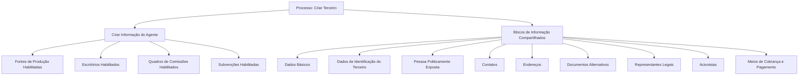

# Operação Criar Agente — Captura de Informações do Agente

## 1. Metadados do Documento
- **Arquivo de Origem:** Não identificado
- **Tipo de Documento:** Procedimento
- **Domínio / Sistema:** Operação de criação de Agente; interface com referência a Zeus
- **Público-Alvo:** Operação, usuários do sistema e analistas funcionais
- **Data/Versão Identificada:** Não identificada

---

## 2. Resumo Executivo & Contexto de Negócio

A operação **Criar Agente** permite capturar as informações necessárias para o cadastro de um Agente. O processo organiza o registro em blocos de informação compartilhados, blocos específicos conforme a atividade do Terceiro e informações complementares do Agente.

A obrigatoriedade e a habilitação dos campos variam conforme o código de atividade do Terceiro. A classificação do Terceiro como **Pessoa Física** ou **Pessoa Jurídica** também pode alterar a obrigatoriedade ou habilitação dos campos de informação.

Personalizações implementadas podem afetar o comportamento da aplicação quanto à obrigatoriedade de registro dos dados do Terceiro. Além disso, o usuário pode definir a ordem de captura dos dados nos diferentes blocos de informação.

O fluxo apresentado associa a criação do Terceiro à criação das informações do Agente, fontes de produção, escritórios habilitados, quadros de comissões habilitados e subvenções habilitadas. O documento não detalha campos, contratos de API, validações específicas, persistência de dados ou critérios de conclusão do cadastro.

---

## 3. Arquitetura, Componentes & Tecnologias Envolvidas

Os elementos identificados são:

| Componente / Elemento | Papel descrito |
| :--- | :--- |
| Operação Criar Agente | Permite capturar a informação de um Agente. |
| Criar Terceiro | Processo que contém blocos de informação compartilhados. |
| Informação do Agente | Bloco específico de acordo com a atividade do Terceiro. |
| Fontes de Produção Habilitadas | Bloco específico associado ao Agente. |
| Escritórios Habilitados | Bloco específico associado ao Agente. |
| Quadros de Comissões Habilitados | Informação complementar do Agente. |
| Subvenções Habilitadas | Informação complementar do Agente. |
| Zeus | Nome exibido na navegação do conteúdo; o documento não detalha sua função técnica. |
| Soluciones APIs / Documentación | Textos exibidos na navegação; o documento não descreve APIs, endpoints ou contratos. |



> **Nota de Análise:** O documento apresenta um fluxo funcional de blocos de informação, não uma arquitetura técnica de software. Não há detalhes sobre serviços, bancos de dados, métodos HTTP, URLs, autenticação, tecnologias de implementação ou integrações.

---

## 4. Regras de Negócio, Especificações Funcionais & Processos

1. A operação **Criar Agente** permite capturar a informação de um Agente.
2. A obrigatoriedade e/ou habilitação dos campos em cada bloco ou estrutura de informação compartilhada pode variar conforme o **código de atividade do Terceiro**.
3. A obrigatoriedade e/ou habilitação dos campos pode variar quando o tipo de Terceiro for **Pessoa Física** ou **Pessoa Jurídica**.
4. Personalizações previamente implementadas podem afetar o comportamento da aplicação relativo à obrigatoriedade do registro dos dados do Terceiro.
5. A ordem de captura de dados nos diferentes blocos de informação pode variar conforme o critério adotado pelo usuário do sistema.
6. O processo de criação apresentado inclui:
   - Criar Terceiro.
   - Criar Informação do Agente.
   - Criar Fontes de Produção.
   - Criar Escritórios Habilitados.
   - Criar Quadros de Comissões.
   - Criar Subvenções Habilitadas.
7. Os blocos de informação compartilhados, vinculados a **Criar Terceiro**, são:
   - Dados Básicos.
   - Dados de Identificação do Terceiro.
   - Pessoa Politicamente Exposta.
   - Contatos.
   - Endereços.
   - Documentos Alternativos.
   - Representantes Legais.
   - Acionistas.
   - Meios de Cobrança e Pagamento.
8. Os blocos específicos, definidos conforme a atividade do Terceiro, são:
   - Informação do Agente.
   - Fontes de Produção Habilitadas.
   - Escritórios Habilitados.
9. As informações complementares do Agente são:
   - Quadros de Comissões Habilitados.
   - Subvenções Habilitadas.

---

## 5. Tabelas de Parâmetros, Ambientes e Estruturas de Dados

| Item / Parâmetro | Descrição / Função | Tipo / Valores / Formato | Ambiente / Observações |
| :--- | :--- | :--- | :--- |
| Código de atividade do Terceiro | Pode determinar a obrigatoriedade e/ou habilitação dos campos dos blocos compartilhados. | Código de atividade; formato não detalhado. | Critério de comportamento da aplicação. |
| Tipo de Terceiro | Pode alterar a obrigatoriedade e/ou habilitação dos campos de informação. | Pessoa Física ou Pessoa Jurídica. | Não há critérios detalhados por tipo. |
| Personalizações implementadas | Podem afetar a obrigatoriedade do registro dos dados do Terceiro. | Não detalhado. | Dependência de personalizações existentes. |
| Ordem de captura dos dados | Pode variar nos blocos de informação. | Definida conforme critério do usuário. | Não há sequência obrigatória documentada. |
| Dados Básicos | Bloco de informação compartilhada de Criar Terceiro. | Campos não detalhados. | Obrigatoriedade pode variar. |
| Dados de Identificação do Terceiro | Bloco de informação compartilhada de Criar Terceiro. | Campos não detalhados. | Obrigatoriedade pode variar. |
| Pessoa Politicamente Exposta | Bloco de informação compartilhada de Criar Terceiro. | Campos não detalhados. | Obrigatoriedade pode variar. |
| Contatos | Bloco de informação compartilhada de Criar Terceiro. | Campos não detalhados. | Obrigatoriedade pode variar. |
| Endereços | Bloco de informação compartilhada de Criar Terceiro. | Campos não detalhados. | Obrigatoriedade pode variar. |
| Documentos Alternativos | Bloco de informação compartilhada de Criar Terceiro. | Campos não detalhados. | Obrigatoriedade pode variar. |
| Representantes Legais | Bloco de informação compartilhada de Criar Terceiro. | Campos não detalhados. | Obrigatoriedade pode variar. |
| Acionistas | Bloco de informação compartilhada de Criar Terceiro. | Campos não detalhados. | Obrigatoriedade pode variar. |
| Meios de Cobrança e Pagamento | Bloco de informação compartilhada de Criar Terceiro. | Campos não detalhados. | Obrigatoriedade pode variar. |
| Informação do Agente | Bloco específico conforme a atividade do Terceiro. | Campos não detalhados. | Associado à operação Criar Agente. |
| Fontes de Produção Habilitadas | Bloco específico conforme a atividade do Terceiro. | Campos não detalhados. | Associado ao Agente. |
| Escritórios Habilitados | Bloco específico conforme a atividade do Terceiro. | Campos não detalhados. | Associado ao Agente. |
| Quadros de Comissões Habilitados | Informação complementar do Agente. | Campos não detalhados. | Associado ao Agente. |
| Subvenções Habilitadas | Informação complementar do Agente. | Campos não detalhados. | Associado ao Agente. |

---

## 6. Bateria de Perguntas & Respostas para RAG (FAQ Sintético)

### P1: Qual é a finalidade da operação Criar Agente?
**R:** A operação Criar Agente permite capturar a informação de um Agente. O processo inclui dados compartilhados de Criar Terceiro, informações específicas do Agente e informações complementares relacionadas a fontes de produção, escritórios, comissões e subvenções.

### P2: A obrigatoriedade dos campos é fixa durante a criação de um Agente?
**R:** Não. A obrigatoriedade e/ou habilitação dos campos pode variar conforme o código de atividade do Terceiro, o tipo de Terceiro — Pessoa Física ou Pessoa Jurídica — e personalizações implementadas na aplicação.

### P3: Quais tipos de Terceiro podem alterar a habilitação ou obrigatoriedade dos campos?
**R:** O documento indica que a habilitação e/ou obrigatoriedade pode variar quando o tipo de Terceiro for uma Pessoa Física ou uma Pessoa Jurídica.

### P4: Quais são os blocos de informação compartilhados na criação de Terceiro?
**R:** Os blocos compartilhados são Dados Básicos, Dados de Identificação do Terceiro, Pessoa Politicamente Exposta, Contatos, Endereços, Documentos Alternativos, Representantes Legais, Acionistas e Meios de Cobrança e Pagamento.

### P5: Quais blocos são específicos de acordo com a atividade do Terceiro?
**R:** Os blocos específicos de acordo com a atividade do Terceiro são Informação do Agente, Fontes de Produção Habilitadas e Escritórios Habilitados.

### P6: Quais informações complementares do Agente são apresentadas?
**R:** As informações complementares do Agente apresentadas são Quadros de Comissões Habilitados e Subvenções Habilitadas.

### P7: O usuário deve seguir uma ordem obrigatória para preencher os blocos de informação?
**R:** Não necessariamente. O documento estabelece que a ordem de captura dos dados nos distintos blocos pode variar de acordo com o critério seguido pelo usuário no sistema.

### P8: Como as personalizações influenciam o cadastro do Terceiro e do Agente?
**R:** As personalizações que possam ter sido implementadas podem afetar o comportamento da aplicação em relação à obrigatoriedade do registro dos dados do Terceiro.

### P9: O documento especifica quais campos existem dentro do bloco Informação do Agente?
**R:** Não. O documento apenas lista Informação do Agente como um bloco específico conforme a atividade do Terceiro, sem detalhar campos, formatos, regras de validação ou valores permitidos.

### P10: O documento descreve APIs, métodos HTTP ou contratos JSON da operação Criar Agente?
**R:** Não. Embora a navegação exibida contenha as referências “Soluciones APIs”, “Documentación” e “Zeus”, o conteúdo não descreve endpoints, métodos HTTP, contratos JSON, autenticação ou integrações técnicas.

---

## 7. Glossário de Termos, Siglas & Conceitos-Chave

- **Agente:** Entidade cuja informação é capturada pela operação Criar Agente.
- **Terceiro:** Entidade associada aos blocos de informação compartilhados e cuja atividade e tipo podem influenciar a habilitação e obrigatoriedade de campos.
- **Pessoa Física:** Um dos tipos de Terceiro mencionados como fator de variação para obrigatoriedade e habilitação de campos.
- **Pessoa Jurídica:** Um dos tipos de Terceiro mencionados como fator de variação para obrigatoriedade e habilitação de campos.
- **Pessoa Politicamente Exposta:** Bloco de informação compartilhada listado no processo Criar Terceiro.
- **Fontes de Produção Habilitadas:** Bloco específico associado à atividade do Terceiro e ao Agente.
- **Escritórios Habilitados:** Bloco específico associado à atividade do Terceiro e ao Agente.
- **Quadros de Comissões Habilitados:** Informação complementar associada ao Agente.
- **Subvenções Habilitadas:** Informação complementar associada ao Agente.
- **Zeus:** Termo exibido na navegação do material; sem definição funcional ou técnica adicional no documento.

---

## 8. Notas Críticas, Riscos & Limitações

- O documento não identifica o arquivo de origem, versão, data, responsável ou sistema corporativo formal.
- O documento não detalha os campos internos de nenhum bloco de informação.
- Não há descrição de regras específicas para cada código de atividade do Terceiro.
- Não há matriz que relacione Pessoa Física ou Pessoa Jurídica aos campos obrigatórios, opcionais ou desabilitados.
- As personalizações podem alterar o comportamento da aplicação, mas não são identificadas ou descritas.
- Não há critérios explícitos de sucesso, persistência, falhas, validações, mensagens de erro ou aprovação do processo.
- Não há detalhes sobre APIs, contratos, integrações, tecnologias, ambientes, segurança ou trilhas de auditoria.
- **Nota de Análise:** O documento lista o fluxo e os blocos funcionais da operação Criar Agente, porém não detalha os campos, métodos HTTP ou contratos JSON expostos.

---

## 9. Conteúdo Bruto Estruturado (Referência Fiel)

```text
--- [PÁGINA 1 DE 2] ---

OPERACIÓN CREAR Agente
¿En que consiste?
Esta operación permite capturar la Información de un Agente.
Premisas
La obligatoriedad y/o la habilitación de los campos en el registro de los datos de cada uno de
los bloques o estructuras de información compartidas puede variar de acuerdo con el código de
actividad del Tercero:
La obligatoriedad y/o la habilitación de los campos en el registro de los datos de cada uno de
los bloques o estructuras de información pueden variar si el tipo de Tercero es una Persona
Física o una Persona Jurídica:
Las personalizaciones que se hubieran podido implementar a su vez pueden afectar el
comportamiento de la aplicación en relación con la obligatoriedad en el registro de los Datos del
Tercero.
Por último, el orden de captura de los datos en los distintos bloques de Información puede
variar de acuerdo con el criterio seguido por el Usuario en el Sistema.
Ejemplo:
Ejemplo:
 /
RS
Inicio Soluciones APIs Documentación Zeus
ES


--- [PÁGINA 2 DE 2] ---

Proceso
CREAR
TERCERO
Crear Información
del Agente
Crear Fuentes de
Producción
Crear Oficinas
Habilitadas
Crear Cuadros de
Comisiones
Crear Subvenciones
Habilitadas
Bloques de Información Compartidos (CREAR TERCERO)
 Datos Básicos ( )
 Datos Identificación del Tercero ( )
 Persona Políticamente Expuesta ( )
 Contactos ( )
 Direcciones ( )
 Documentos Alternativos ( )
 Representantes Legales ( )
 Accionistas ( )
 Medios de Cobro y Pago ( )
Bloques de Información Específicos de acuerdo con la
Actividad del Tercero.
 Información del Agente (  )
 Fuentes de Producción Habilitadas ( )
 Oficinas Habilitadas ( )
Información Complementaria del Agente.
 Cuadros de Comisiones Habilitados ( )
 Subvenciones Habilitadas ( )
```
