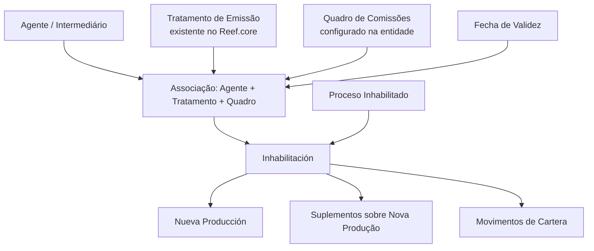

# Gestão de Quadros de Comissões para Agentes no Reef.core

## 1. Metadados do Documento
- **Arquivo de Origem:** Não identificado; conteúdo apresentado como extração de 3 páginas.
- **Tipo de Documento:** Manual Operacional / Especificação Funcional.
- **Domínio / Sistema:** Reef.core — gestão de agentes, tratamentos de emissão e quadros de comissões.
- **Público-Alvo:** Operação, negócio, analistas funcionais e administradores de configuração.
- **Data/Versão Identificada:** Não identificada.

---

## 2. Resumo Executivo & Contexto de Negócio

O documento descreve a operação de gestão de **Cuadros de Comisiones** — quadros de comissões — associados a um agente no sistema Reef.core. A operação permite criar novas associações de quadros de comissões, modificar associações existentes ou inabilitar quadros previamente habilitados para o agente.

A finalidade funcional é controlar quais configurações de comissão podem ser utilizadas pelo agente no cálculo das comissões relacionadas à comercialização das apólices. A associação é formada, no mínimo, pela chave do agente, pelo código do tratamento de emissão e pelo quadro de comissões configurado na entidade.

A inabilitação possui impacto operacional configurável. O campo **Proceso Inhabilitado** define se a restrição se aplica apenas a apólices de **Nueva Producción** ou se também alcança suplementos emitidos sobre essas apólices e movimentos de carteira. O campo **Inhabilitación** efetiva a condição de indisponibilidade do quadro de comissões para o agente e tratamento definidos.

O documento também estabelece que a **Fecha de Validez** determina a partir de quando a associação entre agente, tratamento de emissão e quadro de comissões pode ser utilizada. Esse mecanismo permite manter histórico das mudanças realizadas nas definições configuradas.

---

## 3. Arquitetura, Componentes & Tecnologias Envolvidas

Os componentes e conceitos identificados no documento são:

- **Reef.core:** sistema no qual existem tratamentos de emissão e quadros de comissões configurados na estrutura de produtos da entidade.
- **Agente / Intermediário:** entidade identificada pela chave de agente.
- **Tratamento de Emissão:** configuração identificada por um código existente na estrutura de produtos da entidade.
- **Quadro de Comissões:** configuração identificada por uma chave e associada ao agente e ao tratamento de emissão.
- **Apólices:** contratos cuja comercialização pode gerar comissões.
- **Nueva Producción:** comissões geradas exclusivamente durante o primeiro ano de vigência da apólice.
- **Cartera:** comissões associadas a apólices vigentes em anos sucessivos.
- **Suplementos:** emissões sobre apólices de nova produção, mencionadas no contexto da inabilitação.
- **Movimentos de Cartera:** movimentos relacionados à carteira, mencionados no contexto da inabilitação.



**Nota de Análise:** o documento não detalha arquitetura técnica de infraestrutura, APIs, métodos HTTP, contratos JSON, bancos de dados, ambientes de execução ou integrações externas.

---

## 4. Regras de Negócio, Especificações Funcionais & Processos

### Operações permitidas

A operação de gestão de quadros de comissões para agentes apresenta três ações possíveis:

1. **Crear:** criar novos quadros de comissões que poderão ser utilizados pelo agente para calcular comissões na comercialização de apólices.
2. **Modificar:** modificar quadros de comissões previamente associados ou habilitados para o agente.
3. **Inhabilitar:** inabilitar quadros de comissões que o agente possuía previamente habilitados.

### Sequência de captura

O documento informa que, no bloco de informações **Cuadros de Comisiones (GDC)**, os atributos seguem uma sequência de captura da esquerda para a direita e de cima para baixo. Os atributos apresentados são:

1. Clave de Agente.
2. Código de Tratamiento de Emisión.
3. Cuadro de Comisiones.
4. Proceso Inhabilitado.
5. Inhabilitación.
6. Fecha de Validez.

### Regras da chave de agente

A **Clave de Agente** exibe e identifica a chave do intermediário conforme a definição previamente cadastrada no sistema. O documento não descreve o formato, tamanho, obrigatoriedade ou mecanismo de validação dessa chave.

### Regras do código de tratamento de emissão

O **Código de Tratamiento de Emisión** deve conter uma das chaves dos tratamentos de emissão existentes no Reef.core, dentro da estrutura de produtos da entidade. Portanto, o código utilizado deve corresponder a uma configuração já existente.

### Regras do quadro de comissões

O atributo **Cuadro de Comisiones** identifica uma das chaves dos quadros de comissões configurados na entidade. O documento não informa a estrutura interna do quadro, fórmulas de cálculo, percentuais, faixas, moedas ou regras de elegibilidade.

### Regras de inabilitação por processo

O campo **Proceso Inhabilitado** determina o escopo da inabilitação do quadro de comissões do agente para o tratamento de emissão definido.

A inabilitação pode afetar:

- Apenas apólices de **Nueva Producción**; ou
- Os movimentos de **Nueva Producción**, os suplementos emitidos sobre essas apólices e os **Movimientos de Cartera**.

O documento não apresenta os valores possíveis, códigos de domínio ou interface utilizada para indicar cada uma dessas opções.

### Regras do campo Inhabilitación

O campo **Inhabilitación** é um campo de seleção do tipo check. Quando marcado, indica que o quadro de comissões do agente, para o tratamento definido, está inabilitado e não pode ser utilizado.

A inabilitação deve ser interpretada em coerência com o valor definido no campo **Proceso Inhabilitado**. Assim, o escopo da indisponibilidade depende da configuração de processo escolhida.

### Regras da data de validade

A **Fecha de Validez** determina a data a partir da qual a associação entre:

- Agente;
- Código de tratamento de emissão; e
- Quadro de comissões

fica habilitada no sistema para utilização.

O uso correto da data de validade permite manter histórico das mudanças efetuadas nas definições configuradas. O documento não define formato de data, fuso horário, comportamento para datas retroativas ou regras de sobreposição entre associações.

### Conceitos de comissão

As comissões são classificadas segundo o momento temporal em que são geradas no processo de emissão:

- **Comissões de Nueva Producción:** percebidas exclusivamente durante o primeiro ano de vigência da apólice. Em geral, são de valor mais elevado que as comissões de carteira para estimular a captação de novas operações.
- **Comissões de Cartera:** originadas na carteira de quem as recebe, relacionada a apólices vigentes em anos sucessivos. Permanecem existentes enquanto as apólices subscritas por meio da gestão comercial do agente estiverem vigentes.

---

## 5. Tabelas de Parâmetros, Ambientes e Estruturas de Dados

| Item / Parâmetro | Descrição / Função | Tipo / Valores / Formato | Ambiente / Observações |
| :--- | :--- | :--- | :--- |
| Clave de Agente | Mostra e identifica a chave do intermediário. | Não especificado. | Deve estar de acordo com definição previamente realizada no sistema. |
| Código de Tratamiento de Emisión | Identifica o tratamento de emissão associado ao agente e ao quadro de comissões. | Uma das chaves de tratamentos de emissão existentes. | O tratamento deve existir na estrutura de produtos da entidade no Reef.core. |
| Cuadro de Comisiones | Identifica o quadro de comissões associado ao agente e ao tratamento de emissão. | Chave de um quadro de comissões. | O quadro deve estar configurado na entidade. |
| Proceso Inhabilitado | Define o alcance da inabilitação do quadro de comissões. | Não especificado. | Pode afetar somente Nueva Producción ou também suplementos e Movimientos de Cartera. |
| Inhabilitación | Indica que o quadro de comissões do agente para o tratamento definido não pode ser usado. | Check / seleção. | Deve ser interpretado em coerência com Proceso Inhabilitado. |
| Fecha de Validez | Define a data a partir da qual a associação pode ser utilizada. | Data; formato não especificado. | Permite manter histórico de mudanças nas definições configuradas. |
| Nueva Producción | Classificação temporal de comissão. | Primeiro ano de vigência da apólice. | Geralmente possui valor superior ao da comissão de cartera. |
| Cartera | Classificação temporal de comissão. | Anos sucessivos de vigência da apólice. | Existe enquanto as apólices originadas pela gestão comercial do agente estiverem vigentes. |
| Suplementos | Emissões sobre apólices de Nueva Producción. | Não especificado. | Podem ser afetados pela inabilitação, conforme Proceso Inhabilitado. |
| Movimientos de Cartera | Movimentos relacionados à carteira. | Não especificado. | Podem ser afetados pela inabilitação, conforme Proceso Inhabilitado. |

**Nota de Análise:** o documento não apresenta servidores, URLs, portas, variáveis de log, credenciais, APIs, nomes de ambiente ou parâmetros de infraestrutura.

---

## 6. Bateria de Perguntas & Respostas para RAG (FAQ Sintético)

### P1: Qual é o objetivo da operação de gestão de quadros de comissões para agentes?
**R:** A operação permite criar novos quadros de comissões utilizáveis pelo agente no cálculo de comissões da comercialização de apólices, além de modificar ou inabilitar quadros de comissões que o agente possuía previamente habilitados.

### P2: Quais são as ações disponíveis na operação de Cuadros de Comisiones?
**R:** As ações possíveis são **Crear**, **Modificar** e **Inhabilitar**. Crear permite cadastrar novas associações de quadros de comissões para o agente; Modificar altera configurações existentes; e Inhabilitar torna indisponível uma associação previamente habilitada.

### P3: O que a Clave de Agente representa no Reef.core?
**R:** A Clave de Agente mostra e identifica a chave do intermediário conforme a definição previamente realizada no sistema. O documento não informa o formato técnico dessa chave.

### P4: Qual é a validação exigida para o Código de Tratamiento de Emisión?
**R:** O Código de Tratamiento de Emisión deve conter uma das chaves dos tratamentos de emissão existentes no Reef.core e configurados na estrutura de produtos da entidade.

### P5: O que o campo Cuadro de Comisiones identifica?
**R:** O campo Cuadro de Comisiones identifica no sistema uma das chaves dos quadros de comissões configurados na entidade. O documento não detalha as regras internas ou as fórmulas de cálculo desse quadro.

### P6: O que o campo Proceso Inhabilitado controla?
**R:** O campo Proceso Inhabilitado define o impacto da inabilitação do quadro de comissões do agente para o tratamento de emissão definido. A inabilitação pode afetar somente apólices de Nueva Producción ou também movimentos de Nueva Producción, suplementos emitidos sobre essas apólices e Movimientos de Cartera.

### P7: Qual é o efeito de marcar o campo Inhabilitación?
**R:** Marcar o campo Inhabilitación significa que o quadro de comissões do agente para o tratamento definido fica inabilitado e não pode ser utilizado. O alcance dessa indisponibilidade deve estar em coerência com o valor informado em Proceso Inhabilitado.

### P8: Para que serve a Fecha de Validez na associação de comissões?
**R:** A Fecha de Validez estabelece a partir de qual data a associação entre agente, código de tratamento de emissão e quadro de comissões fica habilitada para uso no sistema. O uso correto desse campo permite manter histórico das alterações realizadas nas definições configuradas.

### P9: O que são comissões de Nueva Producción?
**R:** Comissões de Nueva Producción são comissões percebidas exclusivamente durante o primeiro ano de vigência da apólice. O documento informa que, em geral, esse tipo de comissão possui valor mais elevado que a comissão de cartera para estimular a captação de novas operações.

### P10: O que são comissões de Cartera?
**R:** Comissões de Cartera têm origem na carteira de quem as recebe, associada a apólices vigentes em anos sucessivos. Essas comissões existem enquanto permanecerem vigentes as apólices subscritas por meio da gestão comercial do agente.

### P11: A inabilitação de um quadro de comissões afeta necessariamente movimentos de carteira?
**R:** Não necessariamente. O impacto depende do valor definido em Proceso Inhabilitado. O documento estabelece que a inabilitação pode afetar apenas Nueva Producción ou abranger também suplementos e Movimientos de Cartera.

### P12: O documento define APIs ou contratos técnicos para a gestão de quadros de comissões?
**R:** Não. O documento descreve atributos funcionais e regras de utilização no Reef.core, mas não detalha métodos HTTP, endpoints, contratos JSON, autenticação, persistência de dados ou integrações técnicas.

---

## 7. Glossário de Termos, Siglas & Conceitos-Chave

- **Reef.core:** sistema citado como fonte dos tratamentos de emissão existentes na estrutura de produtos da entidade.
- **Agente:** participante que pode utilizar quadros de comissões para calcular comissões na comercialização de apólices.
- **Intermediário:** entidade identificada pela Clave de Agente.
- **Clave de Agente:** chave que mostra e identifica o intermediário no sistema.
- **Código de Tratamiento de Emisión:** chave de um tratamento de emissão existente no Reef.core.
- **Tratamiento de Emisión:** tratamento de emissão configurado na estrutura de produtos da entidade.
- **Cuadro de Comisiones:** configuração de comissões identificada por uma chave e associada a um agente e tratamento de emissão.
- **GDC:** sigla apresentada entre parênteses após Cuadros de Comisiones; o documento não expande seu significado.
- **Proceso Inhabilitado:** campo que determina o escopo da inabilitação do quadro de comissões.
- **Inhabilitación:** campo de seleção que indica que o quadro de comissões não pode ser utilizado.
- **Fecha de Validez:** data a partir da qual a associação entre agente, tratamento e quadro de comissões fica habilitada para uso.
- **Nueva Producción:** comissões geradas exclusivamente no primeiro ano de vigência da apólice.
- **Cartera:** comissões relacionadas a apólices vigentes em anos sucessivos.
- **Movimientos de Cartera:** movimentos relacionados à carteira, potencialmente afetados pela inabilitação.
- **Suplementos:** emissões realizadas sobre apólices de Nueva Producción, potencialmente afetadas pela inabilitação.
- **Póliza / Apólice:** contrato cuja comercialização pode gerar comissões para o agente.

---

## 8. Notas Críticas, Riscos & Limitações

- O documento não identifica arquivo de origem, versão, data, autor, organização responsável ou público formalmente definido.
- Não há detalhamento de formatos, tipos de dados, obrigatoriedade, valores permitidos ou regras de validação para os atributos apresentados.
- O campo **Proceso Inhabilitado** é funcionalmente relevante, mas os valores de interface ou códigos que distinguem os cenários de impacto não são informados.
- Não são descritas regras para coexistência, sobreposição, substituição ou retroatividade de associações com diferentes datas de validade.
- Não há detalhamento de fórmulas, percentuais, faixas, produtos ou critérios de cálculo dos quadros de comissões.
- O documento não fornece arquitetura técnica de integração, endpoints, APIs, logs, mecanismos de auditoria, banco de dados, permissões ou ambientes.
- A página 3 não possui conteúdo textual funcional adicional; é indicada como página em branco ou contendo somente elementos visuais/imagem.
- **Nota de Análise:** o documento cita o Reef.core, mas não detalha os módulos internos, métodos técnicos ou contratos expostos pelo sistema.

---

## 9. Conteúdo Bruto Estruturado (Referência Fiel)

```text
--- [PÁGINA 1 DE 3] ---

MODIFICAR Cuadros de Comisiones para el
Agente

Objetivo

Esta Operación permite Crear nuevos cuadros de comisiones que pueden ser empleados por el
Agente para el cálculo de las comisiones en la comercialización de sus pólizas además de Modificar
o Inhabilitar los que tuviera el Agente previamente habilitados.

Posibles Acciones

 CREAR ( )  MODIFICAR ( )  INHABILITAR ( )

Cuadros de Comisiones (GDC)

De Izquierda a Derecha y de Arriba hacia Abajo, los siguientes atributos marcan la secuencia de
captura en este Bloque de Información.

Clave de Agente (  )

 /

 RS

Inicio Soluciones APIs Documentación Zeus
ES


--- [PÁGINA 2 DE 3] ---

Esta propiedad muestra e identifica la clave del intermediario de acuerdo con la definición de las
mismas previamente realizada en el Sistema.

Código de Tratamiento de Emisión (  )

Este atributo ha de contener una de las claves de los Tratamientos de Emisión de Reef.core
existentes en la Estructura de Productos de la Entidad.

Cuadro de Comisiones (  )

Este dato identifica en el sistema una de las claves de los Cuadros de Comisiones configurados en la
entidad.

Proceso Inhabilitado (   )

Este campo establece si la inhabilitación del Cuadro de Comisiones del Agente para el tratamiento de
emisión definido va a afectar únicamente a las pólizas de Nueva Producción o afecta tanto a los
Movimientos de Nueva Producción como a los suplementos emitidos sobre ellas o Movimientos
de Cartera.

Inhabilitación (  )

El Check sobre este campo implica que el Cuadro de Comisiones del Agente y para el Tratamiento
definido está inhabilitado para poder ser empleado (en coherencia con el valor del Proceso
Inhabilitado que se haya indicado)

Fecha de Validez ( )

Esta propiedad establece la fecha a partir de la cual la asociación del Agente al Código del
Tratamiento y al Cuadro de Comisiones está habilitado en el sistema para ser utilizada por lo que su
correcto uso permite tener un histórico de los cambios efectuados en las definiciones configuradas.

Preguntas frecuentes

(1) ¿Qué implican en Reef.core los Términos Nueva Producción y Cartera?

Atendiendo al momento temporal en el que se generan las comisiones en el proceso de emisión,
puede establecerse la siguiente clasificación:

Las Comisiones de nueva producción son aquellas que se perciben exclusivamente durante el primer
año de vigencia de la póliza. Generalmente y a fin de estimular la labor de captación de nuevas
operaciones, este tipo de comisión suele ser de importe más elevado que la de cartera.

Las Comisiones de cartera en cambio tienen su origen en la cartera de quien la percibe (pólizas
vigentes en años sucesivos) y son comisiones que existen mientras tengan vigencia las pólizas
suscritas a través de la gestión comercial del agente.


--- [PÁGINA 3 DE 3] ---

[Página em branco ou apenas elementos visuais/imagem]
```
