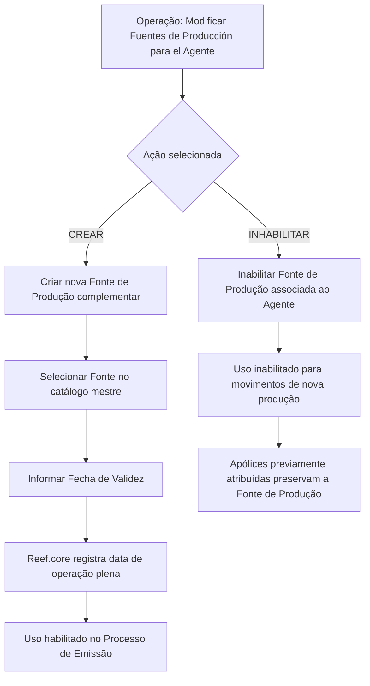

# Modificar Fuentes de Producción para el Agente

## 1. Metadados do Documento
- **Arquivo de Origem:** Não identificado
- **Tipo de Documento:** Procedimento
- **Domínio / Sistema:** Reef.core — gestão de Fontes de Produção associadas a Agentes
- **Público-Alvo:** Operação, negócio e usuários do sistema
- **Data/Versão Identificada:** Não identificada

---

## 2. Resumo Executivo & Contexto de Negócio

O documento descreve a operação **“Modificar Fuentes de Producción para el Agente”**, destinada à administração das Fontes de Produção vinculadas a um Agente no sistema Reef.core.

A operação permite duas ações: **criar** novas Fontes de Produção complementares e **inabilitar** Fontes de Produção anteriormente habilitadas para o Agente. A associação da Fonte de Produção utiliza valores existentes no catálogo mestre de Fontes de Produção do sistema.

A data de validade determina a partir de quando uma Fonte de Produção associada ao Agente está plenamente operacional e, consequentemente, habilitada para uso no Processo de Emissão.

A inabilitação impede o uso da Fonte de Produção nos movimentos de nova produção. Entretanto, a regra preserva as apólices que já possuíam previamente aquela Fonte de Produção atribuída.

---

## 3. Arquitetura, Componentes & Tecnologias Envolvidas

Os elementos identificados no documento são:

- **Reef.core:** sistema que armazena a data de validade da Fonte de Produção associada ao Agente.
- **Agente:** entidade à qual as Fontes de Produção são associadas.
- **Fonte de Produção:** atributo associado ao Agente, selecionado a partir do catálogo mestre.
- **Catálogo mestre de Fontes de Produção:** relação de valores existentes que pode ser utilizada na associação.
- **Processo de Emissão:** processo que utiliza Fontes de Produção operativas e habilitadas.
- **Apólices previamente atribuídas:** apólices que mantêm a Fonte de Produção anteriormente associada mesmo após a inabilitação para nova produção.



**Nota de Análise:** o documento não detalha interfaces, métodos HTTP, contratos JSON, tecnologias de infraestrutura, perfis de acesso ou mecanismos técnicos de persistência para a operação.

---

## 4. Regras de Negócio, Especificações Funcionais & Processos

1. A operação permite modificar as Fontes de Produção de um Agente.
2. Existem duas ações possíveis:
   - **CREAR:** criar novas Fontes de Produção complementares.
   - **INHABILITAR:** inabilitar Fontes de Produção que o Agente possuía previamente habilitadas.
3. O campo **Fuente de Producción** deve conter uma Fonte de Produção que será associada ao Agente.
4. A Fonte de Produção deve ser selecionada conforme a relação de valores disponível no catálogo mestre de Fontes de Produção existente no sistema.
5. Os atributos do bloco de informação seguem a sequência de captura apresentada da esquerda para a direita e de cima para baixo.
6. O campo **Fecha de Validez** contém, no Reef.core, a data a partir da qual a Fonte de Produção associada ao Agente está plenamente operativa.
7. A partir da data de validade, a Fonte de Produção fica habilitada para uso no **Proceso de Emisión**.
8. O campo **Inhabilitación** marca que a Fonte de Produção associada ao Agente está inabilitada no sistema.
9. Uma Fonte de Produção inabilitada não pode ser utilizada no Processo de Emissão para movimentos de nova produção.
10. A inabilitação não altera as apólices que já possuíam previamente a Fonte de Produção atribuída.

---

## 5. Tabelas de Parâmetros, Ambientes e Estruturas de Dados

| Item / Parâmetro | Descrição / Função | Tipo / Valores / Formato | Ambiente / Observações |
| :--- | :--- | :--- | :--- |
| Operação | Modificar Fontes de Produção para o Agente | Operação funcional | Permite criar ou inabilitar Fontes de Produção |
| Ação | Define a ação aplicada à Fonte de Produção | `CREAR` ou `INHABILITAR` | As ações são apresentadas como possíveis ações da operação |
| Fuente de Producción | Fonte de Produção associada ao Agente | Um valor do catálogo mestre de Fontes de Produção | O documento não especifica formato, código ou domínio de valores |
| Fecha de Validez | Data a partir da qual a Fonte de Produção está plenamente operativa | Data; formato não informado | Registrada no Reef.core e habilita uso no Processo de Emissão |
| Inhabilitación | Marca a Fonte de Produção como inabilitada no sistema | Campo de marcação; formato não informado | Impede uso para nova produção; preserva apólices previamente associadas |
| Agente | Entidade que possui Fontes de Produção associadas | Entidade de negócio | O documento não detalha identificador ou atributos do Agente |
| Catálogo mestre de Fontes de Produção | Relação de valores disponíveis para associação | Catálogo existente no sistema | Não são apresentados os valores do catálogo |
| Proceso de Emisión | Processo que utiliza Fontes de Produção habilitadas | Processo de negócio | Fontes inabilitadas não são usadas para movimentos de nova produção |
| Reef.core | Sistema citado para a data de validade | Sistema | Não são detalhados módulos, URLs ou integrações |

---

## 6. Bateria de Perguntas & Respostas para RAG (FAQ Sintético)

### P1: Qual é o objetivo da operação “Modificar Fuentes de Producción para el Agente”?
**R:** A operação permite criar novas Fontes de Produção complementares para um Agente e inabilitar Fontes de Produção que já estavam habilitadas para esse Agente.

### P2: Quais ações estão disponíveis na operação de modificação das Fontes de Produção?
**R:** O documento apresenta duas ações possíveis: `CREAR`, para criar novas Fontes de Produção complementares, e `INHABILITAR`, para inabilitar Fontes de Produção previamente habilitadas pelo Agente.

### P3: Como é selecionada uma Fonte de Produção para um Agente?
**R:** O campo `Fuente de Producción` deve conter uma das Fontes de Produção associadas ao Agente conforme os valores existentes no catálogo mestre de Fontes de Produção do sistema.

### P4: O que representa o campo “Fecha de Validez” em Reef.core?
**R:** Em Reef.core, o campo `Fecha de Validez` contém a data a partir da qual a Fonte de Produção associada ao Agente está plenamente operativa e habilitada para uso no Processo de Emissão.

### P5: Quando uma Fonte de Produção pode ser usada no Processo de Emissão?
**R:** A Fonte de Produção pode ser usada no Processo de Emissão a partir da data de validade registrada em Reef.core, quando passa a estar plenamente operativa.

### P6: Qual é o efeito da inabilitação de uma Fonte de Produção?
**R:** A inabilitação marca a Fonte de Produção associada ao Agente como inabilitada no sistema e impede seu uso no Processo de Emissão para movimentos de nova produção.

### P7: A inabilitação altera apólices que já possuíam a Fonte de Produção atribuída?
**R:** Não. O documento determina que as apólices que já tinham previamente a Fonte de Produção atribuída são respeitadas após a inabilitação. A restrição aplica-se aos movimentos de nova produção.

### P8: O documento informa o formato da data de validade?
**R:** Não. O documento informa a finalidade da `Fecha de Validez`, mas não especifica seu formato técnico.

### P9: O documento lista as Fontes de Produção disponíveis no catálogo mestre?
**R:** Não. O documento apenas informa que a Fonte de Produção deve ser selecionada entre os valores existentes no catálogo mestre do sistema.

### P10: O documento detalha APIs ou contratos técnicos para a operação?
**R:** Não. O documento descreve a operação funcional, os campos e as regras de uso no Processo de Emissão, mas não detalha métodos HTTP, contratos JSON, endpoints ou integrações técnicas.

---

## 7. Glossário de Termos, Siglas & Conceitos-Chave

- **Agente:** entidade à qual uma ou mais Fontes de Produção podem ser associadas.
- **Fuente de Producción / Fonte de Produção:** fonte associável ao Agente e utilizada no Processo de Emissão quando plenamente operativa.
- **CREAR:** ação para criar novas Fontes de Produção complementares.
- **INHABILITAR:** ação para marcar uma Fonte de Produção como inabilitada no sistema.
- **Fecha de Validez:** data a partir da qual a Fonte de Produção está plenamente operativa e habilitada para uso no Processo de Emissão.
- **Inhabilitación:** marcação que indica que uma Fonte de Produção associada ao Agente está inabilitada.
- **Reef.core:** sistema citado como responsável por conter o valor da data de validade.
- **Proceso de Emisión / Processo de Emissão:** processo no qual Fontes de Produção plenamente operativas podem ser utilizadas.
- **Nueva producción / Nova produção:** movimentos para os quais Fontes de Produção inabilitadas não podem ser usadas.
- **Catálogo mestre de Fontes de Produção:** relação de valores existentes no sistema para seleção de Fontes de Produção.

---

## 8. Notas Críticas, Riscos & Limitações

- O documento não identifica o arquivo de origem, a data, a versão ou o responsável pela documentação.
- Não foram detalhados os valores existentes no catálogo mestre de Fontes de Produção.
- O documento não informa o formato da `Fecha de Validez`.
- Não há detalhamento sobre validações obrigatórias, mensagens de erro, permissões de usuário ou fluxo de aprovação.
- Não há especificação de APIs, endpoints, contratos de integração, tabelas físicas ou mecanismos de persistência.
- A regra de inabilitação exige atenção operacional: a Fonte de Produção deixa de ser válida para nova produção, mas permanece respeitada nas apólices que já a possuíam atribuída.

---

## 9. Conteúdo Bruto Estruturado (Referência Fiel)

```text
--- [PÁGINA 1 DE 2] ---

MODIFICAR Fuentes de Producción para el
Agente
Objetivo
Esta Operación permite Crear nuevas fuentes de producción complementarias además de
Inhabilitar las que tuviera previamente habilitadas el Agente.
Posibles Acciones
 CREAR ( )  INHABILITAR ( )
Fuentes de Producción
Fuentes de Producción
De Izquierda a Derecha y de Arriba hacia Abajo, los siguientes atributos marcan la secuencia de
captura en este Bloque de Información.
Fuente de Producción (  )
Este Campo contendrá Una de las Fuentes de Producción que el Agente tendrá asociadas de
acuerdo con la relación de valores existentes en el catálogo maestro de Fuentes de Producción
existente en el Sistema.
Fecha de Validez ( )
 / 
 RS
Inicio Soluciones APIs Documentación Zeus
ES


--- [PÁGINA 2 DE 2] ---

El valor de este campo en Reef.core contiene la fecha a partir de la cual la Fuente de Producción
asociada al Agente está plenamente operativa y se habilita por tanto su uso en el Proceso de
Emisión.
Inhabilitación (  )
Este Campo marca que la Fuente de Producción asociada al Agente está inhabilitada en el Sistema y
por tanto se inhabilita su uso en el Proceso de Emisión para los movimientos de nueva producción
(respetándose en cambio en aquellas pólizas que la tuvieran previamente asignada).
```
