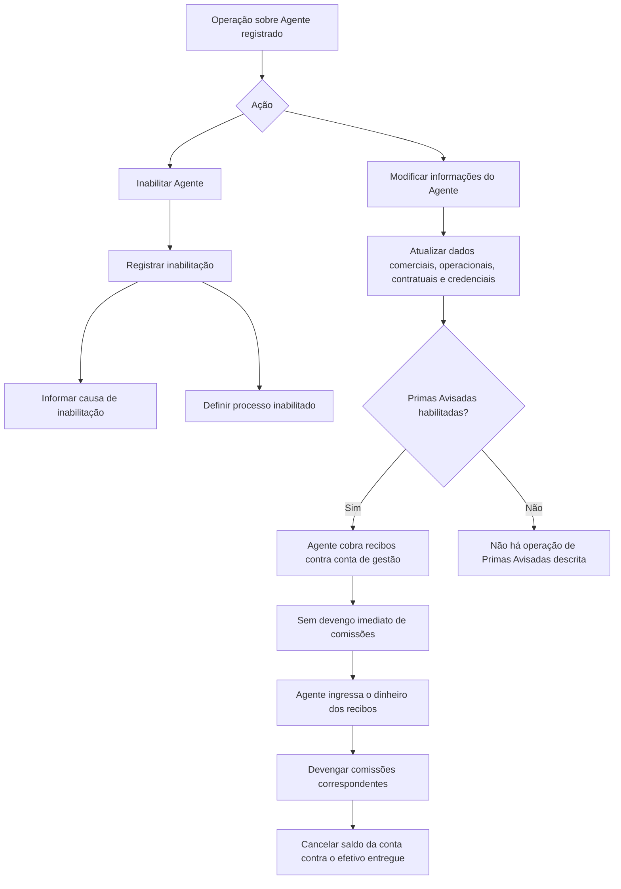

# Operação de Modificação e Inabilitação de Agentes — Especificação Funcional de Dados do Agente

## 1. Metadados do Documento
- **Arquivo de Origem:** `Não identificado`
- **Tipo de Documento:** `Especificação Técnica / Manual Funcional`
- **Domínio / Sistema:** `Gestão de Agentes e Intermediários em entidade seguradora`
- **Público-Alvo:** `Analistas funcionais, Desenvolvedores, Operação, Áreas Comercial e de Clientes`
- **Data/Versão Identificada:** `Não identificada`

---

## 2. Resumo Executivo & Contexto de Negócio

O documento descreve a operação de **modificação das informações de um Agente** já registrado no sistema de uma entidade seguradora. A operação também permite **inabilitar** o Agente, impedindo que ele seja empregado, contemplado ou considerado em parte ou na totalidade dos processos operacionais da entidade após a data de inabilitação.

A especificação organiza os atributos que compõem o cadastro operacional, comercial, contratual e regulatório do Agente. Entre os dados abrangidos estão situação, classificação, tipo de Agente, vínculos com Executivo de Conta, Assessor Comercial e Organizador Comercial, escritório comercial padrão, fonte de produção, retenções, comissões, formas de cobrança/pagamento e entrega de documentação.

O cadastro suporta regras relevantes para a operação de seguros. Um exemplo é a funcionalidade de **Primas Avisadas**, que permite ao Agente cobrar recibos contra uma conta de gestão sem gerar imediatamente o devengo de comissões. As comissões são posteriormente geradas quando o Agente ingressa o valor recebido dos recibos, momento em que o saldo da conta de gestão de Primas Avisadas é cancelado contra o efetivo entregue.

A especificação também mantém informações do contrato privado celebrado entre a entidade seguradora e o Agente, bem como credenciais profissionais, colegiação, observações e forma de gestão. A coerência entre as formas de gestão definidas e as operações habilitadas para o Agente é explicitamente exigida pelo documento.

O conteúdo não detalha APIs, métodos HTTP, contratos JSON, persistência, integrações técnicas, URLs, ambientes, perfis de acesso ou fluxos de aprovação. O documento concentra-se na definição funcional dos atributos de cadastro e nas regras operacionais associadas.

---

## 3. Arquitetura, Componentes & Tecnologias Envolvidas

O documento não descreve uma arquitetura técnica de software, microsserviços, banco de dados, APIs, servidores, ambientes ou tecnologias de implementação.

Os componentes funcionais identificados são:

| Componente / Entidade | Papel descrito |
| :--- | :--- |
| Agente | Entidade principal cujo cadastro pode ser modificado ou inabilitado. |
| Entidade Seguradora | Organização que configura catálogos, define diretrizes comerciais e opera processos relacionados aos Agentes. |
| Sistema | Repositório funcional onde são configurados Agentes, Terceiros, classificações, tipos de intermediários, compensações e demais catálogos mestres. |
| Catálogo Mestre | Fonte de valores para classificações, tipos de intermediários, escritórios comerciais, fontes de produção, compensações, códigos de qualidade, códigos de envio e agrupamentos. |
| Executivo de Conta | Agente associado ao cadastro do Agente; deve ser um Terceiro configurado com Código de Atividade 11. |
| Assessor Comercial | Agente associado ao cadastro do Agente; deve ser um Terceiro configurado com Código de Atividade 2. |
| Organizador Comercial | Agente associado ao cadastro do Agente; deve ser um Terceiro configurado com Código de Atividade 2. |
| Processo de Pagamento da Liquidação de Comissões | Processo do qual o Agente pode ser excluído por decisão comercial da entidade seguradora. |
| Conta de Gestão de Primas Avisadas | Conta utilizada na operação de Primas Avisadas para cobrança de recibos sem devengo imediato de comissão. |



> **Nota de Análise:** o diagrama representa exclusivamente o fluxo funcional explicitamente descrito. O documento não informa interfaces, serviços, persistência, validações técnicas ou eventos sistêmicos.

---

## 4. Regras de Negócio, Especificações Funcionais & Processos

### 4.1 Ações disponíveis

A operação dispõe de duas ações possíveis:

1. **MODIFICAR:** altera as informações previamente registradas para o Agente.
2. **INHABILITAR:** registra que o Agente está inabilitado no sistema.

### 4.2 Sequência de captura

Os atributos de dados do Agente são apresentados em sequência de captura, da esquerda para a direita e de cima para baixo. Caso não exista indicação expressa em contrário, os atributos se aplicam tanto a **Pessoas Físicas** quanto a **Pessoas Jurídicas**.

### 4.3 Regras de validade e histórico

- A **Data de Validade** indica a data a partir da qual o Agente está plenamente operativo no sistema.
- O uso correto da Data de Validade permite à entidade seguradora manter um histórico das alterações realizadas na configuração e nas informações dos Agentes.

### 4.4 Regras de produtor direto

- A ativação da marca **¿Productor Directo?** qualifica o Agente como **Productor Directo**.
- O documento não descreve consequências adicionais, processos específicos ou critérios de elegibilidade associados à qualificação de Productor Directo.

### 4.5 Regras de situação do Agente

- O campo **Situación** atribui um código de situação ao Agente.
- A entidade seguradora deve analisar a conveniência de utilizar esse código transversalmente em seus processos.
- Os valores informados para definições em idioma espanhol são:
  - `1`: Agente Activo.
  - `2`: Agente Inactivo.
  - `3`: Agente Retirado.

### 4.6 Regras de inabilitação

- O campo **Inhabilitación** informa que o Agente está inabilitado no sistema.
- A partir da inabilitação, o Agente não deve ser empregado, contemplado ou considerado em parte ou em todos os processos operacionais da entidade.
- Quando o Agente estiver inabilitado, o campo **Causa de Inhabilitación** deve conter um código de causa definido no catálogo mestre do sistema.
- O campo **Proceso Inhabilitado** determina o escopo da inabilitação:
  - Inabilitação para comercializar apólices ou aplicações de **Nueva Producción**.
  - Inabilitação para intermediar apólices e aplicações de **Nueva Producción** e também suplementos da carteira de apólices e aplicações.

### 4.7 Regras para vínculos comerciais

- **Ejecutivo de Cuenta:** deve corresponder a um código de Terceiro configurado no sistema com **Código de Actividad 11**.
- **Asesor Comercial:** deve corresponder a um código de Terceiro configurado no sistema com **Código de Actividad 2**.
- **Organizador Comercial:** deve corresponder a um código de Terceiro configurado no sistema com **Código de Actividad 2**.
- Os vínculos devem ser selecionados conforme as relações existentes no catálogo mestre de Agentes configurado no sistema.

### 4.8 Regras de comissões e compensação

- A marca **Exclusión de Comisiones** exclui o Agente do Processo de Pagamento da Liquidação de Comissões, por razões comerciais definidas pela entidade seguradora.
- **Forma de Cobro/Pago** deve conter o código da forma de cobrança/pagamento do Agente, conforme as Formas de Compensação definidas no catálogo mestre de Compensações.
- **Tipo de Retención** contém o código de um dos Tipos de Retenção configurados localmente pela entidade seguradora.

### 4.9 Regras de Primas Avisadas

- A marca **Primas Avisadas?** somente é aplicável quando a entidade seguradora tiver o conceito de Primas Avisadas operativo.
- Quando habilitado, o atributo qualifica o Agente para realizar a operação de Primas Avisadas.
- A operação permite cobrar recibos contra uma conta de gestão de Primas Avisadas.
- Durante a cobrança contra a conta de gestão, não ocorre o devengo de comissões ao Agente.
- Quando o Agente ingressa o dinheiro dos recibos:
  1. As comissões correspondentes são devengadas.
  2. O valor da conta de gestão de Primas Avisadas é cancelado contra o efetivo entregue pelo Agente.

### 4.10 Regras contratuais e de credenciamento

- **Contrato** é o código ou chave do contrato privado celebrado entre a entidade seguradora e o Agente.
- **Fecha de Alta del Contrato** é a data de efeito do contrato que habilita comercialmente o Agente.
- **Fecha de Vencimiento del Contrato** é a data em que o contrato celebrado deixa de vigorar.
- **Número de Colegiación** corresponde ao código da cédula profissional que habilita o Agente, por pertencer a um colégio profissional ou associação oficial semelhante, a atuar como mediador de seguros.
- **Fecha de Expedición de la Credencial** é a data de efeito da colegiação.
- **Fecha de Vencimiento de la Credencial** é a data de baixa da colegiação.

### 4.11 Regras de gestão e classificação complementar

- **Forma de Gestión** identifica a forma de gestão atribuída ao Agente segundo diretrizes das Direções de Clientes, Comercial ou outras diretrizes da entidade seguradora.
- Deve existir total coerência entre as formas de gestão definidas e as operações habilitadas para o Agente.
- Os valores exemplificados para Forma de Gestión, quando a definição utiliza espanhol, são:
  - `AA1`: No puede Cobrar Primas.
  - `BB1`: Puede Cobrar Primas.
  - `CC1`: Solo a Cuentas Corporativas.
- **Tipo de Clasificación** permite associar ao Agente um código de agrupamento que complementa as informações habilitadas no núcleo do sistema.
- Os valores exemplificados para Tipo de Clasificación, quando a definição utiliza espanhol, são:
  - `1`: Agente Bueno.
  - `2`: Agente Regular.
  - `3`: Agente Malo.

---

## 5. Tabelas de Parâmetros, Ambientes e Estruturas de Dados

| Item / Parâmetro | Descrição / Função | Tipo / Valores / Formato | Ambiente / Observações |
| :--- | :--- | :--- | :--- |
| Posibles Acciones | Define a ação executada sobre o Agente. | `MODIFICAR`; `INHABILITAR`. | O documento não detalha fluxo de aprovação ou permissões. |
| Fecha de Validez | Data a partir da qual o Agente está plenamente operativo. | Data. | Mantém histórico de alterações de configuração e informação do Agente. |
| ¿Productor Directo? | Qualifica o Agente como Productor Directo quando a marca é ativada. | Marca / indicador. | Não há detalhamento adicional sobre efeitos da classificação. |
| Situación | Atribui código de situação ao Agente. | `1` Agente Activo; `2` Agente Inactivo; `3` Agente Retirado. | Valores apresentados para definição em espanhol. |
| Clasificación | Contém a classificação atribuída ao Agente. | Valor do catálogo mestre de Clasificaciones. | Catálogo configurado no sistema. |
| Inhabilitación | Indica que o Agente está inabilitado no sistema. | Marca / indicador. | O Agente não deve ser utilizado, contemplado ou considerado em parte ou todos os processos operacionais. |
| Causa de Inhabilitación | Informa a causa da inabilitação. | Código do catálogo mestre de causas. | Aplicável quando o Agente está inabilitado. |
| Proceso Inhabilitado | Define o escopo da inabilitação operacional. | Nueva Producción; ou Nueva Producción e Suplementos. | Não são informados códigos de valores. |
| Tipo de Agente | Contém a tipologia do Agente. | Valor do catálogo mestre de Tipos de Intermediarios. | Catálogo configurado no sistema. |
| Oficina Comercial por Defecto | Define o escritório comercial padrão do Agente. | Valor do catálogo mestre de Oficinas Comerciales. | Escritórios definidos previamente na estrutura comercial da companhia. |
| Ejecutivo de Cuenta | Define o Executivo de Conta associado ao Agente. | Código de Terceiro. | Deve possuir Código de Actividad `11`. |
| Asesor Comercial | Define o Assessor Comercial associado ao Agente. | Código de Terceiro. | Deve possuir Código de Actividad `2`. |
| Organizador Comercial | Define o Organizador Comercial associado ao Agente. | Código de Terceiro. | Deve possuir Código de Actividad `2`. |
| Fuente de Producción por Defecto | Define a fonte de produção padrão do Agente. | Valor do catálogo mestre de Fuentes de Producción. | Catálogo configurado localmente. |
| Tipo de Retención | Define o tipo de retenção aplicável. | Código de Tipo de Retención. | Configurado localmente pela entidade seguradora. |
| Exclusión de Comisiones | Exclui o Agente do pagamento da liquidação de comissões. | Marca / indicador. | Exclusão por questões comerciais. |
| Forma de Cobro/Pago | Define a forma de cobrança/pagamento do Agente. | Código de Forma de Compensación. | Valores do catálogo mestre de Compensaciones. |
| Calidad del Agente | Define classificação qualitativa do Agente. | Valor do catálogo mestre de Códigos de Calidad. | Catálogo configurado no sistema. |
| Tipo de Envío | Identifica o método de envio de documentação ao Agente. | Chave do catálogo mestre de Códigos de Envío. | Pode abranger cópias de CC.PP. de apólices; catálogo corporativo no núcleo do sistema. |
| Agrupamiento Comercial del Agente | Define a agrupação comercial do Agente. | Valor do catálogo mestre de Agrupaciones. | Catálogo do sistema. |
| Primas Avisadas? | Habilita o Agente para a operação de Primas Avisadas. | Marca / indicador. | Depende de a entidade seguradora ter o conceito operativo. |
| Contrato | Identifica o contrato privado entre entidade seguradora e Agente. | Código ou chave. | Sem formato especificado. |
| Fecha de Alta del Contrato | Indica a data de efeito do contrato. | Data. | Habilita o Agente a exercer comercialmente. |
| Fecha de Vencimiento del Contrato | Indica a data de baixa do contrato. | Data. | Relacionada ao contrato celebrado. |
| Número de Colegiación | Identifica a cédula profissional do Agente. | Chave ou código. | Relacionado à habilitação para atuar como mediador de seguros. |
| Fecha de Expedición de la Credencial | Indica a data de efeito da colegiação. | Data. | Relacionada à credencial profissional. |
| Fecha de Vencimiento de la Credencial | Indica a data de baixa da colegiação. | Data. | Relacionada à credencial profissional. |
| Observaciones | Permite registrar informação adicional do Agente. | Texto. | Conforme diretrizes das Direções de Clientes ou Comercial. |
| Forma de Gestión | Identifica a forma de gestão atribuída ao Agente. | `AA1`, `BB1`, `CC1` e outros valores não detalhados. | Deve ser coerente com as operações habilitadas. |
| Tipo de Clasificación | Associa código de agrupamento complementar ao Agente. | `1` Agente Bueno; `2` Agente Regular; `3` Agente Malo. | Valores apresentados para definição em espanhol. |

### Valores de Situação

| Código | Descrição |
| :--- | :--- |
| `1` | Agente Activo |
| `2` | Agente Inactivo |
| `3` | Agente Retirado |

### Valores Exemplificados de Forma de Gestão

| Código | Descrição |
| :--- | :--- |
| `AA1` | No puede Cobrar Primas |
| `BB1` | Puede Cobrar Primas |
| `CC1` | Solo a Cuentas Corporativas |

### Valores Exemplificados de Tipo de Classificação

| Código | Descrição |
| :--- | :--- |
| `1` | Agente Bueno |
| `2` | Agente Regular |
| `3` | Agente Malo |

---

## 6. Bateria de Perguntas & Respostas para RAG (FAQ Sintético)

### P1: Quais ações podem ser executadas na operação de manutenção de Agentes?
**R:** A operação permite duas ações: `MODIFICAR`, para alterar dados já registrados do Agente, e `INHABILITAR`, para indicar que o Agente não deve mais ser empregado, contemplado ou considerado em parte ou em todos os processos operacionais da entidade seguradora.

### P2: Qual é a função da Fecha de Validez no cadastro do Agente?
**R:** A Fecha de Validez indica a data a partir da qual o Agente está plenamente operativo no sistema. A utilização correta dessa data permite à entidade seguradora manter um histórico das alterações efetuadas na configuração e nas informações dos Agentes.

### P3: O que acontece quando um Agente é marcado como inabilitado?
**R:** Quando o campo Inhabilitación indica que o Agente está inabilitado, o Agente não deve ser empregado, contemplado ou considerado em parte ou em todos os processos operacionais da entidade. O cadastro pode incluir uma Causa de Inhabilitación e a definição do Proceso Inhabilitado.

### P4: Qual é a diferença entre os escopos possíveis do campo Proceso Inhabilitado?
**R:** O campo Proceso Inhabilitado pode estabelecer que o Agente está inabilitado somente para comercializar apólices ou aplicações de Nueva Producción. Também pode estabelecer que o Agente está inabilitado para intermediar apólices e aplicações de Nueva Producción e para intermediar suplementos da carteira de apólices e aplicações.

### P5: Qual requisito deve ser atendido pelo Executivo de Conta associado ao Agente?
**R:** O código do Executivo de Cuenta deve ser um código de Terceiro configurado no sistema com Código de Actividad `11`.

### P6: Quais requisitos se aplicam ao Assessor Comercial e ao Organizador Comercial?
**R:** Tanto o código do Asesor Comercial quanto o código do Organizador Comercial devem ser códigos de Terceiros configurados no sistema com Código de Actividad `2`.

### P7: Como funciona a operação de Primas Avisadas?
**R:** Quando o conceito de Primas Avisadas está operativo na entidade seguradora e o Agente está qualificado para utilizá-lo, o Agente pode cobrar recibos contra uma conta de gestão de Primas Avisadas sem gerar devengo imediato de comissões. Posteriormente, quando o Agente ingressa o dinheiro dos recibos, as comissões correspondentes são devengadas e o valor da conta de gestão é cancelado contra o efetivo entregue.

### P8: Qual é o efeito do campo Exclusión de Comisiones?
**R:** Exclusión de Comisiones indica que a entidade seguradora exclui o Agente, por questões comerciais, do Processo de Pagamento da Liquidação de Comissões configurado na entidade.

### P9: Como é determinada a Forma de Cobro/Pago do Agente?
**R:** A Forma de Cobro/Pago contém o código da forma de cobrança ou pagamento do Agente, conforme as possíveis Formas de Compensação definidas no catálogo mestre de Compensaciones.

### P10: O que representa o Número de Colegiación?
**R:** O Número de Colegiación contém a chave ou código da cédula profissional pela qual o Agente, por pertencer a um colégio profissional ou associação oficial semelhante, está habilitado para exercer como mediador de seguros.

### P11: Quais exemplos de Forma de Gestión são apresentados?
**R:** O documento apresenta `AA1` para “No puede Cobrar Primas”, `BB1` para “Puede Cobrar Primas” e `CC1` para “Solo a Cuentas Corporativas”. Também informa que deve haver total coerência entre as formas de gestão definidas e as operações habilitadas para o Agente.

### P12: Quais valores de Situación estão definidos quando o idioma utilizado é o espanhol?
**R:** Os valores apresentados são `1` para Agente Activo, `2` para Agente Inactivo e `3` para Agente Retirado.

---

## 7. Glossário de Termos, Siglas & Conceitos-Chave

- **Agente:** entidade cadastrada no sistema cuja informação pode ser modificada ou que pode ser inabilitada.
- **Asesor Comercial:** Assessor Comercial associado ao Agente; deve ser Terceiro com Código de Actividad 2.
- **Causa de Inhabilitación:** código de motivo da inabilitação, definido no catálogo mestre do sistema.
- **CC.PP.:** sigla citada como exemplo de documentação de apólices enviada ao Agente; o documento não fornece expansão.
- **Código de Actividad:** código de atividade requerido para determinados Terceiros associados ao Agente.
- **Ejecutivo de Cuenta:** Executivo de Conta associado ao Agente; deve ser Terceiro com Código de Actividad 11.
- **Entidad Aseguradora:** organização seguradora que configura catálogos, processos e diretrizes de operação do Agente.
- **Forma de Cobro/Pago:** forma de cobrança ou pagamento do Agente, baseada no catálogo mestre de Compensaciones.
- **Forma de Gestión:** classificação de gestão atribuída ao Agente, que deve ser coerente com as operações habilitadas.
- **Inhabilitación:** condição em que o Agente deixa de poder ser utilizado em parte ou em todos os processos operacionais.
- **Nueva Producción:** expressão usada para apólices ou aplicações de nova produção; o documento não apresenta definição adicional.
- **Organizador Comercial:** Organizador Comercial associado ao Agente; deve ser Terceiro com Código de Actividad 2.
- **Primas Avisadas:** operação em que o Agente cobra recibos contra conta de gestão sem devengo imediato de comissões.
- **Suplementos:** itens da carteira de apólices e aplicações que podem integrar o escopo de inabilitação; não possuem detalhamento adicional.
- **Tercero:** entidade cadastrada no sistema com um Código de Actividad específico, utilizada para identificar Executivo de Conta, Assessor Comercial ou Organizador Comercial.
- **Tipo de Retención:** código de tipo de retenção configurado localmente pela entidade seguradora.

---

## 8. Notas Críticas, Riscos & Limitações

- O documento não identifica o nome do sistema, versão, data de publicação, responsáveis, ambiente operacional ou arquivo de origem.
- O documento não especifica tecnologias, APIs, métodos HTTP, contratos JSON, banco de dados, integrações, logs, mensagens de erro, perfis de acesso ou mecanismos de auditoria.
- Não são apresentados códigos concretos para Causa de Inhabilitación, Proceso Inhabilitado, Tipo de Agente, Oficina Comercial, Fuente de Producción, Tipo de Retención, Forma de Cobro/Pago, Calidad del Agente, Tipo de Envío ou Agrupamiento Comercial.
- A inabilitação tem impacto potencialmente amplo, pois o Agente não deve ser considerado em parte ou em todos os processos operacionais. O documento não define controles, aprovações, reversão ou validações para essa alteração.
- A operação de Primas Avisadas depende de a entidade seguradora possuir esse conceito operativo; não são descritos critérios de ativação, controles financeiros, contabilização ou tratamento de exceções.
- A forma de gestão precisa estar integralmente coerente com as operações habilitadas para o Agente. O documento determina essa obrigatoriedade, mas não detalha uma matriz de validação entre códigos de gestão e permissões operacionais.
- **Nota de Análise:** os exemplos de valores para Situação, Forma de Gestão e Tipo de Classificação são condicionados ao uso do idioma espanhol na definição. O documento não fornece equivalentes para outros idiomas.

---

## 9. Conteúdo Bruto Estruturado (Referência Fiel)

```text
--- [PÁGINA 1 DE 6] ---

MODIFICAR Información específica del Agente
Objetivo
Esta Operación permite Modificar la información del Agente registrada previamente además de
poder Inhabilitarlo.
Posibles Acciones
 MODIFICAR ( )
 INHABILITAR ( )
Datos Agente
Información Agente
De Izquierda a Derecha y de Arriba hacia Abajo, los siguientes atributos marcan la secuencia de
captura de los Datos. Si no se especifica o indica expresamente, los Atributos se emplearán tanto en
Personas Físicas como en Personas Jurídicas
Fecha de Validez ( )
Esta propiedad le indica al Sistema la fecha a partir de la cual el Agente está plenamente operativo
en el sistema por lo que su empleo y correcta utilización permite tener en la entidad Aseguradora un
histórico de los cambios efectuados en la configuración e información de los Agentes.
¿Productor Directo? ( )
 / 
 RS
Inicio Soluciones APIs Documentación Zeus
ES


--- [PÁGINA 2 DE 6] ---

La activación de esta marca en la captura de la información del Agente califica al Agente como
Productor Directo.
Situación (  )
El sentido de este campo es asignar un código de situación al Agente para que la entidad
aseguradora, tras haber analizado la conveniencia de utilizarlo transversalmente en los procesos de
la compañía, lo utilice adecuadamente en aquellos procesos que así lo puedan demandar.
Si el Idioma utilizado en la definición es el español, sus valores son:
TIPOS de SITUACIÓN DESCRIPCIÓN
1 Agente Activo
2 Agente Inactivo
3 Agente Retirado
Clasificación (  )
Este Campo contendrá la Clasificación que se le otorga al Agente de acuerdo con la relación de
valores existentes en el catálogo maestro de Clasificaciones configurado en el Sistema.
Inhabilitación ( )
Este Campo le indica al Sistema que el Agente está inhabilitado en el Sistema por lo que a partir del
momento de su inhabilitación no debería ser empleado, contemplado o considerado en parte o en
todos los procesos operativos de la entidad.
Causa de Inhabilitación (   )
En el supuesto que el Agente estuviera Inhabilitado, este atributo del Agente contendrá el código de
una Causa de Inhabilitación definida en el catálogo maestro del Sistema.
Proceso Inhabilitado (   )
Este campo establece si el Agente está inhabilitado para comercializar pólizas o aplicaciones de
Nueva Producción o bien está inhabilitado para intermediar tanto pólizas y aplicaciones de Nueva
Producción como Suplementos a la cartera de sus pólizas y aplicaciones.
Tipo de Agente (  )


--- [PÁGINA 3 DE 6] ---

Este dato contendrá la Tipología del Agente de acuerdo con la relación de valores existentes en el
catálogo maestro de Tipos de Intermediarios configurado en el Sistema.
Oficina Comercial por Defecto (  )
Este Campo contendrá la Oficina Comercial que el Agente va a tener asignada por defecto de
acuerdo con la relación de valores existentes en el catálogo maestro de Oficinas Comerciales
definidas previamente en la estructura comercial de la Compañía.
Ejecutivo de Cuenta (  )
Este Campo contendrá el código del Ejecutivo de Cuenta al que estará asignado el Agente, de
acuerdo con la relación existente en el catálogo maestro de Agentes existente en el Sistema.
El Código del Ejecutivo de Cuenta ha de ser un código de Tercero configurado en el Sistema con
el Código de Actividad 11.
Asesor Comercial (  )
Este Campo contendrá el código del Asesor Comercial que tendrá asignado el Agente, de acuerdo
con la relación existente en el catálogo maestro de Agentes existente en el Sistema.
Organizador Comercial (  )
Este Campo contendrá el código del Organizador Comercial al que estará asignado el Agente, de
acuerdo con la relación existente en el catálogo maestro de Agentes existente en el Sistema.
Tanto el Código del Asesor Comercial como el Código del Organizador Comercial han de ser
códigos de Terceros configurados en el Sistema con el Código de Actividad 2.
Fuente de Producción por Defecto (  )
Este Campo contendrá la Fuente de Producción por defecto que el Agente va a tener asignada de
acuerdo con la relación de valores existentes en el catálogo maestro de Fuentes de Producción
configuradas localmente.
Tipo de Retención (  )
Este Dato contiene el código de uno de los Tipos de Retención configurados localmente por la
Entidad Aseguradora.
Ejecutivo de Cuenta
Organizador Comercial


--- [PÁGINA 4 DE 6] ---

Exclusión de Comisiones ( )
Este atributo implica que la entidad Aseguradora excluye por cuestiones comerciales al Agente del
Proceso de Pago de la Liquidación de Comisiones configurado en la Entidad.
Forma de Cobro/Pago (  )
Este Dato indicará el Código de la Forma de Cobro/Pago del Agente de acuerdo con las posibles
Formas de Compensación definidas en el catálogo maestro de Compensaciones.
Calidad del Agente (  )
Este Campo contendrá una clasificación cualitativa del Agente de acuerdo con la relación de valores
existentes en el catálogo maestro de Códigos de Calidad configurado en el Sistema.
Tipo de Envío (  )
Este campo contiene una clave que identifica el método de envío por el cual la entidad aseguradora
dispondrá al Agente de su documentación, como por ejemplo las copias de las CC.PP de sus pólizas,
... todo ello de acuerdo con los valores del catálogo maestro de Códigos de Envío configurado
corporativamente en el núcleo del Sistema.
Agrupamiento Comercial del Agente (  )
Este Campo contendrá la Agrupación Comercial del Agente de acuerdo con la relación de valores
configurados en el catálogo maestro de Agrupaciones del Sistema.
Primas Avisadas? ( )
Siempre y cuando la entidad Aseguradora tenga operativo el concepto de Primas Avisadas, este
Atributo en la configuración del Agente le califica para estar o no en disposición de poder realizar su
Operativa.
La operativa denominada "Primas Avisadas" permite que los Agentes cobren recibos contra una
cuenta de gestión de primas avisadas sin generar el devengo de las comisiones al agente.
Posteriormente cuando el agente ingrese el dinero de los recibos se devengarán las comisiones
correspondientes y se cancelará su importe de la cuenta de gestión de primas avisadas contra el
efectivo que nos entregue.
Contrato ( )
Código o Clave del Contrato Privado celebrado entre la Entidad Aseguradora y el Agente.
Fecha de Alta del Contrato ( )


--- [PÁGINA 5 DE 6] ---

Fecha de Efecto del Contrato que habilita al Agente para poder ejercer comercialmente como tal.
Fecha de Vencimiento del Contrato ( )
Fecha en la que causa baja el contrato celebrado previamente entre la entidad Aseguradora y el
Agente.
Número de Colegiación ( )
Este Campo contiene la clave/código de la Cédula Profesional por la que un Agente, por pertenecer a
un colegio profesional o asociación semejante de carácter oficial, está habilitado para ejercer como
mediador de Seguros.
Fecha de Expedición de la Credencial ( )
Fecha de Efecto de la Colegiación del Agente.
Fecha de Vencimiento de la Credencial ( )
Fecha en la que causa baja la Colegiación del Agente.
Observaciones ( )
El propósito de este campo es permitir la captura de información adicional del Agente de acuerdo con
los Planteamientos o directrices que pudieran efectuar las Direcciones de Clientes o Comercial de la
entidad aseguradora.
Forma de Gestión (  )
El propósito de este campo es identificar la Forma de Gestión que tendrá asignado al Agente de
acuerdo con los Planteamientos o directrices que pudieran efectuar las Direcciones de Clientes,
Comercial,... de la entidad aseguradora.
A modo de ejemplo y si el Idioma utilizado en la definición es el español:
FORMAS DE GESTIÓN DESCRIPCIÓN
AA1 No puede Cobrar Primas
BB1 Puede Cobrar Primas
CC1 Solo a Cuentas Corporativas
... ...


--- [PÁGINA 6 DE 6] ---

NOTA: Debe existir una total coherencia entre las forma de Gestión definidas y las operativas
habilitadas al Agente por parte de la entidad Aseguradora.
Tipo de Clasificación (  )
Este atributo permite a la entidad Aseguradora asociar al Agente un código de Agrupamiento que
clasifique al Agente y que complemente la información que está habilitada en el núcleo del Sistema.
Si el Idioma utilizado en la definición es el español, sus valores son:
CLASIFICACIONES DESCRIPCIÓN
1 Agente Bueno
2 Agente Regular
3 Agente Malo
```
