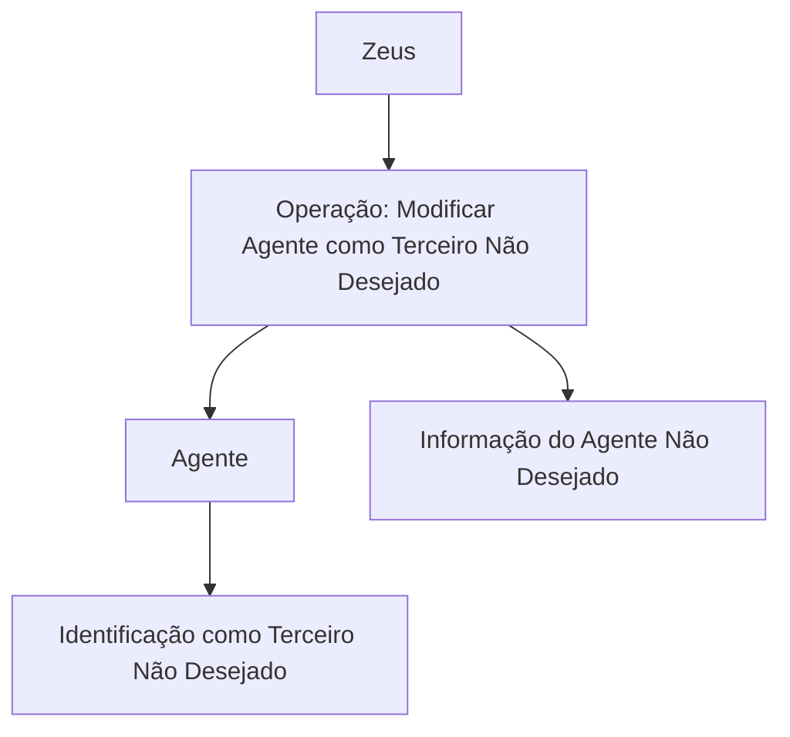

# Operação “Modificar Agente como Terceiro Não Desejado” — Referência Funcional Zeus

## 1. Metadados do Documento
- **Arquivo de Origem:** Não identificado
- **Tipo de Documento:** Procedimento
- **Domínio / Sistema:** Zeus / Soluciones APIs
- **Público-Alvo:** Operação, Negócio e usuários das APIs
- **Data/Versão Identificada:** Não identificada

---

## 2. Resumo Executivo & Contexto de Negócio

O conteúdo descreve a operação **“Modificar Agente como Terceiro Não Desejado”**. A finalidade declarada é alterar as informações de um agente pelas quais esse agente é identificado como **Terceiro Não Desejado**.

A operação está apresentada no contexto de uma interface ou portal denominado **Zeus**, com elementos de navegação que incluem “Inicio”, “Soluciones”, “APIs”, “Documentación”, “Zeus”, “ES” e “RS”.

O material não apresenta regras de validação, campos editáveis, contratos de API, métodos HTTP, autenticação, persistência de dados ou critérios de sucesso da alteração. Portanto, o escopo comprovadamente documentado limita-se à capacidade de modificar informações identificadoras do Agente como Terceiro Não Desejado.

---

## 3. Arquitetura, Componentes & Tecnologias Envolvidas

Os componentes explicitamente identificados são:

| Componente | Papel identificado no conteúdo |
| :--- | :--- |
| Zeus | Contexto de navegação ou sistema no qual a operação é apresentada |
| Soluciones | Item de navegação exibido |
| APIs | Item de navegação exibido |
| Documentación | Item de navegação exibido |
| Operação “Modificar Agente como Terceiro Não Desejado” | Função destinada a modificar informações de identificação do agente como Terceiro Não Desejado |
| Agente | Entidade cuja informação é modificada |
| Terceiro Não Desejado | Classificação pela qual o Agente é identificado |



> **Nota de Análise:** O conteúdo não detalha a arquitetura técnica, serviços, bancos de dados, integrações, endpoints, protocolos ou tecnologias de implementação da operação.

---

## 4. Regras de Negócio, Especificações Funcionais & Processos

### Objetivo funcional identificado

A operação permite modificar a informação do Agente utilizada para identificar esse Agente como **Terceiro Não Desejado**.

### Processo explicitamente sustentado

1. A operação é denominada **“Modificar Agente como Terceiro Não Desejado”**.
2. A operação incide sobre a **informação do Agente Não Desejado**.
3. A finalidade da modificação é alterar a informação pela qual o Agente é identificado como **Terceiro Não Desejado**.

### Restrições de evidência documental

O conteúdo não informa:

- Quais campos compõem a informação do Agente Não Desejado.
- Quais valores podem ser modificados.
- Quais validações são aplicadas antes da alteração.
- Quais perfis ou permissões podem executar a operação.
- Quais são os efeitos da modificação sobre outros sistemas ou processos.
- Se existe confirmação, auditoria, versionamento ou reversão da alteração.
- Quais APIs, métodos HTTP ou contratos JSON suportam a operação.

---

## 5. Tabelas de Parâmetros, Ambientes e Estruturas de Dados

| Item / Parâmetro | Descrição / Função | Tipo / Valores / Formato | Ambiente / Observações |
| :--- | :--- | :--- | :--- |
| Operação | Modificar Agente como Terceiro Não Desejado | Operação funcional | Exibida no contexto Zeus |
| Agente | Entidade cuja informação é modificada | Entidade de negócio | Não há estrutura de dados detalhada |
| Terceiro Não Desejado | Classificação associada ao Agente | Classificação de negócio | Critérios de classificação não detalhados |
| Informação do Agente Não Desejado | Informação alterada pela operação | Não especificado | Campos e formato não identificados |
| Zeus | Sistema ou contexto de navegação | Sistema / portal | Tecnologia e ambiente não identificados |
| Idioma “ES” | Elemento exibido na navegação | Código de idioma | O documento contém texto em espanhol |
| “RS” | Elemento exibido na interface | Não especificado | Significado não detalhado |

---

## 6. Bateria de Perguntas & Respostas para RAG (FAQ Sintético)

### P1: Qual é o objetivo da operação “Modificar Agente como Terceiro Não Desejado”?
**R:** A operação permite modificar a informação do Agente pela qual o Agente é identificado como Terceiro Não Desejado.

### P2: Qual entidade é afetada pela operação documentada?
**R:** A entidade afetada é o Agente. O conteúdo informa que a operação modifica informações associadas à identificação do Agente como Terceiro Não Desejado.

### P3: A operação cria ou remove um Agente Não Desejado?
**R:** Não há evidência de criação ou remoção. O conteúdo declara exclusivamente que a operação permite modificar a informação de identificação do Agente como Terceiro Não Desejado.

### P4: Quais campos do Agente podem ser alterados?
**R:** O conteúdo não especifica quais campos compõem a informação do Agente Não Desejado nem quais campos podem ser modificados.

### P5: O documento informa quais validações são aplicadas na modificação?
**R:** Não. Não são apresentados critérios de validação, regras de consistência, valores permitidos ou condições de rejeição da alteração.

### P6: A operação está associada a qual sistema ou contexto?
**R:** A operação é apresentada no contexto de Zeus, com itens de navegação como Inicio, Soluciones, APIs e Documentación.

### P7: O documento especifica uma API ou endpoint para modificar o Agente?
**R:** Não. Apesar de “APIs” aparecer como item de navegação, o conteúdo não fornece endpoint, método HTTP, parâmetros de requisição, resposta, autenticação ou contrato JSON.

### P8: Quem possui permissão para modificar um Agente como Terceiro Não Desejado?
**R:** O conteúdo não identifica perfis, papéis, matrizes de permissão ou regras de autorização para executar a operação.

### P9: Existe rastreabilidade ou auditoria para a alteração do Agente?
**R:** O conteúdo não descreve logs, trilhas de auditoria, histórico de alterações ou mecanismos de reversão.

### P10: Qual informação é efetivamente alterada pela operação?
**R:** É alterada a informação pela qual o Agente é identificado como Terceiro Não Desejado. O documento não detalha a estrutura ou os atributos dessa informação.

---

## 7. Glossário de Termos, Siglas & Conceitos-Chave

- **Agente:** Entidade de negócio cuja informação pode ser modificada.
- **Terceiro Não Desejado:** Classificação atribuída ao Agente, conforme a terminologia usada no conteúdo.
- **Informação do Agente Não Desejado:** Informação pela qual o Agente é identificado como Terceiro Não Desejado.
- **Zeus:** Sistema ou contexto de navegação mencionado no conteúdo.
- **APIs:** Item de navegação exibido; o conteúdo não detalha interfaces de programação associadas.
- **ES:** Código exibido na interface; o significado não é explicitamente definido, embora o conteúdo esteja em espanhol.
- **RS:** Sigla ou item exibido na interface; o significado não é detalhado.

---

## 8. Notas Críticas, Riscos & Limitações

- O material é extremamente resumido e não detalha a implementação técnica da operação.
- Não há definição dos campos que identificam o Agente como Terceiro Não Desejado.
- Não há especificação de validações, permissões, auditoria, erros, integrações ou impactos da alteração.
- Não são apresentados contratos de API, URLs, ambientes, métodos HTTP, autenticação ou estruturas JSON.
- **Nota de Análise:** O documento lista a operação “Modificar Agente como Terceiro Não Desejado”, porém não detalha os atributos modificáveis, os critérios de classificação ou o fluxo técnico de persistência da alteração.

---

## 9. Conteúdo Bruto Estruturado (Referência Fiel)

```text
--- [PÁGINA 1 DE 1] ---

OPERACIÓN MODIFICAR Agente como Tercero
no Deseado
¿En que consiste?
Esta operación permite Modificar la información del Agente por la que se le identifica como Tercero
No Deseado.
Información del Agente No Deseado
 MODIFICAR Agente No Deseado (  )
 / 
 RS
Inicio Soluciones APIs Documentación Zeus
ES
```
