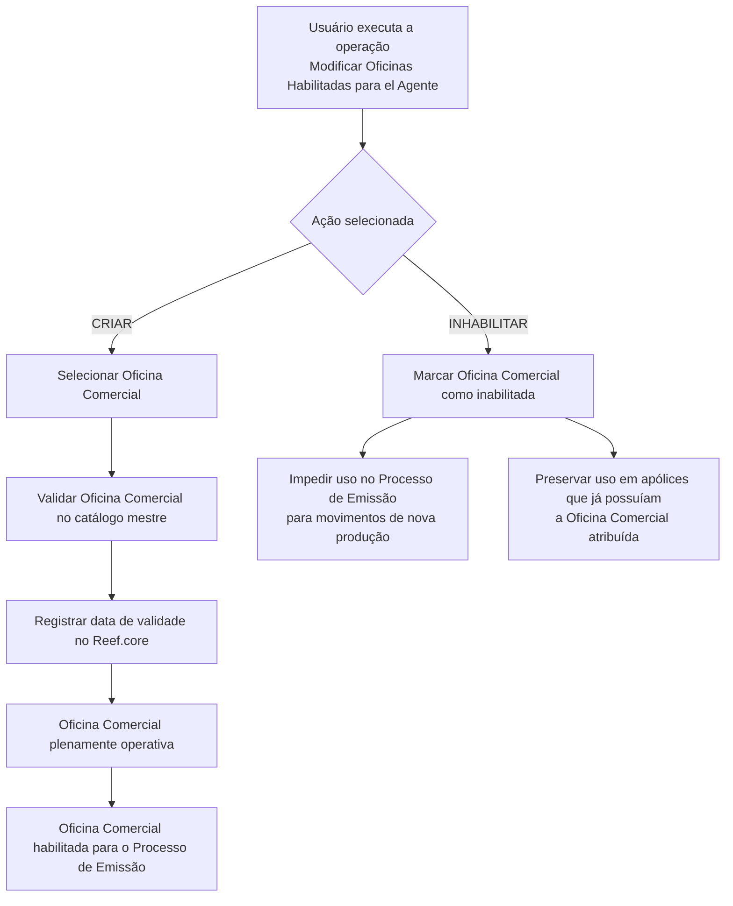

# Gestão de Oficinas Comerciais Habilitadas para Agentes no Reef.core

## 1. Metadados do Documento
- **Arquivo de Origem:** Não identificado no conteúdo fornecido
- **Tipo de Documento:** Procedimento funcional
- **Domínio / Sistema:** Reef.core; processo de emissão; estrutura comercial
- **Público-Alvo:** Operação, negócio e usuários responsáveis pela gestão de agentes
- **Data/Versão Identificada:** Não identificada

---

## 2. Resumo Executivo & Contexto de Negócio

O documento descreve a operação **“Modificar Oficinas Habilitadas para el Agente”**, destinada à administração das Oficinas Comerciais associadas a um Agente. A operação permite criar novas Oficinas Comerciais Complementares e inabilitar Oficinas Comerciais previamente habilitadas.

A associação entre Agente e Oficina Comercial é orientada por um catálogo mestre de Oficinas Comerciais, definido na estrutura comercial da Companhia. Portanto, a escolha de uma Oficina Comercial deve respeitar os valores existentes nesse catálogo mestre.

A data de validade registrada no Reef.core determina a partir de quando uma Oficina Comercial associada ao Agente fica plenamente operacional. A partir dessa data, a Oficina Comercial torna-se habilitada para utilização no Processo de Emissão.

A inabilitação restringe o uso da Oficina Comercial no Processo de Emissão para movimentos de nova produção. Contudo, a inabilitação não altera a utilização da Oficina Comercial em apólices que já possuíam essa Oficina Comercial previamente atribuída.

---

## 3. Arquitetura, Componentes & Tecnologias Envolvidas

### Componentes e conceitos identificados

| Componente / Conceito | Papel descrito |
| :--- | :--- |
| Agente | Entidade que pode possuir Oficinas Comerciais associadas e habilitadas. |
| Oficina Comercial | Unidade comercial que pode ser associada ao Agente, habilitada, tornada operacional ou inabilitada. |
| Catálogo mestre de Oficinas Comerciais | Fonte de valores válidos para a seleção de Oficinas Comerciais associadas ao Agente. |
| Estrutura comercial da Companhia | Contexto no qual o catálogo mestre de Oficinas Comerciais é definido. |
| Reef.core | Sistema no qual é registrada a data a partir da qual a Oficina Comercial associada ao Agente fica plenamente operativa. |
| Processo de Emissão | Processo que pode utilizar Oficinas Comerciais habilitadas; sofre restrição para nova produção quando uma Oficina Comercial é inabilitada. |
| Nova produção | Movimentos do Processo de Emissão para os quais uma Oficina Comercial inabilitada não pode ser utilizada. |
| Apólices previamente atribuídas | Apólices que mantêm o uso da Oficina Comercial inabilitada caso já a possuíssem atribuída. |



> **Nota de Análise:** O conteúdo não detalha telas, métodos HTTP, contratos JSON, banco de dados, integrações técnicas, perfis de acesso nem o formato da data de validade no Reef.core.

---

## 4. Regras de Negócio, Especificações Funcionais & Processos

### Operação disponível

A operação **Modificar Oficinas Habilitadas para el Agente** possui duas ações possíveis:

1. **CRIAR**
   - Permite criar novas Oficinas Comerciais Complementares para o Agente.
   - A Oficina Comercial selecionada deve pertencer ao catálogo mestre de Oficinas Comerciais.
   - O catálogo mestre é definido na estrutura comercial da Companhia.
   - A data de validade registrada no Reef.core indica quando a Oficina Comercial associada ao Agente se torna plenamente operativa.
   - Após a data de validade, a Oficina Comercial fica habilitada para utilização no Processo de Emissão.

2. **INHABILITAR**
   - Permite inabilitar uma Oficina Comercial que o Agente já possuía habilitada.
   - Uma Oficina Comercial inabilitada deixa de poder ser utilizada no Processo de Emissão para movimentos de nova produção.
   - A inabilitação não remove nem invalida a Oficina Comercial em apólices que já a tinham previamente atribuída.

### Sequência de captura de dados

O documento indica que, no bloco **“Datos Agente Oficinas Habilitadas”**, os atributos devem ser capturados na sequência apresentada, da esquerda para a direita e de cima para baixo. Os campos identificados são:

1. Oficina Comercial.
2. Fecha de Validez.
3. Inhabilitación.

### Restrições funcionais

- A Oficina Comercial associada ao Agente deve ser uma das Oficinas Comerciais existentes no catálogo mestre.
- A habilitação para o Processo de Emissão depende da data de validade registrada no Reef.core.
- A inabilitação afeta exclusivamente movimentos de nova produção.
- Apólices com atribuição prévia da Oficina Comercial permanecem respeitadas após a inabilitação.

---

## 5. Tabelas de Parâmetros, Ambientes e Estruturas de Dados

| Item / Parâmetro | Descrição / Função | Tipo / Valores / Formato | Ambiente / Observações |
| :--- | :--- | :--- | :--- |
| Ação | Define a operação a ser executada para as Oficinas Comerciais do Agente. | `CRIAR` ou `INHABILITAR` | O documento apresenta as duas ações como possíveis. |
| Oficina Comercial | Identifica uma Oficina Comercial que pode ser associada ao Agente. | Valor existente no catálogo mestre de Oficinas Comerciais | O catálogo mestre é definido na estrutura comercial da Companhia. |
| Fecha de Validez | Determina a data a partir da qual a Oficina Comercial associada ao Agente fica plenamente operativa. | Data; formato não especificado | O valor é registrado no Reef.core e habilita o uso no Processo de Emissão a partir da data. |
| Inhabilitación | Marca que a Oficina Comercial associada ao Agente está inabilitada no Sistema. | Indicador; valores/formato não especificados | Impede uso no Processo de Emissão para nova produção. |
| Reef.core | Sistema citado como repositório da data de validade da associação entre Oficina Comercial e Agente. | Sistema | Não há detalhamento de versão, URLs, integrações ou interfaces. |
| Processo de Emissão | Processo no qual Oficinas Comerciais habilitadas podem ser utilizadas. | Processo corporativo | A inabilitação impede uso somente em movimentos de nova produção. |
| Nova produção | Movimentos do Processo de Emissão afetados pela inabilitação. | Categoria de movimento | O documento não fornece definição adicional. |
| Apólices previamente atribuídas | Apólices que já tinham uma Oficina Comercial atribuída antes da inabilitação. | Apólices | Continuam respeitando a atribuição anterior da Oficina Comercial. |

---

## 6. Bateria de Perguntas & Respostas para RAG (FAQ Sintético)

### P1: Qual é o objetivo da operação “Modificar Oficinas Habilitadas para el Agente”?
**R:** A operação permite criar novas Oficinas Comerciais Complementares para um Agente e inabilitar Oficinas Comerciais que já estavam previamente habilitadas para esse Agente.

### P2: Quais ações estão disponíveis na gestão de Oficinas Habilitadas para o Agente?
**R:** O documento apresenta duas ações: `CRIAR`, para criar novas Oficinas Comerciais Complementares, e `INHABILITAR`, para inabilitar Oficinas Comerciais que o Agente possuía anteriormente habilitadas.

### P3: De onde deve ser selecionada uma Oficina Comercial para associação a um Agente?
**R:** A Oficina Comercial deve ser selecionada entre os valores existentes no catálogo mestre de Oficinas Comerciais definido na estrutura comercial da Companhia.

### P4: O que representa a data de validade da Oficina Comercial no Reef.core?
**R:** A data de validade representa a data a partir da qual a Oficina Comercial associada ao Agente está plenamente operativa e, consequentemente, habilitada para uso no Processo de Emissão.

### P5: Uma Oficina Comercial pode ser usada no Processo de Emissão antes da data de validade?
**R:** O documento informa que a Oficina Comercial fica plenamente operativa e habilitada para uso no Processo de Emissão a partir da data de validade registrada no Reef.core. Não há detalhamento adicional sobre comportamento anterior a essa data.

### P6: O que acontece quando uma Oficina Comercial é marcada como inabilitada?
**R:** A Oficina Comercial associada ao Agente fica inabilitada no Sistema e deixa de poder ser utilizada no Processo de Emissão para movimentos de nova produção.

### P7: A inabilitação de uma Oficina Comercial afeta apólices já existentes?
**R:** Não para as apólices que já possuíam a Oficina Comercial previamente atribuída. O documento estabelece que essas atribuições preexistentes devem ser respeitadas.

### P8: Qual parte do Processo de Emissão é afetada pela inabilitação de uma Oficina Comercial?
**R:** A inabilitação afeta os movimentos de nova produção no Processo de Emissão. O documento não informa impacto sobre outros tipos de movimento.

### P9: Quais campos são identificados no bloco “Datos Agente Oficinas Habilitadas”?
**R:** Os campos identificados são `Oficina Comercial`, `Fecha de Validez` e `Inhabilitación`. O documento determina que a sequência de captura segue a ordem da esquerda para a direita e de cima para baixo.

### P10: O documento especifica o formato da data de validade ou os valores do indicador de inabilitação?
**R:** Não. O documento identifica os campos `Fecha de Validez` e `Inhabilitación`, mas não especifica formato de data, valores permitidos, tipo técnico ou regras adicionais de preenchimento.

---

## 7. Glossário de Termos, Siglas & Conceitos-Chave

- **Agente:** Entidade que pode ter Oficinas Comerciais associadas e habilitadas.
- **Catálogo mestre de Oficinas Comerciais:** Relação de valores de Oficinas Comerciais definidas na estrutura comercial da Companhia.
- **Fecha de Validez:** Campo que informa a data a partir da qual a Oficina Comercial associada ao Agente fica plenamente operativa.
- **Inhabilitación:** Campo que marca que a Oficina Comercial associada ao Agente está inabilitada no Sistema.
- **Nova produção:** Movimentos do Processo de Emissão para os quais uma Oficina Comercial inabilitada não pode ser utilizada.
- **Oficina Comercial:** Entidade comercial que pode ser associada a um Agente, habilitada para emissão ou inabilitada.
- **Processo de Emissão:** Processo que utiliza Oficinas Comerciais habilitadas e restringe o uso de Oficinas inabilitadas para nova produção.
- **Reef.core:** Sistema citado como contendo a data de validade da associação entre Oficina Comercial e Agente.

---

## 8. Notas Críticas, Riscos & Limitações

- O documento não identifica o arquivo de origem, autor, data, versão ou histórico de alterações.
- Não há detalhamento sobre permissões, perfis autorizados ou aprovação necessária para criar ou inabilitar Oficinas Comerciais.
- Não são descritos os critérios para impedir duplicidade de associação entre Agente e Oficina Comercial.
- Não há definição do formato da `Fecha de Validez`, incluindo fuso horário, granularidade ou validação de datas passadas/futuras.
- O campo `Inhabilitación` é mencionado, mas os valores aceitos e o comportamento técnico do indicador não são especificados.
- O documento não descreve reversão de inabilitação, exclusão de associação ou alteração de data de validade.
- Não são fornecidos contratos de integração, APIs, URLs, logs, bancos de dados ou mecanismos de auditoria.
- **Nota de Análise:** O comportamento preserva apólices previamente atribuídas, mas o documento não detalha como essa preservação é implementada no Reef.core ou no Processo de Emissão.

---

## 9. Conteúdo Bruto Estruturado (Referência Fiel)

```text
--- [PÁGINA 1 DE 2] ---

MODIFICAR Oficinas Habilitadas para el Agente
Objetivo
Esta Operación permite Crear nuevas Oficinas Comerciales Complementarias además de Inhabilitar
aquellas Oficinas que tuviera previamente habilitadas el Agente.
Posibles Acciones
 CREAR ( )  INHABILITAR ( )
Datos Oficinas Habilitadas
Datos Agente Oficinas Habilitadas
De Izquierda a Derecha y de Arriba hacia Abajo, los siguientes atributos marcan la secuencia de
captura en este Bloque de Información.
Oficina Comercial (  )
Este Campo contendrá una de las Oficinas Comerciales que el Agente puede tener asociadas, de
acuerdo con la relación de valores existentes en el catálogo maestro de Oficinas Comerciales
definidas en la estructura comercial de la Compañía.
Fecha de Validez ( )
 /
 RS
Inicio Soluciones APIs Documentación Zeus
ES


--- [PÁGINA 2 DE 2] ---

El valor de este campo en Reef.core contiene la fecha a partir de la cual la Oficina asociada al
Agente está plenamente operativa y se habilita por tanto su uso en el Proceso de Emisión.
Inhabilitación (  )
Este Campo marca que la Oficina Comercial asociada al Agente está inhabilitada en el Sistema y por
tanto se inhabilita su uso en el Proceso de Emisión para los movimientos de nueva producción
(respetándose en cambio en aquellas pólizas que la tuvieran previamente asignada).
```
