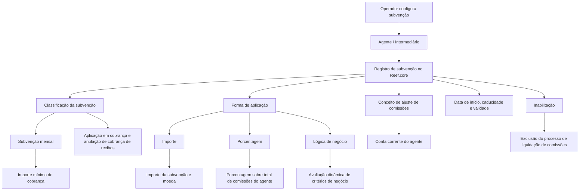

# Gestão de Subvenções Habilitadas para Agentes no Reef.core

## 1. Metadados do Documento
- **Arquivo de Origem:** Não identificado; conteúdo bruto fornecido pelo solicitante
- **Tipo de Documento:** Manual Operacional
- **Domínio / Sistema:** Reef.core — subvenções, agentes, comissões e cobrança de recibos
- **Público-Alvo:** Operação, negócio e equipes responsáveis pela configuração de subvenções de agentes
- **Data/Versão Identificada:** Não identificada

---

## 2. Resumo Executivo & Contexto de Negócio

O documento descreve a operação **“Modificar Subvenciones Habilitadas para el Agente”**, destinada a administrar subvenções concedidas a agentes pela entidade seguradora. A operação permite criar novas subvenções associadas à comercialização e/ou à cobrança dos recibos das apólices, bem como modificar ou inabilitar subvenções previamente habilitadas para um agente.

A configuração da subvenção é identificada pelo código do agente intermediário e contém atributos que determinam a classificação, a forma de aplicação, o conceito de ajuste de comissões, o período de concessão e os valores ou regras aplicáveis. As classificações corporativas indicadas no Reef.core são **subvenção mensal** e **aplicação na cobrança e anulação de cobrança dos recibos**.

A forma de aplicação define como o benefício será calculado: por **importe**, **porcentagem** ou por uma **lógica de negócio** executada dinamicamente. Cada alternativa possui atributos condicionais próprios, evitando que campos como valor, percentual, valor mínimo de cobrança ou lógica dinâmica sejam aplicados fora do contexto configurado.

A operação também preserva rastreabilidade histórica por meio da **Fecha de Validez**, que determina a partir de quando uma subvenção fica disponível para os processos do sistema. A inabilitação impede que a subvenção seja utilizada no processo de liquidação de comissões estabelecido pela entidade seguradora.

---

## 3. Arquitetura, Componentes & Tecnologias Envolvidas

Os componentes e termos explicitamente citados são:

| Componente / Termo | Papel identificado no documento |
| :--- | :--- |
| **Reef.core** | Sistema no qual valores corporativos de classificação e forma de aplicação da subvenção são configurados; recebe a indicação de inabilitação da subvenção. |
| **Agente / Intermediário** | Entidade para a qual a subvenção é criada, modificada ou inabilitada. |
| **Entidade seguradora** | Concede a subvenção e define critérios de negócio aplicáveis. |
| **Conta corrente do agente** | Local onde o conceito de ajuste de comissões identifica especificamente a subvenção concedida. |
| **Processo de liquidação de comissões** | Processo que deixa de utilizar uma subvenção quando o registro está inabilitado. |
| **Processos de cobrança e anulação de cobrança de recibos** | Processos relacionados à classificação de subvenção aplicável à cobrança e anulação de cobrança. |
| **Zeus** | Termo exibido na linha de navegação do conteúdo bruto; o documento não detalha sua função ou relação técnica com Reef.core. |



> **Nota de Análise:** O documento descreve regras funcionais e atributos de tela, mas não especifica interfaces, métodos HTTP, contratos JSON, persistência, microsserviços, versões tecnológicas ou mecanismos de integração.

---

## 4. Regras de Negócio, Especificações Funcionais & Processos

### 4.1 Ações permitidas

A operação permite as seguintes ações sobre subvenções habilitadas para o agente:

1. **Criar:** criar novas subvenções para agentes pela comercialização e/ou cobrança dos recibos das apólices.
2. **Modificar:** alterar subvenções que já estavam habilitadas para o agente.
3. **Inabilitar:** marcar como inabilitada uma subvenção previamente habilitada.

### 4.2 Sequência de captura

O documento estabelece que os atributos da tela devem ser percorridos **da esquerda para a direita e de cima para baixo**. Essa sequência representa a ordem de captura das informações da subvenção.

### 4.3 Identificação do agente

- O **Código do Agente** apresenta a chave do intermediário para o qual a entidade seguradora cria, modifica ou inabilita a subvenção.
- O documento trata os termos **agente** e **intermediário** no contexto da identificação do destinatário da subvenção.

### 4.4 Classificação da subvenção

A classificação da subvenção é visualizada conforme valores configurados corporativamente no Reef.core:

1. **SUBVENCIÓN MENSUAL:** classificação associada a uma subvenção mensal.
2. **APLICACIÓN EN EL COBRO Y ANULADO DE COBRO DE LOS RECIBOS:** classificação associada à cobrança e à anulação de cobrança dos recibos.

### 4.5 Forma de aplicação da subvenção

A forma de aplicação determina como a subvenção concedida será aplicada. Os valores corporativos possíveis no Reef.core são:

1. **IMPORTE:** a subvenção é aplicada como um valor monetário, de acordo com a moeda definida.
2. **PORCENTAJE:** a subvenção é aplicada como percentual.
3. **LÓGICA DE NEGOCIO:** o importe ou percentual é obtido pela execução de lógica de negócio.

### 4.6 Conceito de ajuste de comissões

- O **Código del concepto de ajuste** identifica o conceito de ajuste de comissões.
- Esse conceito identifica especificamente, na conta corrente do agente, a subvenção concedida.
- A agrupação contábil do conceito de ajuste deve ser do tipo **MP**.

### 4.7 Vigência da concessão

- **Fecha inicio concesión Subvención:** apresenta a data a partir da qual a subvenção é concedida ao agente.
- **Fecha caducidad concesión Subvención:** apresenta a data de caducidade da subvenção concedida.
- **Fecha de Validez:** apresenta a data a partir da qual a subvenção fica disponível no sistema para ser considerada nos processos aplicáveis. O uso correto dessa data permite manter histórico das alterações realizadas nas definições de subvenções.

### 4.8 Regras condicionais por forma de aplicação

| Condição | Atributo aplicável | Regra extraída |
| :--- | :--- | :--- |
| A forma de aplicação é **IMPORTE** | Importe de la subvención | Identifica o importe da subvenção concedida ao agente. |
| A forma de aplicação é **IMPORTE** | Moneda | Identifica o código da moeda para a qual a subvenção é concedida. |
| A forma de aplicação é **PORCENTAJE** | Porcentaje de la subvención | Identifica a porcentagem aplicada sobre o total das comissões do agente. |
| A forma de aplicação é **LÓGICA DE NEGOCIO** | Lógica de negocio para obtener el importe o porcentaje de la subvención | Permite avaliar dinamicamente critérios de negócio definidos pela entidade seguradora para obter o importe ou a porcentagem aplicável. |

### 4.9 Regra condicional por classificação

| Condição | Atributo aplicável | Regra extraída |
| :--- | :--- | :--- |
| A classificação é **SUBVENCIÓN MENSUAL** | Importe mínimo cobranza | Determina o importe mínimo que o agente precisa cobrar para receber a subvenção mensal. |

### 4.10 Inabilitação

- O atributo **Inhabilitación** informa ao Reef.core que o registro identificador da subvenção está inabilitado.
- Um registro inabilitado não pode ser utilizado no processo de liquidação de comissões definido pela entidade seguradora.

---

## 5. Tabelas de Parâmetros, Ambientes e Estruturas de Dados

| Item / Parâmetro | Descrição / Função | Tipo / Valores / Formato | Ambiente / Observações |
| :--- | :--- | :--- | :--- |
| Código del Agente | Mostra a chave do intermediário para o qual a subvenção é criada, modificada ou inabilitada. | Código / chave de intermediário; formato não detalhado. | Aplicável à operação de gestão de subvenções. |
| Clasificación de la subvención | Visualiza a classificação da subvenção concedida. | `SUBVENCIÓN MENSUAL`; `APLICACIÓN EN EL COBRO Y ANULADO DE COBRO DE LOS RECIBOS`. | Valores configurados corporativamente no Reef.core. |
| Forma de aplicación de la subvención | Determina como a subvenção concedida será aplicada. | `IMPORTE`; `PORCENTAJE`; `LÓGICA DE NEGOCIO`. | Valores configurados corporativamente no Reef.core. |
| Código del concepto de ajuste | Identifica o conceito de ajuste de comissões que representará a subvenção na conta corrente do agente. | Código; formato não detalhado. | A agrupação contábil deve ser do tipo `MP`. |
| Fecha inicio concesión Subvención | Mostra a data a partir da qual a subvenção é concedida ao agente. | Data; formato não detalhado. | Define o início da concessão. |
| Fecha caducidad concesión Subvención | Mostra a data de caducidade da subvenção concedida. | Data; formato não detalhado. | Define a caducidade da concessão. |
| Importe de la subvención | Identifica o valor da subvenção concedida ao agente. | Importe monetário; formato não detalhado. | Aplicável somente quando a forma de aplicação for `IMPORTE`. |
| Moneda | Identifica o código da moeda da subvenção. | Código de moeda; formato não detalhado. | Associado à aplicação por `IMPORTE`. |
| Importe mínimo cobranza | Define o importe mínimo que o agente deve cobrar para perceber a subvenção mensal. | Importe monetário; formato não detalhado. | Aplicável somente à classificação `SUBVENCIÓN MENSUAL`. |
| Lógica de negocio para obtener el importe o porcentaje de la subvención | Avalia dinamicamente critérios de negócio para determinar o importe ou percentual aplicável. | Lógica de negócio; mecanismo técnico não detalhado. | Aplicável somente quando a forma de aplicação for `LÓGICA DE NEGOCIO`. |
| Porcentaje de la subvención | Identifica o percentual aplicado sobre o total das comissões do agente. | Percentual; formato não detalhado. | Aplicável somente quando a forma de aplicação for `PORCENTAJE`. |
| Inhabilitación | Indica ao Reef.core que o registro de subvenção está inabilitado. | Indicador; valores/formato não detalhados. | Impede uso no processo de liquidação de comissões. |
| Fecha de Validez | Mostra a data a partir da qual a subvenção fica disponível para consideração pelos processos aplicáveis. | Data; formato não detalhado. | Permite histórico de alterações nas definições de subvenções. |

> **Nota de Análise:** O documento não informa URLs, servidores, portas, credenciais, ambientes de desenvolvimento/homologação/produção, estruturas de banco de dados ou formatos dos campos.

---

## 6. Bateria de Perguntas & Respostas para RAG (FAQ Sintético)

### P1: Quais ações podem ser realizadas na operação de subvenções habilitadas para agentes?
**R:** A operação permite criar novas subvenções para agentes, modificar subvenções previamente habilitadas e inabilitar subvenções existentes. As subvenções estão relacionadas à comercialização e/ou à cobrança dos recibos das apólices.

### P2: Como o agente destinatário de uma subvenção é identificado?
**R:** O agente é identificado pelo atributo **Código del Agente**, que mostra a chave do intermediário para o qual a entidade seguradora cria, modifica ou inabilita a subvenção.

### P3: Quais classificações de subvenção são configuradas corporativamente no Reef.core?
**R:** O documento identifica duas classificações configuradas corporativamente no Reef.core: **SUBVENCIÓN MENSUAL** e **APLICACIÓN EN EL COBRO Y ANULADO DE COBRO DE LOS RECIBOS**.

### P4: Quais formas de aplicação de subvenção existem no Reef.core?
**R:** As formas de aplicação são **IMPORTE**, quando a subvenção é aplicada como valor de acordo com a moeda definida; **PORCENTAJE**, quando é aplicada como percentual; e **LÓGICA DE NEGOCIO**, quando o importe ou percentual é obtido mediante execução de lógica de negócio.

### P5: Quando o campo “Importe de la subvención” deve ser utilizado?
**R:** O campo **Importe de la subvención** deve ser utilizado somente quando a forma de aplicação da subvenção determina que a subvenção será aplicada como **IMPORTE**. Nesse caso, o campo identifica o valor da subvenção concedida ao agente.

### P6: Para que serve o campo “Importe mínimo cobranza”?
**R:** O campo **Importe mínimo cobranza** determina o valor mínimo que o agente precisa cobrar para receber uma subvenção mensal. Esse atributo é aplicável somente quando a classificação da subvenção indica **SUBVENCIÓN MENSUAL**.

### P7: Como é utilizado o percentual de uma subvenção?
**R:** Quando a forma de aplicação é **PORCENTAJE**, o atributo **Porcentaje de la subvención** identifica a porcentagem que será aplicada sobre o total das comissões do agente.

### P8: Qual é a função da lógica de negócio para obter o importe ou percentual da subvenção?
**R:** Quando a forma de aplicação é **LÓGICA DE NEGOCIO**, esse atributo permite avaliar dinamicamente os critérios de negócio definidos pela entidade seguradora para obter o importe ou a porcentagem de subvenção a aplicar.

### P9: Qual regra deve ser obedecida pelo conceito de ajuste de comissões?
**R:** O código do conceito de ajuste identifica a subvenção na conta corrente do agente. A agrupação contábil desse conceito de ajuste deve obrigatoriamente ser do tipo **MP**.

### P10: O que acontece quando uma subvenção é inabilitada?
**R:** A inabilitação informa ao Reef.core que o registro que identifica a subvenção não está habilitado para uso. Como consequência, a subvenção não pode ser utilizada no processo de liquidação de comissões estabelecido pela entidade seguradora.

### P11: Qual é a diferença entre a data de início da concessão e a data de validade?
**R:** A **Fecha inicio concesión Subvención** mostra a data desde a qual a subvenção é concedida ao agente. A **Fecha de Validez** mostra a data a partir da qual a subvenção fica disponível no sistema para ser considerada pelos processos correspondentes e permite manter o histórico das mudanças realizadas nas definições de subvenção.

### P12: O documento especifica contratos técnicos ou APIs para a operação de subvenções?
**R:** Não. O documento descreve atributos funcionais e regras de uso da operação, mas não detalha métodos HTTP, contratos JSON, endpoints, microsserviços, esquemas de banco de dados ou tecnologias de integração.

---

## 7. Glossário de Termos, Siglas & Conceitos-Chave

- **Agente:** destinatário da subvenção concedida pela entidade seguradora.
- **Intermediário:** entidade identificada pelo código do agente para a qual a subvenção é criada, modificada ou inabilitada.
- **Reef.core:** sistema em que são configurados corporativamente os valores de classificação e forma de aplicação da subvenção.
- **Subvenção:** benefício concedido ao agente pela comercialização e/ou cobrança de recibos de apólices.
- **Recibo:** elemento associado aos processos de cobrança e anulação de cobrança mencionados na classificação da subvenção.
- **Comissões:** valores do agente sobre os quais uma subvenção percentual pode ser aplicada.
- **Liquidação de comissões:** processo da entidade seguradora que não deve utilizar registros de subvenções inabilitados.
- **Conceito de ajuste:** código que identifica especificamente a subvenção concedida na conta corrente do agente.
- **MP:** tipo obrigatório de agrupação contábil do conceito de ajuste.
- **IMPORTE:** forma de aplicação da subvenção como valor monetário, conforme a moeda definida.
- **PORCENTAJE:** forma de aplicação da subvenção como percentual sobre o total das comissões do agente.
- **LÓGICA DE NEGOCIO:** forma de aplicação que determina dinamicamente o importe ou percentual por critérios de negócio.
- **Fecha de Validez:** data a partir da qual a subvenção está disponível no sistema para os processos que devem considerá-la.
- **Zeus:** termo apresentado na navegação do conteúdo bruto; não possui definição funcional ou técnica adicional no documento.

---

## 8. Notas Críticas, Riscos & Limitações

- O documento não apresenta detalhamento técnico sobre APIs, integrações, contratos, banco de dados, autenticação, autorização, logs, servidores, URLs ou ambientes.
- Os formatos de código do agente, código de moeda, código de conceito de ajuste, datas, importes e percentuais não são especificados.
- A documentação não informa se as ações de criar, modificar e inabilitar possuem validações adicionais, aprovações, perfis de acesso ou trilha de auditoria.
- A inabilitação possui impacto operacional explícito: o registro deixa de estar disponível para o processo de liquidação de comissões.
- A configuração incorreta da classificação ou da forma de aplicação pode levar à utilização inadequada de campos condicionais, pois importe, percentual, lógica de negócio e importe mínimo de cobrança possuem aplicabilidade restrita.
- A **Fecha de Validez** é um elemento crítico para preservar o histórico de alterações das definições de subvenções.
- **Nota de Análise:** O documento menciona o Reef.core como fonte de valores configurados corporativamente, mas não detalha onde ou como tais valores são administrados.

---

## 9. Conteúdo Bruto Estruturado (Referência Fiel)

```text
--- [PÁGINA 1 DE 3] ---

MODIFICAR Subvenciones Habilitadas para el
Agente
Objetivo
Esta Operación permite Crear nuevas subvenciones a los agentes por la comercialización y/ó la
cobranza de los recibos de sus pólizas además de Modificar o Inhabilitar aquellas que tuviera el
Agente previamente habilitadas.
Posibles Acciones
 CREAR ( )  MODIFICAR ( )
 INHABILITAR ( )
Datos Subvenciones Habilitadas
De Izquierda a Derecha y de Arriba hacia Abajo, los siguientes atributos marcan la secuencia de
captura en esta pantalla de Información.
Código del Agente
 / 
 RS
Inicio Soluciones APIs Documentación Zeus
ES


--- [PÁGINA 2 DE 3] ---

Este campo muestra la clave del intermediario para el que se crea, modifica o inhabilita la subvención
concedida por la entidad aseguradora.
Clasificación de la subvención
Esta propiedad visualiza la clasificación de la subvención concedida, de acuerdo con uno de los
posibles valores configurados a nivel corporativo en Reef.core:
(1) SUBVENCIÓN MENSUAL.
(2) APLICACIÓN EN EL COBRO Y ANULADO DE COBRO DE LOS RECIBOS.
Forma de aplicación de la subvención (   )
Esta propiedad determina la forma de aplicación de la subvención concedida, de acuerdo con uno de
los posibles valores configurados a nivel corporativo en Reef.core:
(1) IMPORTE (de acuerdo a la Moneda de la definición)
(2) PORCENTAJE
(3) LÓGICA DE NEGOCIO
Código del concepto de ajuste
Muestra e identifica el código del concepto de ajuste de comisiones, que identificará específicamente
en la cuenta corriente del agente la subvención concedida.
La agrupación contable del concepto de ajuste debe ser del tipo MP.
Fecha inicio concesión Subvención
Muestra la fecha desde la que se concede la subvención al agente.
Fecha caducidad concesión Subvención
Este dato muestra la fecha de caducidad de la subvención concedida.
Importe de la subvención (  )
Siempre y cuando la forma de aplicación de la subvención determine que sea un importe, este
atributo identifica el importe de la subvención concedida al agente.
Moneda (   )
Este campo identifica el código de la moneda para la que se concede la subvención.


--- [PÁGINA 3 DE 3] ---

Importe mínimo cobranza (  )
Siempre y cuando la clasificación de la subvención indique que sea una subvención mensual, esta
propiedad determina el importe mínimo que el Agente tiene que cobrar para percibir la subvención
mensual.
Lógica de negocio para obtener el importe o porcentaje de la subvención (  )
Siempre y cuando la forma de aplicación de la subvención determine que vaya a ser obtenida
mediante la ejecución de una lógica de negocio, este atributo permite evaluar dinámicamente los
criterios de negocio que se hubieren considerado por parte de la entidad aseguradora al fin de
obtener el importe o el porcentaje de la subvención a aplicar.
Porcentaje de la subvención (  )
Siempre y cuando la forma de aplicación de la subvención determine que sea un porcentaje, esta
propiedad de la definición identifica el porcentaje de la subvención que se va a aplicar sobre el total
de las comisiones del Agente.
Inhabilitación (  )
Este campo le indica a Reef.core que el registro que identifica la subvención está inhabilitado para
poder ser utilizado en el proceso de liquidación de comisiones que tenga establecida la entidad
aseguradora.
Fecha de Validez
Este dato muestra la fecha a partir de la cual la subvención está disponible en el sistema para ser
contemplada en los procesos en los que deba ser considerada. Su correcto uso, por tanto, permite
tener un histórico de los cambios efectuados en las definiciones de las subvenciones.
```
