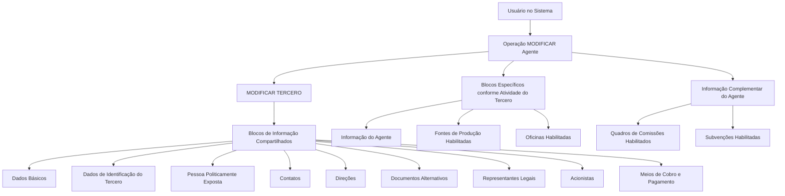

# Operação MODIFICAR Agente — Gestão de Informações de Terceiros e Agentes

## 1. Metadados do Documento
- **Arquivo de Origem:** Não identificado
- **Tipo de Documento:** Procedimento
- **Domínio / Sistema:** Operação de modificação de Agente / Tercero
- **Público-Alvo:** Operação, Negócio e usuários do sistema
- **Data/Versão Identificada:** Não identificada

---

## 2. Resumo Executivo & Contexto de Negócio

O documento descreve a operação **MODIFICAR Agente**, destinada ao complemento, à modificação e/ou à inabilitação das informações de um Agente. A operação abrange dados compartilhados do cadastro de Tercero, informações específicas vinculadas à atividade do Tercero e informações complementares do Agente.

A obrigatoriedade e a habilitação dos campos não são fixas para todos os registros. Essas condições podem variar conforme o código de atividade do Tercero e conforme o Tercero seja uma Pessoa Física ou uma Pessoa Jurídica.

O documento também informa que personalizações previamente implementadas podem alterar o comportamento da aplicação quanto à obrigatoriedade de preenchimento dos Dados do Tercero. Portanto, a validação efetiva dos campos depende tanto das características cadastrais quanto das personalizações aplicadas no sistema.

O fluxo de modificação inclui a atualização das informações do Agente, das Fontes de Produção, das Oficinas Habilitadas, dos Quadros de Comissões Habilitados e das Subvenções Habilitadas. A ordem de captura dos dados nos blocos de informação pode variar segundo o critério utilizado pelo usuário no sistema.

---

## 3. Arquitetura, Componentes & Tecnologias Envolvidas

O documento não descreve arquitetura de software, tecnologias, endpoints, bancos de dados, integrações, ambientes ou contratos técnicos. O conteúdo apresenta uma arquitetura funcional de blocos de informação dentro da operação **MODIFICAR TERCERO**, aplicada à manutenção de informações de Agente.

Componentes funcionais identificados:

- **MODIFICAR TERCERO:** conjunto de blocos de informações compartilhados.
- **Informação do Agente:** bloco específico conforme a atividade do Tercero.
- **Fontes de Produção Habilitadas:** bloco específico conforme a atividade do Tercero.
- **Oficinas Habilitadas:** bloco específico conforme a atividade do Tercero.
- **Quadros de Comissões Habilitados:** informação complementar do Agente.
- **Subvenções Habilitadas:** informação complementar do Agente.



> **Nota de Análise:** O documento não detalha telas, métodos HTTP, serviços, contratos JSON, persistência de dados ou regras técnicas de integração.

---

## 4. Regras de Negócio, Especificações Funcionais & Processos

### Escopo da operação MODIFICAR Agente

A operação **MODIFICAR Agente** permite:

1. Complementar informações do Agente.
2. Modificar informações do Agente.
3. Inabilitar informações do Agente.

### Premissas de obrigatoriedade e habilitação

1. A obrigatoriedade e/ou habilitação dos campos em cada bloco ou estrutura de informação compartilhada pode variar conforme o **código de atividade do Tercero**.
2. A obrigatoriedade e/ou habilitação dos campos pode variar quando o Tercero for:
   - Pessoa Física; ou
   - Pessoa Jurídica.
3. Personalizações implementadas podem afetar o comportamento da aplicação em relação à obrigatoriedade do registro dos Dados do Tercero.
4. A ordem de captura dos dados nos diferentes blocos de informação pode variar de acordo com o critério seguido pelo usuário no sistema.

### Processo funcional identificado

1. O usuário acessa a operação **MODIFICAR Agente**.
2. O usuário pode modificar a informação do Agente.
3. O usuário pode modificar as Fontes de Produção.
4. O usuário pode modificar as Oficinas Habilitadas.
5. O usuário pode modificar os Quadros de Comissões.
6. O usuário pode modificar as Subvenções Habilitadas.
7. A operação considera os blocos compartilhados de **MODIFICAR TERCERO**.
8. A operação considera blocos específicos conforme a atividade do Tercero.
9. A operação considera informações complementares do Agente.

> **Nota de Análise:** O documento não especifica critérios para aprovação, rejeição, persistência, auditoria, autorização de usuários ou validações individuais de cada campo.

---

## 5. Tabelas de Parâmetros, Ambientes e Estruturas de Dados

| Item / Parâmetro | Descrição / Função | Tipo / Valores / Formato | Ambiente / Observações |
| :--- | :--- | :--- | :--- |
| Operação MODIFICAR Agente | Complemento, modificação e/ou inabilitação da informação do Agente | Operação funcional | Não há ambiente identificado |
| Código de atividade do Tercero | Pode determinar a obrigatoriedade e/ou habilitação dos campos | Código de atividade | Aplicável a blocos ou estruturas de informação compartilhadas |
| Tipo de Tercero | Pode alterar a obrigatoriedade e/ou habilitação dos campos | Pessoa Física ou Pessoa Jurídica | Regra aplicável aos dados do Tercero |
| Personalizações | Podem afetar a obrigatoriedade do registro dos Dados do Tercero | Personalizações implementadas | Não há detalhamento das personalizações |
| Ordem de captura | Pode variar nos diferentes blocos de informação | Critério definido pelo usuário no sistema | Não há ordem fixa documentada |
| Dados Básicos | Bloco de informação compartilhada | Bloco de MODIFICAR TERCERO | Não há campos detalhados |
| Dados de Identificação do Tercero | Bloco de informação compartilhada | Bloco de MODIFICAR TERCERO | Não há campos detalhados |
| Pessoa Politicamente Exposta | Bloco de informação compartilhada | Bloco de MODIFICAR TERCERO | Não há campos detalhados |
| Contatos | Bloco de informação compartilhada | Bloco de MODIFICAR TERCERO | Não há campos detalhados |
| Direções | Bloco de informação compartilhada | Bloco de MODIFICAR TERCERO | Não há campos detalhados |
| Documentos Alternativos | Bloco de informação compartilhada | Bloco de MODIFICAR TERCERO | Não há campos detalhados |
| Representantes Legais | Bloco de informação compartilhada | Bloco de MODIFICAR TERCERO | Não há campos detalhados |
| Acionistas | Bloco de informação compartilhada | Bloco de MODIFICAR TERCERO | Não há campos detalhados |
| Meios de Cobro e Pagamento | Bloco de informação compartilhada | Bloco de MODIFICAR TERCERO | Não há campos detalhados |
| Informação do Agente | Informação específica conforme a atividade do Tercero | Bloco específico | Não há campos detalhados |
| Fontes de Produção Habilitadas | Informação específica conforme a atividade do Tercero | Bloco específico | Não há critérios de habilitação documentados |
| Oficinas Habilitadas | Informação específica conforme a atividade do Tercero | Bloco específico | Não há critérios de habilitação documentados |
| Quadros de Comissões Habilitados | Informação complementar do Agente | Informação complementar | Não há regras de comissão documentadas |
| Subvenções Habilitadas | Informação complementar do Agente | Informação complementar | Não há critérios de habilitação documentados |

---

## 6. Bateria de Perguntas & Respostas para RAG (FAQ Sintético)

### P1: Em que consiste a operação MODIFICAR Agente?
**R:** A operação MODIFICAR Agente consiste no complemento, na modificação e/ou na inabilitação da informação do Agente.

### P2: Quais fatores podem alterar a obrigatoriedade dos campos na operação MODIFICAR Agente?
**R:** A obrigatoriedade dos campos pode variar conforme o código de atividade do Tercero, conforme o Tercero seja uma Pessoa Física ou uma Pessoa Jurídica e conforme personalizações implementadas na aplicação.

### P3: A habilitação dos campos é igual para todos os Terceiros?
**R:** Não. O documento informa que a habilitação e/ou obrigatoriedade dos campos pode variar de acordo com o código de atividade do Tercero e com o tipo de Tercero, Pessoa Física ou Pessoa Jurídica.

### P4: Quais blocos compartilhados fazem parte de MODIFICAR TERCERO?
**R:** Os blocos compartilhados são Dados Básicos, Dados de Identificação do Tercero, Pessoa Politicamente Exposta, Contatos, Direções, Documentos Alternativos, Representantes Legais, Acionistas e Meios de Cobro e Pagamento.

### P5: Quais informações específicas podem ser modificadas conforme a atividade do Tercero?
**R:** O documento identifica três blocos específicos conforme a atividade do Tercero: Informação do Agente, Fontes de Produção Habilitadas e Oficinas Habilitadas.

### P6: Quais informações complementares do Agente são tratadas pela operação?
**R:** A operação inclui os Quadros de Comissões Habilitados e as Subvenções Habilitadas como informações complementares do Agente.

### P7: A ordem de preenchimento dos blocos de informação é obrigatória?
**R:** Não há uma ordem fixa documentada. O documento afirma que a ordem de captura dos dados nos blocos de informação pode variar de acordo com o critério seguido pelo usuário no sistema.

### P8: As personalizações do sistema afetam o cadastro do Tercero?
**R:** Sim. As personalizações que tenham sido implementadas podem afetar o comportamento da aplicação em relação à obrigatoriedade do registro dos Dados do Tercero.

### P9: O documento detalha os campos de Dados Básicos ou de Contatos?
**R:** Não. O documento apenas lista Dados Básicos e Contatos como blocos de informação compartilhada de MODIFICAR TERCERO, sem detalhar seus campos, formatos ou validações.

### P10: O documento especifica como habilitar uma Fonte de Produção ou uma Oficina?
**R:** Não. O documento identifica Fontes de Produção Habilitadas e Oficinas Habilitadas como blocos específicos, mas não apresenta critérios, etapas ou validações para habilitação.

### P11: O documento define regras de cálculo para Quadros de Comissões ou Subvenções?
**R:** Não. Quadros de Comissões Habilitados e Subvenções Habilitadas são mencionados como informações complementares do Agente, sem regras de cálculo, percentuais ou critérios operacionais.

### P12: O documento descreve APIs, integrações ou tecnologias usadas pela operação MODIFICAR Agente?
**R:** Não. O documento não apresenta APIs, métodos HTTP, contratos de integração, tecnologias, bancos de dados, URLs ou detalhes de infraestrutura.

---

## 7. Glossário de Termos, Siglas & Conceitos-Chave

- **Agente:** Entidade cuja informação pode ser complementada, modificada e/ou inabilitada por meio da operação MODIFICAR Agente.
- **MODIFICAR Agente:** Operação funcional voltada à manutenção das informações do Agente.
- **MODIFICAR TERCERO:** Conjunto de blocos de informação compartilhados associados à modificação de informações do Tercero.
- **Tercero:** Entidade cujo código de atividade e tipo podem influenciar a obrigatoriedade e a habilitação dos campos.
- **Pessoa Física:** Tipo de Tercero que pode influenciar a obrigatoriedade e/ou habilitação dos campos.
- **Pessoa Jurídica:** Tipo de Tercero que pode influenciar a obrigatoriedade e/ou habilitação dos campos.
- **Pessoa Politicamente Exposta:** Bloco de informação compartilhada listado em MODIFICAR TERCERO.
- **Fontes de Produção Habilitadas:** Bloco de informação específico conforme a atividade do Tercero.
- **Oficinas Habilitadas:** Bloco de informação específico conforme a atividade do Tercero.
- **Quadros de Comissões Habilitados:** Informação complementar do Agente.
- **Subvenções Habilitadas:** Informação complementar do Agente.

---

## 8. Notas Críticas, Riscos & Limitações

- O documento não identifica arquivo de origem, versão, data, autor, sistema, ambiente ou URL.
- Não há detalhamento de campos, tipos de dados, formatos, valores permitidos ou validações por bloco de informação.
- Não há descrição de perfis de acesso, permissões, trilha de auditoria ou segregação de funções.
- A obrigatoriedade dos campos depende de código de atividade, tipo de Tercero e personalizações, mas os critérios concretos não são documentados.
- A ausência de uma ordem fixa para captura dos dados pode exigir orientação operacional adicional para manter consistência no cadastro.
- Não são documentados métodos HTTP, APIs, integrações, contratos JSON, persistência, mensagens de erro ou fluxos de exceção.
- Não são detalhadas regras para habilitação de Fontes de Produção, Oficinas, Quadros de Comissões ou Subvenções.

---

## 9. Conteúdo Bruto Estruturado (Referência Fiel)

```text
--- [PÁGINA 1 DE 2] ---

OPERACIÓN MODIFICAR Agente
¿En que consiste?
Esta operación consiste en el Complemento, Modificación y/o Inhabilitación de la información del
Agente.
Premisas
La obligatoriedad y/o la habilitación de los campos en el registro de los datos de cada uno de
los bloques o estructuras de información compartidas puede variar de acuerdo con el código de
actividad del Tercero:
La obligatoriedad y/o la habilitación de los campos en el registro de los datos de cada uno de
los bloques o estructuras de información pueden variar si el tipo de Tercero es una Persona
Física o una Persona Jurídica:
Las personalizaciones que se hubieran podido implementar a su vez pueden afectar el
comportamiento de la aplicación en relación con la obligatoriedad en el registro de los Datos del
Tercero.
Ejemplo:
Ejemplo:
 / 
 RS
Inicio Soluciones APIs Documentación Zeus
ES


--- [PÁGINA 2 DE 2] ---

Por último, el orden de captura de los datos en los distintos bloques de Información puede
variar de acuerdo con el criterio seguido por el Usuario en el Sistema.
Proceso
MODIFICAR
TERCERO
Modificar Información
del Agente
Modificar Fuentes de
Producción
Modificar Oficinas
Habilitadas
Modificar Cuadros de
Comisiones
Modificar Subvenciones
Habilitadas
Bloques de Información Compartidos (MODIFICAR TERCERO)
 Datos Básicos ( )
 Datos Identificación Tercero ( )
 Persona Políticamente Expuesta(   )
 Contactos (   )
 Direcciones (   )
 Documentos Alternativos (   )
 Representantes Legales (   )
 Accionistas (   )
 Medios de Cobro y Pago (   )
Bloques de Información Específicos de acuerdo con la
Actividad del Tercero.
 Información del Agente (  )
 Fuentes de Producción Habilitadas (  )
 Oficinas Habilitadas (  )
Información Complementaria del Agente.
 Cuadros de Comisiones Habilitados (   )
 Subvenciones Habilitadas (   )
```
