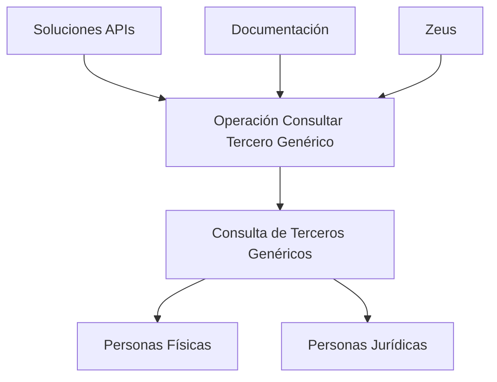

# Operación Consultar Tercero Genérico

## 1. Metadados do Documento
- **Arquivo de Origem:** Não identificado
- **Tipo de Documento:** Especificação Técnica
- **Domínio / Sistema:** Operación Consultar Tercero Genérico; Soluciones APIs; Zeus
- **Público-Alvo:** Não identificado
- **Data/Versão Identificada:** Não identificada

---

## 2. Resumo Executivo & Contexto de Negócio

O conteúdo descreve a operação **“Consultar Tercero Genérico”**, destinada à consulta de terceiros genéricos. O texto estabelece que os terceiros consultados podem ser classificados como **Personas Físicas** ou **Personas Jurídicas**.

A operação está associada ao contexto de **Soluciones APIs**, **Documentación** e **Zeus**, termos exibidos no trecho extraído. O conteúdo também apresenta as siglas ou identificadores **RS** e **ES**, sem explicação adicional sobre seus significados.

O material disponível é extremamente resumido e não informa métodos HTTP, contratos de API, campos de entrada, respostas, mecanismos de autenticação, regras de validação, URLs, ambientes ou procedimentos operacionais.

---

## 3. Arquitetura, Componentes & Tecnologias Envolvidas

Os elementos explicitamente mencionados são:

| Componente / Termo | Evidência no conteúdo | Detalhamento disponível |
| :--- | :--- | :--- |
| Operación Consultar Tercero Genérico | Título da operação | Consulta terceiros genéricos. |
| Terceros Genéricos | Descrição funcional | Podem ser Personas Físicas ou Personas Jurídicas. |
| Soluciones APIs | Elemento de navegação/contexto | Não detalhado. |
| Documentación | Elemento de navegação/contexto | Não detalhado. |
| Zeus | Elemento de navegação/contexto | Não detalhado. |
| RS | Sigla/identificador exibido | Não definido. |
| ES | Sigla/identificador exibido | Não definido. |



**Nota de Análise:** o conteúdo não descreve arquitetura de software, integrações, tecnologias, microsserviços, protocolos ou fluxos de dados além da relação funcional entre a operação de consulta e os tipos de terceiros genéricos.

---

## 4. Regras de Negócio, Especificações Funcionais & Processos

1. A operação identificada como **Consultar Tercero Genérico** realiza consulta de **Terceros Genéricos**.
2. Os **Terceros Genéricos** podem ser:
   - **Personas Físicas**;
   - **Personas Jurídicas**.
3. O conteúdo não define critérios para identificar, filtrar, validar, cadastrar, atualizar ou excluir terceiros genéricos.
4. O conteúdo não especifica os parâmetros necessários para executar a consulta.
5. O conteúdo não informa o resultado esperado, a estrutura de retorno, códigos de erro ou regras de autorização da operação.

---

## 5. Tabelas de Parâmetros, Ambientes e Estruturas de Dados

| Item / Parâmetro | Descrição / Função | Tipo / Valores / Formato | Ambiente / Observações |
| :--- | :--- | :--- | :--- |
| Operación Consultar Tercero Genérico | Operação para consulta de terceiros genéricos. | Nome de operação. | Não informado. |
| Terceros Genéricos | Entidades consultadas pela operação. | Personas Físicas ou Personas Jurídicas. | Não informado. |
| Personas Físicas | Categoria possível de terceiro genérico. | Não detalhado. | Não informado. |
| Personas Jurídicas | Categoria possível de terceiro genérico. | Não detalhado. | Não informado. |
| RS | Sigla ou identificador apresentado. | Não definido. | Não informado. |
| ES | Sigla ou identificador apresentado. | Não definido. | Não informado. |
| Soluciones APIs | Contexto ou área apresentada no conteúdo. | Não detalhado. | Não informado. |
| Documentación | Contexto ou área apresentada no conteúdo. | Não detalhado. | Não informado. |
| Zeus | Contexto ou sistema apresentado no conteúdo. | Não detalhado. | Não informado. |

---

## 6. Bateria de Perguntas & Respostas para RAG (FAQ Sintético)

### P1: Qual é o objetivo da operação “Consultar Tercero Genérico”?
**R:** A operação “Consultar Tercero Genérico” tem como objetivo consultar terceiros genéricos.

### P2: Quais tipos de terceiros genéricos podem ser consultados?
**R:** O conteúdo informa que os terceiros genéricos podem ser Personas Físicas ou Personas Jurídicas.

### P3: A operação diferencia Personas Físicas e Personas Jurídicas?
**R:** O texto reconhece Personas Físicas e Personas Jurídicas como tipos de terceiros genéricos consultáveis, mas não descreve regras de diferenciação, filtros ou tratamentos específicos para cada tipo.

### P4: Quais parâmetros são exigidos pela operação Consultar Tercero Genérico?
**R:** O conteúdo fornecido não informa parâmetros de entrada para a operação Consultar Tercero Genérico.

### P5: Quais métodos HTTP são suportados pela operação?
**R:** O conteúdo não especifica métodos HTTP para a operação Consultar Tercero Genérico.

### P6: O documento informa a URL ou endpoint da consulta?
**R:** Não. Nenhuma URL, endpoint, host, porta ou rota é apresentada no conteúdo.

### P7: O que significa a sigla RS no documento?
**R:** O conteúdo apresenta “RS”, mas não define seu significado no contexto da operação ou do sistema.

### P8: O que significa a sigla ES no documento?
**R:** O conteúdo apresenta “ES”, mas não define seu significado no contexto da operação ou do sistema.

### P9: Qual é a relação entre a operação e Soluciones APIs?
**R:** “Soluciones APIs” aparece no conteúdo como parte do contexto de navegação ou localização da operação, mas o material não explica sua relação técnica ou organizacional com a consulta.

### P10: O sistema Zeus é detalhado no conteúdo?
**R:** Não. “Zeus” é mencionado no trecho extraído, porém não há descrição de suas responsabilidades, integrações ou funcionalidades.

---

## 7. Glossário de Termos, Siglas & Conceitos-Chave

- **Consultar Tercero Genérico:** Operação destinada à consulta de terceiros genéricos.
- **Terceros Genéricos:** Entidades que podem ser consultadas pela operação; o conteúdo indica que incluem Personas Físicas e Personas Jurídicas.
- **Personas Físicas:** Categoria de terceiro genérico mencionada no conteúdo.
- **Personas Jurídicas:** Categoria de terceiro genérico mencionada no conteúdo.
- **RS:** Sigla ou identificador exibido sem definição.
- **ES:** Sigla ou identificador exibido sem definição.
- **Soluciones APIs:** Termo apresentado no contexto do conteúdo, sem detalhamento funcional ou técnico.
- **Documentación:** Termo apresentado no contexto do conteúdo, sem detalhamento adicional.
- **Zeus:** Termo ou sistema citado sem descrição adicional.

---

## 8. Notas Críticas, Riscos & Limitações

- O conteúdo extraído possui apenas uma descrição resumida da operação.
- Não há identificação do arquivo de origem, data, versão, autor ou público-alvo.
- Não foram informados endpoints, métodos HTTP, protocolos, autenticação, autorização, contratos de requisição ou contratos de resposta.
- Não há regras de validação, critérios de busca, códigos de erro, logs, ambientes ou dependências técnicas.
- **Nota de Análise:** o documento lista “Soluciones APIs”, “Documentación”, “Zeus”, “RS” e “ES”, porém não detalha seus significados, responsabilidades ou relações técnicas.

---

## 9. Conteúdo Bruto Estruturado (Referência Fiel)

```text
--- [PÁGINA 1 DE 1] ---

OPERACIÓN CONSULTAR Tercero Genérico
Consulta de los Terceros Genéricos sean estos Personas Físicas o Personas Jurídicas.
 / 
 RS
Inicio Soluciones APIs Documentación Zeus
ES
```
