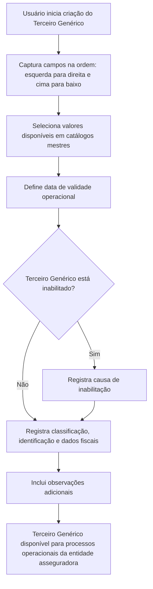

# Especificação Funcional — Criação de Informações para Terceiros Genéricos

## 1. Metadados do Documento
- **Arquivo de Origem:** `Não informado`
- **Tipo de Documento:** `Especificação Técnica / Procedimento Funcional`
- **Domínio / Sistema:** `Gestão de Terceiros Genéricos em entidade asseguradora`
- **Público-Alvo:** `Analistas funcionais, desenvolvedores, operação e áreas de negócio`
- **Data/Versão Identificada:** `Não identificada`

---

## 2. Resumo Executivo & Contexto de Negócio

O documento descreve a criação e o cadastro de informações para o **Terceiro Genérico** em uma entidade asseguradora. O objetivo declarado é capturar dados em uma estrutura que permita classificar, identificar e detalhar informações de âmbito operacional associadas ao Terceiro Genérico.

A estrutura de dados é necessária para que o Terceiro Genérico seja adequadamente considerado nos processos da entidade asseguradora que demandem essa informação. A única ação explicitamente habilitada no trecho é **CREAR**, isto é, criação.

O documento determina uma sequência de captura dos campos: leitura **da esquerda para a direita** e **de cima para baixo**. Quando não houver indicação expressa em contrário, os atributos devem ser utilizados tanto para **Pessoas Físicas** quanto para **Pessoas Jurídicas**.

Os atributos abrangem origem comercial, agrupamento comercial, compensação, qualidade, retenção, validade, inabilitação, classificação, identificação profissional, identificação fiscal, IVA e observações. Diversos campos dependem de valores previamente mantidos em catálogos mestres do sistema.

Não há detalhamento de arquitetura de software, contratos de integração, métodos HTTP, formatos JSON, bancos de dados, permissões, validações obrigatórias ou interfaces de usuário. O documento também menciona “Home Solutions APIs Documentation Zeus” e “CF”, mas não explica o significado ou a relação desses termos com o cadastro.

---

## 3. Arquitetura, Componentes & Tecnologias Envolvidas

O conteúdo fornecido não apresenta uma arquitetura técnica, microsserviços, APIs, servidores, URLs, linguagens, bancos de dados ou tecnologias de implantação.

Os componentes funcionais explicitamente identificados são:

- Estrutura de dados de **Tercero Genérico**.
- Processos operacionais da **entidade asseguradora**.
- Catálogo mestre de **Oficinas Comerciais**.
- Catálogo mestre de **Agrupações Comerciais**.
- Catálogo mestre de **Compensações**.
- Catálogo mestre de **Códigos de Qualidade**.
- Tipos de Retenção configurados localmente pela entidade asseguradora.
- Catálogo mestre de **Causas de Inabilitação**.
- Catálogo mestre de **Classificações**.



> **Nota de Análise:** O fluxograma representa exclusivamente a sequência funcional inferida a partir dos campos e descrições fornecidos. O documento não descreve persistência, validações sistêmicas, integrações ou comportamento técnico após o cadastro.

---

## 4. Regras de Negócio, Especificações Funcionais & Processos

### 4.1 Objetivo da estrutura de dados

A captura de informações na estrutura de dados do Terceiro Genérico existe para:

1. Classificar o Terceiro Genérico.
2. Identificar o Terceiro Genérico.
3. Detalhar a informação operacional do Terceiro Genérico.
4. Permitir que os processos da entidade asseguradora contemplem adequadamente o Terceiro Genérico quando necessário.

### 4.2 Ação habilitada

A única ação explicitamente indicada é:

- **CREAR:** criação de informações para o Terceiro Genérico.

### 4.3 Sequência de captura

Os atributos devem ser capturados segundo a sequência visual definida no bloco de informação:

1. Da esquerda para a direita.
2. De cima para baixo.

### 4.4 Aplicabilidade por tipo de pessoa

Caso não exista indicação ou especificação expressa em contrário, os atributos devem ser utilizados para:

- Pessoas Físicas.
- Pessoas Jurídicas.

### 4.5 Regras por atributo

- **Oficina Comercial Associada:** deve conter o código do terceiro nível da Estrutura Comercial da qual procede o Terceiro Genérico. O código deve estar de acordo com os valores existentes no catálogo mestre de Oficinas Comerciais do sistema.
- **Agrupamento Comercial:** deve conter a Agrupação Comercial associada ao Terceiro Genérico, conforme valores definidos no catálogo mestre de Agrupações do sistema.
- **Compensação:** deve indicar o código da Forma de Cobro/Pago do assegurado, de acordo com as Formas de Compensação disponíveis no catálogo mestre de Compensações.
- **Calidad del Tercero Genérico:** deve conter a condição de qualidade vinculada ao Terceiro Genérico, selecionada entre os valores do catálogo mestre de Códigos de Qualidade.
- **Tipo de Retención:** deve conter o código de um dos Tipos de Retenção configurados localmente pela entidade asseguradora.
- **Fecha de Validez:** indica a data a partir da qual o Terceiro Genérico está plenamente operativo no sistema. O uso correto dessa data permite manter histórico das mudanças realizadas na configuração do Terceiro.
- **Inhabilitación:** informa ao sistema que o Terceiro Genérico está inabilitado e, portanto, não deve ser utilizado, contemplado ou considerado nos processos operacionais da entidade.
- **Causa de Inhabilitación:** quando o Terceiro Genérico estiver inabilitado, deve conter o código de uma das Causas de Inabilitação definidas no catálogo mestre do sistema.
- **Clasificación:** deve conter a classificação do Terceiro Genérico conforme os valores existentes no catálogo mestre de Classificações do sistema.
- **Número de Colegiación:** deve conter a chave ou código da Cédula Profissional pela qual o Terceiro, por pertencer a um colégio profissional ou associação oficial semelhante, está habilitado a exercer sua profissão.
- **Identificación Fiscal:** deve conter a chave do identificador fiscal do Terceiro Genérico, de acordo com a legislação do país onde se situa a entidade asseguradora.
- **IVA:** deve conter o tipo de Imposto sobre o Valor Acrescentado que identifica a tributação fiscal do Terceiro Genérico pelos serviços prestados à entidade asseguradora.
- **Observaciones:** permite ao usuário capturar informações adicionais sobre o Terceiro Genérico segundo orientações ou diretrizes das Direções de Negócio da entidade asseguradora.

---

## 5. Tabelas de Parâmetros, Ambientes e Estruturas de Dados

| Item / Parâmetro | Descrição / Função | Tipo / Valores / Formato | Ambiente / Observações |
| :--- | :--- | :--- | :--- |
| Ação habilitada | Permite criar informações para o Terceiro Genérico. | `CREAR` | Nenhuma outra ação é descrita. |
| Ordem de captura | Define a sequência de preenchimento dos campos do bloco de informação. | Esquerda para direita; cima para baixo. | Regra de navegação/captura indicada no documento. |
| Aplicabilidade de atributos | Define a abrangência padrão dos atributos. | Pessoas Físicas e Pessoas Jurídicas. | Aplicável quando não houver indicação expressa em contrário. |
| Oficina Comercial Associada | Identifica a origem comercial do Terceiro Genérico. | Código do terceiro nível da Estrutura Comercial. | Deve respeitar o catálogo mestre de Oficinas Comerciais. |
| Agrupamento Comercial | Associa uma Agrupação Comercial ao Terceiro Genérico. | Valor de agrupamento comercial. | Deve respeitar o catálogo mestre de Agrupações. |
| Compensação | Indica a Forma de Cobro/Pago do assegurado. | Código de Forma de Compensação. | Deve respeitar o catálogo mestre de Compensações. |
| Calidad del Tercero Genérico | Define a condição de qualidade vinculada ao Terceiro Genérico. | Código de qualidade. | Deve respeitar o catálogo mestre de Códigos de Qualidade. |
| Tipo de Retención | Identifica o tipo de retenção aplicável. | Código de Tipo de Retenção. | Configurado localmente pela entidade asseguradora. |
| Fecha de Validez | Define quando o Terceiro Genérico passa a estar plenamente operativo. | Data. | Permite histórico de mudanças na configuração do Terceiro. |
| Inhabilitación | Sinaliza que o Terceiro Genérico não deve ser utilizado operacionalmente. | Indicador de inabilitação. | Impede que o Terceiro seja empregado, contemplado ou considerado em processos operacionais. |
| Causa de Inhabilitación | Registra o motivo da inabilitação do Terceiro Genérico. | Código de causa. | Aplicável quando o Terceiro Genérico estiver inabilitado; valores oriundos do catálogo mestre. |
| Clasificación | Define a classificação do Terceiro Genérico. | Valor de classificação. | Deve respeitar o catálogo mestre de Classificações. |
| Número de Colegiación | Identifica o registro ou cédula profissional do Terceiro. | Chave ou código de Cédula Profissional. | Relacionado à habilitação profissional por colégio profissional ou associação oficial semelhante. |
| Identificación Fiscal | Identifica fiscalmente o Terceiro Genérico. | Chave de identificador fiscal. | Deve seguir a legislação do país onde se situa a entidade asseguradora. |
| IVA | Identifica a tributação fiscal do Terceiro pelos serviços prestados. | Tipo de Imposto sobre o Valor Acrescentado. | Aplicável aos serviços prestados à entidade asseguradora. |
| Observaciones | Armazena informação adicional sobre o Terceiro Genérico. | Texto adicional. | Deve seguir orientações ou diretrizes das Direções de Negócio. |
| Home Solutions APIs Documentation Zeus | Termo exibido no conteúdo bruto. | Não detalhado. | O documento não explica sua função, integração ou relação com o cadastro. |
| CF | Sigla exibida no conteúdo bruto. | Não detalhado. | O documento não define o significado da sigla. |

---

## 6. Bateria de Perguntas & Respostas para RAG (FAQ Sintético)

### P1: Qual é o objetivo do cadastro de informações para Terceiros Genéricos?
**R:** O cadastro tem como objetivo classificar, identificar e detalhar a informação operacional do Terceiro Genérico, permitindo que a entidade asseguradora considere esse Terceiro adequadamente nos processos que dependam dessa informação.

### P2: Qual ação está habilitada no documento para o Terceiro Genérico?
**R:** O documento indica somente a ação **CREAR**, destinada à criação das informações do Terceiro Genérico. Não são descritas ações de alteração, consulta, exclusão ou aprovação.

### P3: Em que ordem os campos do bloco de informações devem ser preenchidos?
**R:** Os campos devem seguir a sequência de captura da esquerda para a direita e de cima para baixo, conforme indicado no bloco de informação do Terceiro Genérico.

### P4: Os atributos do Terceiro Genérico são aplicáveis a Pessoas Físicas e Pessoas Jurídicas?
**R:** Sim. Quando o documento não especificar ou indicar expressamente uma exceção, os atributos devem ser empregados tanto para Pessoas Físicas quanto para Pessoas Jurídicas.

### P5: O que deve ser informado em Oficina Comercial Associada?
**R:** Deve ser informado o código do terceiro nível da Estrutura Comercial de onde procede o Terceiro Genérico. O valor deve corresponder à relação existente no catálogo mestre de Oficinas Comerciais do sistema.

### P6: Para que serve a Fecha de Validez do Terceiro Genérico?
**R:** A Fecha de Validez indica a data a partir da qual o Terceiro Genérico está plenamente operativo no sistema. O uso correto da data permite à entidade asseguradora manter um histórico das mudanças realizadas na configuração do Terceiro.

### P7: Qual é o efeito da Inhabilitación em um Terceiro Genérico?
**R:** A Inhabilitación informa ao sistema que o Terceiro Genérico está inabilitado. Nessa condição, o Terceiro não deve ser utilizado, contemplado ou considerado nos processos operacionais da entidade asseguradora.

### P8: Quando a Causa de Inhabilitación deve ser preenchida?
**R:** A Causa de Inhabilitación deve ser informada quando o Terceiro Genérico estiver inabilitado. O atributo deve conter o código de uma causa definida no catálogo mestre de Causas de Inabilitação do sistema.

### P9: Como deve ser definida a Clasificación do Terceiro Genérico?
**R:** A Clasificación deve ser preenchida com um valor existente na relação do catálogo mestre de Classificações do sistema.

### P10: O que representa o Número de Colegiación?
**R:** O Número de Colegiación representa a chave ou o código da Cédula Profissional pela qual o Terceiro está habilitado a exercer sua profissão, em razão de sua vinculação a um colégio profissional ou associação oficial semelhante.

### P11: Qual regra se aplica à Identificación Fiscal?
**R:** A Identificación Fiscal deve conter a chave do identificador fiscal do Terceiro Genérico conforme a legislação do país no qual a entidade asseguradora está localizada.

### P12: Qual é a finalidade do campo IVA?
**R:** O campo IVA contém o tipo de Imposto sobre o Valor Acrescentado que identifica o gravame fiscal do Terceiro Genérico pelos serviços prestados à entidade asseguradora.

### P13: Que tipo de informação pode ser registrada em Observaciones?
**R:** Observaciones permite ao usuário registrar informações adicionais sobre o Terceiro Genérico, de acordo com os planteamentos, orientações ou diretrizes que possam ser definidos pelas Direções de Negócio da entidade asseguradora.

---

## 7. Glossário de Termos, Siglas & Conceitos-Chave

- **Terceiro Genérico / Tercero Genérico:** Entidade cadastrada cuja informação operacional deve ser classificada, identificada e detalhada para uso nos processos da entidade asseguradora.
- **Entidade Asseguradora / Entidad Aseguradora:** Organização para a qual o Terceiro Genérico presta serviços ou cujos processos operacionais utilizam as informações do Terceiro.
- **Oficina Comercial Associada:** Código do terceiro nível da Estrutura Comercial de onde procede o Terceiro Genérico.
- **Agrupamento Comercial / Agrupación Comercial:** Agrupação comercial associada ao Terceiro Genérico.
- **Compensação / Compensación:** Código da Forma de Cobro/Pago do assegurado.
- **Calidad del Tercero Genérico:** Condição de qualidade atribuída ao Terceiro Genérico.
- **Tipo de Retención:** Tipo de retenção configurado localmente pela entidade asseguradora.
- **Fecha de Validez:** Data a partir da qual o Terceiro Genérico se torna plenamente operativo no sistema.
- **Inhabilitación:** Estado que sinaliza que o Terceiro Genérico não deve ser utilizado nos processos operacionais.
- **Causa de Inhabilitación:** Motivo codificado para a inabilitação do Terceiro Genérico.
- **Clasificación:** Classificação do Terceiro Genérico conforme catálogo mestre.
- **Número de Colegiación:** Chave ou código da Cédula Profissional que habilita o Terceiro para o exercício profissional.
- **Identificación Fiscal:** Chave de identificação fiscal do Terceiro Genérico.
- **IVA:** Imposto sobre o Valor Acrescentado aplicável aos serviços prestados pelo Terceiro Genérico.
- **Catálogo mestre:** Relação de valores de referência existente no sistema para seleção ou validação de atributos.
- **CF:** Sigla presente no documento sem significado definido.
- **Home Solutions APIs Documentation Zeus:** Texto presente no documento sem descrição funcional ou técnica.

---

## 8. Notas Críticas, Riscos & Limitações

- O documento não identifica o nome do arquivo de origem, data, versão, autor, área proprietária ou sistema específico.
- O documento não define tipos de dados, tamanhos, obrigatoriedade, máscaras, valores padrão ou regras de validação para os atributos.
- O documento não apresenta contratos de API, métodos HTTP, formatos JSON, endpoints, autenticação, integração ou persistência de dados.
- O documento depende de diversos catálogos mestres, mas não fornece os valores desses catálogos, responsáveis pela manutenção ou mecanismos de consulta.
- A relação entre **Inhabilitación** e **Causa de Inhabilitación** é funcionalmente indicada, porém não é descrita uma validação técnica obrigatória.
- Os termos **CF** e **Home Solutions APIs Documentation Zeus** aparecem no conteúdo, mas não recebem explicação adicional.
- O documento menciona “Exemplo:” para Clasificación e Observaciones, porém nenhum exemplo foi fornecido no conteúdo extraído.
- Não há detalhamento adicional sobre o comportamento dos processos operacionais após a criação do Terceiro Genérico.

---

## 9. Conteúdo Bruto Estruturado (Referência Fiel)

```text
--- [PÁGINA 1 DE 3] ---

CREAR Información para los Terceros
Genéricos
Objetivo
La captura de la información en esta Estructura de datos obedece a la necesidad de clasificar,
identificar y detallar la información de ámbito operativo del Tercero Genérico para poder
contemplarlo adecuadamente en los procesos de la entidad Aseguradora que así lo demanden.
Acciones habilitadas
 CREAR ( )
Datos Tercero Genérico
De Izquierda a Derecha y de Arriba hacia Abajo, los siguientes atributos marcan la secuencia de
captura de los Campos en este Bloque de Información.
Si no se especifica o indica expresamente, los Atributos se emplearán tanto en Personas Físicas
como en Personas Jurídicas.
 / 
 CF
Home Solutions APIs Documentation Zeus
EN


--- [PÁGINA 2 DE 3] ---

Oficina Comercial Asociada (  )
Este atributo contiene el código del Tercer Nivel de la Estructura Comercial del que procede el
Tercero Genérico, de acuerdo con la relación de valores existentes en el catálogo maestro de
Oficinas Comerciales existente en el Sistema.
Agrupamiento Comercial (  )
Este Campo contendrá la Agrupación Comercial que se asocia al Tercero Genérico de acuerdo con la
relación de valores definidos en el catálogo maestro de Agrupaciones existente en el Sistema.
Compensación (  )
Este Dato indicará el Código de la Forma de Cobro/Pago del Asegurado de acuerdo con las posibles
Formas de Compensación definidas en el catálogo maestro de Compensaciones
Calidad del Tercero Genérico (  )
Este Campo contendrá la condición de calidad vinculada al Tercero Genérico de acuerdo con uno de
valores existentes en el catálogo maestro de Códigos de Calidad existente en el Sistema.
Tipo de Retención (  )
Este Dato contiene el código de uno de los Tipos de Retención configurados localmente por la
Entidad Aseguradora.
Fecha de Validez ( )
Esta propiedad indica la fecha a partir de la cual el Tercero Genérico está plenamente operativo en el
sistema por lo que su empleo y correcta utilización permite tener en la entidad Aseguradora un
histórico de los cambios efectuados en la configuración del Tercero.
Inhabilitación ( )
Esta propiedad le indica al Sistema que el Tercero Genérico está inhabilitado en el Sistema por lo
que no debería ser empleado, contemplado o considerado en los procesos operativos de la entidad.
Causa de Inhabilitación (  )
En el supuesto que el Tercero Genérico estuviera Inhabilitado, este atributo contendrá el código de
una de las Causas de Inhabilitación definidas en el catálogo maestro del Sistema.
Clasificación (  )
Ejemplo:


--- [PÁGINA 3 DE 3] ---

Este Campo contendrá la Clasificación del Tercero Genérico de acuerdo con la relación de valores
existentes en el catálogo maestro de Clasificaciones existente en el Sistema.
Número de Colegiación ( )
Este Campo va a contener la clave ó código de la Cédula Profesional por la que el Tercero, por
pertenecer a un colegio profesional o asociación semejante de carácter oficial, está habilitado para
ejercer en el desempeño de su profesión.
Identificación Fiscal ( )
Clave del Identificador fiscal del Tercero Genérico de acuerdo con la Legislación del País en el que
se ubica la Entidad Aseguradora.
IVA (  )
Este campo contiene el Tipo del Impuesto de Valor Añadido (IVA) que identificará el gravamen fiscal
del Tercero Genérico por los servicios prestados a la Entidad Aseguradora.
Observaciones ( )
El propósito de este campo permite al Usuario capturar información adicional del Tercero Genérico de
acuerdo con los Planteamientos o directrices que pudieran efectuar las Direcciones de Negocio de la
entidad aseguradora.
Ejemplo:
```
