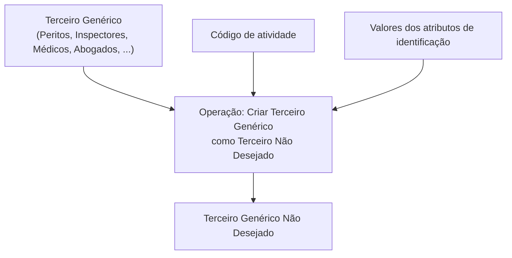
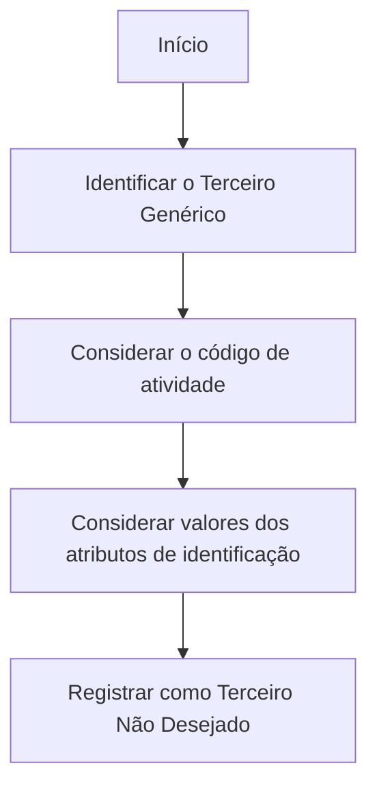

# Operação Criar Terceiro Genérico como Terceiro Não Desejado

## 1. Metadados do Documento
- **Arquivo de Origem:** `Não identificado`
- **Tipo de Documento:** `Procedimento`
- **Domínio / Sistema:** `Cadastro de Terceiro Genérico Não Desejado`
- **Público-Alvo:** `Não identificado`
- **Data/Versão Identificada:** `Não identificada`

---

## 2. Resumo Executivo & Contexto de Negócio

O documento descreve a operação **“Criar Terceiro Genérico como Terceiro Não Desejado”**. A operação tem como finalidade registrar um Terceiro Genérico, incluindo exemplos como Peritos, Inspectores, Médicos e Abogados, na condição de Terceiro Não Desejado.

O critério indicado para o registro combina o **código de atividade** do Terceiro Genérico com os valores dos **atributos que conformam sua identificação**. O conteúdo não detalha quais códigos de atividade são aceitos, quais atributos compõem a identificação nem quais validações são realizadas.

A referência a “Informação do Terceiro Genérico Não Desejado” sugere que a operação depende de dados específicos de identificação do terceiro. Contudo, o documento não apresenta estrutura de campos, contratos de integração, métodos HTTP, respostas, regras de erro ou persistência de dados.

---

## 3. Arquitetura, Componentes & Tecnologias Envolvidas

Os elementos explicitamente citados são:

- **Operação Criar Terceiro Genérico Não Desejado:** operação para registrar um Terceiro Genérico como Terceiro Não Desejado.
- **Terceiro Genérico:** entidade que pode representar Peritos, Inspectores, Médicos, Abogados e outros exemplos não especificados.
- **Código de atividade:** critério utilizado no registro do Terceiro Genérico como Terceiro Não Desejado.
- **Atributos de identificação:** valores que compõem a identificação do Terceiro Genérico.
- **Zeus:** termo presente no conteúdo de navegação exibido; o documento não explica sua função técnica ou funcional.
- **APIs:** termo presente no conteúdo de navegação exibido; o documento não identifica endpoints, protocolos ou contratos relacionados.



> **Nota de Análise:** o documento não descreve arquitetura de software, camadas, microsserviços, bancos de dados, métodos HTTP, contratos JSON, URLs ou ambientes técnicos.

---

## 4. Regras de Negócio, Especificações Funcionais & Processos

### Regra funcional identificada

A operação permite registrar um **Terceiro Genérico** como um **Terceiro Não Desejado**.

### Critérios de registro identificados

O registro deve ocorrer de acordo com:

1. O **código de atividade** do Terceiro Genérico.
2. Os **valores dos atributos** que compõem a identificação do Terceiro Genérico.

### Tipos de Terceiro Genérico exemplificados

O documento cita os seguintes exemplos de Terceiro Genérico:

- Peritos;
- Inspectores;
- Médicos;
- Abogados.

### Fluxo funcional extraído



> **Nota de Análise:** o documento não especifica obrigatoriedade de campos, ordem operacional de preenchimento, critérios de rejeição, autorizações, aprovações, deduplicação, mensagens de erro ou etapas posteriores ao registro.

---

## 5. Tabelas de Parâmetros, Ambientes e Estruturas de Dados

| Item / Parâmetro | Descrição / Função | Tipo / Valores / Formato | Ambiente / Observações |
| :--- | :--- | :--- | :--- |
| Terceiro Genérico | Entidade que pode ser registrada como Terceiro Não Desejado | Exemplos: Peritos, Inspectores, Médicos, Abogados | O documento não define estrutura de dados. |
| Terceiro Não Desejado | Classificação resultante do registro realizado pela operação | Não especificado | Não são informadas consequências ou regras posteriores associadas à classificação. |
| Código de atividade | Critério utilizado para registrar o Terceiro Genérico como Terceiro Não Desejado | Não especificado | Não há catálogo, formato ou valores permitidos. |
| Atributos de identificação | Valores que conformam a identificação do Terceiro Genérico | Não especificado | O documento não lista os atributos nem suas regras de validação. |
| Informação do Terceiro Genérico Não Desejado | Informação associada ao contexto da operação | Não especificado | Não há detalhamento de campos, fonte ou persistência. |
| Zeus | Termo exibido na navegação do conteúdo | Não especificado | O documento não define a função de Zeus. |
| APIs | Termo exibido na navegação do conteúdo | Não especificado | Nenhuma API, rota, método ou contrato é descrito. |
| RS | Sigla exibida no conteúdo | Não especificado | Significado não definido no documento. |
| Idioma ES | Indicador “ES” exibido no conteúdo | `ES` | Pode indicar idioma espanhol, mas o documento não confirma explicitamente essa interpretação. |

---

## 6. Bateria de Perguntas & Respostas para RAG (FAQ Sintético)

### P1: Em que consiste a operação Criar Terceiro Genérico como Terceiro Não Desejado?
**R:** A operação permite registrar um Terceiro Genérico como Terceiro Não Desejado. O registro considera o código de atividade e os valores dos atributos que conformam a identificação do Terceiro Genérico.

### P2: Quais tipos de entidades podem ser tratados como Terceiro Genérico no documento?
**R:** O documento apresenta como exemplos de Terceiro Genérico os Peritos, Inspectores, Médicos e Abogados. A lista é exemplificativa, pois o conteúdo utiliza reticências após esses tipos.

### P3: Quais critérios são usados para registrar um Terceiro Genérico como Terceiro Não Desejado?
**R:** Os critérios mencionados são o código de atividade do Terceiro Genérico e os valores dos atributos que compõem sua identificação.

### P4: O documento informa quais valores de código de atividade permitem o registro?
**R:** Não. O documento afirma que o registro ocorre de acordo com o código de atividade, mas não informa catálogo, formato, valores aceitos ou regras de decisão associadas ao código.

### P5: Quais atributos formam a identificação do Terceiro Genérico?
**R:** O documento apenas menciona “os valores dos atributos que conformam sua identificação”. Os nomes, tipos, formatos, obrigatoriedade e regras de validação desses atributos não são detalhados.

### P6: O documento descreve uma API para criar o Terceiro Genérico Não Desejado?
**R:** Não. Embora o termo “APIs” apareça na navegação do conteúdo, não há endpoint, método HTTP, URL, autenticação, payload JSON, contrato de resposta ou código de erro descrito.

### P7: Qual é o resultado esperado da operação de criação?
**R:** O resultado funcional indicado é o registro do Terceiro Genérico como Terceiro Não Desejado. O documento não informa identificador gerado, confirmação, status técnico ou comportamento posterior ao registro.

### P8: O que significa a expressão Informação do Terceiro Genérico Não Desejado?
**R:** A expressão aparece como um título ou referência no conteúdo relacionado à operação. Entretanto, o documento não detalha quais informações, campos ou estruturas pertencem ao Terceiro Genérico Não Desejado.

### P9: O documento informa em qual ambiente a operação deve ser executada?
**R:** Não. Não há indicação de ambiente de desenvolvimento, homologação, produção, servidor, URL, porta, rota de log ou configuração operacional.

### P10: Zeus é um sistema ou componente arquitetural da operação?
**R:** O termo “Zeus” aparece na navegação apresentada no conteúdo bruto. O documento não fornece explicação suficiente para determinar sua função, relacionamento com a operação ou características técnicas.

---

## 7. Glossário de Termos, Siglas & Conceitos-Chave

- **Terceiro Genérico:** entidade que pode ser registrada como Terceiro Não Desejado; o documento cita Peritos, Inspectores, Médicos e Abogados como exemplos.
- **Terceiro Não Desejado:** classificação atribuída ao Terceiro Genérico após o registro pela operação descrita.
- **Código de atividade:** critério associado ao Terceiro Genérico e utilizado no processo de registro como Terceiro Não Desejado.
- **Atributos de identificação:** valores que compõem a identificação do Terceiro Genérico.
- **APIs:** termo presente no conteúdo de navegação; o documento não detalha interfaces, serviços ou contratos de API.
- **Zeus:** termo presente no conteúdo de navegação; significado e função não definidos.
- **RS:** sigla presente no conteúdo; significado não definido.
- **ES:** indicador presente no conteúdo; o documento não define seu significado.

---

## 8. Notas Críticas, Riscos & Limitações

- O conteúdo disponível é resumido e não apresenta detalhamento técnico da operação.
- Não há especificação de campos, tipos de dados, formatos, obrigatoriedade ou validações para os atributos de identificação.
- Não há catálogo ou regra explícita para os códigos de atividade.
- Não há descrição de APIs, endpoints, métodos HTTP, autenticação, contratos de requisição ou respostas.
- Não há informação sobre ambientes, URLs, servidores, logs, monitoramento ou tratamento de erros.
- Os termos **Zeus**, **RS**, **APIs** e **ES** aparecem no conteúdo, mas não possuem definição contextual suficiente.
- Não é possível inferir regras de autorização, persistência, auditoria, reprocessamento ou consequências operacionais da condição de Terceiro Não Desejado.

---

## 9. Conteúdo Bruto Estruturado (Referência Fiel)

```text
--- [PÁGINA 1 DE 1] ---

OPERACIÓN CREAR Tercero Genérico como
Tercero no Deseado
¿En que consiste?
Esta operación permite registrar al Tercero Genérico (Peritos, Inspectores, Médicos, Abogados,...)
como un Tercero No Deseado, de acuerdo con su código de actividad y de los valores de los
atributos que conforman su identificación.
Información del Tercero Genérico No Deseado
 CREAR Tercero Genérico No Deseado ( )
 / 
 RS
Inicio Soluciones APIs Documentación Zeus
ES
```
