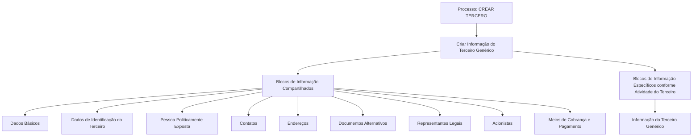

# Operação Criar Terceiro Genérico — Captura de Informações e Blocos Compartilhados

## 1. Metadados do Documento
- **Arquivo de Origem:** Não identificado
- **Tipo de Documento:** Procedimento
- **Domínio / Sistema:** Operação **CREAR TERCERO**; referências a APIs, documentação e Zeus
- **Público-Alvo:** Usuários do sistema responsáveis pelo cadastro de Terceiros Genéricos
- **Data/Versão Identificada:** Não identificada

---

## 2. Resumo Executivo & Contexto de Negócio

O documento descreve a operação **Crear Tercero Genérico**, cuja finalidade é capturar as informações de entidades denominadas **Terceros Genéricos**. O processo é organizado em blocos de informação compartilhados e em blocos específicos associados à atividade do Terceiro.

A obrigatoriedade e a habilitação dos campos não são fixas para todos os cadastros. Esses comportamentos podem variar conforme o código de atividade do Terceiro, o tipo de Terceiro — Pessoa Física ou Pessoa Jurídica — e as personalizações implementadas na aplicação.

O documento também estabelece que a ordem de captura das informações nos diferentes blocos pode variar conforme o critério adotado pelo usuário no sistema. Portanto, não há uma sequência obrigatória de preenchimento explicitamente definida no conteúdo fornecido.

O processo inclui blocos compartilhados para dados básicos, identificação, pessoa politicamente exposta, contatos, endereços, documentos alternativos, representantes legais, acionistas e meios de cobrança e pagamento. Há ainda um bloco específico denominado **Informação do Terceiro Genérico**.

---

## 3. Arquitetura, Componentes & Tecnologias Envolvidas

O documento não detalha arquitetura de software, tecnologias, APIs, métodos HTTP, contratos JSON, bancos de dados, ambientes ou integrações técnicas. As referências textuais a “Soluciones APIs”, “Documentación” e “Zeus” não possuem explicação adicional no conteúdo extraído.

Os componentes funcionais identificados são os blocos de informação usados durante a criação de um Terceiro Genérico.



> **Nota de Análise:** O documento apresenta blocos funcionais para a operação **CREAR TERCERO**, mas não detalha campos, telas, regras de persistência, integrações ou contratos técnicos associados a cada bloco.

---

## 4. Regras de Negócio, Especificações Funcionais & Processos

### Objetivo da operação

A operação **Crear Tercero Genérico** permite capturar informações dos denominados Terceiros Genéricos.

### Premissas de obrigatoriedade e habilitação de campos

1. A obrigatoriedade e/ou habilitação dos campos de registro de dados pode variar conforme o **código de atividade do Terceiro**.
2. A obrigatoriedade e/ou habilitação dos campos de registro de dados pode variar conforme o Terceiro seja uma **Pessoa Física** ou uma **Pessoa Jurídica**.
3. Personalizações implementadas podem afetar o comportamento da aplicação quanto à obrigatoriedade no registro dos dados do Terceiro.
4. A ordem de captura dos dados nos diferentes blocos de informação pode variar conforme o critério seguido pelo usuário no sistema.

### Processo funcional identificado

1. Iniciar o processo **CREAR TERCERO**.
2. Criar a informação do Terceiro Genérico.
3. Registrar informações nos blocos de informação compartilhados aplicáveis.
4. Registrar informações nos blocos específicos segundo a atividade do Terceiro.
5. Considerar as condições de obrigatoriedade e habilitação determinadas pelo código de atividade, tipo de Terceiro e personalizações existentes.

### Blocos compartilhados do processo CREAR TERCERO

- Dados Básicos.
- Dados de Identificação do Terceiro.
- Pessoa Politicamente Exposta.
- Contatos.
- Endereços.
- Documentos Alternativos.
- Representantes Legais.
- Acionistas.
- Meios de Cobrança e Pagamento.

### Bloco específico identificado

- Informação do Terceiro Genérico.

> **Nota de Análise:** O documento não especifica quais campos são obrigatórios ou habilitados para cada código de atividade, para Pessoa Física ou Pessoa Jurídica, nem descreve as personalizações que podem alterar essas condições.

---

## 5. Tabelas de Parâmetros, Ambientes e Estruturas de Dados

| Item / Parâmetro | Descrição / Função | Tipo / Valores / Formato | Ambiente / Observações |
| :--- | :--- | :--- | :--- |
| Operação | Permite capturar informações de Terceiros Genéricos | `CREAR TERCERO` | Não detalhado |
| Terceiro Genérico | Entidade cujas informações são criadas e capturadas pela operação | Não detalhado | Não detalhado |
| Código de atividade do Terceiro | Pode determinar a obrigatoriedade e/ou habilitação dos campos | Não detalhado | Regra condicional |
| Tipo de Terceiro | Pode alterar obrigatoriedade e/ou habilitação de campos | Pessoa Física ou Pessoa Jurídica | Regra condicional |
| Personalizações implementadas | Podem afetar o comportamento da aplicação quanto à obrigatoriedade dos dados | Não detalhado | Dependente de personalizações existentes |
| Ordem de captura | Sequência usada para registrar dados nos blocos de informação | Variável | Definida conforme critério do usuário |
| Dados Básicos | Bloco de informação compartilhado | Não detalhado | Processo CREAR TERCERO |
| Dados de Identificação do Terceiro | Bloco de informação compartilhado | Não detalhado | Processo CREAR TERCERO |
| Pessoa Politicamente Exposta | Bloco de informação compartilhado | Não detalhado | Processo CREAR TERCERO |
| Contatos | Bloco de informação compartilhado | Não detalhado | Processo CREAR TERCERO |
| Endereços | Bloco de informação compartilhado | Não detalhado | Processo CREAR TERCERO |
| Documentos Alternativos | Bloco de informação compartilhado | Não detalhado | Processo CREAR TERCERO |
| Representantes Legais | Bloco de informação compartilhado | Não detalhado | Processo CREAR TERCERO |
| Acionistas | Bloco de informação compartilhado | Não detalhado | Processo CREAR TERCERO |
| Meios de Cobrança e Pagamento | Bloco de informação compartilhado | Não detalhado | Processo CREAR TERCERO |
| Informação do Terceiro Genérico | Bloco específico segundo a atividade do Terceiro | Não detalhado | Processo CREAR TERCERO |

---

## 6. Bateria de Perguntas & Respostas para RAG (FAQ Sintético)

### P1: Qual é a finalidade da operação Crear Tercero Genérico?
**R:** A operação Crear Tercero Genérico permite capturar as informações dos denominados Terceiros Genéricos.

### P2: O preenchimento dos campos possui obrigatoriedade fixa para todos os Terceiros Genéricos?
**R:** Não. A obrigatoriedade e/ou habilitação dos campos pode variar de acordo com o código de atividade do Terceiro, o tipo de Terceiro e as personalizações implementadas.

### P3: Como o tipo de Terceiro influencia o cadastro no processo CREAR TERCERO?
**R:** O documento estabelece que a obrigatoriedade e/ou habilitação dos campos pode variar se o tipo de Terceiro for uma Pessoa Física ou uma Pessoa Jurídica.

### P4: O código de atividade do Terceiro afeta quais aspectos do cadastro?
**R:** O código de atividade do Terceiro pode afetar a obrigatoriedade e/ou a habilitação dos campos de registro dos dados presentes nos blocos ou estruturas de informação compartilhadas.

### P5: As personalizações da aplicação podem alterar o comportamento do cadastro?
**R:** Sim. As personalizações que tenham sido implementadas podem afetar o comportamento da aplicação em relação à obrigatoriedade do registro dos dados do Terceiro.

### P6: Existe uma ordem obrigatória para preencher os blocos de informação?
**R:** Não há uma ordem obrigatória descrita. A ordem de captura dos dados nos diferentes blocos de informação pode variar conforme o critério seguido pelo usuário no sistema.

### P7: Quais blocos de informação compartilhados são citados no processo CREAR TERCERO?
**R:** Os blocos citados são Dados Básicos, Dados de Identificação do Terceiro, Pessoa Politicamente Exposta, Contatos, Endereços, Documentos Alternativos, Representantes Legais, Acionistas e Meios de Cobrança e Pagamento.

### P8: Qual bloco específico é apresentado para o Terceiro Genérico?
**R:** O bloco específico identificado é **Informação do Terceiro Genérico**, listado como um bloco de informação específico de acordo com a atividade do Terceiro.

### P9: O documento descreve quais campos existem em Dados Básicos ou Dados de Identificação do Terceiro?
**R:** Não. O documento somente lista Dados Básicos e Dados de Identificação do Terceiro como blocos compartilhados; não detalha os campos, formatos, validações ou regras internas desses blocos.

### P10: O documento fornece métodos de API, URLs, contratos JSON ou detalhes de integração?
**R:** Não. Embora o texto apresente referências a “Soluciones APIs”, “Documentación” e “Zeus”, não há métodos HTTP, URLs, contratos JSON ou detalhes técnicos de integração descritos.

---

## 7. Glossário de Termos, Siglas & Conceitos-Chave

- **CREAR TERCERO:** Processo ou operação destinada à criação e captura de informações de um Terceiro.
- **Terceiro Genérico:** Entidade cujas informações são capturadas pela operação descrita.
- **Pessoa Física:** Tipo de Terceiro mencionado como fator que pode alterar obrigatoriedade e habilitação de campos.
- **Pessoa Jurídica:** Tipo de Terceiro mencionado como fator que pode alterar obrigatoriedade e habilitação de campos.
- **Pessoa Politicamente Exposta:** Bloco de informação compartilhado listado no processo CREAR TERCERO.
- **Blocos de Informação Compartilhados:** Conjunto de blocos reutilizados no processo CREAR TERCERO.
- **Blocos de Informação Específicos:** Blocos associados à atividade do Terceiro.
- **Zeus:** Termo exibido no conteúdo extraído, sem detalhamento de significado ou função.
- **RS:** Sigla exibida no conteúdo extraído, sem significado explicado.

---

## 8. Notas Críticas, Riscos & Limitações

- O documento não identifica o nome do arquivo de origem, data, versão, autor ou responsável pelo conteúdo.
- Não há detalhamento dos campos pertencentes a cada bloco de informação.
- Não são informados critérios concretos para determinar campos obrigatórios, opcionais, habilitados ou desabilitados.
- O documento afirma que personalizações podem modificar a obrigatoriedade dos dados, mas não descreve quais personalizações existem nem como elas são configuradas.
- Não há especificação de telas, passos de navegação, mensagens de erro, regras de persistência ou critérios de conclusão do cadastro.
- Não são apresentados métodos HTTP, URLs, autenticação, contratos de API, formatos de payload, logs, ambientes ou dependências técnicas.
- Os termos “Zeus” e “RS” aparecem no conteúdo, mas não possuem explicação contextual suficiente.

---

## 9. Conteúdo Bruto Estruturado (Referência Fiel)

```text
--- [PÁGINA 1 DE 2] ---

OPERACIÓN CREAR Tercero Genérico
¿En que consiste?
Esta operación permite capturar la Información de los denominados Terceros Genéricos.
Premisas
La obligatoriedad y/o la habilitación de los campos en el registro de los datos de cada uno de
los bloques o estructuras de información compartidas puede variar de acuerdo con el código de
actividad del Tercero:
La obligatoriedad y/o la habilitación de los campos en el registro de los datos de cada uno de
los bloques o estructuras de información pueden variar si el tipo de Tercero es una Persona
Física o una Persona Jurídica:
Las personalizaciones que se hubieran podido implementar a su vez pueden afectar el
comportamiento de la aplicación en relación con la obligatoriedad en el registro de los Datos del
Tercero.
Por último, el orden de captura de los datos en los distintos bloques de Información puede
variar de acuerdo con el criterio seguido por el Usuario en el Sistema.
Ejemplo:
Ejemplo:
 /
RS
Inicio Soluciones APIs Documentación Zeus
ES


--- [PÁGINA 2 DE 2] ---

Proceso
CREAR
TERCERO
Crear Información
del Tercero Genérico
Bloques de Información Compartidos (CREAR TERCERO)
 Datos Básicos ( )
 Datos Identificación del Tercero ( )
 Persona Políticamente Expuesta ( )
 Contactos ( )
 Direcciones ( )
 Documentos Alternativos ( )
 Representantes Legales ( )
 Accionistas ( )
 Medios de Cobro y Pago ( )
Bloques de Información Específicos de acuerdo con la
Actividad del Tercero.
 Información del Tercero Genérico ( )
```
