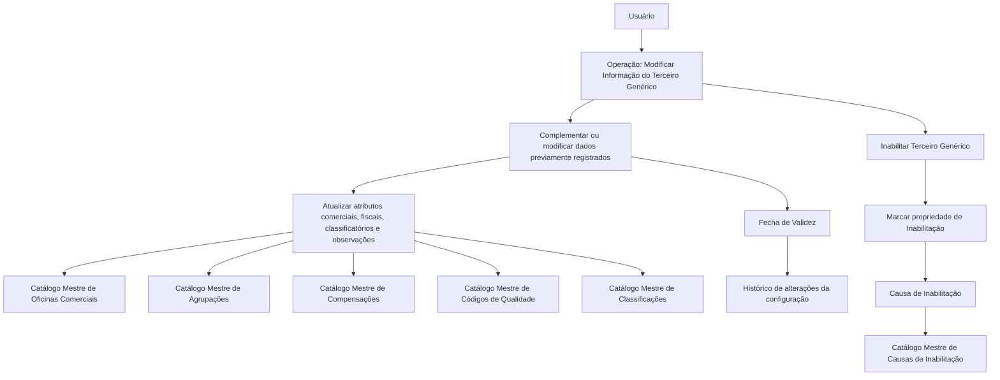

# Operação de Modificação e Inabilitação de Terceiros Genéricos

## 1. Metadados do Documento
- **Arquivo de Origem:** Não identificado no conteúdo fornecido
- **Tipo de Documento:** Especificação Funcional
- **Domínio / Sistema:** Gestão de Terceiros Genéricos em entidade seguradora
- **Público-Alvo:** Negócio, analistas funcionais, desenvolvedores e operação
- **Data/Versão Identificada:** Não identificada

---

## 2. Resumo Executivo & Contexto de Negócio

O documento descreve a operação **“Modificar Información para los Terceros Genéricos”**, destinada a complementar ou alterar informações previamente registradas para um Terceiro Genérico. A operação também permite **inabilitar** o Terceiro Genérico no sistema.

O contexto funcional é o de uma entidade seguradora que mantém dados operacionais, comerciais, fiscais e classificatórios de terceiros. Diversos atributos dependem de catálogos mestres existentes no sistema, tais como catálogos de Oficinas Comerciais, Agrupamentos Comerciais, Compensações, Códigos de Qualidade, Classificações e Causas de Inabilitação.

O documento estabelece que, salvo indicação explícita em contrário, os atributos descritos são utilizados tanto para **Pessoas Físicas** quanto para **Pessoas Jurídicas**. A operação suporta a manutenção histórica por meio da propriedade **Fecha de Validez**, cuja data deve ser igual ou posterior à data previamente registrada.

A inabilitação representa uma restrição operacional: um Terceiro Genérico inabilitado não deve ser empregado, contemplado ou considerado nos processos operacionais da entidade seguradora. Quando houver inabilitação, deve ser informado o código de uma causa definida no catálogo mestre de Causas de Inabilitação.

---

## 3. Arquitetura, Componentes & Tecnologias Envolvidas

O conteúdo não descreve arquitetura técnica, integrações, APIs, bancos de dados, protocolos, URLs, ambientes ou tecnologias de implementação. O documento descreve exclusivamente uma operação funcional de manutenção de cadastro de Terceiros Genéricos dentro de um sistema de entidade seguradora.

### Componentes e entidades funcionais identificadas

| Componente / Entidade | Função identificada |
| :--- | :--- |
| Operação de Modificação | Complementar e modificar informações previamente registradas do Terceiro Genérico. |
| Operação de Inabilitação | Indicar que o Terceiro Genérico está inabilitado e não deve participar dos processos operacionais. |
| Terceiro Genérico | Entidade cadastrada no sistema e sujeita a atributos comerciais, fiscais, classificatórios e operacionais. |
| Catálogo Mestre de Oficinas Comerciais | Fonte de valores para o código de Oficina Comercial Associada. |
| Catálogo Mestre de Agrupações | Fonte de valores para Agrupamento Comercial. |
| Catálogo Mestre de Compensações | Fonte de valores para Forma de Cobro/Pagamento do Segurado. |
| Catálogo Mestre de Códigos de Qualidade | Fonte de valores para a qualidade do Terceiro Genérico. |
| Catálogo Mestre de Causas de Inabilitação | Fonte de valores para a causa de inabilitação. |
| Catálogo Mestre de Classificações | Fonte de valores para a classificação do Terceiro Genérico. |
| Entidade Seguradora | Organização que opera o sistema, configura tipos de retenção localmente e utiliza os dados do Terceiro Genérico. |



> **Nota de Análise:** O documento não detalha métodos HTTP, contratos JSON, persistência de dados, autenticação, telas, APIs, fluxos de aprovação ou validações técnicas além das regras funcionais explicitamente apresentadas.

---

## 4. Regras de Negócio, Especificações Funcionais & Processos

### 4.1 Objetivo da operação

A operação permite:

1. Complementar as informações do Terceiro Genérico registradas previamente.
2. Modificar as informações do Terceiro Genérico registradas previamente.
3. Inabilitar o Terceiro Genérico.

As ações habilitadas apresentadas no documento são:

- **MODIFICAR**
- **INHABILITAR**

### 4.2 Aplicabilidade dos atributos

Caso não exista indicação ou especificação expressa em contrário, os atributos são empregados tanto para:

- Pessoas Físicas.
- Pessoas Jurídicas.

### 4.3 Ordem de captura de dados

O documento indica que os atributos do bloco de informações devem seguir uma sequência de captura:

- Da esquerda para a direita.
- De cima para baixo.

> **Nota de Análise:** O conteúdo fornecido não apresenta a tela, formulário ou a ordenação visual completa dos campos; portanto, não é possível reconstruir a sequência específica de todos os atributos.

### 4.4 Regras para atributos comerciais

- **Oficina Comercial Associada:** deve conter o código do terceiro nível da Estrutura Comercial de origem do Terceiro Genérico.
- O valor de Oficina Comercial Associada deve estar de acordo com a relação de valores existente no catálogo mestre de Oficinas Comerciais do sistema.
- **Agrupamento Comercial:** deve conter o agrupamento comercial associado ao Terceiro Genérico.
- O valor de Agrupamento Comercial deve corresponder a um valor definido no catálogo mestre de Agrupações do sistema.
- **Compensação:** deve indicar o código da Forma de Cobro/Pagamento do Segurado.
- O código de Compensação deve corresponder a uma das Formas de Compensação definidas no catálogo mestre de Compensações.

### 4.5 Regras para atributos de qualidade, retenção e classificação

- **Calidad del Tercero Genérico:** deve conter a condição de qualidade vinculada ao Terceiro Genérico.
- O valor de qualidade deve pertencer aos valores existentes no catálogo mestre de Códigos de Qualidade.
- **Tipo de Retención:** deve conter o código de um dos tipos de retenção configurados localmente pela entidade seguradora.
- **Clasificación:** deve conter a classificação do Terceiro Genérico.
- O valor de classificação deve pertencer à relação de valores existente no catálogo mestre de Classificações.

### 4.6 Regra de validade e histórico

A propriedade **Fecha de Validez** indica a data a partir da qual o Terceiro Genérico está plenamente operacional no sistema.

A utilização correta de Fecha de Validez permite à entidade seguradora manter um histórico das alterações efetuadas na configuração do Terceiro Genérico.

Regra obrigatória de data:

- O valor de Fecha de Validez deve ser igual à data previamente registrada; ou
- O valor de Fecha de Validez deve ser posterior à data previamente registrada.

O documento não permite inferir se existe restrição para datas futuras, formato obrigatório de data, fuso horário ou comportamento em caso de data inválida.

### 4.7 Regra de inabilitação

A propriedade **Inhabilitación** indica ao sistema que o Terceiro Genérico está inabilitado.

Consequência operacional da inabilitação:

- O Terceiro Genérico não deve ser utilizado.
- O Terceiro Genérico não deve ser contemplado.
- O Terceiro Genérico não deve ser considerado nos processos operacionais da entidade seguradora.

### 4.8 Regra para causa de inabilitação

Quando o Terceiro Genérico estiver inabilitado:

- O atributo **Causa de Inhabilitación** deve conter o código de uma das Causas de Inabilitação definidas no catálogo mestre do sistema.

> **Nota de Análise:** O documento não especifica se Causa de Inhabilitación é obrigatória antes de selecionar Inhabilitación ou se o sistema aplica validação automática entre ambos os atributos. A única condição explicitada é que, estando o Terceiro Genérico inabilitado, o atributo deve conter um código de causa definido no catálogo mestre.

### 4.9 Regras fiscais e profissionais

- **Número de Colegiación:** contém a chave ou código da Cédula Profissional pela qual o Terceiro Genérico, por pertencer a um colégio profissional ou associação oficial semelhante, está habilitado a exercer a profissão.
- **Identificación Fiscal:** contém a chave do identificador fiscal do Terceiro Genérico de acordo com a legislação do país onde está localizada a entidade seguradora.
- **IVA:** contém o tipo de Imposto sobre Valor Agregado que identifica o gravame fiscal do Terceiro Genérico pelos serviços prestados à entidade seguradora.

### 4.10 Observações

O campo **Observaciones** permite ao usuário registrar informações adicionais sobre o Terceiro Genérico.

O conteúdo das observações deve seguir os direcionamentos ou diretrizes que possam ser definidos pelas Direções de Negócio da entidade seguradora.

---

## 5. Tabelas de Parâmetros, Ambientes e Estruturas de Dados

| Item / Parâmetro | Descrição / Função | Tipo / Valores / Formato | Ambiente / Observações |
| :--- | :--- | :--- | :--- |
| Ação MODIFICAR | Complementa ou modifica informações previamente registradas do Terceiro Genérico. | Ação habilitada. | Não há detalhamento técnico da execução. |
| Ação INHABILITAR | Permite marcar o Terceiro Genérico como inabilitado. | Ação habilitada. | O Terceiro Genérico não deve ser utilizado nos processos operacionais. |
| Oficina Comercial Associada | Código do terceiro nível da Estrutura Comercial de procedência do Terceiro Genérico. | Código pertencente ao catálogo mestre de Oficinas Comerciais. | O documento não informa formato, tamanho ou lista de códigos. |
| Agrupamento Comercial | Agrupamento comercial associado ao Terceiro Genérico. | Valor definido no catálogo mestre de Agrupações. | Não há formato ou obrigatoriedade especificados. |
| Compensação | Código da Forma de Cobro/Pagamento do Segurado. | Código definido no catálogo mestre de Compensações. | Associado às formas de compensação do sistema. |
| Calidad del Tercero Genérico | Condição de qualidade vinculada ao Terceiro Genérico. | Valor existente no catálogo mestre de Códigos de Qualidade. | O documento mantém a denominação original em espanhol. |
| Tipo de Retención | Código de um tipo de retenção. | Código configurado localmente pela entidade seguradora. | Não há catálogo mestre explicitamente indicado para este atributo. |
| Fecha de Validez | Data a partir da qual o Terceiro Genérico está plenamente operacional. | Data igual ou posterior à data previamente registrada. | Permite manter histórico de alterações de configuração. |
| Inhabilitación | Indica que o Terceiro Genérico está inabilitado no sistema. | Propriedade de inabilitação; valores não especificados. | O Terceiro Genérico não deve ser empregado, contemplado ou considerado operacionalmente. |
| Causa de Inhabilitación | Código que identifica a razão da inabilitação. | Código de uma Causa de Inabilitação definida no catálogo mestre. | Aplicável quando o Terceiro Genérico estiver inabilitado. |
| Clasificación | Classificação atribuída ao Terceiro Genérico. | Valor existente no catálogo mestre de Classificações. | O documento não informa as classificações possíveis. |
| Número de Colegiación | Chave ou código da Cédula Profissional do Terceiro Genérico. | Código ou chave; formato não especificado. | Relacionado à habilitação profissional por colégio ou associação oficial semelhante. |
| Identificación Fiscal | Chave do identificador fiscal do Terceiro Genérico. | Identificador fiscal conforme a legislação local. | A legislação aplicável é a do país onde está a entidade seguradora. |
| IVA | Tipo de Imposto sobre Valor Agregado aplicado aos serviços prestados. | Tipo de IVA; valores não especificados. | Identifica o gravame fiscal do Terceiro Genérico. |
| Observaciones | Campo para registro de informação adicional. | Texto; formato e tamanho não especificados. | Deve atender aos direcionamentos das Direções de Negócio. |

### Catálogos mestres mencionados

| Catálogo Mestre | Atributo dependente | Uso |
| :--- | :--- | :--- |
| Oficinas Comerciais | Oficina Comercial Associada | Define valores válidos para o código do terceiro nível da Estrutura Comercial. |
| Agrupaciones | Agrupamento Comercial | Define valores válidos para o agrupamento comercial. |
| Compensaciones | Compensação | Define as possíveis Formas de Compensação. |
| Códigos de Calidad | Calidad del Tercero Genérico | Define valores válidos para a condição de qualidade. |
| Causas de Inhabilitación | Causa de Inhabilitación | Define códigos válidos para a razão de inabilitação. |
| Clasificaciones | Clasificación | Define valores válidos para a classificação do Terceiro Genérico. |

---

## 6. Bateria de Perguntas & Respostas para RAG (FAQ Sintético)

### P1: Qual é o objetivo da operação de modificação de Terceiros Genéricos?
**R:** A operação permite complementar e modificar informações previamente registradas de um Terceiro Genérico. A operação também permite inabilitar o Terceiro Genérico no sistema.

### P2: Quais ações estão habilitadas para o Terceiro Genérico?
**R:** O documento apresenta duas ações habilitadas: **MODIFICAR** e **INHABILITAR**. MODIFICAR é utilizada para complementar ou alterar informações registradas; INHABILITAR é utilizada para indicar que o Terceiro Genérico não deve participar dos processos operacionais da entidade seguradora.

### P3: Os atributos descritos se aplicam apenas a Pessoas Físicas?
**R:** Não. Se não houver indicação ou especificação expressa em contrário, os atributos descritos são utilizados tanto para Pessoas Físicas quanto para Pessoas Jurídicas.

### P4: Qual é a regra para a Fecha de Validez do Terceiro Genérico?
**R:** Fecha de Validez indica a data a partir da qual o Terceiro Genérico está plenamente operacional no sistema. O valor informado deve ter a mesma data ou uma data posterior à registrada previamente. Esse atributo permite manter histórico de alterações na configuração do Terceiro Genérico.

### P5: O que acontece quando um Terceiro Genérico é inabilitado?
**R:** A propriedade Inhabilitación informa ao sistema que o Terceiro Genérico está inabilitado. Como consequência, o Terceiro Genérico não deve ser empregado, contemplado ou considerado nos processos operacionais da entidade seguradora.

### P6: Qual informação deve ser fornecida para um Terceiro Genérico inabilitado?
**R:** Quando o Terceiro Genérico estiver inabilitado, o atributo Causa de Inhabilitación deve conter o código de uma das Causas de Inabilitação definidas no catálogo mestre do sistema.

### P7: Como deve ser preenchida a Oficina Comercial Associada?
**R:** Oficina Comercial Associada deve conter o código do terceiro nível da Estrutura Comercial de onde procede o Terceiro Genérico. O código deve estar de acordo com a relação de valores existente no catálogo mestre de Oficinas Comerciais do sistema.

### P8: O que representa o atributo Compensação?
**R:** Compensação indica o código da Forma de Cobro/Pagamento do Segurado. O código deve corresponder a uma das possíveis Formas de Compensação definidas no catálogo mestre de Compensações.

### P9: Como é definido o Tipo de Retenção?
**R:** Tipo de Retención contém o código de um dos Tipos de Retenção configurados localmente pela entidade seguradora. O documento não detalha os códigos disponíveis nem a estrutura do cadastro local.

### P10: Qual é a finalidade do Número de Colegiación?
**R:** Número de Colegiación contém a chave ou código da Cédula Profissional pela qual o Terceiro Genérico, por pertencer a um colégio profissional ou associação semelhante de caráter oficial, está habilitado a exercer sua profissão.

### P11: Como deve ser interpretada a Identificación Fiscal?
**R:** Identificación Fiscal é a chave do identificador fiscal do Terceiro Genérico. O identificador deve estar de acordo com a legislação do país onde a entidade seguradora está localizada.

### P12: Para que serve o campo Observaciones?
**R:** Observaciones permite que o usuário registre informações adicionais sobre o Terceiro Genérico. As informações devem seguir os direcionamentos ou diretrizes que possam ser definidos pelas Direções de Negócio da entidade seguradora.

---

## 7. Glossário de Termos, Siglas & Conceitos-Chave

- **Terceiro Genérico:** Entidade cadastrada no sistema cuja informação pode ser complementada, modificada ou inabilitada.
- **MODIFICAR:** Ação habilitada para complementar ou modificar informações previamente registradas do Terceiro Genérico.
- **INHABILITAR:** Ação habilitada para indicar que o Terceiro Genérico não deve ser utilizado nos processos operacionais.
- **Oficina Comercial Associada:** Código do terceiro nível da Estrutura Comercial de procedência do Terceiro Genérico.
- **Agrupamento Comercial:** Agrupação comercial associada ao Terceiro Genérico.
- **Compensação:** Código da Forma de Cobro/Pagamento do Segurado.
- **Calidad del Tercero Genérico:** Condição de qualidade vinculada ao Terceiro Genérico.
- **Tipo de Retención:** Código de um tipo de retenção configurado localmente pela entidade seguradora.
- **Fecha de Validez:** Data a partir da qual o Terceiro Genérico está plenamente operacional no sistema.
- **Inhabilitación:** Propriedade que indica que o Terceiro Genérico está inabilitado no sistema.
- **Causa de Inhabilitación:** Código da causa que justifica a inabilitação de um Terceiro Genérico.
- **Clasificación:** Classificação do Terceiro Genérico conforme catálogo mestre de Classificações.
- **Número de Colegiación:** Chave ou código da Cédula Profissional que habilita o Terceiro Genérico a exercer a profissão.
- **Identificación Fiscal:** Identificador fiscal do Terceiro Genérico, conforme a legislação aplicável.
- **IVA:** Imposto sobre Valor Agregado aplicável aos serviços prestados pelo Terceiro Genérico à entidade seguradora.
- **Catálogo Mestre:** Repositório de valores permitidos para determinados atributos do sistema.
- **Entidade Seguradora:** Organização que opera o sistema, mantém configurações locais e utiliza os dados dos Terceiros Genéricos.

---

## 8. Notas Críticas, Riscos & Limitações

- O documento não identifica o nome do sistema, versão, data, autor, ambiente, URLs, servidores, APIs, banco de dados ou tecnologias de implementação.
- Não há detalhamento sobre obrigatoriedade geral dos campos, tipos técnicos de dados, tamanhos máximos, máscaras, expressões de validação, mensagens de erro ou comportamento de persistência.
- O documento não apresenta a lista de valores dos catálogos mestres, apenas informa a existência desses catálogos.
- Não há especificação de fluxo de aprovação, perfis de acesso, matriz de permissões ou auditoria para as ações MODIFICAR e INHABILITAR.
- Não é informado se um Terceiro Genérico inabilitado pode ser reabilitado, nem quais regras se aplicariam a uma possível reabilitação.
- A regra de Causa de Inhabilitación é condicionada à situação de inabilitação, mas o documento não detalha o comportamento do sistema quando a causa estiver ausente ou inválida.
- O documento cita exemplos para Causa de Inhabilitación e Observaciones, mas o conteúdo dos exemplos não foi fornecido.
- O conteúdo contém referências de navegação ou interface — “Inicio Soluciones APIs Documentación Zeus” — sem explicação funcional adicional.

---

## 9. Conteúdo Bruto Estruturado (Referência Fiel)

```text
--- [PÁGINA 1 DE 3] ---

MODIFICAR Información para los Terceros
Genéricos
Objetivo
Esta Operación permite Complementar y Modificar la información del Tercero Genérico registrada
previamente además de poder Inhabilitarlo.
Acciones habilitadas
 MODIFICAR ( )
 INHABILITAR ( )
Datos Tercero Genérico
De Izquierda a Derecha y de Arriba hacia Abajo, los siguientes atributos marcan la secuencia de
captura en este Bloque de Información.
 / 
 RS
Inicio Soluciones APIs Documentación Zeus
ES


--- [PÁGINA 2 DE 3] ---

Si no se especifica o indica expresamente, los Atributos se emplearán tanto en Personas Físicas
como en Personas Jurídicas
Oficina Comercial Asociada (  )
Este atributo contiene el código del Tercer Nivel de la Estructura Comercial del que procede el
Tercero Genérico, de acuerdo con la relación de valores existentes en el catálogo maestro de
Oficinas Comerciales existente en el Sistema.
Agrupamiento Comercial (  )
Este Campo contendrá la Agrupación Comercial que se asocia al Tercero Genérico de acuerdo con la
relación de valores definidos en el catálogo maestro de Agrupaciones existente en el Sistema.
Compensación (  )
Este Dato indicará el Código de la Forma de Cobro/Pago del Asegurado de acuerdo con las posibles
Formas de Compensación definidas en el catálogo maestro de Compensaciones
Calidad del Tercero Genérico (  )
Este Campo contendrá la condición de calidad vinculada al Tercero Genérico de acuerdo con uno de
valores existentes en el catálogo maestro de Códigos de Calidad existente en el Sistema.
Tipo de Retención (  )
Este Dato contiene el código de uno de los Tipos de Retención configurados localmente por la
Entidad Aseguradora.
Fecha de Validez ( )
Esta propiedad indica la fecha a partir de la cual el Tercero Genérico está plenamente operativo en el
sistema por lo que su empleo y correcta utilización permite tener en la entidad Aseguradora un
histórico de los cambios efectuados en la configuración del Tercero.
Por tanto su valor tendrá que tener la misma fecha u otra superior a la registrada previamente.
Inhabilitación ( )
Esta propiedad le indica al Sistema que el Tercero Genérico está inhabilitado en el Sistema por lo
que no debería ser empleado, contemplado o considerado en los procesos operativos de la entidad.
Causa de Inhabilitación (   )
Ejemplo:


--- [PÁGINA 3 DE 3] ---

En el supuesto que el Tercero Genérico estuviera Inhabilitado, este atributo contendrá el código de
una de las Causas de Inhabilitación definidas en el catálogo maestro del Sistema.
Clasificación (  )
Este Campo contendrá la Clasificación del Tercero Genérico de acuerdo con la relación de valores
existentes en el catálogo maestro de Clasificaciones existente en el Sistema.
Número de Colegiación ( )
Este Campo va a contener la clave ó código de la Cédula Profesional por la que el Tercero, por
pertenecer a un colegio profesional o asociación semejante de carácter oficial, está habilitado para
ejercer en el desempeño de su profesión.
Identificación Fiscal ( )
Clave del Identificador fiscal del Tercero Genérico de acuerdo con la Legislación del País en el que
se ubica la Entidad Aseguradora.
IVA (  )
Este campo contiene el Tipo del Impuesto de Valor Añadido (IVA) que identificará el gravamen fiscal
del Tercero Genérico por los servicios prestados a la Entidad Aseguradora.
Observaciones ( )
El propósito de este campo permite al Usuario capturar información adicional del Tercero Genérico de
acuerdo con los Planteamientos o directrices que pudieran efectuar las Direcciones de Negocio de la
entidad aseguradora.
Ejemplo:
```
