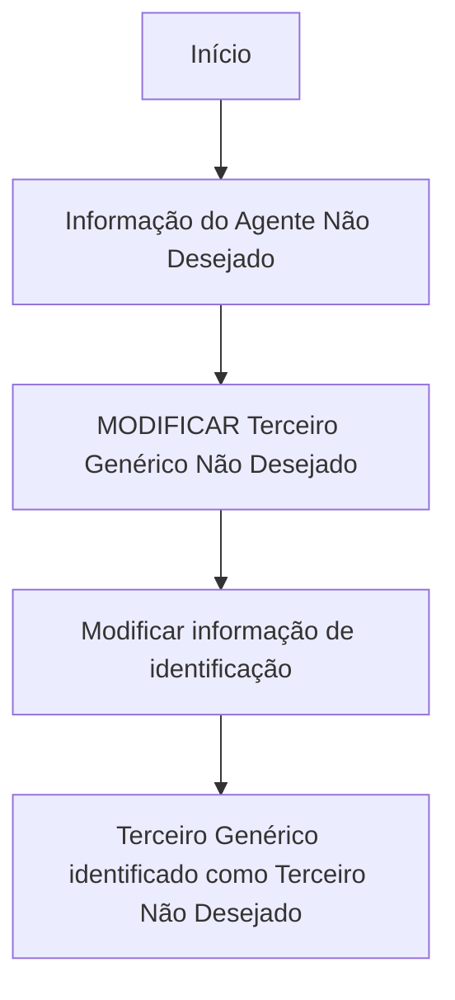

# Operação “Modificar Agente como Terceiro Não Desejado”

## 1. Metadados do Documento
- **Arquivo de Origem:** `Não identificado (texto bruto fornecido)`
- **Tipo de Documento:** `Procedimento`
- **Domínio / Sistema:** `Operação de Terceiro Genérico Não Desejado`
- **Público-Alvo:** `Operação e usuários de negócio`
- **Data/Versão Identificada:** `Não identificada`

---

## 2. Resumo Executivo & Contexto de Negócio

O conteúdo descreve a operação **“Modificar Agente como Terceiro Não Desejado”**. A finalidade declarada é alterar as informações do **Terceiro Genérico** pelas quais esse terceiro é identificado como **Terceiro Não Desejado**.

A operação está associada à seção ou funcionalidade denominada **“Informação do Agente Não Desejado”**. O texto também apresenta a ação **“MODIFICAR Terceiro Genérico Não Desejado”**, indicando que a modificação incide sobre o cadastro ou identificação do terceiro genérico nessa condição.

O material fornecido não descreve campos alteráveis, critérios de validação, permissões, persistência, integrações, métodos HTTP, contratos de dados ou etapas detalhadas de execução. Também não apresenta definição explícita para os termos “Agente”, “Terceiro Genérico” e “Terceiro Não Desejado”.

---

## 3. Arquitetura, Componentes & Tecnologias Envolvidas

Os elementos explicitamente citados são:

| Componente / Elemento | Papel identificado no conteúdo |
| :--- | :--- |
| Operação “Modificar Agente como Terceiro Não Desejado” | Operação para modificar a informação identificadora de um Terceiro Genérico como Terceiro Não Desejado. |
| Informação do Agente Não Desejado | Seção ou contexto funcional relacionado à operação. |
| MODIFICAR Terceiro Genérico Não Desejado | Ação apresentada no conteúdo. |
| Soluciones | Item de navegação citado. |
| APIs | Item de navegação citado. |
| Documentación | Item de navegação citado. |
| Zeus | Item de navegação citado. |
| RS | Sigla ou identificador exibido, sem explicação adicional. |
| ES | Identificador de idioma ou sigla exibida, sem explicação adicional. |



> **Nota de Análise:** O fluxo Mermaid representa somente a sequência funcional inferida literalmente da descrição. O documento não detalha sistemas, APIs, tecnologias, bancos de dados, contratos ou integrações.

---

## 4. Regras de Negócio, Especificações Funcionais & Processos

1. A operação é denominada **“Modificar Agente como Terceiro Não Desejado”**.
2. A operação permite modificar a informação do **Terceiro Genérico**.
3. A informação modificada é aquela pela qual o Terceiro Genérico é identificado como **Terceiro Não Desejado**.
4. A operação está contextualizada pela expressão **“Informação do Agente Não Desejado”**.
5. O conteúdo apresenta a ação **“MODIFICAR Terceiro Genérico Não Desejado”**.
6. Não há descrição dos atributos da informação do Terceiro Genérico que podem ser modificados.
7. Não há critérios de elegibilidade para classificar um Terceiro Genérico como Terceiro Não Desejado.
8. Não há regras de validação, aprovação, auditoria, reversão ou confirmação da alteração.
9. Não há detalhamento sobre responsabilidades, perfis de acesso ou permissões necessárias para executar a operação.

---

## 5. Tabelas de Parâmetros, Ambientes e Estruturas de Dados

| Item / Parâmetro | Descrição / Função | Tipo / Valores / Formato | Ambiente / Observações |
| :--- | :--- | :--- | :--- |
| Operação | Modificar Agente como Terceiro Não Desejado | Operação funcional | Não há ambiente identificado. |
| Entidade alvo | Terceiro Genérico | Entidade de negócio | Identificado como Terceiro Não Desejado. |
| Informação modificada | Informação pela qual o Terceiro Genérico é identificado como Terceiro Não Desejado | Não especificado | Os campos e formatos não são detalhados. |
| Seção funcional | Informação do Agente Não Desejado | Seção ou contexto funcional | Sem detalhamento adicional. |
| Ação | MODIFICAR Terceiro Genérico Não Desejado | Ação de modificação | Exibida literalmente no conteúdo. |
| RS | Não especificado | Sigla ou identificador | O documento não define o significado. |
| ES | Não especificado | Sigla ou identificador | Aparece junto à navegação; pode indicar idioma, mas não há confirmação textual. |
| Zeus | Não especificado | Item de navegação ou sistema | O papel não é detalhado. |

---

## 6. Bateria de Perguntas & Respostas para RAG (FAQ Sintético)

### P1: Em que consiste a operação “Modificar Agente como Terceiro Não Desejado”?
**R:** A operação permite modificar a informação do Terceiro Genérico pela qual o Terceiro Genérico é identificado como Terceiro Não Desejado.

### P2: Qual entidade é alterada pela operação descrita?
**R:** A entidade mencionada é o **Terceiro Genérico**, especificamente a informação que o identifica como Terceiro Não Desejado.

### P3: A operação cria um novo Terceiro Genérico?
**R:** Não. O conteúdo descreve uma operação de modificação da informação de um Terceiro Genérico. Não há indicação de criação de um novo registro.

### P4: Quais campos podem ser modificados no Terceiro Genérico Não Desejado?
**R:** O documento não informa quais campos ou atributos podem ser modificados. Apenas estabelece que a informação de identificação como Terceiro Não Desejado pode ser alterada.

### P5: Qual é a seção funcional associada à modificação?
**R:** A seção ou contexto funcional apresentado é **“Informação do Agente Não Desejado”**.

### P6: O documento especifica uma API para modificar o Terceiro Genérico Não Desejado?
**R:** Não. Embora “APIs” apareça como item de navegação, o conteúdo não fornece endpoint, método HTTP, parâmetros, payload, resposta ou contrato de API.

### P7: Existem regras de validação para alterar a identificação de Terceiro Não Desejado?
**R:** Não há regras de validação descritas no texto fornecido.

### P8: O documento informa quais perfis podem executar a operação?
**R:** Não. O conteúdo não descreve perfis, papéis, permissões ou controles de acesso.

### P9: O que significa a ação “MODIFICAR Terceiro Genérico Não Desejado”?
**R:** A ação indica a modificação do Terceiro Genérico que está identificado como Terceiro Não Desejado. O comportamento detalhado da ação não é especificado.

### P10: O que é “RS” no contexto da operação?
**R:** O conteúdo exibe “RS”, mas não define seu significado ou função.

---

## 7. Glossário de Termos, Siglas & Conceitos-Chave

- **Agente Não Desejado:** Termo usado na seção “Informação do Agente Não Desejado”; não possui definição adicional no conteúdo.
- **Terceiro Genérico:** Entidade cuja informação pode ser modificada para identificação como Terceiro Não Desejado.
- **Terceiro Não Desejado:** Classificação ou identificação atribuída ao Terceiro Genérico conforme o texto.
- **RS:** Sigla ou identificador presente no conteúdo, sem expansão ou definição.
- **ES:** Sigla ou identificador presente no conteúdo, sem expansão ou definição.
- **Zeus:** Item citado na navegação, sem função detalhada.

---

## 8. Notas Críticas, Riscos & Limitações

- O documento não identifica o arquivo de origem, data, versão, autor ou proprietário funcional.
- Não são informados os campos modificáveis, formatos, obrigatoriedades ou valores permitidos.
- Não há fluxo detalhado de tela, confirmação, persistência, aprovação ou reversão.
- Não são apresentados controles de acesso, matriz de permissões ou trilha de auditoria.
- Não há especificação técnica de APIs, integrações, tecnologias, serviços ou banco de dados.
- **Nota de Análise:** O documento descreve a finalidade da operação, mas não detalha o procedimento operacional nem os critérios para classificar um Terceiro Genérico como Terceiro Não Desejado.

---

## 9. Conteúdo Bruto Estruturado (Referência Fiel)

```text
--- [PÁGINA 1 DE 1] ---

OPERACIÓN MODIFICAR Agente como Tercero
no Deseado
¿En que consiste?
Esta operación permite Modificar la información del Tercero Genérico por la que se le identifica
como Tercero No Deseado.
Información del Agente No Deseado
 MODIFICAR Tercero Genérico No Deseado (  )
 / 
 RS
Inicio Soluciones APIs Documentación Zeus
ES
```
