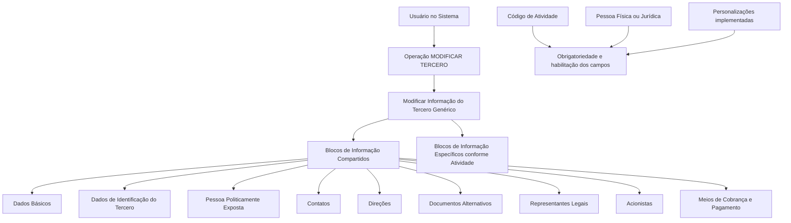

# Operação MODIFICAR Tercero Genérico — Procedimento de Atualização Cadastral

## 1. Metadados do Documento
- **Arquivo de Origem:** Não identificado
- **Tipo de Documento:** Procedimento
- **Domínio / Sistema:** Cadastro de Tercero Genérico
- **Público-Alvo:** Operação, usuários do sistema e analistas funcionais
- **Data/Versão Identificada:** Não identificada

---

## 2. Resumo Executivo & Contexto de Negócio

O documento descreve a operação **MODIFICAR TERCERO**, destinada a complementar, modificar e/ou inabilitar informações de um **Tercero Genérico**. A atualização pode ocorrer em qualquer bloco ou estrutura de dados que agrupe informações cadastrais do terceiro.

A obrigatoriedade e a habilitação dos campos não são fixas. Esses comportamentos podem variar conforme o código de atividade do terceiro, a classificação como pessoa física ou pessoa jurídica e personalizações previamente implementadas na aplicação.

O procedimento também informa que o usuário pode seguir diferentes ordens de captura dos dados nos blocos de informação. Portanto, o fluxo apresentado identifica conjuntos de informações passíveis de atualização, mas não estabelece uma sequência obrigatória de preenchimento.

O conteúdo não especifica interfaces, métodos HTTP, contratos de integração, tecnologias, regras de persistência, trilha de auditoria ou critérios detalhados para inabilitação de dados.

---

## 3. Arquitetura, Componentes & Tecnologias Envolvidas

O documento menciona a operação **MODIFICAR TERCERO** e blocos de informação compartilhados ou específicos conforme a atividade do terceiro. Não há tecnologias, microsserviços, bancos de dados, endpoints, ambientes ou integrações técnicas identificados.



**Nota de Análise:** o documento cita blocos de informação e condições que influenciam a habilitação ou obrigatoriedade de campos, mas não detalha a estrutura de dados, os campos internos, os valores permitidos ou os mecanismos técnicos de validação.

---

## 4. Regras de Negócio, Especificações Funcionais & Processos

### Objetivo da operação
A operação **MODIFICAR TERCERO** permite:

1. Complementar informações do Tercero Genérico.
2. Modificar informações do Tercero Genérico.
3. Inabilitar informações do Tercero Genérico.
4. Atualizar qualquer bloco ou estrutura de dados que contenha e agrupe informações do Tercero Genérico.

### Premissas de obrigatoriedade e habilitação

1. A obrigatoriedade e/ou habilitação dos campos em cada bloco ou estrutura de informação compartilhada pode variar conforme o **código de atividade do Tercero**.
2. A obrigatoriedade e/ou habilitação dos campos pode variar quando o tipo de Tercero for:
   - Pessoa Física.
   - Pessoa Jurídica.
3. Personalizações implementadas podem afetar o comportamento da aplicação em relação à obrigatoriedade de registro dos dados do Tercero.
4. A ordem de captura dos dados entre os blocos de informação pode variar conforme o critério adotado pelo usuário no sistema.

### Blocos de informação compartilhados

A operação relaciona os seguintes blocos compartilhados para modificação de informações:

- Dados Básicos.
- Dados de Identificação do Tercero.
- Pessoa Politicamente Exposta.
- Contatos.
- Direções.
- Documentos Alternativos.
- Representantes Legais.
- Acionistas.
- Meios de Cobrança e Pagamento.

### Blocos específicos

Além dos blocos compartilhados, a operação contempla **blocos de informação específicos de acordo com a atividade do Tercero**.

**Nota de Análise:** o documento não detalha quais atividades possuem blocos específicos, quais campos existem em cada bloco, nem os critérios de validação aplicáveis a cada tipo de terceiro.

---

## 5. Tabelas de Parâmetros, Ambientes e Estruturas de Dados

| Item / Parâmetro | Descrição / Função | Tipo / Valores / Formato | Ambiente / Observações |
| :--- | :--- | :--- | :--- |
| Operação MODIFICAR TERCERO | Operação para complementar, modificar e/ou inabilitar informações do Tercero Genérico. | Operação funcional. | Sistema não identificado. |
| Tercero Genérico | Entidade cujas informações podem ser atualizadas em blocos ou estruturas de dados. | Entidade cadastral. | Não há definição adicional no documento. |
| Código de atividade do Tercero | Critério que pode alterar a obrigatoriedade e/ou habilitação de campos. | Código de atividade. | Valores não especificados. |
| Tipo de Tercero | Critério que pode alterar a obrigatoriedade e/ou habilitação de campos. | Pessoa Física ou Pessoa Jurídica. | Não há regras detalhadas por tipo. |
| Personalizações implementadas | Customizações que podem afetar a obrigatoriedade do registro de dados do Tercero. | Personalização da aplicação. | Não detalhada. |
| Dados Básicos | Bloco de informação compartilhado. | Estrutura de dados. | Campos não especificados. |
| Dados de Identificação do Tercero | Bloco de informação compartilhado. | Estrutura de dados. | Campos não especificados. |
| Pessoa Politicamente Exposta | Bloco de informação compartilhado. | Estrutura de dados. | Campos e critérios não especificados. |
| Contatos | Bloco de informação compartilhado. | Estrutura de dados. | Campos não especificados. |
| Direções | Bloco de informação compartilhado. | Estrutura de dados. | Campos não especificados. |
| Documentos Alternativos | Bloco de informação compartilhado. | Estrutura de dados. | Campos não especificados. |
| Representantes Legais | Bloco de informação compartilhado. | Estrutura de dados. | Campos não especificados. |
| Acionistas | Bloco de informação compartilhado. | Estrutura de dados. | Campos não especificados. |
| Meios de Cobrança e Pagamento | Bloco de informação compartilhado. | Estrutura de dados. | Campos não especificados. |
| Blocos específicos por atividade | Estruturas de informação aplicáveis de acordo com a atividade do Tercero. | Estrutura de dados específica. | Não detalhados. |

---

## 6. Bateria de Perguntas & Respostas para RAG (FAQ Sintético)

### P1: Qual é a finalidade da operação MODIFICAR TERCERO?
**R:** A operação MODIFICAR TERCERO serve para complementar, modificar e/ou inabilitar informações de um Tercero Genérico em qualquer bloco ou estrutura de dados que contenha e agrupe essas informações.

### P2: A operação MODIFICAR TERCERO permite apenas alterar informações existentes?
**R:** Não. O documento informa que a operação permite complementar, modificar e/ou inabilitar informações do Tercero Genérico.

### P3: A obrigatoriedade dos campos é igual para todos os terceiros?
**R:** Não. A obrigatoriedade e/ou habilitação dos campos pode variar conforme o código de atividade do Tercero, o tipo de Tercero — Pessoa Física ou Pessoa Jurídica — e personalizações implementadas na aplicação.

### P4: Como o código de atividade do Tercero afeta o cadastro?
**R:** O código de atividade do Tercero pode alterar a obrigatoriedade e/ou a habilitação dos campos registrados nos blocos ou estruturas de informação compartilhada.

### P5: O tipo de Tercero influencia os campos exigidos?
**R:** Sim. O documento estabelece que a obrigatoriedade e/ou habilitação dos campos pode variar se o Tercero for uma Pessoa Física ou uma Pessoa Jurídica.

### P6: As personalizações da aplicação podem alterar o comportamento da operação?
**R:** Sim. As personalizações que tenham sido implementadas podem afetar o comportamento da aplicação em relação à obrigatoriedade no registro dos Dados do Tercero.

### P7: Existe uma sequência obrigatória para preencher os blocos de informação?
**R:** Não há uma sequência obrigatória identificada. O documento informa que a ordem de captura dos dados nos distintos blocos de informação pode variar de acordo com o critério seguido pelo usuário no sistema.

### P8: Quais blocos de informação compartilhados podem ser modificados?
**R:** Os blocos listados são: Dados Básicos, Dados de Identificação do Tercero, Pessoa Politicamente Exposta, Contatos, Direções, Documentos Alternativos, Representantes Legais, Acionistas e Meios de Cobrança e Pagamento.

### P9: Há blocos de informação além dos blocos compartilhados?
**R:** Sim. O procedimento menciona blocos de informação específicos de acordo com a atividade do Tercero, mas não especifica quais são esses blocos ou quais atividades os determinam.

### P10: O documento descreve os campos internos de Dados Básicos e Dados de Identificação do Tercero?
**R:** Não. O documento apenas relaciona esses itens como blocos de informação compartilhados e não detalha seus campos, formatos, validações ou valores permitidos.

---

## 7. Glossário de Termos, Siglas & Conceitos-Chave

- **Tercero Genérico:** entidade cadastral cujas informações podem ser complementadas, modificadas ou inabilitadas pela operação MODIFICAR TERCERO.
- **MODIFICAR TERCERO:** operação funcional voltada à atualização de informações de um Tercero Genérico.
- **Blocos de Informação Compartidos:** conjuntos de informações compartilhadas relacionados ao cadastro do Tercero Genérico.
- **Blocos de Informação Específicos:** estruturas de informação aplicáveis de acordo com a atividade do Tercero.
- **Pessoa Física:** tipo de Tercero citado como critério que pode influenciar a obrigatoriedade e a habilitação de campos.
- **Pessoa Jurídica:** tipo de Tercero citado como critério que pode influenciar a obrigatoriedade e a habilitação de campos.
- **Pessoa Politicamente Exposta:** bloco de informação compartilhado listado no processo MODIFICAR TERCERO.
- **Meios de Cobrança e Pagamento:** bloco de informação compartilhado listado no processo MODIFICAR TERCERO.

---

## 8. Notas Críticas, Riscos & Limitações

- O documento não identifica arquivo de origem, versão, data, sistema, ambiente ou responsáveis pelo processo.
- Não há detalhamento dos campos, tipos de dados, formatos, regras de validação ou mensagens de erro para os blocos de informação.
- Não são definidos os critérios para complementar, modificar ou inabilitar dados.
- Não são especificados os blocos de informação aplicáveis a cada código de atividade do Tercero.
- Não há matriz que relacione Pessoa Física, Pessoa Jurídica, atividade e obrigatoriedade de campos.
- Não são descritos controles de autorização, auditoria, persistência, integração ou reversão de alterações.
- Os termos de navegação “Inicio”, “Soluciones”, “APIs”, “Documentación”, “Zeus”, “ES” e “RS” aparecem na extração, mas não possuem explicação funcional adicional.

---

## 9. Conteúdo Bruto Estruturado (Referência Fiel)

```text
--- [PÁGINA 1 DE 2] ---

OPERACIÓN MODIFICAR Tercero Genérico
Esta operación consiste en Complementar, Modificar y/o Inhabilitar la información del Tercero
Genérico en cualquiera de los bloques o estructuras de datos que la contienen y agrupan.
Premisas
La obligatoriedad y/o la habilitación de los campos en el registro de los datos de cada uno de
los bloques o estructuras de información compartidas puede variar de acuerdo con el código de
actividad del Tercero:
La obligatoriedad y/o la habilitación de los campos en el registro de los datos de cada uno de
los bloques o estructuras de información pueden variar si el tipo de Tercero es una Persona
Física o una Persona Jurídica:
Las personalizaciones que se hubieran podido implementar a su vez pueden afectar el
comportamiento de la aplicación en relación con la obligatoriedad en el registro de los Datos del
Tercero.
Por último, el orden de captura de los datos en los distintos bloques de Información puede
variar de acuerdo con el criterio seguido por el Usuario en el Sistema.
Ejemplo:
Ejemplo:
 / 
 RS
Inicio Soluciones APIs Documentación Zeus
ES


--- [PÁGINA 2 DE 2] ---

Proceso
MODIFICAR
TERCERO
Modificar Información
del Tercero Genérico
Bloques de Información Compartidos (MODIFICAR TERCERO)
 Datos Básicos ( )
 Datos Identificación Tercero ( )
 Persona Políticamente Expuesta(   )
 Contactos (   )
 Direcciones (   )
 Documentos Alternativos (   )
 Representantes Legales (   )
 Accionistas (   )
 Medios de Cobro y Pago (   )
Bloques de Información Específicos de acuerdo con la
Actividad del Tercero.
 Modificar Información del Tercero Genérico (  )
```
