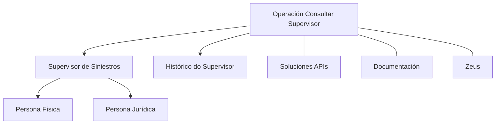

# Operación Consultar Supervisor — Consulta de Supervisores de Siniestros

## 1. Metadados do Documento
- **Arquivo de Origem:** Não identificado
- **Tipo de Documento:** Especificação Funcional
- **Domínio / Sistema:** Operación Consultar Supervisor / Soluciones APIs / Zeus
- **Público-Alvo:** Negócio, Desenvolvedores, Operação
- **Data/Versão Identificada:** Não identificada

---

## 2. Resumo Executivo & Contexto de Negócio

O documento descreve a operação **Consultar Supervisor**, destinada à consulta de Supervisores de Siniestros e à consulta de seu histórico. O escopo declarado contempla Supervisores de Siniestros que sejam **Personas Físicas** ou **Personas Jurídicas**.

O conteúdo também associa a operação aos termos **Soluciones APIs**, **Documentación** e **Zeus**, sem explicar formalmente as responsabilidades, integrações ou limites funcionais desses elementos. A sigla **RS** aparece no conteúdo bruto, mas não possui definição explícita.

Não há detalhes sobre métodos HTTP, contratos de API, parâmetros de entrada, estruturas de resposta, autenticação, URLs, ambientes, regras de filtragem ou critérios de histórico. Portanto, o artefato preserva apenas o objetivo funcional explicitamente apresentado.

---

## 3. Arquitetura, Componentes & Tecnologias Envolvidas

Componentes e termos identificados:

| Componente / Termo | Papel declarado no documento |
| :--- | :--- |
| Operación Consultar Supervisor | Operação de consulta de Supervisores de Siniestros e de seu histórico. |
| Supervisor de Siniestros | Entidade consultada pela operação. Pode ser Pessoa Física ou Pessoa Jurídica. |
| Soluciones APIs | Termo mencionado no conteúdo; função não detalhada. |
| Documentación | Termo mencionado no conteúdo; função não detalhada. |
| Zeus | Termo mencionado no conteúdo; função não detalhada. |
| RS | Sigla mencionada sem expansão ou definição. |



> **Nota de Análise:** O documento menciona Soluciones APIs, Documentación e Zeus, mas não especifica se esses termos representam sistemas, menus, portais, integrações, camadas técnicas ou ambientes.

---

## 4. Regras de Negócio, Especificações Funcionais & Processos

1. A operação denominada **Consultar Supervisor** permite consultar Supervisores de Siniestros.
2. A operação também permite consultar o histórico dos Supervisores de Siniestros.
3. Os Supervisores de Siniestros consultados podem ser classificados como:
   - Personas Físicas.
   - Personas Jurídicas.
4. O documento não define critérios de pesquisa, filtros, identificadores, paginação, regras de acesso ou formato de apresentação do histórico.
5. O documento não detalha métodos HTTP, endpoints, contratos JSON, códigos de resposta ou mecanismos de autenticação.

---

## 5. Tabelas de Parâmetros, Ambientes e Estruturas de Dados

| Item / Parâmetro | Descrição / Função | Tipo / Valores / Formato | Ambiente / Observações |
| :--- | :--- | :--- | :--- |
| Operación Consultar Supervisor | Operação para consultar Supervisores de Siniestros e seus históricos. | Operação funcional | Não informado |
| Supervisor de Siniestros | Entidade principal consultada. | Persona Física ou Persona Jurídica | Não informado |
| Histórico | Histórico associado ao Supervisor de Siniestros. | Estrutura não especificada | Não informado |
| RS | Sigla exibida no conteúdo. | Não definido | Não informado |
| Soluciones APIs | Termo associado ao conteúdo. | Não especificado | Não informado |
| Documentación | Termo associado ao conteúdo. | Não especificado | Não informado |
| Zeus | Termo associado ao conteúdo. | Não especificado | Não informado |

---

## 6. Bateria de Perguntas & Respostas para RAG (FAQ Sintético)

### P1: Qual é o objetivo da operação Consultar Supervisor?
**R:** A operação Consultar Supervisor tem o objetivo de consultar Supervisores de Siniestros e consultar o histórico desses Supervisores de Siniestros.

### P2: Quais tipos de Supervisor de Siniestros podem ser consultados?
**R:** O documento informa que a consulta contempla Supervisores de Siniestros que sejam Personas Físicas ou Personas Jurídicas.

### P3: A operação Consultar Supervisor inclui consulta de histórico?
**R:** Sim. O conteúdo declara explicitamente a consulta dos Supervisores de Siniestros e a consulta de seu histórico.

### P4: O documento especifica quais dados compõem o histórico do Supervisor de Siniestros?
**R:** Não. O documento informa que existe consulta de histórico, mas não detalha campos, eventos, período, estrutura ou formato dos dados históricos.

### P5: Qual método HTTP deve ser utilizado pela operação Consultar Supervisor?
**R:** O documento não especifica métodos HTTP para a operação Consultar Supervisor.

### P6: Quais endpoints ou URLs estão disponíveis para consultar Supervisores de Siniestros?
**R:** O documento não apresenta endpoints, URLs, domínios, portas ou caminhos de API.

### P7: O que significa a sigla RS no documento?
**R:** A sigla RS aparece no conteúdo bruto, mas o documento não fornece sua expansão ou significado.

### P8: Qual é a relação entre Consultar Supervisor e Zeus?
**R:** Zeus é citado no conteúdo junto de Soluciones APIs e Documentación, mas o documento não define a relação funcional ou técnica entre Zeus e a operação Consultar Supervisor.

### P9: O documento informa parâmetros de entrada para identificar um Supervisor de Siniestros?
**R:** Não. Não há parâmetros, identificadores, filtros ou critérios de busca especificados.

### P10: O documento descreve autenticação ou autorização para a operação?
**R:** Não. Não existem detalhes sobre autenticação, autorização, perfis, permissões ou controles de acesso.

---

## 7. Glossário de Termos, Siglas & Conceitos-Chave

- **Consultar Supervisor:** Operação destinada à consulta de Supervisores de Siniestros e de seus históricos.
- **Supervisor de Siniestros:** Entidade consultada pela operação; pode ser Persona Física ou Persona Jurídica.
- **Siniestros:** Termo apresentado no documento no contexto de Supervisores de Siniestros; não possui definição adicional no conteúdo.
- **Persona Física:** Tipo de Supervisor de Siniestros mencionado no documento.
- **Persona Jurídica:** Tipo de Supervisor de Siniestros mencionado no documento.
- **RS:** Sigla apresentada sem significado definido.
- **Soluciones APIs:** Termo citado sem detalhamento adicional.
- **Documentación:** Termo citado sem detalhamento adicional.
- **Zeus:** Termo citado sem detalhamento adicional.

---

## 8. Notas Críticas, Riscos & Limitações

- O conteúdo disponível é resumido e não contém especificação técnica detalhada.
- Não foram identificados endpoints, métodos HTTP, contratos de integração, exemplos de requisição ou exemplos de resposta.
- Não foram identificados parâmetros de busca, estruturas de dados, critérios de ordenação, regras de paginação ou códigos de erro.
- Não foram identificadas regras de autenticação, autorização ou matriz de permissões.
- **Nota de Análise:** O documento lista Soluciones APIs, Documentación, Zeus e a sigla RS, porém não detalha seus significados, responsabilidades ou relacionamentos técnicos.
- **Nota de Análise:** O documento declara a consulta do histórico de Supervisores de Siniestros, mas não especifica o conteúdo ou a granularidade desse histórico.

---

## 9. Conteúdo Bruto Estruturado (Referência Fiel)

```text
--- [PÁGINA 1 DE 1] ---

OPERACIÓN CONSULTAR Supervisor
Consulta de los Supervisores de Siniestros & Consulta de su histórico, sean estos Personas Físicas
o Personas Jurídicas.
 / 
 RS
Inicio Soluciones APIs Documentación Zeus
ES
```
