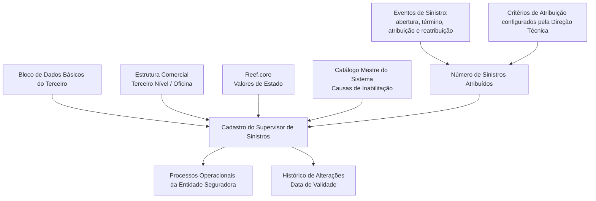

# Especificação Funcional — Criação de Informações do Supervisor de Sinistros

## 1. Metadados do Documento
- **Arquivo de Origem:** Não identificado
- **Tipo de Documento:** Especificação Técnica / Funcional
- **Domínio / Sistema:** Reef.core; entidade seguradora; gestão de supervisores de sinistros
- **Público-Alvo:** Desenvolvedores, Arquitetos, Operação e Negócio
- **Data/Versão Identificada:** Não identificada

---

## 2. Resumo Executivo & Contexto de Negócio

O documento descreve a criação e a manutenção das informações operacionais associadas ao **Supervisor de Sinistros** em uma entidade seguradora. A estrutura de dados tem como objetivo identificar e detalhar atributos necessários para que os processos da seguradora considerem adequadamente cada supervisor.

A única ação explicitamente habilitada é **CRIAR**. A sequência de captura dos atributos segue a orientação “da esquerda para a direita e de cima para baixo”. Salvo indicação expressa em sentido contrário, os atributos são aplicáveis tanto a pessoas físicas quanto a pessoas jurídicas.

Parte relevante das informações do supervisor é herdada do bloco de **Dados Básicos do Terceiro**, incluindo o código do supervisor e a atividade. Outros dados representam a alocação organizacional, o estado operacional, a validade da atuação, a quantidade de sinistros atribuídos e possíveis responsabilidades sobre outros supervisores.

O documento também define mecanismos de controle operacional. A data de validade permite registrar o momento a partir do qual o supervisor passa a ser plenamente operativo e manter histórico de alterações. A inabilitação determina que um supervisor não deve mais ser utilizado nos processos operacionais a partir do momento em que é inabilitado.

---

## 3. Arquitetura, Componentes & Tecnologias Envolvidas

Os componentes e conceitos explicitamente citados são:

- **Reef.core:** sistema no qual são configurados os possíveis valores do estado do supervisor.
- **Bloco de Dados Básicos do Terceiro:** origem dos atributos herdados de código do supervisor e atividade.
- **Estrutura Comercial:** estrutura que contém o Terceiro Nível, correspondente à oficina à qual o supervisor está atribuído.
- **Catálogo Mestre do Sistema:** origem dos códigos de causa de inabilitação.
- **Direção Técnica:** área que pode configurar critérios de atribuição de sinistros no sistema.
- **Processos operacionais da entidade seguradora:** processos que utilizam ou deixam de utilizar o supervisor conforme seus dados e estado operacional.



**Nota de Análise:** O documento não detalha métodos HTTP, contratos JSON, banco de dados, APIs, URLs, portas, mecanismos de autenticação ou tecnologias de implementação para o cadastro do Supervisor de Sinistros.

---

## 4. Regras de Negócio, Especificações Funcionais & Processos

### 4.1 Objetivo da estrutura

A captura das informações na estrutura existe para identificar e detalhar as informações de âmbito operacional do Supervisor de Sinistros. Essas informações devem permitir que processos da entidade seguradora utilizem adequadamente o supervisor quando necessário.

### 4.2 Ação habilitada

A ação habilitada explicitamente no documento é:

- **CRIAR**

Não há detalhamento adicional sobre ações de alteração, consulta, exclusão, aprovação ou workflow de cadastro.

### 4.3 Sequência de captura

A sequência de captura dos campos do bloco de informações deve seguir a ordem:

1. Da esquerda para a direita.
2. De cima para baixo.

### 4.4 Aplicabilidade a pessoas

Quando não houver indicação ou especificação expressa em contrário, os atributos devem ser utilizados para:

- Pessoas físicas.
- Pessoas jurídicas.

### 4.5 Regras por atributo

#### Código do Supervisor

- O Código do Supervisor é herdado do Bloco de Dados Básicos do Terceiro.
- O atributo identifica o código do Supervisor no sistema.

#### Código de Usuário do Supervisor

- O campo contém o código de usuário utilizado pelo Supervisor para identificar-se no sistema.

#### Atividade

- O valor de Atividade é herdado do Bloco de Dados Básicos do Terceiro.
- O atributo apresenta o código de Atividade do Terceiro para os Supervisores.

#### Terceiro Nível

- O Terceiro Nível representa o código do Terceiro Nível da Estrutura Comercial.
- O Terceiro Nível corresponde à oficina à qual o Supervisor está atribuído.

#### Estado do Supervisor

- O campo apresenta o estado em que o Supervisor se encontra.
- O estado deve assumir um dos valores possíveis configurados no **Reef.core**.

#### Data de Validade

- A Data de Validade informa ao sistema a data a partir da qual o Supervisor está plenamente operativo.
- A utilização correta da Data de Validade permite manter, na entidade seguradora, um histórico das alterações realizadas na configuração dos Supervisores.

#### Número de Sinistros Atribuídos

- O atributo contém a quantidade de sinistros atribuídos a um Supervisor.
- O atributo deve ser atualizado e modificado sempre que ocorrer:
  - Abertura de um sinistro.
  - Término de um sinistro.
  - Atribuição de um sinistro.
  - Reatribuição de um sinistro.
- A atualização deve respeitar os critérios de atribuição de sinistros que a Direção Técnica tenha configurado no sistema.
- Na captura inicial do Supervisor, este atributo não deve apresentar informação.

#### Supervisor Responsável

- O campo identifica se o Supervisor de Sinistros que está sendo registrado terá também o papel de responsável por outro Supervisor ou por um grupo de Supervisores.

#### Inabilitação

- O campo informa ao sistema que o Supervisor de Sinistros está inabilitado.
- A partir do momento da inabilitação, o Supervisor não deve ser utilizado, contemplado ou considerado nos processos operacionais da entidade seguradora.

#### Causa de Inabilitação

- Quando o Supervisor estiver inabilitado, o atributo deve conter o código de uma causa de inabilitação.
- A causa deve estar definida no Catálogo Mestre do Sistema.

---

## 5. Tabelas de Parâmetros, Ambientes e Estruturas de Dados

| Item / Parâmetro | Descrição / Função | Tipo / Valores / Formato | Ambiente / Observações |
| :--- | :--- | :--- | :--- |
| Ação habilitada | Permite criar a informação específica do Supervisor. | `CRIAR` | O documento não descreve outras ações habilitadas. |
| Código do Supervisor | Identifica o código do Supervisor no sistema. | Não especificado | Herdado do Bloco de Dados Básicos do Terceiro. |
| Código de Usuário do Supervisor | Código de usuário com o qual o Supervisor se identifica no sistema. | Não especificado | Campo do bloco de informações do Supervisor. |
| Atividade | Exibe o código de Atividade do Terceiro para Supervisores. | Não especificado | Herdado do Bloco de Dados Básicos do Terceiro. |
| Terceiro Nível | Código do Terceiro Nível da Estrutura Comercial ao qual o Supervisor é atribuído. | Não especificado | O documento associa o Terceiro Nível à oficina. |
| Estado do Supervisor | Mostra o estado atual do Supervisor. | Um dos valores configurados no Reef.core | Os valores concretos não foram apresentados. |
| Data de Validade | Define a data a partir da qual o Supervisor está plenamente operativo. | Data; formato não especificado | Permite manter histórico de mudanças de configuração. |
| Número de Sinistros Atribuídos | Mantém a quantidade de sinistros atribuídos ao Supervisor. | Número; formato não especificado | Inicialmente sem informação; atualizado em eventos de sinistro. |
| Supervisor Responsável | Indica se o Supervisor terá responsabilidade sobre outro supervisor ou grupo de supervisores. | Não especificado | Não são apresentados valores permitidos ou regras adicionais. |
| Inabilitação | Indica que o Supervisor está inabilitado no sistema. | Não especificado | O Supervisor inabilitado não deve participar de processos operacionais. |
| Causa de Inabilitação | Código que representa a causa da inabilitação. | Código definido no Catálogo Mestre do Sistema | Aplicável quando o Supervisor estiver inabilitado. |
| Reef.core | Sistema citado para configuração dos valores possíveis do estado do Supervisor. | Sistema / aplicação | Não são descritas versões, integrações ou URLs. |
| Direção Técnica | Área que pode configurar os critérios de atribuição de sinistros. | Área organizacional | Critérios influenciam a atualização do número de sinistros atribuídos. |
| Catálogo Mestre do Sistema | Fonte das causas de inabilitação. | Catálogo | O catálogo e seus códigos não são detalhados. |

---

## 6. Bateria de Perguntas & Respostas para RAG (FAQ Sintético)

### P1: Qual é o objetivo da estrutura de informações do Supervisor de Sinistros?
**R:** A estrutura tem o objetivo de identificar e detalhar as informações de âmbito operacional do Supervisor de Sinistros, permitindo que os processos da entidade seguradora considerem adequadamente esse supervisor quando necessário.

### P2: Qual ação está habilitada para as informações específicas do Supervisor?
**R:** O documento informa que a ação habilitada é **CRIAR**. Não há detalhamento sobre ações de alteração, consulta ou exclusão.

### P3: Em qual ordem os campos do bloco de informações devem ser capturados?
**R:** Os campos devem ser capturados da esquerda para a direita e de cima para baixo.

### P4: De onde vem o Código do Supervisor?
**R:** O Código do Supervisor é herdado do Bloco de Dados Básicos do Terceiro e identifica o código do Supervisor no sistema.

### P5: Como o Supervisor se identifica no sistema?
**R:** O Supervisor se identifica no sistema por meio do Código de Usuário do Supervisor, armazenado no respectivo campo do bloco de informações.

### P6: O que representa o Terceiro Nível do Supervisor?
**R:** O Terceiro Nível é o código da Estrutura Comercial, correspondente à oficina, à qual o Supervisor está atribuído.

### P7: Onde são configurados os valores possíveis do Estado do Supervisor?
**R:** O Estado do Supervisor deve assumir um dos valores possíveis configurados no sistema Reef.core. O documento não lista quais são esses valores.

### P8: Para que serve a Data de Validade do Supervisor?
**R:** A Data de Validade informa a partir de quando o Supervisor está plenamente operativo no sistema. A utilização correta desse atributo permite manter histórico de alterações realizadas na configuração dos Supervisores na entidade seguradora.

### P9: Quando o Número de Sinistros Atribuídos deve ser atualizado?
**R:** O Número de Sinistros Atribuídos deve ser atualizado sempre que um sinistro for aberto, terminado, atribuído ou reatribuído, conforme os critérios de atribuição de sinistros configurados pela Direção Técnica no sistema.

### P10: O Número de Sinistros Atribuídos possui valor durante o cadastro inicial?
**R:** Não. Na captura inicial do Supervisor, o campo Número de Sinistros Atribuídos não apresenta qualquer informação.

### P11: Qual é a finalidade do campo Supervisor Responsável?
**R:** O campo Supervisor Responsável identifica se o Supervisor de Sinistros em registro também exercerá o papel de responsável por outro Supervisor ou por um grupo de Supervisores.

### P12: O que acontece quando um Supervisor de Sinistros é inabilitado?
**R:** A partir do momento da inabilitação, o Supervisor de Sinistros não deve ser utilizado, contemplado ou considerado nos processos operacionais da entidade seguradora.

### P13: Como a Causa de Inabilitação deve ser preenchida?
**R:** Caso o Supervisor esteja inabilitado, a Causa de Inabilitação deve conter um código de causa definido no Catálogo Mestre do Sistema.

---

## 7. Glossário de Termos, Siglas & Conceitos-Chave

- **Reef.core:** Sistema mencionado como responsável pela configuração dos valores possíveis para o Estado do Supervisor.
- **Supervisor de Sinistros:** Supervisor cujas informações operacionais são registradas na estrutura descrita.
- **Sinistro:** Evento cuja abertura, término, atribuição ou reatribuição afeta o Número de Sinistros Atribuídos ao Supervisor.
- **Terceiro:** Entidade ou registro cujos Dados Básicos originam o Código do Supervisor e a Atividade.
- **Bloco de Dados Básicos do Terceiro:** Bloco de origem de atributos herdados pelo cadastro do Supervisor.
- **Estrutura Comercial:** Estrutura organizacional que contém o Terceiro Nível, associado à oficina de atribuição do Supervisor.
- **Terceiro Nível:** Código da Estrutura Comercial, correspondente à oficina à qual o Supervisor está atribuído.
- **Catálogo Mestre do Sistema:** Catálogo que define os códigos de causa de inabilitação.
- **Direção Técnica:** Área que pode configurar no sistema os critérios de atribuição de sinistros.
- **Inabilitação:** Condição que impede que o Supervisor seja utilizado, contemplado ou considerado nos processos operacionais.

---

## 8. Notas Críticas, Riscos & Limitações

- O documento não apresenta o nome do arquivo de origem, data, versão, autor ou responsável pelo conteúdo.
- O documento cita o sistema **Reef.core**, mas não detalha versão, URL, ambiente, permissões, integração ou valores possíveis para o Estado do Supervisor.
- O documento não informa o formato, obrigatoriedade, tamanho, domínio de valores ou regras de validação técnica para os campos.
- Não há definição explícita dos critérios de atribuição de sinistros configuráveis pela Direção Técnica.
- Não são apresentadas regras que determinem se a Causa de Inabilitação é obrigatória, embora o texto indique que ela deve conter um código quando o Supervisor estiver inabilitado.
- Não há detalhamento dos efeitos de reabilitação, alteração de Estado do Supervisor, alteração de Data de Validade ou mudança de Terceiro Nível.
- Não foram identificados contratos de API, modelos de dados, mensagens de erro, trilha de auditoria técnica ou mecanismos de integração.
- **Nota de Análise:** O documento menciona “Nota:” após o campo Supervisor Responsável, porém não apresenta conteúdo adicional associado à nota no texto fornecido.

---

## 9. Conteúdo Bruto Estruturado (Referência Fiel)

```text
--- [PÁGINA 1 DE 3] ---

CREAR Información específica del Supervisor
Objetivo
La captura de la información en esta Estructura obedece a la necesidad de identificar y detallar la
información de ámbito operativo del Supervisor de Siniestros para poder contemplarla
adecuadamente en los procesos de la entidad Aseguradora que así lo demanden.
Acciones habilitadas
 CREAR ( )
Datos Supervisor
De Izquierda a Derecha y de Arriba hacia Abajo, los siguientes atributos marcan la secuencia de
captura de los Campos en este Bloque de Información.
Si no se especifica o indica expresamente, los Atributos se emplearán tanto en Personas Físicas
como en Personas Jurídicas.
Código del Supervisor
 /
 RS
Inicio Soluciones APIs Documentación Zeus
ES


--- [PÁGINA 2 DE 3] ---

Este dato procede y se hereda del Bloque de Datos Básicos del Tercero e identifica el código del
Supervisor en el Sistema.
Código de Usuario del Supervisor ( )
Este campo del bloque de información contiene el código del usuario con el que el Supervisor se
identifica en el sistema.
Actividad
El valor de este dato se hereda del Bloque de Datos Básicos del Tercero y muestra el código de
Actividad del Tercero para los Supervisores.
Tercer Nivel (  )
Este dato es el código del Tercer Nivel de la Estructura Comercial (oficina) al que está asignado el
Supervisor.
Estado del Supervisor (  )
Este Campo muestra el estado en el que se encuentra el Supervisor, estado que tiene que tener uno
de los posibles valores configurados en Reef.core.
Fecha de Validez ( )
Esta propiedad le indica al Sistema la fecha a partir de la cual el supervisor está plenamente
operativo en el sistema por lo que su empleo y correcta utilización permite tener en la entidad
Aseguradora un histórico de los cambios efectuados en la configuración de los Supervisores.
Número de Siniestros Asignados
Este dato contiene el número de siniestros asignados que tiene asignado un Supervisor, sabiendo
que cada vez que se abre, se termina, se asigna o se reasigna un siniestro, se actualiza y modifica
su contenido (Todo ello de acuerdo con los criterios de asignación de siniestros que la Dirección
Técnica haya considerado configurar en el sistema)
En la captura inicial del supervisor este dato no mostrará información alguna.
Supervisor Responsable ( )
Este campo identifica si el Supervisor de siniestros que estamos registrando va a su vez a tener el rol
de Responsable de otro supervisor o grupo de supervisores.
Nota:


--- [PÁGINA 3 DE 3] ---

Inhabilitación ( )
Este Campo le indica al Sistema que el Supervisor de Siniestros está inhabilitado en el Sistema por
lo que a partir del momento de su inhabilitación no debería ser empleado, contemplado o
considerado en los procesos operativos de la entidad.
Causa de Inhabilitación (  )
En el supuesto que el Supervisor estuviera Inhabilitado, este Atributo contendrá el código de una
causa de Inhabilitación definida en el catálogo maestro del Sistema.
```
