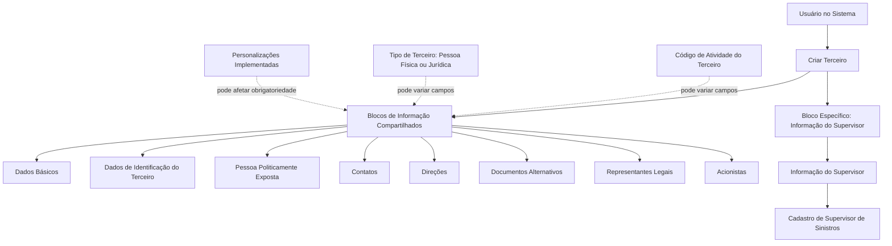

# Operação Criar Supervisor — Cadastro de Informação de Supervisores de Sinistros

## 1. Metadados do Documento
- **Arquivo de Origem:** Não identificado no conteúdo fornecido
- **Tipo de Documento:** Procedimento
- **Domínio / Sistema:** Cadastro de Terceiros / Supervisores de Sinistros
- **Público-Alvo:** Usuários do sistema responsáveis pelo cadastro de informações de supervisores
- **Data/Versão Identificada:** Não identificada

---

## 2. Resumo Executivo & Contexto de Negócio

O documento descreve a operação **Criar Supervisor**, destinada a capturar a informação de Supervisores de Sinistros por meio de um processo de criação de terceiro.

A operação utiliza blocos de informação compartilhados do processo **Criar Terceiro**, além de um bloco específico denominado **Informação do Supervisor**. Os blocos compartilhados incluem dados básicos, identificação, pessoa politicamente exposta, contatos, endereços, documentos alternativos, representantes legais e acionistas.

A obrigatoriedade e a habilitação dos campos não são fixas. Esses comportamentos podem variar conforme o código de atividade do terceiro, o tipo de terceiro — pessoa física ou pessoa jurídica — e personalizações implementadas na aplicação.

O documento também estabelece que a ordem de preenchimento dos blocos de informação pode variar conforme o critério do usuário no sistema. Não há detalhamento de campos específicos, métodos HTTP, contratos de integração, validações por campo ou regras de persistência.

---

## 3. Arquitetura, Componentes & Tecnologias Envolvidas

Os componentes e conceitos explicitamente citados são:

| Componente / Conceito | Descrição |
| :--- | :--- |
| Operação Criar Supervisor | Operação para captura da informação de Supervisores de Sinistros. |
| Processo Criar Terceiro | Processo que disponibiliza blocos de informação compartilhados para o cadastro. |
| Informação do Supervisor | Bloco de informação específico associado à atividade do terceiro. |
| Código de atividade do terceiro | Critério que pode alterar obrigatoriedade ou habilitação dos campos. |
| Tipo de terceiro | Classificação entre pessoa física e pessoa jurídica que pode alterar obrigatoriedade ou habilitação dos campos. |
| Personalizações | Implementações que podem afetar a obrigatoriedade de registro dos dados do terceiro. |
| Usuário no sistema | Responsável por definir a ordem de captura dos dados nos blocos de informação. |



> **Nota de Análise:** O documento não detalha tecnologias, bancos de dados, integrações, APIs, ambientes, URLs, métodos HTTP ou contratos JSON.

---

## 4. Regras de Negócio, Especificações Funcionais & Processos

### Objetivo da operação

A operação **Criar Supervisor** permite capturar a informação dos Supervisores de Sinistros.

### Premissas de obrigatoriedade e habilitação

1. A obrigatoriedade e/ou habilitação dos campos dos blocos ou estruturas de informação compartilhadas podem variar de acordo com o **código de atividade do terceiro**.
2. A obrigatoriedade e/ou habilitação dos campos dos blocos ou estruturas de informação podem variar quando o terceiro for classificado como:
   - Pessoa física.
   - Pessoa jurídica.
3. Personalizações implementadas podem afetar o comportamento da aplicação quanto à obrigatoriedade de registro dos dados do terceiro.
4. A ordem de captura dos dados nos diferentes blocos de informação pode variar conforme o critério seguido pelo usuário no sistema.

### Processo identificado

1. Iniciar o processo **Criar Terceiro**.
2. Registrar os dados nos blocos de informação compartilhados aplicáveis.
3. Considerar as regras de obrigatoriedade e habilitação condicionadas pelo código de atividade do terceiro.
4. Considerar a classificação do terceiro como pessoa física ou pessoa jurídica.
5. Considerar eventuais personalizações que afetem a obrigatoriedade de dados.
6. Registrar as informações no bloco específico **Informação do Supervisor**.
7. A ordem de preenchimento dos blocos pode ser definida pelo usuário no sistema.

> **Nota de Análise:** O documento não especifica quais campos pertencem a cada bloco, quais campos são obrigatórios em cada cenário, nem critérios de validação, mensagens de erro, regras de aprovação ou etapas de conclusão do cadastro.

---

## 5. Tabelas de Parâmetros, Ambientes e Estruturas de Dados

| Item / Parâmetro | Descrição / Função | Tipo / Valores / Formato | Ambiente / Observações |
| :--- | :--- | :--- | :--- |
| Operação | Permite capturar a informação dos Supervisores de Sinistros. | Criar Supervisor | Não informado |
| Processo base | Disponibiliza os blocos compartilhados para criação do terceiro. | Criar Terceiro | Não informado |
| Código de atividade do terceiro | Pode influenciar a obrigatoriedade e a habilitação dos campos. | Código de atividade | Valores não detalhados |
| Tipo de terceiro | Pode influenciar a obrigatoriedade e a habilitação dos campos. | Pessoa física ou pessoa jurídica | Regras específicas não detalhadas |
| Personalizações | Podem afetar a obrigatoriedade do registro dos dados do terceiro. | Implementações na aplicação | Personalizações não identificadas |
| Ordem de captura | Pode variar nos blocos de informação. | Definida conforme critério do usuário | Não há sequência obrigatória explícita |
| Dados Básicos | Bloco de informação compartilhado. | Não detalhado | Parte de Criar Terceiro |
| Dados de Identificação do Terceiro | Bloco de informação compartilhado. | Não detalhado | Parte de Criar Terceiro |
| Pessoa Politicamente Exposta | Bloco de informação compartilhado. | Não detalhado | Parte de Criar Terceiro |
| Contatos | Bloco de informação compartilhado. | Não detalhado | Parte de Criar Terceiro |
| Direções | Bloco de informação compartilhado. | Não detalhado | Parte de Criar Terceiro |
| Documentos Alternativos | Bloco de informação compartilhado. | Não detalhado | Parte de Criar Terceiro |
| Representantes Legais | Bloco de informação compartilhado. | Não detalhado | Parte de Criar Terceiro |
| Acionistas | Bloco de informação compartilhado. | Não detalhado | Parte de Criar Terceiro |
| Informação do Supervisor | Bloco específico conforme a atividade do terceiro. | Não detalhado | Associado ao cadastro do Supervisor |

---

## 6. Bateria de Perguntas & Respostas para RAG (FAQ Sintético)

### P1: Qual é o objetivo da operação Criar Supervisor?
**R:** A operação Criar Supervisor permite capturar a informação de Supervisores de Sinistros.

### P2: A operação Criar Supervisor utiliza qual processo de cadastro?
**R:** A operação é apresentada dentro do processo Criar Terceiro, utilizando blocos de informação compartilhados desse processo e um bloco específico denominado Informação do Supervisor.

### P3: Quais blocos de informação compartilhados são citados no processo Criar Terceiro?
**R:** Os blocos citados são Dados Básicos, Dados de Identificação do Terceiro, Pessoa Politicamente Exposta, Contatos, Direções, Documentos Alternativos, Representantes Legais e Acionistas.

### P4: Qual é o bloco específico utilizado para cadastrar os dados do supervisor?
**R:** O bloco específico citado é Informação do Supervisor, classificado como um bloco de informação específico de acordo com a atividade do terceiro.

### P5: A obrigatoriedade dos campos é sempre a mesma no cadastro de supervisor?
**R:** Não. A obrigatoriedade e/ou a habilitação dos campos dos blocos ou estruturas de informação podem variar conforme o código de atividade do terceiro.

### P6: O tipo de terceiro influencia o preenchimento dos dados?
**R:** Sim. O documento informa que a obrigatoriedade e/ou a habilitação dos campos pode variar caso o tipo de terceiro seja pessoa física ou pessoa jurídica.

### P7: Personalizações na aplicação podem alterar o cadastro de terceiros?
**R:** Sim. Personalizações implementadas podem afetar o comportamento da aplicação em relação à obrigatoriedade do registro dos dados do terceiro.

### P8: Existe uma ordem obrigatória para preencher os blocos de informação?
**R:** Não há uma ordem fixa explicitada. O documento informa que a ordem de captura dos dados nos distintos blocos de informação pode variar de acordo com o critério seguido pelo usuário no sistema.

### P9: O documento detalha os campos que devem ser preenchidos em Informação do Supervisor?
**R:** Não. O documento apenas cita o bloco Informação do Supervisor e não apresenta seus campos, formatos, obrigatoriedades específicas ou regras de validação.

### P10: O documento especifica APIs, métodos HTTP ou contratos de integração para Criar Supervisor?
**R:** Não. O conteúdo fornecido não detalha APIs, métodos HTTP, URLs, tecnologias, ambientes, contratos JSON ou mecanismos de integração.

---

## 7. Glossário de Termos, Siglas & Conceitos-Chave

- **Criar Supervisor:** Operação destinada à captura da informação de Supervisores de Sinistros.
- **Criar Terceiro:** Processo de criação que contém blocos de informação compartilhados.
- **Terceiro:** Entidade cadastrada no processo Criar Terceiro, classificada como pessoa física ou pessoa jurídica.
- **Supervisor de Sinistros:** Entidade cuja informação é capturada pela operação Criar Supervisor.
- **Blocos de Informação Compartilhados:** Estruturas utilizadas no processo Criar Terceiro e listadas no documento.
- **Informação do Supervisor:** Bloco específico associado à atividade do terceiro.
- **Pessoa Física:** Um dos tipos de terceiro citados como fator de variação da obrigatoriedade e habilitação dos campos.
- **Pessoa Jurídica:** Um dos tipos de terceiro citados como fator de variação da obrigatoriedade e habilitação dos campos.
- **Pessoa Politicamente Exposta:** Bloco de informação compartilhado citado no processo Criar Terceiro.
- **Personalizações:** Implementações que podem alterar o comportamento da aplicação quanto à obrigatoriedade dos dados do terceiro.

---

## 8. Notas Críticas, Riscos & Limitações

- O documento não identifica o arquivo de origem, autor, data, versão ou ambiente operacional.
- O documento não detalha os campos de nenhum bloco de informação.
- O documento não apresenta uma matriz que relacione código de atividade, tipo de terceiro e obrigatoriedade dos campos.
- O documento informa que personalizações podem afetar a obrigatoriedade, mas não identifica quais personalizações existem nem seus efeitos.
- O documento não define uma sequência obrigatória de preenchimento dos blocos.
- Não há especificação de APIs, integrações, tecnologias, bancos de dados, URLs, logs, permissões ou tratamento de erros.
- Não são apresentados critérios de sucesso, regras de persistência, telas, mensagens de validação ou fluxos de exceção.

---

## 9. Conteúdo Bruto Estruturado (Referência Fiel)

```text
--- [PÁGINA 1 DE 2] ---

OPERACIÓN CREAR Supervisor
¿En que consiste?
Esta operación permite capturar la Información de los Supervisores de Siniestros.
Premisas
La obligatoriedad y/o la habilitación de los campos en el registro de los datos de cada uno de
los bloques o estructuras de información compartidas puede variar de acuerdo con el código de
actividad del Tercero:
La obligatoriedad y/o la habilitación de los campos en el registro de los datos de cada uno de
los bloques o estructuras de información pueden variar si el tipo de Tercero es una Persona
Física o una Persona Jurídica:
Las personalizaciones que se hubieran podido implementar a su vez pueden afectar el
comportamiento de la aplicación en relación con la obligatoriedad en el registro de los Datos del
Tercero.
Por último, el orden de captura de los datos en los distintos bloques de Información puede
variar de acuerdo con el criterio seguido por el Usuario en el Sistema.
Ejemplo:
Ejemplo:
 / 
 RS
Inicio Soluciones APIs Documentación Zeus
ES


--- [PÁGINA 2 DE 2] ---

Proceso
CREAR
TERCERO
Crear Información
del Supervisor
Bloques de Información Compartidos (CREAR TERCERO)
 Datos Básicos ( )
 Datos Identificación del Tercero ( )
 Persona Políticamente Expuesta ( )
 Contactos ( )
 Direcciones ( )
 Documentos Alternativos ( )
 Representantes Legales ( )
 Accionistas ( )
Bloques de Información Específicos de acuerdo con la
Actividad del Tercero.
 Información del Supervisor ( )
```
