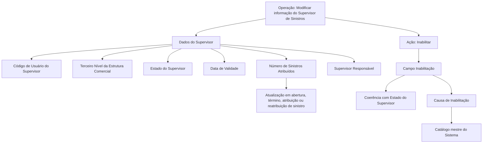

# Modificação e Inabilitação de Supervisor de Sinistros

## 1. Metadados do Documento
- **Arquivo de Origem:** `Não identificado — texto bruto fornecido na solicitação`
- **Tipo de Documento:** `Especificação Funcional`
- **Domínio / Sistema:** `Supervisor de Siniestros; Reef.core; Estrutura Comercial`
- **Público-Alvo:** `Negócio, Operação, Analistas Funcionais e Desenvolvedores`
- **Data/Versão Identificada:** `Não identificada`

---

## 2. Resumo Executivo & Contexto de Negócio

O documento descreve a operação de **modificar informações previamente registradas de um Supervisor de Sinistros** e a possibilidade de **inabilitar** esse supervisor no sistema. As ações explicitamente habilitadas são `MODIFICAR` e `INHABILITAR`.

A especificação organiza os atributos do bloco “Datos Supervisor” segundo uma sequência de captura definida como “de esquerda para direita e de cima para baixo”. O texto também estabelece que, quando não houver indicação expressa em contrário, os atributos são empregados tanto para **Personas Físicas** quanto para **Personas Jurídicas**.

A operação mantém dados de identificação, vinculação organizacional, estado, validade, carga de sinistros, responsabilidade hierárquica e inabilitação. O campo **Fecha de Validez** permite que alterações se tornem operacionais a partir de uma data determinada e suporta o histórico de mudanças na configuração dos Supervisores.

A inabilitação possui implicação operacional explícita: após ser inabilitado, o Supervisor de Sinistros não deve ser utilizado, contemplado ou considerado nos processos operacionais da entidade. O valor de inabilitação deve ser coerente com o valor do campo **Estado del Supervisor**.

---

## 3. Arquitetura, Componentes & Tecnologias Envolvidas

Os componentes e conceitos identificados no conteúdo são:

- **Sistema:** Reef.core.
- **Entidade funcional:** Supervisor de Siniestros.
- **Bloco de informação:** Datos Supervisor.
- **Estrutura organizacional:** Tercer Nivel de la Estructura Comercial, também descrito como oficina.
- **Catálogo mestre:** catálogo maestro del Sistema, origem das causas de inabilitação.
- **Processos de sinistros:** abertura, término, atribuição e reatribuição de sinistros.
- **Elementos de navegação citados no conteúdo bruto:** Inicio, Soluciones, APIs, Documentación e Zeus.

O documento não descreve APIs, métodos HTTP, contratos JSON, bancos de dados, infraestrutura, autenticação, integrações técnicas ou URLs de ambiente.



**Nota de Análise:** O documento cita Reef.core como fonte dos valores possíveis para o estado do Supervisor, mas não relaciona os valores configurados nem detalha como a configuração é administrada.

---

## 4. Regras de Negócio, Especificações Funcionais & Processos

### Operação suportada

A operação permite:

1. Modificar a informação previamente registrada de um Supervisor de Siniestros.
2. Inabilitar o Supervisor de Siniestros.

As ações apresentadas no documento são:

- `MODIFICAR`
- `INHABILITAR`

### Sequência de captura dos dados

No bloco **Datos Supervisor**, a sequência de captura dos campos segue a orientação:

1. Da esquerda para a direita.
2. De cima para baixo.

Caso não exista especificação ou indicação expressa em sentido diferente, os atributos devem ser utilizados tanto para **Personas Físicas** quanto para **Personas Jurídicas**.

### Identificação e alocação organizacional

- O **Código de Usuario del Supervisor** contém o código de usuário pelo qual o Supervisor se identifica no sistema.
- O **Tercer Nivel** contém o código do Terceiro Nível da Estrutura Comercial, identificado como uma oficina, à qual o Supervisor será atribuído.

### Estado, validade e histórico

- O **Estado del Supervisor** exibe o estado atual do Supervisor.
- O estado deve assumir um dos valores possíveis configurados no **Reef.core**.
- A **Fecha de Validez** informa ao sistema a data a partir da qual as mudanças na informação do Supervisor ficam plenamente operacionais.
- O uso correto da data de validade permite manter histórico das alterações efetuadas na configuração dos Supervisores.

### Controle de carga de sinistros

- O **Número de Siniestros Asignados** mostra a quantidade de sinistros atribuídos a um Supervisor.
- O conteúdo desse campo é atualizado e modificado sempre que ocorre:
  1. Abertura de um sinistro.
  2. Término de um sinistro.
  3. Atribuição de um sinistro.
  4. Reatribuição de um sinistro.
- Essa atualização ocorre de acordo com os critérios de atribuição de sinistros considerados pelo sistema.

### Responsabilidade entre supervisores

- O campo **Supervisor Responsable** identifica se o Supervisor de Sinistros que está sendo alterado terá, por sua vez, o papel de responsável por outro Supervisor ou por um grupo de Supervisores.

### Inabilitação do Supervisor

- O campo **Inhabilitación** indica ao sistema que o Supervisor de Siniestros está inabilitado.
- A partir do momento da inabilitação, o Supervisor não deve ser empregado, contemplado ou considerado nos processos operacionais da entidade.
- O valor do campo de inabilitação deve estar em consonância com o valor atribuído ao campo **Estado del Supervisor**.
- Quando o Supervisor estiver inabilitado, o campo **Causa de Inhabilitación** deve conter o código de uma das causas de inabilitação definidas no catálogo mestre do sistema.

**Nota de Análise:** O documento não especifica os valores válidos de inabilitação, os estados existentes no Reef.core, os critérios de atribuição de sinistros, os códigos de causa de inabilitação, nem regras de validação de formato para os campos apresentados.

---

## 5. Tabelas de Parâmetros, Ambientes e Estruturas de Dados

| Item / Parâmetro | Descrição / Função | Tipo / Valores / Formato | Ambiente / Observações |
| :--- | :--- | :--- | :--- |
| Operação | Permite modificar informação previamente registrada do Supervisor de Siniestros e inabilitá-lo. | Ações habilitadas: `MODIFICAR` e `INHABILITAR`. | Sistema não nomeado explicitamente; Reef.core é citado para configuração de estados. |
| Código de Usuario del Supervisor | Contém o código de usuário com o qual o Supervisor se identifica no sistema. | Código de usuário. Formato não especificado. | Campo do bloco Datos Supervisor. |
| Tercer Nivel | Contém o código do Terceiro Nível da Estrutura Comercial, correspondente à oficina à qual o Supervisor será atribuído. | Código. Formato não especificado. | Campo do bloco Datos Supervisor. |
| Estado del Supervisor | Mostra o estado em que o Supervisor se encontra. | Deve assumir um dos valores possíveis configurados no Reef.core. | O documento não lista os valores configurados. |
| Fecha de Validez | Define a data a partir da qual as alterações da informação do Supervisor ficam plenamente operacionais no sistema. | Data. Formato não especificado. | Permite manter histórico das mudanças na configuração dos Supervisores. |
| Número de Siniestros Asignados | Mostra o número de sinistros atribuídos ao Supervisor. | Número. Formato e limites não especificados. | Atualizado em abertura, término, atribuição e reatribuição de sinistros, conforme critérios do sistema. |
| Supervisor Responsable | Identifica se o Supervisor modificado terá o papel de responsável por outro Supervisor ou por um grupo de Supervisores. | Indicador ou identificação não especificada. | Campo do bloco Datos Supervisor. |
| Inhabilitación | Indica que o Supervisor de Siniestros está inabilitado no sistema. | Valor não especificado. | Deve ser coerente com o valor de Estado del Supervisor. Após a inabilitação, o Supervisor não deve participar dos processos operacionais da entidade. |
| Causa de Inhabilitación | Registra o código da causa de inabilitação. | Código de uma causa definida no catálogo mestre do Sistema. | Deve ser preenchido no caso de Supervisor inabilitado. |
| Sequência de captura | Define a ordem de captura dos campos no bloco Datos Supervisor. | Da esquerda para a direita e de cima para baixo. | Aplicável ao bloco de informações do Supervisor. |
| Aplicabilidade dos atributos | Define o público de entidade ao qual os atributos se aplicam. | Personas Físicas e Personas Jurídicas, salvo indicação expressa em contrário. | Regra geral declarada pelo documento. |

---

## 6. Bateria de Perguntas & Respostas para RAG (FAQ Sintético)

### P1: Qual é o objetivo da operação de modificação de Supervisor de Siniestros?
**R:** A operação permite modificar informações previamente registradas de um Supervisor de Siniestros e também permite inabilitar esse Supervisor no sistema. As ações habilitadas explicitamente são `MODIFICAR` e `INHABILITAR`.

### P2: Quais ações estão habilitadas para o Supervisor de Siniestros?
**R:** O documento apresenta duas ações habilitadas: `MODIFICAR` e `INHABILITAR`. Não são detalhadas outras ações disponíveis para a entidade Supervisor de Siniestros.

### P3: Como deve ser seguida a sequência de captura dos campos do bloco Datos Supervisor?
**R:** Os atributos do bloco Datos Supervisor devem ser capturados da esquerda para a direita e de cima para baixo. Essa é a sequência indicada pelo documento para os campos desse bloco de informação.

### P4: O que representa o Código de Usuario del Supervisor?
**R:** O Código de Usuario del Supervisor contém o código de usuário pelo qual o Supervisor se identifica no sistema. O documento não estabelece formato, tamanho ou regra adicional de validação para esse código.

### P5: O que é o campo Tercer Nivel no cadastro do Supervisor?
**R:** Tercer Nivel é o código do Terceiro Nível da Estrutura Comercial, descrito no documento como uma oficina, à qual o Supervisor será atribuído.

### P6: Como o Estado del Supervisor deve ser definido?
**R:** O Estado del Supervisor mostra o estado em que o Supervisor se encontra. Esse estado deve assumir um dos valores possíveis configurados no Reef.core. O documento não informa quais são os valores de estado disponíveis.

### P7: Para que serve a Fecha de Validez das alterações do Supervisor?
**R:** A Fecha de Validez informa ao sistema a data a partir da qual as mudanças na informação do Supervisor ficam plenamente operacionais. O uso correto dessa data permite manter histórico das alterações efetuadas na configuração dos Supervisores.

### P8: Quando o Número de Siniestros Asignados é atualizado?
**R:** O Número de Siniestros Asignados é atualizado sempre que um sinistro é aberto, terminado, atribuído ou reatribuído. A atualização ocorre de acordo com os critérios de atribuição de sinistros considerados no sistema.

### P9: Qual é a função do campo Supervisor Responsable?
**R:** Supervisor Responsable identifica se o Supervisor de Siniestros cuja informação está sendo modificada terá o papel de responsável por outro Supervisor ou por um grupo de Supervisores.

### P10: Qual é o efeito operacional da inabilitação de um Supervisor de Siniestros?
**R:** Quando o Supervisor de Siniestros está inabilitado, ele não deve ser empregado, contemplado ou considerado nos processos operacionais da entidade a partir do momento de sua inabilitação.

### P11: Qual é a relação entre Inhabilitación e Estado del Supervisor?
**R:** O valor do campo Inhabilitación deve estar em consonância com o valor atribuído ao campo Estado del Supervisor. O documento exige coerência entre os dois campos, mas não define quais combinações de valores são válidas.

### P12: Quando deve ser informada a Causa de Inhabilitación?
**R:** No caso de o Supervisor estar inabilitado, o atributo Causa de Inhabilitación deve conter o código de uma das causas de inabilitação definidas no catálogo mestre do Sistema.

---

## 7. Glossário de Termos, Siglas & Conceitos-Chave

- **Causa de Inhabilitación:** Código que representa uma causa de inabilitação definida no catálogo mestre do Sistema, usado quando o Supervisor está inabilitado.
- **Datos Supervisor:** Bloco de informação que concentra os atributos relacionados ao Supervisor de Siniestros.
- **Estado del Supervisor:** Campo que mostra o estado do Supervisor; deve utilizar um dos valores configurados no Reef.core.
- **Fecha de Validez:** Data a partir da qual as mudanças nas informações do Supervisor ficam plenamente operacionais no sistema.
- **Inhabilitación:** Indicação de que o Supervisor de Siniestros está inabilitado e não deve participar dos processos operacionais da entidade.
- **Número de Siniestros Asignados:** Quantidade de sinistros atribuídos a um Supervisor.
- **Personas Físicas:** Categoria de entidade à qual os atributos se aplicam quando não houver indicação expressa em contrário.
- **Personas Jurídicas:** Categoria de entidade à qual os atributos se aplicam quando não houver indicação expressa em contrário.
- **Reef.core:** Sistema citado como origem da configuração dos possíveis valores para o Estado del Supervisor.
- **Supervisor Responsable:** Campo que identifica se um Supervisor terá responsabilidade sobre outro Supervisor ou sobre um grupo de Supervisores.
- **Supervisor de Siniestros:** Entidade cuja informação pode ser modificada ou que pode ser inabilitada.
- **Tercer Nivel:** Código do Terceiro Nível da Estrutura Comercial, identificado como oficina, ao qual o Supervisor é atribuído.

---

## 8. Notas Críticas, Riscos & Limitações

- O conteúdo não identifica o nome do arquivo de origem, autor, data, versão, ambiente, URL ou responsável pelo documento.
- O documento cita Reef.core, mas não informa a lista de valores configurados para o campo Estado del Supervisor.
- Não são informados formatos, obrigatoriedade, tamanhos, tipos técnicos, regras de preenchimento ou validações de interface para os campos.
- Não são descritas APIs, contratos JSON, métodos HTTP, eventos, integrações, persistência ou mecanismos de auditoria.
- O documento exige coerência entre Inhabilitación e Estado del Supervisor, mas não apresenta uma matriz de combinações permitidas.
- O documento determina que a Causa de Inhabilitación deve usar um código do catálogo mestre do Sistema, mas não fornece esse catálogo nem os códigos disponíveis.
- Os critérios de atribuição de sinistros, usados para atualizar o Número de Siniestros Asignados, são mencionados, mas não detalhados.
- A expressão “Consejo:” aparece no conteúdo bruto sem conteúdo adicional associado.

---

## 9. Conteúdo Bruto Estruturado (Referência Fiel)

```text
--- [PÁGINA 1 DE 3] ---

MODIFICAR Información específica del
Supervisor de Siniestros
Objetivo
Esta Operación permite Modificar la información del Supervisor de Siniestros registrada previamente
además de poder Inhabilitarlo.
Acciones habilitadas
 MODIFICAR ( )
 INHABILITAR ( )
Datos Supervisor
De Izquierda a Derecha y de Arriba hacia Abajo, los siguientes atributos marcan la secuencia de
captura de los Campos en este Bloque de Información.
Si no se especifica o indica expresamente, los Atributos se emplearán tanto en Personas Físicas
como en Personas Jurídicas.
 / 
 RS
Inicio Soluciones APIs Documentación Zeus
ES


--- [PÁGINA 2 DE 3] ---

Código de Usuario del Supervisor (  )
Este campo del bloque de información contiene el código del usuario con el que el Supervisor se
identifica en el sistema.
Tercer Nivel (  )
Este dato es el código del Tercer Nivel de la Estructura Comercial (oficina) al que estará asignado el
Supervisor.
Estado del Supervisor (  )
Este Campo muestra el estado en el que se encuentra el Supervisor, estado que tiene que tener uno
de los posibles valores configurados en Reef.core.
Fecha de Validez ( )
Esta propiedad le indica al Sistema la fecha a partir de la cual los cambios en la información del
supervisor está plenamente operativa en el sistema por lo que su empleo y correcta utilización
permite tener un histórico de los cambios efectuados en la configuración de los Supervisores.
Número de Siniestros Asignados
Este dato muestra el número de siniestros asignados que tiene asignado un Supervisor, sabiendo
que cada vez que se abre, se termina, se asigna o se reasigna un siniestro, se actualiza y modifica
su contenido (de acuerdo con los criterios de asignación de siniestros que se hayan considerado en
el sistema)
Supervisor Responsable ( )
Este campo identifica si el Supervisor de siniestros del que estamos modificando su información va a
su vez a tener el rol de Responsable de otro supervisor o grupo de supervisores.
Inhabilitación ( )
Este Campo le indica al Sistema que el Supervisor de Siniestros está inhabilitado en el Sistema por
lo que a partir del momento de su inhabilitación no debería ser empleado, contemplado o
considerado en los procesos operativos de la entidad.
El valor de este dato debe estar en consonancia con el valor asignado en el campo que determina
el Estado del Supervisor.
Causa de Inhabilitación (   )
Consejo:


--- [PÁGINA 3 DE 3] ---

En el supuesto que el Supervisor esté Inhabilitado, este Atributo contendrá el código de una de las
causas de Inhabilitación definidas en el catálogo maestro del Sistema.
```
