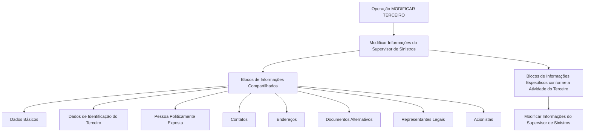

# Operação Modificar Supervisor de Sinistros — Estrutura de Informações de Terceiro

## 1. Metadados do Documento
- **Arquivo de Origem:** Não identificado
- **Tipo de Documento:** Procedimento
- **Domínio / Sistema:** Operação de terceiros; Supervisor de Sinistros; interface com referências a Zeus
- **Público-Alvo:** Usuários do sistema, operação e analistas funcionais
- **Data/Versão Identificada:** Não identificada

---

## 2. Resumo Executivo & Contexto de Negócio

O documento descreve a operação **Modificar Supervisor de Sinistros**, cujo objetivo é complementar, modificar e/ou inabilitar informações do Supervisor de Sinistros. A alteração pode ocorrer em qualquer bloco ou estrutura de dados que contenha e organize essas informações.

A operação está inserida no processo **Modificar Terceiro**. O Supervisor de Sinistros é tratado dentro de blocos de informação compartilhados e, também, em blocos específicos definidos conforme a atividade do terceiro.

A obrigatoriedade e a habilitação dos campos variam conforme o código de atividade do terceiro. Essas condições também podem variar conforme o terceiro seja uma pessoa física ou uma pessoa jurídica.

Personalizações previamente implementadas podem afetar o comportamento da aplicação quanto à obrigatoriedade do registro dos dados do terceiro. Adicionalmente, a ordem de captura dos dados nos diferentes blocos de informação pode variar segundo o critério seguido pelo usuário no sistema.

---

## 3. Arquitetura, Componentes & Tecnologias Envolvidas

O documento não apresenta arquitetura técnica de infraestrutura, APIs, bancos de dados, protocolos, contratos JSON, métodos HTTP ou tecnologias de implementação. O conteúdo descreve uma arquitetura funcional de blocos de informação dentro da operação **Modificar Terceiro**.

Componentes funcionais identificados:

- Operação **Modificar Terceiro**
- Processo de modificação das informações do **Supervisor de Sinistros**
- Blocos de informações compartilhados
- Blocos de informações específicos conforme a atividade do terceiro
- Referência textual a **Zeus**, sem detalhamento técnico ou funcional adicional
- Navegação textual: “Inicio Soluciones APIs Documentación Zeus”



> **Nota de Análise:** O documento lista a referência a Zeus, mas não detalha o papel de Zeus, seus serviços, interfaces, URLs, métodos de acesso ou integrações.

---

## 4. Regras de Negócio, Especificações Funcionais & Processos

### Operação Modificar Supervisor de Sinistros

A operação permite executar uma ou mais das seguintes ações sobre as informações do Supervisor de Sinistros:

1. Complementar informações.
2. Modificar informações.
3. Inabilitar informações.

As ações podem ser aplicadas em qualquer bloco ou estrutura de dados que contenha e estruture as informações do Supervisor de Sinistros.

### Premissas de obrigatoriedade e habilitação

A obrigatoriedade e/ou habilitação dos campos de registro nos blocos ou estruturas de informações compartilhadas pode variar de acordo com o código de atividade do terceiro.

A obrigatoriedade e/ou habilitação dos campos de registro nos blocos ou estruturas de informações pode variar conforme o tipo de terceiro:

- Pessoa Física.
- Pessoa Jurídica.

Personalizações eventualmente implementadas também podem afetar o comportamento da aplicação em relação à obrigatoriedade do registro dos dados do terceiro.

### Ordem de captura de dados

A ordem de captura dos dados nos diferentes blocos de informação pode variar de acordo com o critério seguido pelo usuário no sistema.

### Fluxo funcional identificado

1. O usuário inicia a operação **Modificar Terceiro**.
2. O usuário acessa os blocos de informações compartilhados aplicáveis ao terceiro.
3. O usuário acessa os blocos de informações específicos de acordo com a atividade do terceiro.
4. O usuário complementa, modifica e/ou inabilita as informações do Supervisor de Sinistros.
5. O comportamento de campos obrigatórios ou habilitados é condicionado pelo código de atividade, pelo tipo de terceiro e por personalizações existentes.

---

## 5. Tabelas de Parâmetros, Ambientes e Estruturas de Dados

| Item / Parâmetro | Descrição / Função | Tipo / Valores / Formato | Ambiente / Observações |
| :--- | :--- | :--- | :--- |
| Operação Modificar Supervisor | Complementar, modificar e/ou inabilitar informações do Supervisor de Sinistros | Operação funcional | Pode atuar em blocos ou estruturas que contenham informações do Supervisor de Sinistros |
| Operação Modificar Terceiro | Processo no qual ocorre a modificação das informações do Supervisor de Sinistros | Operação funcional | Contém blocos compartilhados e blocos específicos |
| Código de atividade do terceiro | Pode determinar a obrigatoriedade e/ou habilitação de campos | Código de atividade | O documento não informa valores, formato ou catálogo de códigos |
| Tipo de terceiro | Pode alterar a obrigatoriedade e/ou habilitação de campos | Pessoa Física ou Pessoa Jurídica | Sem critérios adicionais detalhados |
| Personalizações implementadas | Podem afetar a obrigatoriedade do registro dos dados do terceiro | Personalização da aplicação | Não são especificadas |
| Ordem de captura de dados | Define a sequência usada para registrar dados em blocos de informação | Critério do usuário no sistema | Pode variar |
| Dados Básicos | Bloco de informações compartilhadas | Bloco de informação | Integrante de Modificar Terceiro |
| Dados de Identificação do Terceiro | Bloco de informações compartilhadas | Bloco de informação | Integrante de Modificar Terceiro |
| Pessoa Politicamente Exposta | Bloco de informações compartilhadas | Bloco de informação | Integrante de Modificar Terceiro |
| Contatos | Bloco de informações compartilhadas | Bloco de informação | Integrante de Modificar Terceiro |
| Endereços | Bloco de informações compartilhadas | Bloco de informação | Integrante de Modificar Terceiro |
| Documentos Alternativos | Bloco de informações compartilhadas | Bloco de informação | Integrante de Modificar Terceiro |
| Representantes Legais | Bloco de informações compartilhadas | Bloco de informação | Integrante de Modificar Terceiro |
| Acionistas | Bloco de informações compartilhadas | Bloco de informação | Integrante de Modificar Terceiro |
| Informações específicas por atividade | Blocos específicos conforme a atividade do terceiro | Bloco de informação | Inclui a modificação das informações do Supervisor de Sinistros |
| Zeus | Referência textual presente na navegação do documento | Não especificado | Sem descrição funcional ou técnica |

---

## 6. Bateria de Perguntas & Respostas para RAG (FAQ Sintético)

### P1: Em que consiste a operação Modificar Supervisor de Sinistros?
**R:** A operação Modificar Supervisor de Sinistros consiste em complementar, modificar e/ou inabilitar informações do Supervisor de Sinistros em qualquer bloco ou estrutura de dados que contenha e organize essas informações.

### P2: A modificação do Supervisor de Sinistros faz parte de qual processo?
**R:** A modificação das informações do Supervisor de Sinistros faz parte do processo ou operação **Modificar Terceiro**.

### P3: Quais ações podem ser realizadas sobre as informações do Supervisor de Sinistros?
**R:** O documento informa que as informações do Supervisor de Sinistros podem ser complementadas, modificadas e/ou inabilitadas.

### P4: A obrigatoriedade dos campos é fixa para todos os terceiros?
**R:** Não. A obrigatoriedade e/ou habilitação dos campos pode variar conforme o código de atividade do terceiro, o tipo de terceiro — Pessoa Física ou Pessoa Jurídica — e as personalizações implementadas na aplicação.

### P5: O tipo de terceiro interfere no comportamento dos campos?
**R:** Sim. O documento estabelece que a obrigatoriedade e/ou habilitação dos campos pode variar caso o terceiro seja uma Pessoa Física ou uma Pessoa Jurídica.

### P6: As personalizações da aplicação podem alterar o registro dos dados?
**R:** Sim. As personalizações que possam ter sido implementadas podem afetar o comportamento da aplicação em relação à obrigatoriedade do registro dos dados do terceiro.

### P7: Quais blocos compartilhados são listados para a operação Modificar Terceiro?
**R:** Os blocos compartilhados listados são: Dados Básicos, Dados de Identificação do Terceiro, Pessoa Politicamente Exposta, Contatos, Endereços, Documentos Alternativos, Representantes Legais e Acionistas.

### P8: A sequência de preenchimento dos blocos de informação é obrigatoriamente fixa?
**R:** Não. A ordem de captura dos dados nos diversos blocos de informação pode variar de acordo com o critério seguido pelo usuário no sistema.

### P9: O documento define os campos obrigatórios por código de atividade?
**R:** Não. O documento informa que o código de atividade do terceiro pode influenciar a obrigatoriedade e/ou habilitação dos campos, mas não apresenta os códigos de atividade nem a matriz de campos aplicável a cada código.

### P10: O documento especifica APIs, métodos HTTP ou contratos de integração para o Supervisor de Sinistros?
**R:** Não. O documento não detalha APIs, métodos HTTP, contratos JSON, endpoints, URLs, bancos de dados ou integrações técnicas para a operação Modificar Supervisor de Sinistros.

---

## 7. Glossário de Termos, Siglas & Conceitos-Chave

- **Supervisor de Sinistros:** Entidade cujas informações podem ser complementadas, modificadas e/ou inabilitadas no contexto da operação Modificar Terceiro.
- **Terceiro:** Entidade cujos dados são gerenciados pela operação Modificar Terceiro.
- **Pessoa Física:** Tipo de terceiro citado como condição que pode influenciar a obrigatoriedade e/ou habilitação de campos.
- **Pessoa Jurídica:** Tipo de terceiro citado como condição que pode influenciar a obrigatoriedade e/ou habilitação de campos.
- **Pessoa Politicamente Exposta:** Bloco de informação compartilhada listado na operação Modificar Terceiro.
- **Blocos de Informações Compartilhados:** Estruturas de dados comuns listadas no processo Modificar Terceiro.
- **Blocos de Informações Específicos:** Estruturas de informação definidas conforme a atividade do terceiro.
- **Zeus:** Termo presente na navegação textual do documento; o significado e a função não são detalhados.
- **RS:** Sigla presente no conteúdo bruto, sem definição fornecida.

---

## 8. Notas Críticas, Riscos & Limitações

- O documento não identifica o arquivo de origem, autor, data, versão ou responsável pelo procedimento.
- Não são apresentados campos concretos, formatos, valores permitidos, critérios de validação ou mensagens de erro.
- Não há matriz que relacione códigos de atividade a campos obrigatórios ou habilitados.
- O documento não detalha como personalizações são identificadas, configuradas ou priorizadas.
- Não há especificação de APIs, URLs, ambientes, servidores, autenticação, logs ou mecanismos de auditoria.
- A ordem de captura pode variar conforme o usuário, o que pode resultar em fluxos operacionais não uniformes.
- **Nota de Análise:** O documento apresenta a estrutura funcional da operação, mas não fornece detalhamento adicional sobre contratos técnicos, persistência de dados ou regras específicas por atividade do terceiro.

---

## 9. Conteúdo Bruto Estruturado (Referência Fiel)

```text
--- [PÁGINA 1 DE 2] ---

OPERACIÓN MODIFICAR Supervisor
¿En que consiste?
Esta operación consiste en Complementar, Modificar y/o Inhabilitar la información del Supervisor
de Siniestros en cualquiera de los bloques o estructuras de datos que la contienen y estructuran.
Premisas
La obligatoriedad y/o la habilitación de los campos en el registro de los datos de cada uno de
los bloques o estructuras de información compartidas puede variar de acuerdo con el código de
actividad del Tercero:
La obligatoriedad y/o la habilitación de los campos en el registro de los datos de cada uno de
los bloques o estructuras de información pueden variar si el tipo de Tercero es una Persona
Física o una Persona Jurídica:
Las personalizaciones que se hubieran podido implementar a su vez pueden afectar el
comportamiento de la aplicación en relación con la obligatoriedad en el registro de los Datos del
Tercero.
Ejemplo:
Ejemplo:
 /
RS
Inicio Soluciones APIs Documentación Zeus
ES


--- [PÁGINA 2 DE 2] ---

Por último, el orden de captura de los datos en los distintos bloques de Información puede
variar de acuerdo con el criterio seguido por el Usuario en el Sistema.
Proceso
MODIFICAR
TERCERO
Modificar Información
del Supervisor de Siniestros
Bloques de Información Compartidos (MODIFICAR TERCERO)
 Datos Básicos ( )
 Datos Identificación Tercero ( )
 Persona Políticamente Expuesta(   )
 Contactos (   )
 Direcciones (   )
 Documentos Alternativos (   )
 Representantes Legales (   )
 Accionistas (   )
Bloques de Información Específicos de acuerdo con la
Actividad del Tercero.
 Modificar Información del Supervisor de Siniestros (  )
```
