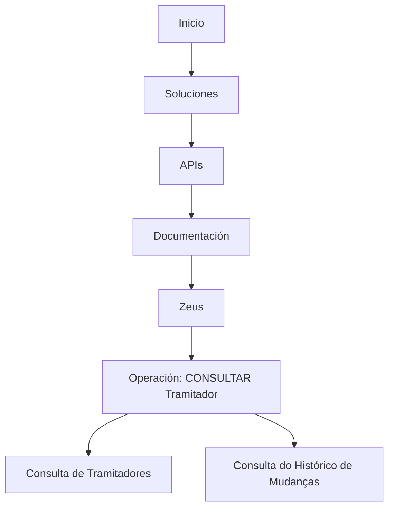

# Consulta de Tramitadores e Histórico de Alterações — Conteúdo Operacional

## 1. Metadados do Documento
- **Arquivo de Origem:** `Não identificado`
- **Tipo de Documento:** `Procedimento`
- **Domínio / Sistema:** `Tramitador / Zeus`
- **Público-Alvo:** `Operação`
- **Data/Versão Identificada:** `Não identificada`

---

## 2. Resumo Executivo & Contexto de Negócio

O conteúdo disponibilizado descreve uma operação denominada **“CONSULTAR Tramitador”**. O objetivo explicitamente informado é realizar a consulta de **Tramitadores** e de seu **histórico de mudanças**.

O texto também apresenta referências de navegação ou seções identificadas como **Inicio**, **Soluciones**, **APIs**, **Documentación** e **Zeus**. Não há detalhamento sobre a função específica de cada referência, nem sobre o procedimento de acesso à operação.

Não foram fornecidos contratos de API, métodos HTTP, campos de consulta, filtros, permissões, regras de autenticação, URLs, ambientes ou critérios para apresentação do histórico.

---

## 3. Arquitetura, Componentes & Tecnologias Envolvidas

Os elementos citados são:

| Componente / Termo | Descrição sustentada pelo conteúdo |
| :--- | :--- |
| `CONSULTAR Tramitador` | Operação para consultar Tramitadores e seu histórico de mudanças. |
| `Tramitador` | Entidade ou recurso que pode ser consultado. O documento não define sua estrutura. |
| `Histórico de mudanças` | Histórico associado aos Tramitadores. O conteúdo não descreve eventos, campos ou período de retenção. |
| `Zeus` | Referência textual apresentada junto a opções de navegação. Não há explicação de sua função. |
| `APIs` | Referência textual de navegação. Não há endpoints ou contratos descritos. |
| `Documentación` | Referência textual de navegação. Não há documentos adicionais fornecidos. |



> **Nota de Análise:** O diagrama representa apenas a associação textual entre os termos fornecidos. O conteúdo não confirma que essas referências constituem uma arquitetura técnica, fluxo de navegação executável ou integração entre sistemas.

---

## 4. Regras de Negócio, Especificações Funcionais & Processos

1. Existe uma operação identificada como **“CONSULTAR Tramitador”**.
2. A operação possui como finalidade declarada a **consulta dos Tramitadores**.
3. A operação também possui como finalidade declarada a consulta do **histórico de mudanças** dos Tramitadores.
4. O conteúdo não informa:
   - critérios de busca;
   - identificadores de Tramitador;
   - filtros disponíveis;
   - ordenação ou paginação;
   - campos retornados;
   - eventos registrados no histórico;
   - perfil de acesso necessário;
   - tratamento de erros;
   - métodos HTTP, contratos JSON ou endpoints de API;
   - regras de retenção ou auditoria do histórico.

---

## 5. Tabelas de Parâmetros, Ambientes e Estruturas de Dados

| Item / Parâmetro | Descrição / Função | Tipo / Valores / Formato | Ambiente / Observações |
| :--- | :--- | :--- | :--- |
| Operação | `CONSULTAR Tramitador` | Nome textual da operação | Não há ambiente identificado. |
| Recurso consultado | Tramitadores | Entidade não detalhada | O documento não apresenta atributos ou identificadores. |
| Informação associada | Histórico de mudanças | Histórico não detalhado | Não há descrição dos eventos ou campos históricos. |
| Referência | `Zeus` | Termo/sistema não detalhado | Associado textualmente à navegação exibida. |
| Referência | `APIs` | Seção ou categoria não detalhada | Não há APIs, URLs ou contratos informados. |
| Referência | `Documentación` | Seção ou categoria não detalhada | Não há documentação adicional no conteúdo fornecido. |

---

## 6. Bateria de Perguntas & Respostas para RAG (FAQ Sintético)

### P1: Qual é a finalidade da operação CONSULTAR Tramitador?
**R:** A operação **CONSULTAR Tramitador** tem a finalidade declarada de consultar os Tramitadores e o histórico de mudanças associado a esses Tramitadores.

### P2: A operação CONSULTAR Tramitador permite consultar histórico?
**R:** Sim. O conteúdo informa explicitamente que a operação consulta os Tramitadores e seu **Histórico de cambios**, isto é, histórico de mudanças.

### P3: Quais dados do Tramitador são retornados pela consulta?
**R:** O conteúdo não especifica quais campos, atributos, identificadores ou estruturas de dados são retornados na consulta de Tramitadores.

### P4: Quais filtros podem ser utilizados para consultar um Tramitador?
**R:** O documento fornecido não informa filtros, parâmetros de entrada, critérios de pesquisa ou mecanismos de identificação de Tramitadores.

### P5: Quais eventos são registrados no histórico de mudanças do Tramitador?
**R:** O conteúdo confirma a existência de um histórico de mudanças, mas não detalha os tipos de eventos, usuários, datas, valores anteriores ou valores posteriores registrados.

### P6: Existe uma API documentada para a operação CONSULTAR Tramitador?
**R:** O termo **APIs** aparece no conteúdo, mas não são fornecidos endpoints, métodos HTTP, contratos, exemplos de requisição ou exemplos de resposta para a operação CONSULTAR Tramitador.

### P7: O que é Zeus no contexto da consulta de Tramitadores?
**R:** **Zeus** aparece como referência textual junto de Inicio, Soluciones, APIs e Documentación. O documento não define se Zeus é um sistema, módulo, ambiente ou área de navegação.

### P8: Em qual ambiente a operação CONSULTAR Tramitador está disponível?
**R:** O documento não identifica ambiente, URL, servidor, instância ou configuração de acesso para a operação CONSULTAR Tramitador.

### P9: Quais permissões são necessárias para consultar Tramitadores?
**R:** O conteúdo não descreve autenticação, autorização, perfis de usuário ou matriz de permissões para a consulta de Tramitadores e de seu histórico.

### P10: O documento fornece procedimentos operacionais passo a passo?
**R:** Não. O conteúdo apresenta o nome da operação e sua finalidade, mas não fornece passos de execução, telas, comandos, parâmetros ou tratamento de exceções.

---

## 7. Glossário de Termos, Siglas & Conceitos-Chave

- **Tramitador:** Entidade ou recurso consultado pela operação `CONSULTAR Tramitador`. A definição funcional não é apresentada.
- **Histórico de mudanças:** Registro histórico associado aos Tramitadores, sem detalhamento de estrutura ou eventos.
- **Zeus:** Termo citado no conteúdo sem definição adicional.
- **APIs:** Termo citado no conteúdo sem especificação de interfaces, endpoints ou contratos.
- **Documentación:** Referência a documentação, sem conteúdo documental adicional fornecido.
- **RS:** Sigla exibida no texto original sem significado definido.

---

## 8. Notas Críticas, Riscos & Limitações

- O conteúdo é extremamente resumido e não permite determinar a arquitetura técnica da operação.
- Não há informações sobre endpoints, métodos HTTP, autenticação, formatos de dados ou tratamento de falhas.
- Não há definição funcional de **Tramitador**, **Zeus** ou **RS**.
- Não foram identificados ambientes, URLs, servidores, versões, responsáveis ou dependências.
- **Nota de Análise:** O documento lista a operação `CONSULTAR Tramitador`, porém não detalha métodos HTTP, contratos JSON, campos de entrada, campos de saída ou regras de acesso.

---

## 9. Conteúdo Bruto Estruturado (Referência Fiel)

```text
--- [PÁGINA 1 DE 1] ---

OPERACIÓN CONSULTAR Tramitador
Consulta de los Tramitadores y de su Histórico de cambios.
 / 
 RS
Inicio Soluciones APIs Documentación Zeus
ES
```
