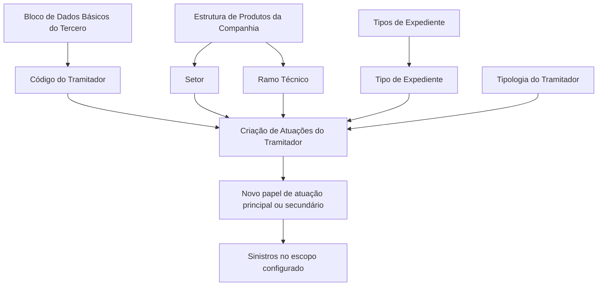

# Criação de Atuações do Tramitador — Regras de Alteração de Papel de Atuação

## 1. Metadados do Documento
- **Arquivo de Origem:** `Não identificado no conteúdo fornecido`
- **Tipo de Documento:** `Manual Operacional`
- **Domínio / Sistema:** `Gestão de sinistros e estrutura de produtos da companhia`
- **Público-Alvo:** `Operação, tramitadores e analistas funcionais`
- **Data/Versão Identificada:** `Não identificada`

---

## 2. Resumo Executivo & Contexto de Negócio

O documento descreve a funcionalidade **“CREAR Actuaciones del Tramitador”**, destinada ao registro de informações que permitem alterar a atuação de um tramitador em processos de sinistro. A funcionalidade atende especificamente à necessidade de habilitar um tramitador que, por seu papel original, não poderia gerir expedientes, a fazê-lo dentro de uma combinação delimitada de setor, ramo técnico e tipo de expediente.

A alteração também pode ser utilizada para modificar o papel de atuação principal já configurado para o tramitador. O efeito da configuração é condicionado pela estrutura de produtos da companhia e pela seleção de valores específicos ou genéricos nos campos de escopo.

A funcionalidade somente é permitida para tramitadores com uma das seguintes tipologias: **Recepcionista**, **Centro Telefônico**, **Tramitador Abogado** ou **Colaborador**. O documento não descreve o comportamento do sistema quando a tipologia do tramitador não pertence a essa lista.

Os campos de configuração são apresentados na ordem de visualização ou registro, da esquerda para a direita e de cima para baixo. A combinação de **Setor**, **Ramo Técnico** e **Tipo de Expediente** determina o alcance dos sinistros para os quais o papel de atuação será alterado.

---

## 3. Arquitetura, Componentes & Tecnologias Envolvidas

Os elementos funcionais identificados no documento são:

- **Tramitador:** entidade cujo papel de atuação pode ser criado ou alterado.
- **Bloco de Dados Básicos do Tercero:** origem do código do tramitador.
- **Estrutura de Produtos da Companhia:** fonte das chaves de setor e ramo técnico.
- **Siniestros:** contexto operacional em que o novo papel de atuação é aplicado.
- **Tipo de Expediente:** classificação do expediente, incluindo exemplos como DPM, RC e DAP.
- **Ação CREAR:** ação habilitada para criação de atuações.
- **Papel de atuação principal / secundário:** papel atribuído ao tramitador pela configuração.



> **Nota de Análise:** O documento não detalha tecnologias, APIs, métodos HTTP, contratos JSON, bancos de dados, URLs, ambientes, integrações técnicas ou mecanismos de persistência.

---

## 4. Regras de Negócio, Especificações Funcionais & Processos

1. A funcionalidade permite que um tramitador, cujo papel inicial não permita gerir expedientes, passe a gerir expedientes para uma combinação determinada de:
   - Setor;
   - Ramo técnico;
   - Tipo de expediente.

2. A funcionalidade também permite modificar o papel de atuação principal já configurado para o tramitador.

3. A criação ou alteração de atuação somente é permitida quando a tipologia do tramitador for uma das seguintes:
   - Recepcionista;
   - Centro Telefônico;
   - Tramitador Abogado;
   - Colaborador.

4. O **Código do Tramitador** é herdado do Bloco de Dados Básicos do Tercero e identifica o código do tramitador no sistema.

5. O campo **Setor** identifica a chave do setor da Estrutura de Produtos da Companhia para a qual o papel de atuação principal do tramitador será alterado.
   - O código genérico `9999` aplica a alteração a sinistros de todos os setores configurados no sistema.
   - Um código específico de setor aplica a alteração exclusivamente a sinistros daquele setor.

6. O campo **Ramo Técnico** identifica a chave do ramo técnico da Estrutura de Produtos da Companhia para a qual o papel de atuação principal do tramitador será alterado.
   - O código genérico `999` aplica a alteração a sinistros de todos os ramos técnicos configurados no sistema.
   - Um código específico de ramo técnico aplica a alteração exclusivamente a sinistros daquele ramo.

7. O campo **Tipo de Expediente** identifica a chave do tipo de expediente para o qual o papel de atuação do tramitador será alterado.
   - Exemplos citados: `DPM` — Daños Materiales Propios; `RC` — Responsabilidad Civil; `DAP` — Lesionados.
   - O código genérico `ZZZ` aplica a alteração a sinistros de todos os tipos de expediente definidos no sistema.
   - Um código específico de tipo de expediente aplica a alteração exclusivamente a sinistros daquela tipologia.

8. O campo **Tipologia del Tramitador** determina o novo papel de atuação, ou o papel de atuação secundário, atribuído ao tramitador.

9. A sequência de apresentação ou registro dos campos deve seguir a ordem descrita no documento: da esquerda para a direita e de cima para baixo.

---

## 5. Tabelas de Parâmetros, Ambientes e Estruturas de Dados

| Item / Parâmetro | Descrição / Função | Tipo / Valores / Formato | Ambiente / Observações |
| :--- | :--- | :--- | :--- |
| Ação habilitada | Permite criar atuações do tramitador. | `CREAR` | O documento apresenta `CREAR ( ) Actuaciones`. |
| Código do Tramitador | Identifica o código do tramitador no sistema. | Não informado | Procede e é herdado do Bloco de Dados Básicos do Tercero. |
| Setor | Define a chave de setor para a qual o papel de atuação principal é alterado. | Código de setor; genérico `9999` | `9999` aplica-se a todos os setores configurados; código específico aplica-se exclusivamente ao setor selecionado. |
| Ramo Técnico | Define a chave de ramo técnico para a qual o papel de atuação principal é alterado. | Código de ramo; genérico `999` | `999` aplica-se a todos os ramos técnicos configurados; código específico aplica-se exclusivamente ao ramo selecionado. |
| Tipo de Expediente | Define a chave do tipo de expediente afetado pela alteração do papel de atuação. | Código de expediente; genérico `ZZZ` | `ZZZ` aplica-se a todos os tipos de expediente definidos; código específico aplica-se exclusivamente à tipologia selecionada. |
| DPM | Exemplo de tipo de expediente. | `DPM` | Significa Daños Materiales Propios. |
| RC | Exemplo de tipo de expediente. | `RC` | Significa Responsabilidad Civil. |
| DAP | Exemplo de tipo de expediente. | `DAP` | Significa Lesionados. |
| Tipologia do Tramitador | Determina o novo papel de atuação ou papel de atuação secundário. | Recepcionista; Centro Telefônico; Tramitador Abogado; Colaborador | A funcionalidade é permitida somente para essas tipologias. |
| Papel de atuação principal | Papel configurado para o tramitador que pode ser modificado. | Não informado | A alteração é delimitada por setor, ramo técnico e tipo de expediente. |
| Papel de atuação secundário | Papel que pode ser atribuído ao tramitador. | Não informado | Determinado pela Tipologia do Tramitador, conforme o documento. |

---

## 6. Bateria de Perguntas & Respostas para RAG (FAQ Sintético)

### P1: Qual é o objetivo da funcionalidade “CREAR Actuaciones del Tramitador”?
**R:** A funcionalidade permite registrar uma atuação para que um tramitador cujo papel inicial não permite gerir expedientes possa fazê-lo para um setor, ramo técnico e tipo de expediente determinados. Também permite alterar o papel de atuação principal configurado para o tramitador.

### P2: Quais tipologias de tramitador podem utilizar a criação de atuações?
**R:** A funcionalidade é permitida somente para tramitadores com tipologia Recepcionista, Centro Telefônico, Tramitador Abogado ou Colaborador.

### P3: De onde vem o Código do Tramitador?
**R:** O Código do Tramitador procede e é herdado do Bloco de Dados Básicos do Tercero. Esse dado identifica o código do tramitador no sistema.

### P4: O que acontece quando o campo Setor recebe o código genérico 9999?
**R:** O código `9999` altera o papel de atuação do tramitador para sinistros de todos os setores configurados no sistema.

### P5: Como limitar a alteração de atuação a um único setor?
**R:** Deve-se informar o código de um setor específico existente na Estrutura de Produtos da Companhia. Nesse caso, a alteração será aplicada exclusivamente aos sinistros daquele setor.

### P6: Qual é o efeito do código 999 no campo Ramo Técnico?
**R:** O código genérico `999` altera o papel de atuação do tramitador para sinistros de todos os ramos técnicos configurados no sistema.

### P7: O que significa utilizar ZZZ no campo Tipo de Expediente?
**R:** O código genérico `ZZZ` altera o papel de atuação do tramitador para sinistros de todos os tipos de expediente definidos no sistema.

### P8: Quais tipos de expediente são citados como exemplos no documento?
**R:** O documento cita DPM, correspondente a Daños Materiales Propios; RC, correspondente a Responsabilidad Civil; e DAP, correspondente a Lesionados.

### P9: Como aplicar a alteração somente a um tipo de expediente específico?
**R:** Deve-se informar o código de um tipo de expediente específico. A alteração do papel de atuação será aplicada exclusivamente a sinistros daquela tipologia de expediente.

### P10: Qual campo determina o novo papel de atuação ou o papel de atuação secundário?
**R:** O campo Tipologia do Tramitador determina o novo papel de atuação, ou o papel de atuação secundário, atribuído ao tramitador.

### P11: O documento informa quais são os papéis de atuação possíveis?
**R:** Não. O documento afirma que a Tipologia do Tramitador determina o novo papel de atuação ou o papel secundário, mas não enumera os papéis de atuação disponíveis.

### P12: O documento define APIs, integrações ou contratos técnicos para criar atuações?
**R:** Não. O conteúdo fornecido não detalha APIs, métodos HTTP, contratos JSON, mecanismos de integração, endpoints, tecnologias ou estruturas de persistência.

---

## 7. Glossário de Termos, Siglas & Conceitos-Chave

- **CREAR:** Ação habilitada para criação de atuações do tramitador.
- **Tramitador:** Entidade que pode ter o papel de atuação alterado para gerir expedientes em determinado escopo.
- **Atuação:** Configuração associada ao tramitador que define ou altera seu papel de atuação.
- **Papel de atuação principal:** Papel configurado para o tramitador que pode ser modificado pela funcionalidade.
- **Papel de atuação secundário:** Papel adicional que pode ser atribuído ao tramitador.
- **Setor:** Chave da Estrutura de Produtos da Companhia usada para delimitar o escopo dos sinistros.
- **Ramo Técnico:** Chave da Estrutura de Produtos da Companhia usada para delimitar o escopo dos sinistros.
- **Tipo de Expediente:** Classificação do expediente de sinistro afetada pela alteração de atuação.
- **DPM:** Daños Materiales Propios.
- **RC:** Responsabilidad Civil.
- **DAP:** Lesionados.
- **Siniestro:** Termo utilizado no documento para sinistro.
- **Tercero:** Entidade cujo Bloco de Dados Básicos fornece o Código do Tramitador.

---

## 8. Notas Críticas, Riscos & Limitações

- O documento não informa o nome do arquivo de origem, data, versão, autor ou responsável pela manutenção.
- O documento não descreve quais valores específicos de setor, ramo técnico e tipo de expediente existem no sistema.
- O documento não apresenta validações para combinações inválidas entre setor, ramo técnico e tipo de expediente.
- O documento não informa como o sistema trata uma tipologia de tramitador fora das quatro tipologias permitidas.
- O documento não especifica a relação entre a tipologia do tramitador e cada papel de atuação principal ou secundário resultante.
- O documento não detalha permissões de usuário, aprovações, trilha de auditoria, mensagens de erro, persistência, APIs ou integrações.
- Os trechos identificados apenas como “Consejo:” não contêm orientação adicional no conteúdo fornecido.

---

## 9. Conteúdo Bruto Estruturado (Referência Fiel)

```text
--- [PÁGINA 1 DE 3] ---

CREAR Actuaciones del Tramitador
Objetivo
El registro de información en esta Estructura obedece a la necesidad de permitir el que un
tramitador, cuyo rol en principio le impide gestionar expedientes, pueda hacerlo para un sector, ramo
técnico y tipo de expediente determinados o cambiar el rol de actuación principal que tenga
configurado.
Esto está permitido siempre y cuando la tipología del Tramitador sea una de las siguientes:
Recepcionista.
Centro Telefónico.
Tramitador Abogado, ó
Colaborador.
Acciones habilitadas
 CREAR ( )
Actuaciones
 /
 RS
Inicio Soluciones APIs Documentación Zeus
ES


--- [PÁGINA 2 DE 3] ---

De Izquierda a Derecha y de Arriba hacia Abajo, los siguientes campos marcan la secuencia de
visualización o registro de los Campos en este Bloque de Información.
Código del Tramitador
Este dato procede y se hereda del Bloque de Datos Básicos del Tercero e identifica el código del
tramitador en el Sistema.
Sector (  )
Este campo identifica la clave del Sector de la Estructura de Productos de la Compañía para la que
se cambia el rol de actuación principal del tramitador.
Utilizando el valor genérico en este campo (código 9999) se cambiará el rol de actuación del
tramitador para los siniestros de todos los sectores configurados en el sistema o bien, al utilizar el
código de un sector en concreto de los existentes, cambiar el rol de actuación exclusivamente
para los siniestros de este.
Ramo Técnico (  )
Este campo identifica la clave del ramo técnico de la Estructura de Productos de la Compañía para la
que se cambia el rol de actuación principal del tramitador.
Utilizando el valor genérico en este campo (código 999) se cambiará el rol de actuación del
tramitador para los siniestros de todos los ramos técnicos configurados en el sistema o bien, al
utilizar el código de un ramo en particular de los existentes, cambiar el rol de actuación
exclusivamente para los siniestros de este.
Tipo de Expediente (  )
Esta campo identifica la clave del tipo de expediente' (DPM - Daños Materiales Propios,RC -
Responsabilidad Civil, DAP - Lesionados,...) sobre el que se cambia el rol de actuación del
tramitador.
Consejo:
Consejo:


--- [PÁGINA 3 DE 3] ---

Utilizando el valor genérico en este campo (código ZZZ) se cambiará el rol de actuación del
tramitador para los siniestros de todos los tipos de expedientes definidos en el sistema o bien, al
utilizar el código de un tipo de expediente en particular, cambiar el rol de actuación
exclusivamente para los siniestros de esta tipología.
Tipología del Tramitador (  )
Este campo del determinará el nuevo rol de actuación (o rol de actuación secundario) asignado al
tramitador.
Consejo:
```
