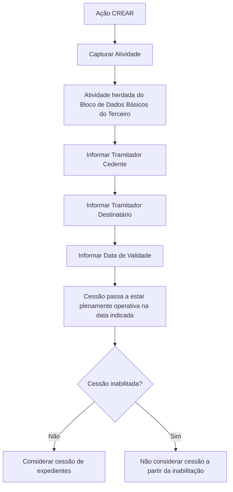

# Criação de Cessões Temporárias de Expedientes do Tramitador

## 1. Metadados do Documento
- **Arquivo de Origem:** `Não identificado`
- **Tipo de Documento:** `Procedimento`
- **Domínio / Sistema:** `Gestão de expedientes de sinistros / Tramitadores`
- **Público-Alvo:** `Operação e usuários responsáveis pela gestão de tramitadores`
- **Data/Versão Identificada:** `Não identificada`

---

## 2. Resumo Executivo & Contexto de Negócio

O documento descreve a funcionalidade **Criar Cessões Temporárias** para expedientes de um tramitador. O objetivo é permitir a reatribuição dos expedientes de sinistros de um tramitador cedente para outro tramitador destinatário, preservando a continuidade da gestão dos expedientes.

A necessidade de negócio está associada a situações de indisponibilidade temporária do tramitador original, incluindo doença, férias e baixa temporária. A cessão temporária permite que os expedientes continuem sendo tratados por outro tramitador enquanto a condição de transferência estiver válida e habilitada.

A captura das informações segue uma sequência apresentada da esquerda para a direita e de cima para baixo. Os principais dados incluem a atividade, o tramitador cedente, o tramitador destinatário, a data de validade e o indicador de inabilitação.

A funcionalidade disponibiliza a ação **CREAR**. O documento não apresenta detalhes sobre persistência, validações técnicas, permissões, contratos de integração, métodos HTTP, mensagens de erro ou comportamento após o encerramento da validade.

---

## 3. Arquitetura, Componentes & Tecnologias Envolvidas

Os componentes funcionais identificados são:

- **Cessões Temporárias:** estrutura utilizada para registrar a transferência temporária de expedientes.
- **Tramitador Cedente:** tramitador que transfere os expedientes de sinistros.
- **Tramitador Destinatário:** tramitador que recebe os expedientes de sinistros.
- **Atividade:** código de atividade aplicável aos tramitadores, herdado do bloco de Dados Básicos do Terceiro.
- **Data de Validade:** data a partir da qual a cessão passa a ser plenamente operacional no sistema.
- **Inabilitação:** campo que informa ao sistema que a cessão deixou de ser considerada.



> **Nota de Análise:** O documento descreve um fluxo funcional de cessão temporária, mas não detalha arquitetura de software, banco de dados, interfaces, tecnologias, integrações ou ambientes.

---

## 4. Regras de Negócio, Especificações Funcionais & Processos

1. A estrutura de **Cessões Temporárias** existe para reatribuir os expedientes de um tramitador a outro tramitador.
2. A reatribuição deve permitir a continuidade da gestão dos expedientes.
3. Os casos de uso explicitamente citados para a cessão temporária são:
   - doença;
   - férias;
   - baixa temporária.
4. A ação habilitada no documento é **CREAR**.
5. Os campos devem ser capturados na sequência visual indicada: da esquerda para a direita e de cima para baixo.
6. O campo **Atividade** é herdado do bloco de **Dados Básicos do Terceiro**.
7. A **Atividade** identifica o código de atividade correspondente aos tramitadores.
8. O campo **Tramitador Cedente** contém o código do tramitador que cede os expedientes de sinistros.
9. O valor de **Tramitador Cedente** é herdado do tramitador que está sendo dado de alta.
10. O campo **Tramitador Destinatário** contém o código do tramitador que recebe os expedientes de sinistros.
11. A **Data de Validade** determina a data a partir da qual a cessão de expedientes se torna efetiva e plenamente operacional no sistema.
12. O campo **Inabilitação** indica que a cessão de expedientes foi inabilitada no sistema.
13. A partir do momento da inabilitação, o sistema não deve considerar a cessão de expedientes.

> **Nota de Análise:** O documento não especifica se a data de validade possui regras de formato, obrigatoriedade, limite temporal ou validação contra datas passadas.

---

## 5. Tabelas de Parâmetros, Ambientes e Estruturas de Dados

| Item / Parâmetro | Descrição / Função | Tipo / Valores / Formato | Ambiente / Observações |
| :--- | :--- | :--- | :--- |
| Ação habilitada | Cria uma cessão temporária de expedientes. | `CREAR` | O documento não detalha permissões nem efeitos de persistência. |
| Cessões Temporárias | Estrutura para reatribuir expedientes de um tramitador a outro. | Estrutura de informação | Utilizada para continuidade da gestão em doença, férias ou baixa temporária. |
| Atividade | Identifica o código de atividade correspondente aos tramitadores. | Código de atividade | Procede e é herdado do bloco de Dados Básicos do Terceiro. |
| Tramitador Cedente | Identifica o tramitador que cede os expedientes de sinistros. | Código do tramitador | O valor é herdado do tramitador que está sendo dado de alta. |
| Tramitador Destinatário | Identifica o tramitador que recebe os expedientes de sinistros. | Código do tramitador | O documento não apresenta regra de herança para esse campo. |
| Data de Validade | Define quando a cessão passa a produzir efeito no sistema. | Data | A partir dessa data, a cessão fica plenamente operativa. |
| Inabilitação | Indica que a cessão está inabilitada. | Campo de inabilitação | Após a inabilitação, o sistema não considera a cessão. |
| Ordem de captura | Determina a sequência de preenchimento dos campos. | Esquerda para direita; cima para baixo | Aplicável ao bloco de informações apresentado. |

---

## 6. Bateria de Perguntas & Respostas para RAG (FAQ Sintético)

### P1: Qual é o objetivo da funcionalidade de Cessões Temporárias?
**R:** A funcionalidade de Cessões Temporárias permite reatribuir os expedientes de um tramitador para outro tramitador, garantindo a continuidade da gestão dos expedientes.

### P2: Em quais situações uma cessão temporária de expedientes pode ser utilizada?
**R:** O documento cita doença, férias e baixa temporária como situações em que os expedientes de um tramitador podem ser cedidos temporariamente a outro tramitador.

### P3: Qual ação está habilitada para a estrutura de Cessões Temporárias?
**R:** A ação habilitada é **CREAR**, apresentada no documento como a ação disponível para a criação de cessões temporárias.

### P4: De onde vem o valor do campo Atividade?
**R:** O valor do campo Atividade procede e é herdado do bloco de Dados Básicos do Terceiro.

### P5: O que o campo Atividade identifica?
**R:** O campo Atividade identifica o código de atividade que corresponde aos tramitadores.

### P6: Qual é a função do Tramitador Cedente?
**R:** O Tramitador Cedente contém o código do tramitador que cede os expedientes de sinistros para outro tramitador.

### P7: Como é preenchido o valor do Tramitador Cedente?
**R:** O valor do Tramitador Cedente é herdado do tramitador que está sendo dado de alta.

### P8: Qual é a função do Tramitador Destinatário?
**R:** O Tramitador Destinatário contém o código do tramitador que recebe os expedientes de sinistros cedidos temporariamente.

### P9: Quando uma cessão de expedientes se torna plenamente operativa no sistema?
**R:** A cessão se torna plenamente operativa a partir da Data de Validade informada na estrutura de Cessões Temporárias.

### P10: O que ocorre quando uma cessão é inabilitada?
**R:** Quando o campo Inabilitação indica que a cessão foi inabilitada, o sistema deixa de considerar a cessão de expedientes a partir do momento da inabilitação.

### P11: Qual é a sequência indicada para a captura dos campos?
**R:** Os campos devem ser capturados da esquerda para a direita e de cima para baixo, conforme a sequência apresentada no bloco de informações.

### P12: O documento informa quais métodos ou contratos técnicos são usados para criar a cessão?
**R:** Não. O documento apresenta a ação CREAR e os campos funcionais, mas não detalha métodos HTTP, contratos JSON, integrações, banco de dados ou mensagens de erro.

---

## 7. Glossário de Termos, Siglas & Conceitos-Chave

- **Cessões Temporárias:** estrutura utilizada para transferir temporariamente a gestão de expedientes entre tramitadores.
- **Expedientes:** expedientes associados a sinistros cuja gestão pode ser reatribuída.
- **Sinistros:** contexto dos expedientes administrados pelos tramitadores mencionados no documento.
- **Tramitador:** responsável pela gestão de expedientes de sinistros.
- **Tramitador Cedente:** tramitador que transfere ou cede os expedientes.
- **Tramitador Destinatário:** tramitador que recebe os expedientes cedidos.
- **Atividade:** código de atividade correspondente aos tramitadores.
- **Dados Básicos do Terceiro:** bloco de origem do valor do campo Atividade.
- **Data de Validade:** data a partir da qual a cessão produz efeito e fica plenamente operacional.
- **Inabilitação:** condição que faz o sistema deixar de considerar uma cessão de expedientes.

---

## 8. Notas Críticas, Riscos & Limitações

- O documento não identifica arquivo de origem, data, versão, autor, ambiente ou sistema corporativo específico.
- Não há especificação de permissões, perfis de acesso ou responsáveis autorizados a executar a ação **CREAR**.
- Não são descritas validações entre o Tramitador Cedente e o Tramitador Destinatário.
- Não há detalhamento sobre o comportamento do sistema após o fim da validade da cessão.
- O documento não esclarece se a inabilitação é reversível, se possui data própria ou se exige justificativa.
- Não são apresentados contratos de integração, telas completas, APIs, logs, bancos de dados, rotas de auditoria ou tratamento de falhas.
- A relação entre o “tramitador que estamos dando de alta” e o processo de alta não recebe detalhamento adicional.

---

## 9. Conteúdo Bruto Estruturado (Referência Fiel)

```text
--- [PÁGINA 1 DE 2] ---

CREAR Cesiones Temporales de Expedientes
del Tramitador
Objetivo
La captura de la información en esta Estructura obedece a la necesidad de reasignar los
Expedientes del Tramitador a algún otro tramitador continuando así con su gestión (ya sea por
enfermedad, vacaciones, baja temporal,...)
Acciones habilitadas
 CREAR ( )
Cesiones Temporales
De Izquierda a Derecha y de Arriba hacia Abajo, los siguientes campos marcan la secuencia de
captura de los Campos en este Bloque de Información.
Actividad (  )
Este dato procede y se hereda del Bloque de Datos Básicos del Tercero e identifica el código de
actividad que le corresponde a los Tramitadores.
 / 
 RS
Inicio Soluciones APIs Documentación Zeus
ES


--- [PÁGINA 2 DE 2] ---

Tramitador Cedente (  )
Este campo contiene el código del Tramitador que cede los expedientes de los siniestros y su valor
se hereda del tramitador que estamos dando de alta.
Tramitador Destinatario (  )
Este campo, por el contrario, contiene el código del Tramitador que recibe los expedientes de los
siniestros.
Fecha de Validez ( )
Esta propiedad le indica al Sistema la fecha a partir de la cual la cesión de expedientes tomará
cuerpo y estará plenamente operativa en el sistema.
Inhabilitación ( )
Este Campo le indica al Sistema que la cesión de expedientes del Tramitador está inhabilitada en el
Sistema por lo que a partir del momento de su inhabilitación no se va a considerar su cesión.
```
