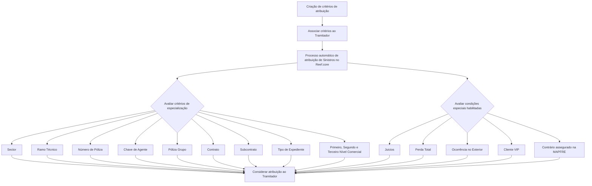

# Critérios de Atribuição de Sinistros ao Tramitador no Reef.core

## 1. Metadados do Documento
- **Arquivo de Origem:** Não identificado no conteúdo fornecido
- **Tipo de Documento:** Manual Operacional
- **Domínio / Sistema:** Reef.core — atribuição automática de Sinistros/Expedientes
- **Público-Alvo:** Operação, Analistas Funcionais, Desenvolvedores e Gestores de Sinistros
- **Data/Versão Identificada:** Não identificada

---

## 2. Resumo Executivo & Contexto de Negócio

O documento descreve a criação de critérios de atribuição de Sinistros para um **Tramitador** no sistema **Reef.core**. Esses critérios são explicitamente associados ao Tramitador para que o processo automático de atribuição de Sinistros considere os parâmetros configurados durante a distribuição de Sinistros e Expedientes.

A configuração permite especializar a atuação de cada Tramitador segundo características da estrutura de produtos, estrutura comercial, apólices, intermediários, contratos e tipos de expediente. A finalidade é direcionar Sinistros e Expedientes a Tramitadores com responsabilidade, conhecimento ou experiência apropriados para determinadas combinações de critérios.

O documento apresenta critérios de segmentação por **Sector**, **Ramo Técnico**, **Número de Póliza**, **Agente**, **Póliza Grupo**, **Contrato**, **Subcontrato**, **Tipo de Expediente** e níveis da estrutura comercial. Alguns critérios dispõem de códigos genéricos que ampliam a elegibilidade do Tramitador para todos os valores configurados em uma determinada dimensão.

Além dos critérios de especialização, o processo de atribuição pode considerar situações específicas: processos judiciais, perda total, ocorrências no exterior, clientes VIP e expedientes cujo contrário esteja segurado na MAPFRE. A ativação desses campos permite que o Tramitador receba Sinistros ou Expedientes com essas características.

A ação habilitada apresentada pelo documento é **CREAR**, indicando que o conteúdo trata da criação de uma estrutura de critérios de atribuição. O texto não descreve o comportamento de alteração, exclusão, prioridade entre critérios concorrentes, regras de desempate, telas, permissões, contratos técnicos ou interfaces de integração.

---

## 3. Arquitetura, Componentes & Tecnologias Envolvidas

### Componentes e conceitos identificados

| Componente / Entidade | Papel descrito no documento |
| :--- | :--- |
| **Reef.core** | Sistema que executa o Processo de Atribuição automático de Sinistros e considera os critérios associados ao Tramitador. |
| **Tramitador** | Entidade responsável pela gestão de Sinistros e/ou Expedientes; recebe critérios de atribuição e distribuição. |
| **Processo de Atribuição automático de Sinistros** | Processo do Reef.core que utiliza os critérios configurados para considerar a atribuição de Sinistros ao Tramitador. |
| **Sinistro** | Evento passível de atribuição a um Tramitador. |
| **Expediente** | Registro de gestão associado a Sinistros, apólices e critérios de classificação. |
| **Estrutura de Produtos da Companhia** | Estrutura que contém, entre outros elementos, Sector e Ramo Técnico. |
| **Estrutura Comercial no Sistema** | Estrutura com Primeiro, Segundo e Terceiro Nível, usada para especializar a atribuição. |
| **Módulo de Juicios** | Módulo mencionado para identificar Sinistros e Expedientes em processo judicial. |
| **MAPFRE** | Organização mencionada no contexto de expedientes cujo contrário está assegurado na MAPFRE. |

### Fluxo funcional de atribuição baseado nos critérios configurados



**Nota de Análise:** O documento afirma que Reef.core considera os critérios associados ao Tramitador no processo automático de atribuição. No entanto, o documento não detalha a lógica de combinação entre critérios, se os critérios são cumulativos ou alternativos, nem a prioridade aplicada quando mais de um Tramitador for elegível.

---

## 4. Regras de Negócio, Especificações Funcionais & Processos

### 4.1 Objetivo da configuração

A estrutura de critérios existe para configurar os critérios de atribuição de Sinistros que serão associados expressamente ao Tramitador. O Processo de Atribuição automático de Sinistros do Reef.core utiliza esses critérios para considerar a distribuição dos Sinistros.

### 4.2 Ação habilitada

A ação habilitada no documento é:

- **CREAR:** criação de critérios de atribuição associados ao Tramitador.

**Nota de Análise:** O documento não apresenta ações de consulta, alteração, eliminação, aprovação ou publicação dos critérios.

### 4.3 Aplicação para pessoas físicas e pessoas jurídicas

Caso não exista uma especificação ou indicação expressa em contrário, os atributos configurados são utilizados tanto para:

- Pessoas Físicas.
- Pessoas Jurídicas.

### 4.4 Critérios de especialização por produto e apólice

1. **Código do Tramitador**
   - Identifica o código do Tramitador ao qual são concedidos os critérios de atribuição e distribuição de Sinistros.

2. **Sector**
   - Identifica a chave do Sector na Estrutura de Produtos da Companhia.
   - Permite especializar a gestão do Tramitador para Sinistros/Expedientes com aquela característica.
   - O código genérico **9999** permite atribuir ao Tramitador Sinistros de todos os sectores configurados no sistema.
   - Um código de Sector específico restringe a consideração aos Sinistros do Sector indicado.
   - Por meio de combinações adequadas, o Tramitador pode receber Sinistros de todos, vários ou apenas um Sector.

3. **Ramo Técnico**
   - Identifica a chave do Ramo Técnico na Estrutura de Produtos da Companhia.
   - Permite especializar a gestão do Tramitador para Sinistros/Expedientes com aquele Ramo Técnico.
   - O código genérico **999** permite atribuir ao Tramitador Sinistros de todos os ramos técnicos configurados.
   - Um código de Ramo Técnico específico restringe a consideração aos Sinistros do Ramo Técnico indicado.

4. **Número de Póliza**
   - Identifica uma Póliza específica.
   - Pode ser usado quando uma Póliza apresenta características técnicas ou comerciais especiais.
   - Pode ser usado quando a entidade considera apropriado que determinado Tramitador, devido à sua experiência, seja responsável pela gestão dos Sinistros e/ou Expedientes da Póliza.

5. **Chave de Agente**
   - Identifica a chave do intermediário.
   - Permite especializar a gestão do Tramitador para Sinistros/Expedientes de Pólizas intermediadas pelo Agente identificado.

6. **Póliza Grupo**
   - Identifica o código de uma Póliza Grupo.
   - Permite especializar a gestão do Tramitador para Sinistros/Expedientes de Pólizas associadas à Póliza Grupo.

7. **Contrato**
   - Identifica o código de um Contrato.
   - Permite ao Reef.core especializar a gestão do Tramitador para Sinistros/Expedientes de Pólizas associadas ao Contrato.

8. **Subcontrato**
   - Identifica a chave de um Subcontrato.
   - Permite especializar a gestão do Tramitador para Sinistros/Expedientes de Pólizas associadas ao Subcontrato.

### 4.5 Critérios de especialização por tipo de expediente

1. **Tipo de Expediente**
   - Identifica a chave de um Tipo de Expediente.
   - São apresentados como exemplos:
     - **DPM:** Daños Materiales Propios.
     - **RC:** Responsabilidad Civil.
     - **DAP:** Lesionados.
   - O critério permite especializar a gestão do Tramitador conforme o Tipo de Expediente.
   - O código genérico **ZZZ** permite atribuir ao Tramitador Sinistros de todos os Tipos de Expediente configurados.
   - Um código específico de Tipo de Expediente restringe a consideração aos Sinistros daquele tipo.

### 4.6 Critérios de especialização por estrutura comercial

1. **Chave do Primeiro Nível**
   - Contém o código que identifica o Primeiro Nível da Estrutura Comercial no Sistema.
   - Permite especializar a gestão do Tramitador para Sinistros/Expedientes de Pólizas associadas à chave configurada.

2. **Chave do Segundo Nível**
   - Contém o código que identifica o Segundo Nível da Estrutura Comercial no Sistema.
   - Permite especializar a gestão do Tramitador para Sinistros/Expedientes de Pólizas associadas à chave configurada.

3. **Chave do Terceiro Nível**
   - Contém o código que identifica o Terceiro Nível da Estrutura Comercial no Sistema.
   - Permite especializar a gestão do Tramitador para Sinistros/Expedientes de Pólizas associadas à chave configurada.

### 4.7 Condições especiais de elegibilidade

1. **Sinistros/Expedientes em Juicios**
   - Quando o campo é ativado, o Tramitador pode receber Sinistros e Expedientes em processo judicial.
   - O documento relaciona essa condição ao módulo de Juicios.

2. **Sinistros com Pérdida Total**
   - Quando o campo é ativado, o Tramitador pode receber Sinistros e Expedientes identificados como perda total.

3. **Sinistros ocorridos no Extranjero**
   - Quando o campo é ativado, o Tramitador pode receber Sinistros e Expedientes identificados como ocorridos no exterior.

4. **Sinistros de Clientes VIP**
   - Quando o campo é ativado, o Processo de Atribuição implementado no Reef.core permite que o Tramitador receba Sinistros e Expedientes pertencentes a Pólizas de Clientes VIP.

5. **Sinistros/Expedientes com Contrário na MAPFRE**
   - Quando o campo é ativado, o Tramitador pode receber Expedientes, normalmente de Pólizas de automóveis, cujo contrário também esteja assegurado na MAPFRE.

---

## 5. Tabelas de Parâmetros, Ambientes e Estruturas de Dados

### 5.1 Critérios de atribuição

| Item / Parâmetro | Descrição / Função | Tipo / Valores / Formato | Ambiente / Observações |
| :--- | :--- | :--- | :--- |
| Código do Tramitador | Identifica o Tramitador que recebe os critérios de atribuição e distribuição. | Código do Tramitador. | Valor específico não informado. |
| Sector | Especializa a atribuição por Sector da Estrutura de Produtos da Companhia. | Código de Sector; código genérico `9999`. | `9999` permite todos os sectores; código específico considera somente o Sector informado. |
| Ramo Técnico | Especializa a atribuição por Ramo Técnico da Estrutura de Produtos da Companhia. | Código de Ramo Técnico; código genérico `999`. | `999` permite todos os ramos técnicos; código específico considera somente o Ramo Técnico informado. |
| Número de Póliza | Direciona a gestão de Sinistros/Expedientes de uma Póliza específica a um Tramitador determinado. | Chave de Póliza. | Aplicável a características técnicas/comerciais especiais ou experiência do Tramitador. |
| Chave de Agente | Especializa a atribuição por intermediário de Póliza. | Chave do intermediário/Agente. | Considera Pólizas intermediadas pelo Agente identificado. |
| Póliza Grupo | Especializa a atribuição por Póliza Grupo. | Código de Póliza Grupo. | Considera Pólizas associadas à Póliza Grupo. |
| Contrato | Especializa a atribuição por Contrato. | Código de Contrato. | Considera Pólizas associadas ao Contrato. |
| Subcontrato | Especializa a atribuição por Subcontrato. | Chave de Subcontrato. | Considera Pólizas associadas ao Subcontrato. |
| Tipo de Expediente | Especializa a gestão segundo o tipo do Expediente. | Código de Tipo de Expediente; código genérico `ZZZ`. | `ZZZ` permite todos os tipos; código específico considera apenas o tipo informado. |
| Chave do Primeiro Nível | Especializa a atribuição pelo Primeiro Nível da Estrutura Comercial. | Código de Primeiro Nível. | Considera Pólizas associadas à chave configurada. |
| Chave do Segundo Nível | Especializa a atribuição pelo Segundo Nível da Estrutura Comercial. | Código de Segundo Nível. | Considera Pólizas associadas à chave configurada. |
| Chave do Terceiro Nível | Especializa a atribuição pelo Terceiro Nível da Estrutura Comercial. | Código de Terceiro Nível. | Considera Pólizas associadas à chave configurada. |

### 5.2 Valores genéricos explicitamente informados

| Item / Parâmetro | Descrição / Função | Tipo / Valores / Formato | Ambiente / Observações |
| :--- | :--- | :--- | :--- |
| Sector genérico | Habilita a atribuição de Sinistros de todos os sectores. | Código `9999`. | Refere-se aos sectores configurados no sistema. |
| Ramo Técnico genérico | Habilita a atribuição de Sinistros de todos os ramos técnicos. | Código `999`. | Refere-se aos ramos técnicos configurados no sistema. |
| Tipo de Expediente genérico | Habilita a atribuição de Sinistros de todos os Tipos de Expediente. | Código `ZZZ`. | Refere-se aos Tipos de Expediente configurados no sistema. |
| DPM | Exemplo de Tipo de Expediente. | `DPM` — Daños Materiales Propios. | Apresentado como exemplo no documento. |
| RC | Exemplo de Tipo de Expediente. | `RC` — Responsabilidad Civil. | Apresentado como exemplo no documento. |
| DAP | Exemplo de Tipo de Expediente. | `DAP` — Lesionados. | Apresentado como exemplo no documento. |

### 5.3 Indicadores de condições especiais

| Item / Parâmetro | Descrição / Função | Tipo / Valores / Formato | Ambiente / Observações |
| :--- | :--- | :--- | :--- |
| Se contemplam Sinistros/Expedientes em Juicios | Permite atribuir Sinistros e Expedientes em processo judicial. | Campo de ativação; valores não detalhados. | Associado ao módulo de Juicios. |
| Se contemplam Sinistros com Pérdida Total | Permite atribuir Sinistros e Expedientes identificados como perda total. | Campo de ativação; valores não detalhados. | Sem regras adicionais descritas. |
| Se contemplam Sinistros ocorridos no Extranjero | Permite atribuir Sinistros e Expedientes ocorridos no exterior. | Campo de ativação; valores não detalhados. | Sem regras adicionais descritas. |
| Se contemplam Sinistros de Clientes VIP | Permite atribuir Sinistros e Expedientes de Pólizas de Clientes VIP. | Campo de ativação; valores não detalhados. | Modula o Processo de Atribuição implementado no Reef.core. |
| Se contemplam Sinistros/Expedientes com Contrário na MAPFRE | Permite atribuir Expedientes cujo contrário seja segurado na MAPFRE. | Campo de ativação; valores não detalhados. | Normalmente associado a Pólizas de automóveis. |

### 5.4 Ambientes, URLs, logs e infraestrutura

| Item / Parâmetro | Descrição / Função | Tipo / Valores / Formato | Ambiente / Observações |
| :--- | :--- | :--- | :--- |
| Ambientes técnicos | Não detalhados. | Não informado. | O documento não apresenta servidores, URLs, portas ou ambientes. |
| Rotas de logs | Não detalhadas. | Não informado. | O documento não apresenta caminhos de logs. |
| APIs e contratos técnicos | Não detalhados. | Não informado. | O documento não descreve métodos HTTP, payloads JSON, endpoints ou integrações. |

---

## 6. Bateria de Perguntas & Respostas para RAG (FAQ Sintético)

### P1: Qual é o objetivo dos critérios de atribuição de Sinistros ao Tramitador no Reef.core?
**R:** Os critérios de atribuição servem para configurar as condições que serão associadas expressamente a um Tramitador. O Processo de Atribuição automático de Sinistros do Reef.core utiliza esses critérios para considerar a atribuição e distribuição de Sinistros e Expedientes ao Tramitador.

### P2: O que representa o Código do Tramitador nessa configuração?
**R:** O Código do Tramitador identifica o Tramitador ao qual estão sendo concedidos os critérios de atribuição e distribuição de Sinistros. O documento não informa o formato técnico ou o domínio de valores desse código.

### P3: Como funciona o código genérico 9999 no critério Sector?
**R:** O código `9999` é o valor genérico do critério Sector. Quando utilizado, permite atribuir ao Tramitador Sinistros de todos os sectores configurados no sistema. Quando é utilizado o código de um Sector específico, a atribuição considera exclusivamente Sinistros daquele Sector.

### P4: Como o Ramo Técnico influencia a distribuição automática de Sinistros?
**R:** O Ramo Técnico identifica uma chave da Estrutura de Produtos da Companhia e permite especializar a gestão do Tramitador. O código genérico `999` permite considerar Sinistros de todos os ramos técnicos configurados; um código específico limita a consideração aos Sinistros daquele Ramo Técnico.

### P5: Em que situação deve ser utilizado o Número de Póliza como critério?
**R:** O Número de Póliza pode ser utilizado quando uma Póliza possui características técnicas ou comerciais especiais, ou quando a entidade entende que a experiência de um Tramitador específico torna adequado que ele seja responsável pela gestão dos Sinistros e/ou Expedientes dessa Póliza.

### P6: O que significa configurar uma Chave de Agente para um Tramitador?
**R:** A Chave de Agente identifica o intermediário associado às Pólizas. Essa configuração permite especializar a gestão do Tramitador para que possam ser atribuídos a ele Sinistros e Expedientes de Pólizas intermediadas pelo Agente identificado.

### P7: Qual é o valor genérico para considerar todos os Tipos de Expediente?
**R:** O valor genérico é `ZZZ`. Ao utilizar `ZZZ`, o sistema permite atribuir ao Tramitador Sinistros de todos os Tipos de Expediente configurados. Ao utilizar um código específico, a atribuição é considerada exclusivamente para aquele Tipo de Expediente.

### P8: Quais Tipos de Expediente são citados como exemplos no documento?
**R:** O documento cita `DPM` para Daños Materiales Propios, `RC` para Responsabilidad Civil e `DAP` para Lesionados. Esses exemplos ilustram tipos que podem ser utilizados para especializar a gestão de um Tramitador.

### P9: Como os níveis da Estrutura Comercial podem ser usados na atribuição?
**R:** As Chaves do Primeiro, Segundo e Terceiro Nível identificam níveis da Estrutura Comercial no Sistema. Cada chave permite especializar a gestão do Tramitador para que sejam atribuídos Sinistros e Expedientes de Pólizas associadas à chave comercial configurada.

### P10: O que ocorre quando é ativada a opção de Sinistros/Expedientes em Juicios?
**R:** Quando essa opção é ativada, o Tramitador pode receber Sinistros e Expedientes que estejam em processo judicial. O documento vincula essa condição ao módulo de Juicios.

### P11: Como habilitar a atribuição de Sinistros de Clientes VIP?
**R:** Deve-se ativar o campo destinado aos Sinistros de Clientes VIP. Essa ativação modula o Processo de Atribuição implementado no Reef.core, permitindo que o Tramitador receba Sinistros e Expedientes pertencentes a Pólizas de Clientes VIP.

### P12: O que significa considerar Sinistros/Expedientes com Contrário na MAPFRE?
**R:** Significa habilitar a atribuição de Expedientes cujo contrário também esteja assegurado na MAPFRE. O documento informa que esses Expedientes são normalmente associados a Pólizas de automóveis.

---

## 7. Glossário de Termos, Siglas & Conceitos-Chave

- **Reef.core:** Sistema que executa o Processo de Atribuição automático de Sinistros e utiliza os critérios associados ao Tramitador.
- **Tramitador:** Entidade responsável pela gestão de Sinistros e/ou Expedientes, à qual são associados critérios de atribuição.
- **Sinistro:** Ocorrência passível de gestão e atribuição a um Tramitador.
- **Expediente:** Registro ou caso de gestão relacionado a Sinistros e Pólizas.
- **Sector:** Chave da Estrutura de Produtos da Companhia usada para especializar a atribuição de Sinistros/Expedientes.
- **Ramo Técnico:** Chave da Estrutura de Produtos da Companhia usada para especializar a atribuição de Sinistros/Expedientes.
- **Póliza:** Apólice identificada por uma chave ou número e utilizada como critério de atribuição.
- **Póliza Grupo:** Póliza cujo código permite considerar Pólizas associadas para fins de atribuição.
- **Agente:** Intermediário identificado por uma chave, relacionado às Pólizas intermediadas.
- **Contrato:** Código que identifica um Contrato associado a Pólizas e usado para especialização da gestão.
- **Subcontrato:** Chave que identifica um Subcontrato associado a Pólizas e usado para especialização da gestão.
- **DPM:** Daños Materiales Propios; exemplo de Tipo de Expediente.
- **RC:** Responsabilidad Civil; exemplo de Tipo de Expediente.
- **DAP:** Lesionados; exemplo de Tipo de Expediente.
- **Juicios:** Processos judiciais; o documento menciona o módulo de Juicios.
- **Pérdida Total:** Identificação de Sinistro ou Expediente como perda total.
- **Extranjero:** Condição que identifica Sinistros e Expedientes ocorridos no exterior.
- **Cliente VIP:** Cliente cujas Pólizas podem ser consideradas por um critério especial de atribuição.
- **Contrário:** Parte contrária em um Expediente; o documento aborda o caso em que está segurada na MAPFRE.
- **MAPFRE:** Organização mencionada como seguradora do contrário em determinados Expedientes.

---

## 8. Notas Críticas, Riscos & Limitações

- O documento não identifica o arquivo de origem, data, versão, autor, área responsável ou histórico de alterações.
- O documento não descreve como Reef.core combina simultaneamente os critérios de Sector, Ramo Técnico, Póliza, Agente, Contrato, Subcontrato, Tipo de Expediente e níveis comerciais.
- Não é informado se os critérios funcionam por conjunção, disjunção, precedência, pontuação, prioridade ou outra lógica de elegibilidade.
- Não há regra descrita para desempate quando múltiplos Tramitadores forem elegíveis para o mesmo Sinistro ou Expediente.
- Não são apresentados valores técnicos, tipos de dados, obrigatoriedade, validações de formato, mensagens de erro ou valores padrão dos campos.
- Os campos de condições especiais são descritos apenas como campos que podem ser ativados; o documento não informa os valores possíveis, a representação técnica ou o comportamento quando não estão ativados.
- Não há descrição de ambientes, servidores, URLs, endpoints, métodos HTTP, contratos JSON, filas, eventos, bancos de dados, logs ou mecanismos de auditoria.
- A expressão “Consejo:” aparece no conteúdo bruto, mas não possui orientação associada no texto fornecido.
- O documento informa que os atributos são utilizados tanto para Pessoas Físicas quanto para Pessoas Jurídicas, exceto quando houver indicação expressa diferente; essa indicação diferente não é detalhada no conteúdo fornecido.
- O documento menciona que o caso de contrário assegurado na MAPFRE ocorre normalmente em Pólizas de automóveis, mas não define uma restrição absoluta a esse ramo.

---

## 9. Conteúdo Bruto Estruturado (Referência Fiel)

```text
--- [PÁGINA 1 DE 4] ---

CREAR Criterios de Asignación de Siniestros
del Tramitador
Objetivo
La captura de la información en esta Estructura obedece a la necesidad de configurar los criterios
de asignación de Siniestros que se van a asociar expresamente al Tramitador para que el Proceso de
Asignación automático de Siniestros de Reef.core los tome en consideración.
Acciones habilitadas
 CREAR ( )
Criterios de asignación
De Izquierda a Derecha y de Arriba hacia Abajo, los siguientes atributos marcan la secuencia de
captura de los Campos en este Bloque de Información.
 / 
 RS
Inicio Soluciones APIs Documentación Zeus
ES


--- [PÁGINA 2 DE 4] ---

Si no se especifica o indica expresamente, los Atributos se emplearán tanto en Personas Físicas
como en Personas Jurídicas.
Código del Tramitador (  )
Este dato identifica el código del Tramitador al que se le están otorgando los criterios de asignación y
distribución de Siniestros.
Sector (  )
Este campo identifica la clave del Sector de la Estructura de Productos de la Compañía, clave que
permite 'especializar' las labores de Gestión del Tramitador para que los siniestros/expedientes con
esta característica le sean asignados únicamente a ellos.
Utilizando el valor genérico en este campo (código 9999) el sistema permite asignar al tramitador
siniestros de todos los sectores configurados en el sistema o bien, al utilizar el código de un sector
en concreto de los existentes, considerar la asignación de siniestros exclusivamente de este.
De esta manera y realizando las combinaciones adecuadas, al Tramitador se le podrán asignar
siniestros de todos, de varios o de un único Sector.
Ramo Técnico (  )
Esta propiedad identifica la clave del Ramo Técnico de la Estructura de Productos de la Compañía,
clave que a su vez permitirá 'especializar' las labores de Gestión del Tramitador para que los
siniestros/expedientes con esta característica sean asignados únicamente a ellos.
Utilizando el valor genérico en este atributo (código 999) el sistema permite asignar al tramitador
siniestros de todos los ramos técnicos configurados en el sistema o bien, al utilizar el código de un
ramo técnico en particular, considerar la asignación de siniestros exclusivamente de este.
Número de Póliza ( )
Este campo identifica la clave de una Póliza en la que por sus especiales características técnicas o
comerciales o por la experiencia del Tramitador, la entidad considere adecuado sea un Tramitador
determinado quien se encargue y responsabilice de la Gestión de sus Siniestros y/o expedientes.
Clave de Agente (  )
Consejo:
Consejo:


--- [PÁGINA 3 DE 4] ---

Este campo identifica la clave del intermediario, clave que permitirá 'especializar' las labores de
Gestión del Tramitador para que los siniestros/expedientes de las pólizas intermediadas por este
Agente le puedan ser asignados.
Póliza Grupo (  )
Este dato identifica el Código de una póliza Grupo, código que permitirá 'especializar' las labores de
Gestión del Tramitador para que los siniestros/expedientes de las pólizas asociadas a la póliza grupo
le puedan ser asignados.
Contrato (  )
Esta otro campo identifica el código de un Contrato, código que permite a Reef.core 'especializar' las
labores de Gestión del Tramitador para que los siniestros/expedientes de las pólizas asociadas a
dicho Contrato le puedan ser asignados.
Subcontrato (  )
Esta dato identifica la clave de un Subcontrato que permite 'especializar' las labores de Gestión del
Tramitador para que los siniestros/expedientes de las pólizas asociadas a dicho Subcontrato puedan
serle asignados.
Tipo de Expediente (  )
Esta campo identifica la clave de un 'tipo de expediente' determinado (DPM - Daños Materiales
Propios,RC - Responsabilidad Civil, DAP - Lesionados,...) que permite especializar la gestión del
Tramitador.
Utilizando el valor genérico en este atributo (código ZZZ) el sistema permite asignar al tramitador
siniestros de todos los tipos de Expedientes configurados en el sistema o bien, al utilizar el código
de un tipo de expediente en particular, considerar la asignación de siniestros exclusivamente de
este.
Clave del Primer Nivel (  )
Este dato contiene el código por el que se identifica el Primer Nivel de la Estructura Comercial en el
Sistema, clave que permite 'especializar' las labores de Gestión del Tramitador para que los
siniestros/expedientes de las pólizas asociadas a dicha Clave puedan serle asignados.
Clave del Segundo Nivel (  )
Este dato contiene el código por el que se identificará el Segundo Nivel de la Estructura Comercial
en el Sistema que permite 'especializar' las labores de Gestión del Tramitador para que los
Consejo:


--- [PÁGINA 4 DE 4] ---

siniestros/expedientes de las pólizas asociadas a dicha Clave le sean asignados.
Clave del Tercer Nivel (  )
Este campo contiene el código por el que se identificará el Tercer Nivel de la Estructura Comercial
en el Sistema que permite 'especializar' las labores de Gestión del Tramitador para que los
siniestros/expedientes de las pólizas asociadas a dicha Clave puedan serle asignados.
Se contemplan los Siniestros/Expedientes en Juicios ( )
Si se activa este campo al Tramitador se le podrán asignar los Siniestros y Expedientes que estén en
proceso Judicial (módulo de Juicios).
Se contemplan los Siniestros con Pérdida Total ( )
De igual forma, si se activa este campo al Tramitador se le podrán asignar los Siniestros y
Expedientes que estén identificados como pérdida total.
Se contemplan los Siniestros acaecidos en el Extranjero ( )
Además, se pueden asignar al Tramitador los Siniestros y Expedientes que estén identificados como
que hayan ocurrido en el Extranjero.
Se contemplan los Siniestros de Clientes VIP ( )
La activación de este dato modulará el Proceso de Asignación implementado en Reef.core
permitiendo que al Tramitador se le puedan asignar los Siniestros y Expedientes que pertenezcan a
pólizas de Clientes VIP.
Se contemplan los Siniestros/Expedientes con Contrario en MAPFRE ( )
Por último, si se activa este campo al Tramitador se le podrán asignar Expedientes (normalmente de
Pólizas de automóviles) cuyo Contrario esté a su vez asegurado en MAPFRE.
```
