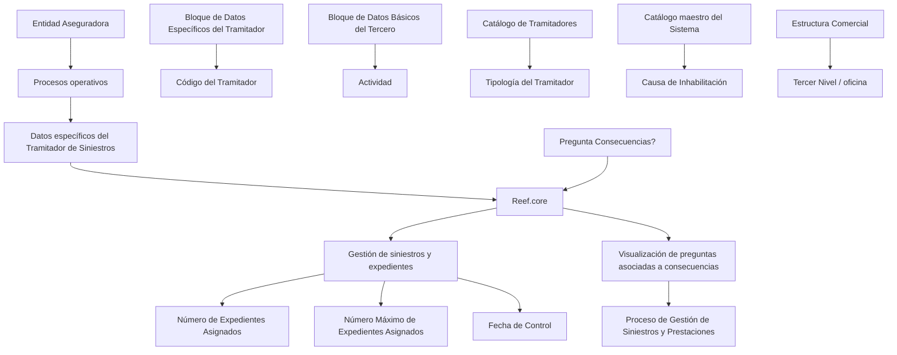

# Gestão de Dados Específicos do Tramitador de Sinistros no Reef.core

## 1. Metadados do Documento
- **Arquivo de Origem:** Não identificado no conteúdo fornecido
- **Tipo de Documento:** Especificação Funcional
- **Domínio / Sistema:** Reef.core — Gestão de Sinistros e Prestações
- **Público-Alvo:** Desenvolvedores, Analistas Funcionais, Operação e Negócio
- **Data/Versão Identificada:** Não identificada

---

## 2. Resumo Executivo & Contexto de Negócio

O documento descreve a criação e a captura de informações específicas do **Tramitador de Siniestros** no sistema **Reef.core**. O objetivo declarado é identificar e detalhar dados operacionais do tramitador para que esses dados sejam utilizados nos processos da entidade seguradora que necessitem dessas informações.

A estrutura funcional apresentada reúne atributos de identificação, classificação organizacional, estado operacional, supervisão, capacidade de gestão de expedientes e permissões de atuação. Alguns atributos são informados diretamente no bloco de dados específicos do tramitador; outros são herdados de blocos relacionados, como o **Bloco de Dados Específicos do Tramitador** e o **Bloco de Dados Básicos do Tercero**.

O documento também estabelece controles relevantes para a operação de sinistros. Um tramitador pode ser inabilitado, situação em que não deve ser empregado, contemplado ou considerado nos processos operacionais da seguradora a partir do momento da inabilitação. A estrutura permite ainda registrar a causa dessa inabilitação por meio de um catálogo mestre do sistema.

No contexto da gestão de expedientes, o documento define campos para acompanhar o número de expedientes pendentes atribuídos ao tramitador, estabelecer um limite máximo de expedientes ativos e pendentes simultâneos e controlar a permissão para modificar a data de controle de sinistros ou expedientes. A utilização da data de controle depende de uma configuração prévia da companhia nos Planos de Tramitación.

Por fim, o campo **Pregunta Consecuencias?** altera a visualização de informações em sinistros atribuídos ao tramitador: quando ativado, o Reef.core exibe perguntas associadas às consequências em vez das descrições dessas consequências. O documento associa esse comportamento à expertise do tramitador e ao apoio à tomada de decisão no Processo de Gestão de Sinistros e Prestações.

---

## 3. Arquitetura, Componentes & Tecnologias Envolvidas

### Componentes e conceitos identificados

| Componente / Conceito | Papel identificado no documento |
| :--- | :--- |
| **Reef.core** | Sistema no qual devem estar configurados os tipos possíveis de Tipología del Tramitador e os estados possíveis de Estado del Tramitador. Também altera seu comportamento conforme o campo Pregunta Consecuencias? |
| **Tramitador de Siniestros** | Entidade operacional responsável pela gestão de sinistros ou expedientes e titular dos dados específicos descritos. |
| **Entidad Aseguradora** | Entidade cujos processos operacionais utilizam as informações do tramitador. |
| **Bloque de Datos Específicos del Tramitador** | Origem herdada do Código del Tramitador. |
| **Bloque de Datos Básicos del Tercero** | Origem herdada do campo Actividad. |
| **Catálogo de Tramitadores** | Fonte da propriedade Tipología del Tramitador. |
| **Catálogo maestro del Sistema** | Fonte das causas de inabilitação. |
| **Estructura Comercial** | Estrutura organizacional que contém o Tercer Nivel, identificado como oficina. |
| **Planes de Tramitación** | Contexto de configuração que pode determinar o uso da Fecha de Control pela companhia. |
| **Proceso de Gestión de Siniestros y Prestaciones** | Processo operacional apoiado pelo campo Pregunta Consecuencias?. |
| **Expedientes de siniestros** | Expedientes atribuídos, encerrados, abertos, reassinalados e contabilizados para o tramitador. |



> **Nota de Análise:** O conteúdo não descreve arquitetura de infraestrutura, APIs, métodos HTTP, contratos JSON, bancos de dados, servidores, URLs, tecnologias de implantação ou integrações externas. O diagrama representa exclusivamente relações funcionais explicitamente indicadas.

---

## 4. Regras de Negócio, Especificações Funcionais & Processos

### 4.1 Objetivo da estrutura de dados

A captura de informações na estrutura de dados específicos do tramitador responde à necessidade de identificar e detalhar informações de âmbito operativo do Tramitador de Siniestros. Essas informações podem ser utilizadas nos processos da entidade seguradora que as demandem.

### 4.2 Ação habilitada

A ação indicada no conteúdo é:

- **CREAR:** criação de informações específicas do tramitador.

### 4.3 Sequência de captura

O documento informa que os atributos devem marcar a sequência de captura dos campos no bloco de informação, seguindo a leitura:

1. Da esquerda para a direita.
2. De cima para baixo.

Quando não houver especificação ou indicação expressa em contrário, os atributos são empregados tanto para:

- Pessoas físicas.
- Pessoas jurídicas.

### 4.4 Regras de origem e herança dos dados

1. **Código del Tramitador**
   - É herdado do **Bloque de Datos Específicos del Tramitador**.
   - Identifica o código do tramitador no sistema.

2. **Actividad**
   - É herdado do **Bloque de Datos Básicos del Tercero**.
   - Identifica o código de atividade do terceiro para os tramitadores.

3. **Tipología del Tramitador**
   - É uma propriedade do **Catálogo de Tramitadores**.
   - A tipologia deve corresponder a um dos possíveis tipos configurados para o Reef.core.

4. **Estado del Tramitador**
   - Registra o estado do tramitador na data de captura das informações.
   - O estado deve corresponder a um dos possíveis estados configurados no Reef.core.

5. **Causa de Inhabilitación**
   - Somente se aplica na hipótese de o tramitador estar inabilitado.
   - Deve conter o código de uma causa de inabilitação definida no catálogo mestre do sistema.

### 4.5 Regras de identificação, estrutura organizacional e supervisão

1. **Código de Usuario del Tramitador**
   - Contém o código de usuário com o qual o tramitador se identificará ao conectar-se ao sistema.

2. **Tercer Nivel**
   - Contém o código do terceiro nível da estrutura comercial.
   - O terceiro nível é identificado no documento como uma oficina.
   - O tramitador é atribuído a esse terceiro nível.

3. **Código del Supervisor**
   - Contém o código do supervisor atribuído ao tramitador.

### 4.6 Regras de inabilitação

1. O campo **Inhabilitación** informa ao sistema que o Tramitador de Siniestros está inabilitado no sistema.
2. A partir do momento da inabilitação, o tramitador não deve:
   - Ser empregado.
   - Ser contemplado.
   - Ser considerado nos processos operacionais da entidade seguradora.
3. Caso o tramitador esteja inabilitado, o campo **Causa de Inhabilitación** deve conter uma causa definida no catálogo mestre do sistema.

### 4.7 Regras de visualização de consequências

1. A ativação do campo **Pregunta Consecuencias?** modifica o comportamento do Reef.core.
2. Para sinistros atribuídos ao tramitador, o Reef.core passa a visualizar:
   - As possíveis perguntas associadas às consequências.
3. Quando o campo está ativado, o sistema deixa de exibir:
   - As descrições das consequências.
4. O documento informa que essa ativação pode atuar como facilitador e guia para a tomada de decisões no Processo de Gestão de Sinistros e Prestações, conforme a expertise do tramitador na gestão dos expedientes.

### 4.8 Regras de capacidade e contagem de expedientes

1. **Número de Expedientes Asignados**
   - Mostra o número de expedientes pendentes atribuídos ao tramitador.
   - O conteúdo do campo é atualizado e modificado sempre que um expediente é:
     - Aberto.
     - Encerrado.
     - Atribuído.
     - Reatribuído.
   - A atualização ocorre de acordo com os critérios de atribuição de sinistros ou expedientes considerados e configurados no sistema para os tramitadores.
   - Na captura inicial do tramitador, esse campo não apresenta nenhuma informação.

2. **Número Máximo de Expedientes Asignados**
   - Identifica o número máximo de expedientes ativos e pendentes que o tramitador pode gerir simultaneamente.

### 4.9 Regra para modificação da data de controle

1. O campo **Modifica Fecha de Control** identifica se o tramitador possui ou não capacidade para modificar a data de controle na gestão de sinistros ou expedientes.
2. Essa capacidade está condicionada a uma configuração de companhia:
   - Deve ter sido indicado, no nível da companhia, que os Planes de Tramitación trabalharão com a Fecha de Control.

> **Nota de Análise:** O documento não especifica valores permitidos, obrigatoriedade, tipos de dados, regras de validação, comportamento de erro ou permissões técnicas para os campos apresentados.

---

## 5. Tabelas de Parâmetros, Ambientes e Estruturas de Dados

| Item / Parâmetro | Descrição / Função | Tipo / Valores / Formato | Ambiente / Observações |
| :--- | :--- | :--- | :--- |
| Acción habilitada | Permite criar informações específicas do tramitador. | `CREAR` | O documento apresenta somente a ação CREAR. |
| Código del Tramitador | Identifica o código do tramitador no sistema. | Código; formato não especificado. | Herdado do Bloque de Datos Específicos del Tramitador. |
| Código de Usuario del Tramitador | Armazena o código de usuário utilizado pelo tramitador para identificar-se ao conectar-se ao sistema. | Código de usuário; formato não especificado. | Campo do bloco de informação. |
| Actividad | Identifica o código de atividade do terceiro para os tramitadores. | Código de atividade; formato não especificado. | Herdado do Bloque de Datos Básicos del Tercero. |
| Tipología del Tramitador | Mostra a tipologia do tramitador. | Um dos possíveis tipos configurados para Reef.core. | Propriedade do Catálogo de Tramitadores. |
| Tercer Nivel | Indica o código do terceiro nível da estrutura comercial ao qual o tramitador está atribuído. | Código; formato não especificado. | O documento identifica o terceiro nível como oficina. |
| Código del Supervisor | Indica o código do supervisor atribuído ao tramitador. | Código; formato não especificado. | Campo do bloco de informação. |
| Estado del Tramitador | Registra o estado do tramitador na data de captura de suas informações. | Um dos possíveis estados configurados no Reef.core. | Campo do bloco de informação. |
| Inhabilitación | Indica ao sistema que o tramitador está inabilitado. | Valor/formato não especificado. | Após a inabilitação, o tramitador não deve ser usado, contemplado ou considerado nos processos operacionais. |
| Causa de Inhabilitación | Registra a causa da inabilitação do tramitador. | Código de causa; formato não especificado. | Aplicável se o tramitador estiver inabilitado; causa definida no catálogo mestre do sistema. |
| Pregunta Consecuencias? | Altera a visualização de consequências nos sinistros atribuídos ao tramitador. | Ativação; valores/formato não especificados. | Exibe perguntas associadas às consequências em vez das descrições das consequências. |
| Número de Expedientes Asignados | Mostra a quantidade de expedientes pendentes atribuídos ao tramitador. | Número; formato não especificado. | Atualizado em abertura, término, atribuição e reatribuição de expedientes. Sem informação na captura inicial. |
| Número Máximo de Expedientes Asignados | Define o máximo de expedientes ativos e pendentes que o tramitador pode gerir simultaneamente. | Número; formato não especificado. | Campo de limite operacional. |
| Modifica Fecha de Control | Identifica se o tramitador pode modificar a data de controle na gestão de sinistros ou expedientes. | Capacidade/indicador; valores não especificados. | Depende de configuração da companhia para uso da Fecha de Control nos Planes de Tramitación. |
| Reef.core | Sistema de referência para tipologias, estados e comportamento de visualização de consequências. | Sistema | Não há versão identificada. |
| Catálogo de Tramitadores | Catálogo que contém a tipologia do tramitador. | Catálogo | Não há estrutura ou valores detalhados. |
| Catálogo maestro del Sistema | Catálogo que contém causas de inabilitação. | Catálogo | Não há estrutura ou valores detalhados. |
| Planes de Tramitación | Planos nos quais pode ser indicado o trabalho com a Fecha de Control. | Configuração de companhia | Não há detalhes de configuração. |

---

## 6. Bateria de Perguntas & Respostas para RAG (FAQ Sintético)

### P1: Qual é o objetivo dos dados específicos do Tramitador de Siniestros no Reef.core?
**R:** O objetivo é identificar e detalhar informações operacionais do Tramitador de Siniestros para que essas informações possam ser utilizadas nos processos da entidade seguradora que as demandem.

### P2: Qual ação está habilitada no documento para a estrutura de dados do tramitador?
**R:** A ação habilitada é `CREAR`, destinada à criação das informações específicas do Tramitador de Siniestros.

### P3: De onde vem o Código del Tramitador?
**R:** O Código del Tramitador é herdado do Bloque de Datos Específicos del Tramitador e identifica o código do tramitador no sistema.

### P4: Qual é a função do Código de Usuario del Tramitador?
**R:** O Código de Usuario del Tramitador contém o código de usuário com o qual o tramitador se identificará ao conectar-se ao sistema.

### P5: Como a Tipología del Tramitador é definida no Reef.core?
**R:** A Tipología del Tramitador é uma propriedade do Catálogo de Tramitadores. A tipologia selecionada deve ser um dos possíveis tipos configurados para o Reef.core.

### P6: O que acontece quando um Tramitador de Siniestros é marcado como inabilitado?
**R:** A inabilitação informa ao sistema que o Tramitador de Siniestros está inabilitado. A partir desse momento, o tramitador não deve ser empregado, contemplado ou considerado nos processos operacionais da entidade seguradora.

### P7: Quando a Causa de Inhabilitación deve ser preenchida?
**R:** A Causa de Inhabilitación deve ser preenchida caso o tramitador esteja inabilitado. O campo deve conter o código de uma causa de inabilitação definida no catálogo mestre do sistema.

### P8: Como o campo Pregunta Consecuencias? altera a visualização dos sinistros?
**R:** Quando o campo Pregunta Consecuencias? é ativado, o Reef.core passa a exibir, nos sinistros atribuídos ao tramitador, as possíveis perguntas associadas às consequências em vez de mostrar as descrições dessas consequências.

### P9: Qual benefício operacional é associado ao campo Pregunta Consecuencias??
**R:** Conforme a expertise do tramitador na gestão de expedientes de sinistros, a ativação do campo pode servir como facilitador e guia para a tomada de decisões no Processo de Gestão de Sinistros e Prestações.

### P10: Como o Número de Expedientes Asignados é atualizado?
**R:** O Número de Expedientes Asignados é atualizado e modificado cada vez que um expediente é aberto, encerrado, atribuído ou reatribuído. Essa atualização segue os critérios de atribuição de sinistros ou expedientes configurados no sistema para os tramitadores.

### P11: O que é exibido no Número de Expedientes Asignados durante a captura inicial do tramitador?
**R:** Na captura inicial do tramitador, o campo Número de Expedientes Asignados não mostra nenhuma informação.

### P12: O que limita o campo Número Máximo de Expedientes Asignados?
**R:** O campo identifica o número máximo de expedientes ativos e pendentes que o tramitador poderá gerir simultaneamente.

### P13: Em que condição o tramitador pode modificar a Fecha de Control?
**R:** O campo Modifica Fecha de Control indica se o tramitador está capacitado para modificar a data de controle na gestão de sinistros ou expedientes. Essa possibilidade aplica-se sempre que tenha sido indicado, no nível da companhia, que os Planes de Tramitación trabalharão com a Fecha de Control.

---

## 7. Glossário de Termos, Siglas & Conceitos-Chave

- **Reef.core:** Sistema citado como referência para configuração de tipos de tramitador, estados de tramitador e comportamento de visualização de consequências.
- **Tramitador de Siniestros:** Profissional ou entidade associada à gestão de sinistros e expedientes de sinistros.
- **Entidad Aseguradora:** Entidade seguradora cujos processos operacionais utilizam as informações do tramitador.
- **Siniestro:** Sinistro; contexto de gestão tratado pelo tramitador.
- **Expediente:** Expediente associado à gestão de sinistros, que pode ser aberto, encerrado, atribuído ou reatribuído.
- **Bloque de Datos Específicos del Tramitador:** Bloco de dados do qual o Código del Tramitador é herdado.
- **Bloque de Datos Básicos del Tercero:** Bloco de dados do qual o campo Actividad é herdado.
- **Tercero:** Terceiro, entidade ou cadastro ao qual está associada uma atividade no contexto dos tramitadores.
- **Catálogo de Tramitadores:** Catálogo que apresenta a tipologia do tramitador.
- **Catálogo maestro del Sistema:** Catálogo mestre que contém causas de inabilitação.
- **Tipología del Tramitador:** Classificação do tramitador, devendo pertencer aos tipos configurados para Reef.core.
- **Tercer Nivel:** Terceiro nível da estrutura comercial, identificado no documento como uma oficina.
- **Inhabilitación:** Situação em que o tramitador fica inabilitado para utilização, consideração ou participação nos processos operacionais.
- **Causa de Inhabilitación:** Código de causa da inabilitação definido no catálogo mestre do sistema.
- **Pregunta Consecuencias?:** Campo cuja ativação faz o Reef.core exibir perguntas associadas às consequências, em vez das descrições das consequências.
- **Fecha de Control:** Data de controle na gestão de sinistros ou expedientes.
- **Planes de Tramitación:** Planos de tramitação nos quais a companhia pode definir o uso da Fecha de Control.
- **Proceso de Gestión de Siniestros y Prestaciones:** Processo de gestão de sinistros e prestações apoiado pelas perguntas associadas a consequências.

---

## 8. Notas Críticas, Riscos & Limitações

- O documento não identifica o nome do arquivo de origem, data, versão, autor, área responsável ou histórico de revisões.
- Não são especificados tipos técnicos de campos, formatos de códigos, tamanhos, valores permitidos, obrigatoriedade, valores padrão ou mensagens de validação.
- O documento informa que alguns valores devem estar configurados no Reef.core, mas não apresenta os tipos de tramitador nem os estados disponíveis.
- O documento cita o Catálogo de Tramitadores e o catálogo mestre do sistema, mas não detalha suas estruturas, métodos de manutenção ou códigos válidos.
- Não há detalhamento sobre como ocorre tecnicamente a herança de dados do Bloque de Datos Específicos del Tramitador ou do Bloque de Datos Básicos del Tercero.
- A regra de atualização do Número de Expedientes Asignados depende de critérios de atribuição configurados no sistema; esses critérios não são descritos.
- A permissão para modificar a Fecha de Control depende de uma configuração no nível da companhia e nos Planes de Tramitación, mas o mecanismo de configuração não é apresentado.
- Não há informação sobre permissões de acesso, perfis de usuários, auditoria, rastreabilidade, integrações, APIs, persistência de dados ou tratamento de falhas.
- **Nota de Análise:** O conteúdo apresenta campos identificados por parênteses, como `( )`, porém não explica seu significado funcional ou técnico. Não é possível inferir, com segurança, se representam obrigatoriedade, edição, seleção ou outro comportamento de interface.

---

## 9. Conteúdo Bruto Estruturado (Referência Fiel)

```text
--- [PÁGINA 1 DE 3] ---

CREAR Información específica del Tramitador
Objetivo
La captura de la información en esta Estructura obedece a la necesidad de identificar y detallar la
información de ámbito operativo del Tramitador de Siniestros para poder utilizarla en los procesos de
la entidad Aseguradora que así lo demanden.
Acciones habilitadas
 CREAR ( )
Datos Tramitador
De Izquierda a Derecha y de Arriba hacia Abajo, los siguientes atributos marcan la secuencia de
captura de los Campos en este Bloque de Información.
Si no se especifica o indica expresamente, los Atributos se emplearán tanto en Personas Físicas
como en Personas Jurídicas.
 /
 RS
Inicio Soluciones APIs Documentación Zeus
ES


--- [PÁGINA 2 DE 3] ---

Código del Tramitador
Este dato procede y se hereda del 'Bloque de Datos Específicos del Tramitador' e identifica su código
en el Sistema.
Código de Usuario del Tramitador (  )
Este campo del bloque de información contiene el código del usuario con el que el Tramitador se va a
identificar al conectarse al sistema.
Actividad
El valor de este dato se hereda del Bloque de Datos Básicos del Tercero e identifica el código de
Actividad del Tercero para los Tramitadores.
Tipología del Tramitador (  )
Esta propiedad del Catálogo de Tramitadores muestra la Tipología del mismo, tipología que tiene que
tener uno de los posibles tipos configurados para Reef.core.
Tercer Nivel (  )
Este dato es el código del Tercer Nivel de la Estructura Comercial (oficina) al que está asignado el
Tramitador.
Código del Supervisor (  )
Este dato contiene el código del Supervisor que tendrá asignado el Tramitador.
Estado del Tramitador (  )
Este campo registra el estado en el que se encuentra el Tramitador a la fecha de captura de su
información, estado que tiene que tener uno de los posibles estados configurados en Reef.core.
Inhabilitación ( )
Este Campo le indica al Sistema que el Tramitador de Siniestros está inhabilitado en el Sistema por
lo que a partir del momento de su inhabilitación no debería ser empleado, contemplado o
considerado en los procesos operativos de la entidad.
Causa de Inhabilitación (  )
En el supuesto que el Tramitador estuviera Inhabilitado, este campo va a contener el código de una
causa de Inhabilitación definida en el catálogo maestro del Sistema.
Pregunta Consecuencias? ( )


--- [PÁGINA 3 DE 3] ---

La activación de este campo hace que el comportamiento de Reef.core varíe para que en los
siniestros que tenga asignados el Tramitador se visualicen las posibles preguntas asociadas a las
consecuencias en vez de mostrar las descripciones de las mismas.
De acuerdo con la expertise del Tramitador en la gestión de los expedientes de siniestros, la
activación de este campo le puede servir de facilitador y guía en la toma de decisiones del
Proceso de Gestión de Siniestros y Prestaciones.
Número de Expedientes Asignados
Este dato muestra el número de expedientes pendientes que tiene asignado un Tramitador,
sabiendo que cada vez que se abre, se termina, se asigna o se reasigna un expediente, se actualiza
y modifica su contenido (Todo ello de acuerdo con los criterios de asignación de
siniestros/expedientes que se hayan considerado y configurado en el sistema para los tramitadores).
En la captura inicial del tramitador este dato no mostrará información alguna.
Número Máximo de Expedientes Asignados ( )
Este campo identifica el número máximo de expedientes activos y pendientes que podrá tener
gestionando el tramitador al mismo tiempo.
Modifica Fecha de Control ( )
Este campo identifica si el Tramitador está o no capacitado para modificar la fecha de control en la
gestión de los siniestros/expedientes (siempre y cuando se haya indicado a nivel de compañía que
en los Planes de Tramitación se vaya a trabajar con la Fecha de Control).
Consejo:
Consejo:
```
