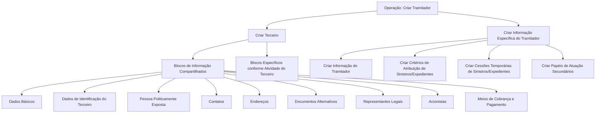

# Operação Criar Tramitador — Processo e Estruturas de Informação

## 1. Metadados do Documento
- **Arquivo de Origem:** Não identificado
- **Tipo de Documento:** Manual Operacional
- **Domínio / Sistema:** Operação de criação de Tramitador de Sinistros
- **Público-Alvo:** Operação, Negócio e Desenvolvedores
- **Data/Versão Identificada:** Não identificada

---

## 2. Resumo Executivo & Contexto de Negócio

O documento descreve a operação **CREAR Tramitador**, destinada a capturar informações de **Tramitadores de Siniestros**. O processo combina blocos de informação compartilhados, associados à criação de um terceiro, e blocos específicos associados à atividade de tramitador.

A obrigatoriedade e a habilitação dos campos variam conforme o código de atividade do terceiro. O documento também estabelece que o comportamento dos campos pode depender de o terceiro ser uma pessoa física ou uma pessoa jurídica.

Personalizações implementadas podem afetar a obrigatoriedade do registro dos dados do terceiro. Além disso, o usuário pode definir critérios de ordenação para capturar os dados nos diferentes blocos de informação.

O fluxo operacional prevê inicialmente a criação do terceiro e, posteriormente, a criação da informação específica do tramitador, incluindo critérios de atribuição, cessões temporárias de sinistros ou expedientes e papéis secundários de atuação.

---

## 3. Arquitetura, Componentes & Tecnologias Envolvidas

O documento não identifica tecnologias, APIs, métodos HTTP, contratos JSON, bancos de dados, ambientes ou componentes de infraestrutura. O conteúdo apresenta uma estrutura funcional composta por blocos de informação e operações de cadastro.



> **Nota de Análise:** O documento não detalha a sequência obrigatória entre os blocos, métodos de persistência, validações por campo ou contratos de integração.

---

## 4. Regras de Negócio, Especificações Funcionais & Processos

### Objetivo da operação
A operação **CREAR Tramitador** permite capturar as informações dos tramitadores de sinistros.

### Premissas de preenchimento

1. A obrigatoriedade e/ou habilitação dos campos nos blocos ou estruturas de informação compartilhadas pode variar conforme o **código de atividade do terceiro**.
2. A obrigatoriedade e/ou habilitação dos campos pode variar conforme o tipo de terceiro:
   - Pessoa física.
   - Pessoa jurídica.
3. Personalizações implementadas podem alterar o comportamento da aplicação quanto à obrigatoriedade do registro dos dados do terceiro.
4. A ordem de captura dos dados nos blocos de informação pode variar conforme o critério definido pelo usuário no sistema.

### Processo funcional

1. Criar o terceiro.
2. Registrar os blocos de informação compartilhados do terceiro.
3. Registrar blocos de informação específicos conforme a atividade do terceiro.
4. Criar a informação específica do tramitador.
5. Criar critérios de atribuição de sinistros ou expedientes.
6. Criar cessões temporárias de sinistros ou expedientes.
7. Criar papéis de atuação secundários.

---

## 5. Tabelas de Parâmetros, Ambientes e Estruturas de Dados

| Item / Parâmetro | Descrição / Função | Tipo / Valores / Formato | Ambiente / Observações |
| :--- | :--- | :--- | :--- |
| Operação Criar Tramitador | Permite capturar informações de tramitadores de sinistros. | Operação funcional | Não informado |
| Código de atividade do terceiro | Pode determinar obrigatoriedade e habilitação de campos. | Código de atividade | Valores não informados |
| Tipo de terceiro | Pode alterar obrigatoriedade e habilitação de campos. | Pessoa física ou pessoa jurídica | Regras específicas não detalhadas |
| Personalizações | Podem afetar a obrigatoriedade de registro dos dados do terceiro. | Personalizações implementadas | Não detalhadas |
| Ordem de captura | Pode variar de acordo com o critério do usuário no sistema. | Ordem definida pelo usuário | Não detalhada |
| Dados Básicos | Bloco de informação compartilhada na criação do terceiro. | Bloco de informação | Campos não informados |
| Dados de Identificação do Terceiro | Bloco compartilhado para identificação do terceiro. | Bloco de informação | Campos não informados |
| Pessoa Politicamente Exposta | Bloco de informação compartilhada. | Bloco de informação | Critérios não informados |
| Contatos | Bloco de informação compartilhada. | Bloco de informação | Campos não informados |
| Endereços | Bloco de informação compartilhada. | Bloco de informação | Campos não informados |
| Documentos Alternativos | Bloco de informação compartilhada. | Bloco de informação | Campos não informados |
| Representantes Legais | Bloco de informação compartilhada. | Bloco de informação | Campos não informados |
| Acionistas | Bloco de informação compartilhada. | Bloco de informação | Campos não informados |
| Meios de Cobrança e Pagamento | Bloco de informação compartilhada. | Bloco de informação | Campos não informados |
| Informação do Tramitador | Informação específica associada ao tramitador. | Bloco específico | Campos não informados |
| Critérios de Atribuição | Configuração de atribuição de sinistros ou expedientes. | Bloco específico | Regras não informadas |
| Cessões Temporárias | Registro de cessões temporárias de sinistros ou expedientes. | Bloco específico | Regras não informadas |
| Papéis de Atuação Secundários | Registro de papéis secundários do tramitador. | Bloco específico | Papéis não informados |

---

## 6. Bateria de Perguntas & Respostas para RAG (FAQ Sintético)

### P1: Qual é o objetivo da operação Criar Tramitador?
**R:** A operação Criar Tramitador permite capturar as informações dos tramitadores de sinistros.

### P2: Quais fatores podem alterar a obrigatoriedade dos campos do terceiro?
**R:** A obrigatoriedade e a habilitação dos campos podem variar conforme o código de atividade do terceiro, o tipo de terceiro — pessoa física ou pessoa jurídica — e personalizações implementadas na aplicação.

### P3: A ordem de preenchimento dos blocos de informação é fixa?
**R:** Não. O documento informa que a ordem de captura dos dados nos diferentes blocos de informação pode variar conforme o critério seguido pelo usuário no sistema.

### P4: Quais são os blocos de informação compartilhados na criação de um terceiro?
**R:** Os blocos compartilhados listados são Dados Básicos, Dados de Identificação do Terceiro, Pessoa Politicamente Exposta, Contatos, Endereços, Documentos Alternativos, Representantes Legais, Acionistas e Meios de Cobrança e Pagamento.

### P5: Quais informações específicas podem ser criadas para um tramitador?
**R:** O processo prevê criar a Informação do Tramitador, Critérios de Atribuição de Sinistros ou Expedientes, Cessões Temporárias de Sinistros ou Expedientes e Papéis de Atuação Secundários.

### P6: O que são os critérios de atribuição no processo de criação do tramitador?
**R:** O documento identifica os Critérios de Atribuição como uma informação específica a ser criada para atribuição de sinistros ou expedientes, mas não detalha critérios, regras de priorização ou campos envolvidos.

### P7: O documento define como registrar cessões temporárias?
**R:** Não. O documento informa que podem ser criadas Cessões Temporárias de Sinistros ou Expedientes, mas não especifica o fluxo, as condições, os campos ou os controles aplicáveis.

### P8: Existem detalhes sobre APIs ou integrações técnicas da operação?
**R:** Não. O documento não apresenta métodos HTTP, URLs, contratos JSON, tecnologias, ambientes ou mecanismos de integração relacionados à operação Criar Tramitador.

### P9: Como o tipo de terceiro influencia o cadastro?
**R:** O tipo de terceiro, definido como pessoa física ou pessoa jurídica, pode alterar a obrigatoriedade e/ou a habilitação dos campos nos blocos ou estruturas de informação.

### P10: As personalizações podem modificar o comportamento padrão da aplicação?
**R:** Sim. O documento estabelece que personalizações implementadas podem afetar o comportamento da aplicação em relação à obrigatoriedade no registro dos dados do terceiro.

---

## 7. Glossário de Termos, Siglas & Conceitos-Chave

- **Tramitador de Sinistros:** Entidade cujas informações são capturadas pela operação Criar Tramitador.
- **Terceiro:** Entidade criada antes ou no contexto da criação da informação específica do tramitador.
- **Sinistro:** Termo utilizado no documento no contexto de atribuição e cessão de sinistros ou expedientes.
- **Expediente:** Item associado aos processos de atribuição e cessão temporária.
- **Pessoa Politicamente Exposta:** Bloco de informação compartilhada listado durante a criação do terceiro.
- **Cessões Temporárias:** Informação específica associada a sinistros ou expedientes.
- **Papéis de Atuação Secundários:** Papéis adicionais que podem ser registrados para o tramitador.

---

## 8. Notas Críticas, Riscos & Limitações

- O documento não especifica campos, formatos, tipos de dados ou validações individuais para os blocos de informação.
- O documento não define quais códigos de atividade exigem ou habilitam campos específicos.
- O documento não detalha as diferenças de regras entre pessoa física e pessoa jurídica.
- As personalizações podem alterar o comportamento de obrigatoriedade, mas não são identificadas ou catalogadas.
- Não há detalhamento técnico sobre APIs, integrações, persistência, segurança, ambientes ou rastreabilidade operacional.
- A página final não contém conteúdo textual funcional, sendo descrita como página em branco ou composta apenas por elementos visuais/imagem.

---

## 9. Conteúdo Bruto Estruturado (Referência Fiel)

```text
--- [PÁGINA 1 DE 3] ---

OPERACIÓN CREAR Tramitador
¿En que consiste?
Esta operación permite capturar la Información de los Tramitadores de Siniestros.
Premisas
La obligatoriedad y/o la habilitación de los campos en el registro de los datos de cada uno de
los bloques o estructuras de información compartidas puede variar de acuerdo con el código de
actividad del Tercero:
La obligatoriedad y/o la habilitación de los campos en el registro de los datos de cada uno de
los bloques o estructuras de información pueden variar si el tipo de Tercero es una Persona
Física o una Persona Jurídica:
Las personalizaciones que se hubieran podido implementar a su vez pueden afectar el
comportamiento de la aplicación en relación con la obligatoriedad en el registro de los Datos del
Tercero.
Por último, el orden de captura de los datos en los distintos bloques de Información puede
variar de acuerdo con el criterio seguido por el Usuario en el Sistema.
Ejemplo:
Ejemplo:
 /
RS
Inicio Soluciones APIs Documentación Zeus
ES

--- [PÁGINA 2 DE 3] ---

Proceso
CREAR
TERCERO
CREAR Información
Específica del Tramitador
Bloques de Información Compartidos (CREAR TERCERO)
 Datos Básicos ( )
 Datos Identificación del Tercero ( )
 Persona Políticamente Expuesta ( )
 Contactos ( )
 Direcciones ( )
 Documentos Alternativos ( )
 Representantes Legales ( )
 Accionistas ( )
 Medios de Cobro y Pago ( )
Bloques de Información Específicos de acuerdo con la
Actividad del Tercero.
CREAR INFORMACIÓN
ESPECÍFICA DEL TRAMITADOR
Crear Información
del Tramitador
Crear Criterios de Asignación
de Siniestros/Expedientes
Crear Cesiones Temporales de
Siniestros/Expedientes
Crear Roles de
Actuación Secundarios
 Crear Información del Tramitador ( )
 Crear Criterios de Asignación ( )
 Crear Cesiones Temporales de Siniestros/Expedientes ( )
 Crear roles de Actuación Secundarios ( )

--- [PÁGINA 3 DE 3] ---

[Página em branco ou apenas elementos visuais/imagem]
```
