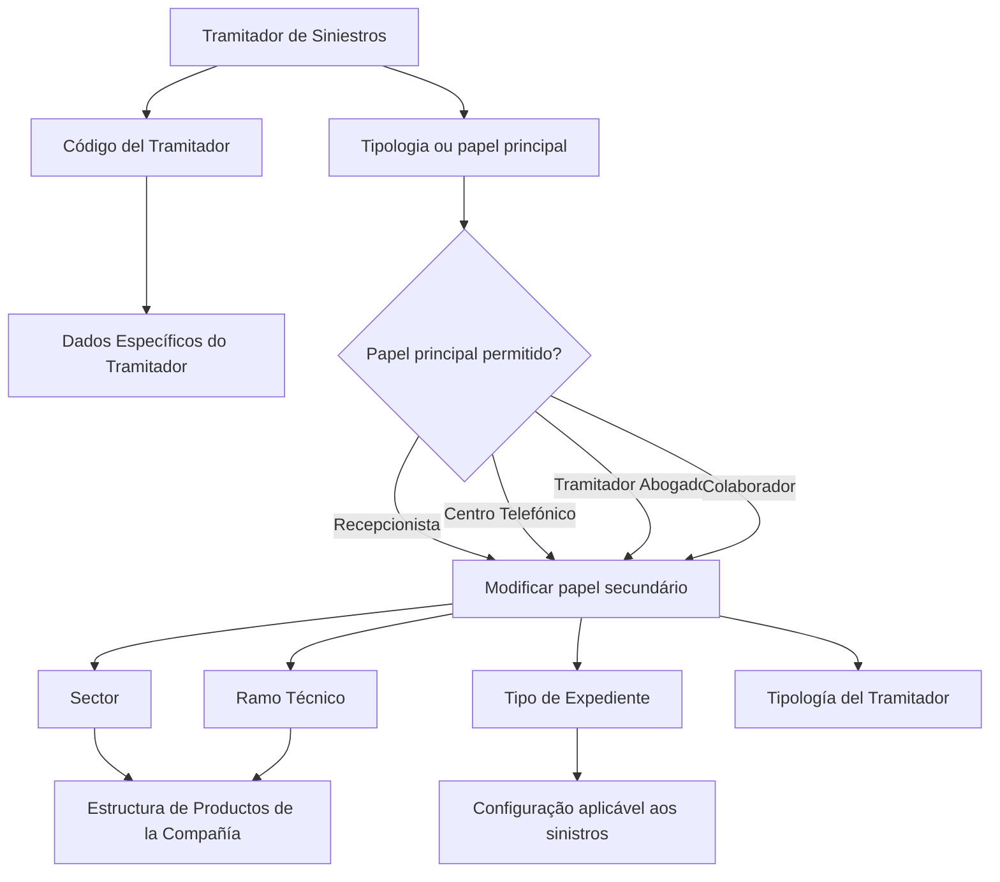

# Modificação de Atuações Secundárias do Tramitador de Sinistros

## 1. Metadados do Documento
- **Arquivo de Origem:** Não identificado no conteúdo fornecido
- **Tipo de Documento:** Procedimento / Especificação Funcional
- **Domínio / Sistema:** Gestão de sinistros e atuações de tramitadores
- **Público-Alvo:** Operação, analistas funcionais e desenvolvedores
- **Data/Versão Identificada:** Não identificada

---

## 2. Resumo Executivo & Contexto de Negócio

O documento descreve a operação **“Modificar Actuaciones del Tramitador”**, destinada a alterar os papéis secundários de atuação atribuídos previamente a um tramitador de sinistros. A alteração é condicionada à tipologia ou ao papel principal de atuação do tramitador.

A operação é permitida somente quando o papel principal do tramitador for **Recepcionista**, **Centro Telefônico**, **Tramitador Abogado** ou **Colaborador**. O conteúdo não descreve comportamentos para outras tipologias de tramitador.

A configuração da atuação pode ser segmentada por **Sector**, **Ramo Técnico** e **Tipo de Expediente**, permitindo aplicar a alteração a todos os valores configurados por meio de códigos genéricos ou restringi-la a um valor específico. Os códigos genéricos identificados são `9999` para setor, `999` para ramo técnico e `ZZZ` para tipo de expediente.

O documento também indica que o código do tramitador é herdado do bloco de dados específicos do tramitador. Não há detalhamento adicional sobre interface, persistência, validações técnicas, métodos HTTP, contratos de integração ou tratamento de erros.

---

## 3. Arquitetura, Componentes & Tecnologias Envolvidas

Os elementos funcionais identificados no conteúdo são:

- Operação **Modificar Actuaciones del Tramitador**.
- **Tramitador de Siniestros**.
- Papel de atuação principal do tramitador.
- Papel de atuação secundário do tramitador.
- Bloco de **Datos Específicos del tramitador**.
- **Estructura de Productos de la Compañía**.
- Campos de segmentação: **Sector**, **Ramo Técnico** e **Tipo de Expediente**.
- Ações listadas: **CREAR** e **MODIFICAR**.
- Referências de navegação ou interface: **Inicio**, **Soluciones**, **APIs**, **Documentación**, **Zeus**, **ES**.



> **Nota de Análise:** O conteúdo descreve relações funcionais entre campos e papéis, mas não detalha sistemas de integração, bancos de dados, APIs, tecnologias, URLs, autenticação ou componentes de infraestrutura.

---

## 4. Regras de Negócio, Especificações Funcionais & Processos

### Operação funcional

A operação **Modificar Actuaciones del Tramitador** permite modificar os papéis secundários de atuação previamente atribuídos a um tramitador de sinistros.

### Elegibilidade do tramitador

A modificação é permitida desde que a tipologia ou o papel principal de atuação do tramitador seja um dos seguintes:

1. **Recepcionista**.
2. **Centro Telefónico**.
3. **Tramitador Abogado**.
4. **Colaborador**.

> **Nota de Análise:** O documento não especifica a ação esperada quando o papel principal do tramitador não pertence à lista permitida.

### Sequência de visualização ou registro dos campos

O documento estabelece que, da esquerda para a direita e de cima para baixo, os campos representam a sequência de visualização ou registro no bloco de informação.

### Código del Tramitador

O campo **Código del Tramitador** é proveniente do bloco de dados específicos do tramitador e identifica o código do tramitador no sistema.

### Sector

O campo **Sector** visualiza ou identifica a chave do setor da estrutura de produtos da companhia à qual é atribuído o papel principal de atuação do tramitador.

- O código genérico `9999` altera o papel de atuação do tramitador para sinistros de todos os setores configurados no sistema.
- Um código de setor específico altera o papel de atuação exclusivamente para sinistros daquele setor.

### Ramo Técnico

O campo **Ramo Técnico** mostra ou identifica a chave do ramo técnico da estrutura de produtos da companhia associado ao papel secundário de atuação do tramitador.

- O código genérico `999` altera o papel de atuação do tramitador para sinistros de todos os ramos técnicos configurados no sistema.
- Um código de ramo técnico específico altera o papel de atuação exclusivamente para sinistros daquele ramo técnico.

### Tipo de Expediente

O campo **Tipo de Expediente** identifica a chave do tipo de expediente sobre o qual é criado o papel de atuação do tramitador.

Exemplos fornecidos pelo documento:

- `DPM` — Daños Materiales Propios.
- `RC` — Responsabilidad Civil.
- `DAP` — Lesionados.

Regras de abrangência:

- O código genérico `ZZZ` altera o papel de atuação do tramitador para sinistros de todos os tipos de expediente definidos no sistema.
- Um código de tipo de expediente específico altera o papel de atuação exclusivamente para sinistros daquela tipologia.

### Tipología del Tramitador

O campo **Tipología del Tramitador** determina o novo papel de atuação, ou papel de atuação secundário, atribuído ao tramitador.

> **Nota de Análise:** O documento lista o campo **Tipología del Tramitador**, mas não apresenta valores possíveis, domínio de dados, obrigatoriedade ou regras de validação para o novo papel secundário.

---

## 5. Tabelas de Parâmetros, Ambientes e Estruturas de Dados

| Item / Parâmetro | Descrição / Função | Tipo / Valores / Formato | Ambiente / Observações |
| :--- | :--- | :--- | :--- |
| Operação | Permite modificar papéis secundários de atuação previamente atribuídos a um tramitador de sinistros. | Modificar Actuaciones del Tramitador | Não há ambiente identificado. |
| Ação listada | Ação apresentada no documento. | `CREAR` | O conteúdo não detalha o comportamento da ação. |
| Ação listada | Ação apresentada no documento. | `MODIFICAR` | O conteúdo não detalha o comportamento da ação. |
| Código del Tramitador | Identifica o código do tramitador no sistema. | Código do tramitador | Procede e é herdado do bloco de dados específicos do tramitador. |
| Sector | Identifica a chave do setor da estrutura de produtos da companhia. | Código de setor; genérico `9999` | `9999` aplica a alteração a todos os setores configurados. Um setor específico limita a alteração àquele setor. |
| Ramo Técnico | Identifica a chave do ramo técnico associada ao papel secundário de atuação. | Código de ramo técnico; genérico `999` | `999` aplica a alteração a todos os ramos técnicos configurados. Um ramo específico limita a alteração àquele ramo. |
| Tipo de Expediente | Identifica a chave da tipologia de expediente para a criação do papel de atuação. | `DPM`, `RC`, `DAP`, outros valores do sistema, genérico `ZZZ` | `ZZZ` aplica a alteração a todos os tipos de expediente definidos no sistema. |
| Tipología del Tramitador | Determina o novo papel de atuação ou papel secundário atribuído ao tramitador. | Não detalhado | Não há lista de valores nem regra de validação apresentada. |
| Papel principal permitido | Define a elegibilidade para modificar atuações secundárias. | Recepcionista; Centro Telefónico; Tramitador Abogado; Colaborador | A operação é permitida somente para esses papéis principais. |
| DPM | Tipo de expediente. | Daños Materiales Propios | Exemplo fornecido pelo documento. |
| RC | Tipo de expediente. | Responsabilidad Civil | Exemplo fornecido pelo documento. |
| DAP | Tipo de expediente. | Lesionados | Exemplo fornecido pelo documento. |

---

## 6. Bateria de Perguntas & Respostas para RAG (FAQ Sintético)

### P1: Qual é o objetivo da operação “Modificar Actuaciones del Tramitador”?
**R:** A operação permite modificar os papéis secundários de atuação que foram previamente atribuídos a um tramitador de sinistros.

### P2: Quais papéis principais permitem a modificação das atuações secundárias do tramitador?
**R:** A modificação é permitida quando a tipologia ou o papel principal de atuação do tramitador é Recepcionista, Centro Telefónico, Tramitador Abogado ou Colaborador.

### P3: O que acontece se o tramitador possuir um papel principal diferente de Recepcionista, Centro Telefónico, Tramitador Abogado ou Colaborador?
**R:** O documento informa que a operação é permitida somente para os quatro papéis listados. O conteúdo não detalha a mensagem, bloqueio ou comportamento aplicável aos demais papéis principais.

### P4: De onde é obtido o Código del Tramitador?
**R:** O Código del Tramitador procede e é herdado do bloco de dados específicos do tramitador, identificando o código do tramitador no sistema.

### P5: Qual é a função do código genérico 9999 no campo Sector?
**R:** O código `9999` é o valor genérico do campo Sector. Seu uso altera o papel de atuação do tramitador para sinistros de todos os setores configurados no sistema.

### P6: Como limitar a alteração de atuação a um único setor?
**R:** Deve-se utilizar o código de um setor específico existente. Dessa forma, a alteração do papel de atuação será aplicada exclusivamente aos sinistros daquele setor.

### P7: Qual é a função do código genérico 999 no campo Ramo Técnico?
**R:** O código `999` é o valor genérico do campo Ramo Técnico. Seu uso altera o papel de atuação do tramitador para sinistros de todos os ramos técnicos configurados no sistema.

### P8: O que identifica o campo Tipo de Expediente?
**R:** O campo Tipo de Expediente identifica a chave do tipo de expediente sobre o qual é criado o papel de atuação do tramitador. O documento apresenta como exemplos DPM para Daños Materiales Propios, RC para Responsabilidad Civil e DAP para Lesionados.

### P9: Como aplicar uma alteração a todos os tipos de expediente definidos no sistema?
**R:** Deve-se utilizar o código genérico `ZZZ` no campo Tipo de Expediente. Esse valor altera o papel de atuação para sinistros de todos os tipos de expediente definidos no sistema.

### P10: Qual é a finalidade do campo Tipología del Tramitador?
**R:** O campo Tipología del Tramitador determina o novo papel de atuação, também denominado papel de atuação secundário, que será atribuído ao tramitador.

### P11: O documento especifica os valores aceitos pelo campo Tipología del Tramitador?
**R:** Não. O documento informa apenas que o campo determina o novo papel secundário de atuação, sem listar valores aceitos, códigos, domínio de dados ou validações.

### P12: O documento detalha APIs, métodos HTTP ou contratos JSON para a modificação de atuações?
**R:** Não. O conteúdo fornecido descreve regras funcionais e campos de configuração, mas não detalha métodos HTTP, endpoints, contratos JSON, persistência, integrações ou tratamento de erros.

---

## 7. Glossário de Termos, Siglas & Conceitos-Chave

- **Actuaciones del Tramitador:** Atuações ou papéis de atuação atribuídos ao tramitador de sinistros.
- **Tramitador de Siniestros:** Tramitador responsável pelo tratamento de sinistros.
- **Papel de atuação principal:** Papel principal atribuído ao tramitador; determina a elegibilidade para modificar atuações secundárias.
- **Papel de atuação secundário:** Novo papel determinado pelo campo Tipología del Tramitador.
- **Recepcionista:** Papel principal elegível para a operação de modificação.
- **Centro Telefónico:** Papel principal elegível para a operação de modificação.
- **Tramitador Abogado:** Papel principal elegível para a operação de modificação.
- **Colaborador:** Papel principal elegível para a operação de modificação.
- **Sector:** Chave de setor da estrutura de produtos da companhia.
- **Ramo Técnico:** Chave de ramo técnico da estrutura de produtos da companhia.
- **Tipo de Expediente:** Chave da tipologia de expediente sobre a qual é criado o papel de atuação.
- **DPM:** Daños Materiales Propios.
- **RC:** Responsabilidad Civil.
- **DAP:** Lesionados.
- **9999:** Código genérico para todos os setores configurados no sistema.
- **999:** Código genérico para todos os ramos técnicos configurados no sistema.
- **ZZZ:** Código genérico para todos os tipos de expediente definidos no sistema.

---

## 8. Notas Críticas, Riscos & Limitações

- O documento não identifica arquivo de origem, autor, data, versão ou ambiente.
- O conteúdo não detalha as ações **CREAR** e **MODIFICAR**, embora ambas sejam listadas.
- Não há especificação de telas, permissões, autenticação, trilha de auditoria, persistência ou mensagens de erro.
- Não são descritos métodos HTTP, APIs, URLs, contratos JSON, integração entre sistemas ou tecnologias utilizadas.
- Não há lista de valores permitidos para o campo **Tipología del Tramitador**.
- O comportamento para papéis principais não elegíveis não é informado.
- Os trechos “Consejo:” aparecem no conteúdo, mas não possuem recomendação associada no material fornecido.
- O documento descreve a aplicação dos códigos genéricos `9999`, `999` e `ZZZ`, mas não define regras de precedência quando mais de um critério possui valor genérico.

---

## 9. Conteúdo Bruto Estruturado (Referência Fiel)

```text
--- [PÁGINA 1 DE 3] ---

MODIFICAR Actuaciones del Tramitador
Objetivo
Esta Operación permite Modificar los roles de actuación secundarios asignados al Tramitador de
Siniestros previamente.
Esto está permitido siempre y cuando la tipología o rol de actuación principal del Tramitador sea
uno de los siguientes:
Recepcionista.
Centro Telefónico.
Tramitador Abogado, ó
Colaborador.
Acciones habilitadas
 CREAR ( )
 MODIFICAR ( )
Actuaciones
 / 
 RS
Inicio Soluciones APIs Documentación Zeus
ES


--- [PÁGINA 2 DE 3] ---

De Izquierda a Derecha y de Arriba hacia Abajo, los siguientes campos marcan la secuencia de
visualización o registro de los Campos en este Bloque de Información.
Código del Tramitador
Este dato procede y se hereda del Bloque de Datos Específicos del tramitador e identifica el código
del tramitador en el Sistema.
Sector (  )
Este campo visualiza o identifica la clave del Sector de la Estructura de Productos de la Compañía a
la que se asigna el rol de actuación principal del tramitador.
Utilizando el valor genérico en este campo (código 9999) se cambiará el rol de actuación del
tramitador para los siniestros de todos los sectores configurados en el sistema o bien, al utilizar el
código de un sector en concreto de los existentes, cambiar el rol de actuación exclusivamente
para los siniestros de este.
Ramo Técnico (  )
Este campo muestra o identificará la clave del ramo técnico de la Estructura de Productos de la
Compañía asociado al rol de actuación secundario del tramitador.
Utilizando el valor genérico en este campo (código 999) se cambiará el rol de actuación del
tramitador para los siniestros de todos los ramos técnicos configurados en el sistema o bien, al
utilizar el código de un ramo en particular de los existentes, cambiar el rol de actuación
exclusivamente para los siniestros de este.
Tipo de Expediente (  )
Esta campo identifica la clave del tipo de expediente' (DPM - Daños Materiales Propios,RC -
Responsabilidad Civil, DAP - Lesionados,...) sobre el que se crea el rol de actuación del tramitador.
Consejo:
Consejo:


--- [PÁGINA 3 DE 3] ---

Utilizando el valor genérico en este campo (código ZZZ) se cambiará el rol de actuación del
tramitador para los siniestros de todos los tipos de expedientes definidos en el sistema o bien, al
utilizar el código de un tipo de expediente en particular, cambiar el rol de actuación
exclusivamente para los siniestros de esta tipología.
Tipología del Tramitador (   )
Este campo del determinará el nuevo rol de actuación (o rol de actuación secundario) que se asigna
al tramitador.
Consejo:
```
