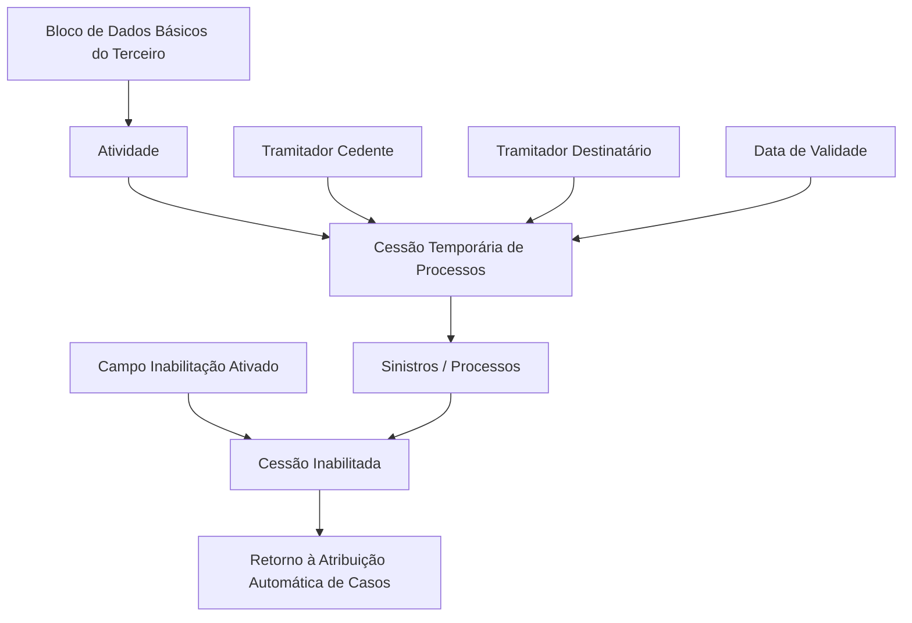

# Procedimento para Inabilitar Cessões Temporárias de Processos do Tramitador

## 1. Metadados do Documento
- **Arquivo de Origem:** Não identificado
- **Tipo de Documento:** Procedimento
- **Domínio / Sistema:** Gestão de sinistros/processos e cessões temporárias de tramitadores
- **Público-Alvo:** Operação de tramitadores
- **Data/Versão Identificada:** Não identificada

---

## 2. Resumo Executivo & Contexto de Negócio

O documento descreve a operação **“Modificar Cesiones Temporales de Expedientes del Tramitador”**, destinada a inabilitar uma cessão previamente configurada para sinistros/processos. A inabilitação permite que os sinistros/processos deixem de utilizar a cessão anterior e retornem ao processo de atribuição automática de casos.

A operação apresenta ações identificadas como **CRIAR** e **INABILITAR**, sem detalhar comportamentos adicionais, permissões, pré-requisitos ou regras de validação para a ação de criação.

A configuração da cessão temporária utiliza dados como atividade, tramitador cedente, tramitador destinatário, data de validade e inabilitação. O campo de atividade é herdado do bloco de dados básicos do terceiro e identifica o código de atividade associado aos tramitadores.

A ativação do campo **Inhabilitación** é o mecanismo explicitamente indicado para desabilitar a cessão de processos do tramitador. O documento não detalha contratos de integração, métodos HTTP, persistência de dados, auditoria, mensagens de erro ou critérios de reativação de cessões.

---

## 3. Arquitetura, Componentes & Tecnologias Envolvidas

O conteúdo identifica os seguintes componentes funcionais:

- Operação de modificação de cessões temporárias de processos.
- Processos de sinistros.
- Processo de atribuição automática de casos.
- Bloco de dados básicos do terceiro.
- Tramitador cedente.
- Tramitador destinatário.
- Campo de data de validade.
- Campo de inabilitação.



> **Nota de Análise:** O documento não identifica tecnologias, bancos de dados, URLs, ambientes, serviços, APIs, contratos JSON, métodos HTTP ou mecanismos de autenticação.

---

## 4. Regras de Negócio, Especificações Funcionais & Processos

1. A operação permite inabilitar uma cessão previamente realizada de sinistros/processos.
2. Ao inabilitar a cessão, os sinistros/processos retornam ao processo de atribuição automática de casos.
3. O campo **Atividade** é obtido e herdado do bloco de dados básicos do terceiro.
4. O campo **Atividade** identifica o código de atividade correspondente aos tramitadores.
5. O campo **Tramitador Cedente** contém o código do tramitador que transfere os sinistros/processos.
6. O campo **Tramitador Destinatário** contém o código do tramitador que recebe os processos dos sinistros.
7. A **Data de Validade** informa ao sistema a data a partir da qual a cessão de processos passa a vigorar plenamente.
8. A ativação do campo **Inhabilitación** causa a inabilitação da cessão de processos do tramitador.
9. O documento indica as ações **CRIAR** e **INABILITAR**, mas não detalha o fluxo de criação, regras de preenchimento obrigatório, validações de datas ou efeitos de atualização.

---

## 5. Tabelas de Parâmetros, Ambientes e Estruturas de Dados

| Item / Parâmetro | Descrição / Função | Tipo / Valores / Formato | Ambiente / Observações |
| :--- | :--- | :--- | :--- |
| Operação | Modificar cessões temporárias de processos do tramitador. | Operação funcional. | Permite inabilitar cessões previamente efetuadas. |
| CRIAR | Ação habilitada indicada no documento. | Ação. | Sem detalhamento funcional adicional. |
| INABILITAR | Ação habilitada indicada no documento. | Ação. | Relacionada à inabilitação de cessões de processos. |
| Atividade | Identifica o código de atividade correspondente aos tramitadores. | Código de atividade. | Herdado do bloco de dados básicos do terceiro. |
| Tramitador Cedente | Código do tramitador que transfere sinistros/processos. | Código de tramitador. | Origem da cessão. |
| Tramitador Destinatário | Código do tramitador que recebe processos dos sinistros. | Código de tramitador. | Destino da cessão. |
| Data de Validade | Define a data a partir da qual a cessão passa a estar plenamente operacional. | Data. | Determina o início de vigência da cessão. |
| Inabilitação | Campo cuja ativação inabilita a cessão de processos do tramitador. | Campo de ativação. | Permite retorno ao processo de atribuição automática de casos. |
| Sinistros / Processos | Itens envolvidos na cessão temporária entre tramitadores. | Entidade funcional. | Podem retornar à atribuição automática após inabilitação. |
| Atribuição automática de casos | Processo para o qual os sinistros/processos retornam após a inabilitação da cessão. | Processo funcional. | Sem detalhamento adicional. |

---

## 6. Bateria de Perguntas & Respostas para RAG (FAQ Sintético)

### P1: Qual é o objetivo da operação “Modificar Cesiones Temporales de Expedientes del Tramitador”?
**R:** A operação permite inabilitar uma cessão previamente efetuada de sinistros/processos. Após a inabilitação, os sinistros/processos podem retornar ao processo de atribuição automática de casos.

### P2: O que ocorre quando uma cessão temporária é inabilitada?
**R:** A cessão de processos do tramitador é inabilitada e os sinistros/processos retornam ao processo de atribuição automática de casos.

### P3: Qual campo deve ser ativado para inabilitar uma cessão de processos?
**R:** Deve ser ativado o campo **Inhabilitación**. O documento informa que a ativação desse campo faz com que a cessão de processos do tramitador seja inabilitada.

### P4: O que representa o campo Atividade na cessão temporária?
**R:** O campo **Atividade** identifica o código de atividade correspondente aos tramitadores. Esse dado é herdado do bloco de dados básicos do terceiro.

### P5: Qual é a diferença entre Tramitador Cedente e Tramitador Destinatário?
**R:** O **Tramitador Cedente** contém o código do tramitador que transfere os sinistros/processos. O **Tramitador Destinatário** contém o código do tramitador que recebe os processos dos sinistros.

### P6: Qual é a função da Data de Validade em uma cessão temporária?
**R:** A Data de Validade informa ao sistema a data a partir da qual a cessão de processos passa a vigorar e estará plenamente operacional.

### P7: O documento detalha quais validações são aplicadas à Data de Validade?
**R:** Não. O documento apenas informa que a Data de Validade determina a partir de quando a cessão será plenamente operativa no sistema; não descreve validações, formatos, restrições ou comportamento para datas inválidas.

### P8: Quais ações habilitadas são apresentadas no documento?
**R:** O documento apresenta as ações **CRIAR** e **INABILITAR**. Não há detalhamento adicional sobre o comportamento da ação CRIAR.

### P9: A operação detalha APIs, integrações ou métodos HTTP?
**R:** Não. O conteúdo não especifica APIs, endpoints, métodos HTTP, contratos JSON, serviços, protocolos de integração ou tecnologias envolvidas.

### P10: O documento informa como reativar uma cessão temporária inabilitada?
**R:** Não. O documento descreve apenas a inabilitação da cessão e o retorno dos sinistros/processos ao processo de atribuição automática de casos.

---

## 7. Glossário de Termos, Siglas & Conceitos-Chave

- **Cessão Temporária:** Transferência de sinistros/processos entre um tramitador cedente e um tramitador destinatário.
- **Sinistros / Processos:** Itens associados à cessão temporária de tramitadores.
- **Tramitador Cedente:** Tramitador cujo código identifica quem transfere os sinistros/processos.
- **Tramitador Destinatário:** Tramitador cujo código identifica quem recebe os processos dos sinistros.
- **Atividade:** Código de atividade associado aos tramitadores, herdado do bloco de dados básicos do terceiro.
- **Data de Validade:** Data a partir da qual a cessão de processos passa a vigorar plenamente.
- **Inabilitação:** Ativação que desabilita a cessão de processos do tramitador.
- **Atribuição Automática de Casos:** Processo para o qual os sinistros/processos retornam após a inabilitação da cessão.

---

## 8. Notas Críticas, Riscos & Limitações

- O documento não detalha validações para os campos apresentados.
- O documento não informa quais campos são obrigatórios.
- Não há descrição do comportamento da ação **CRIAR**.
- Não há informações sobre permissões, perfis de acesso, trilha de auditoria ou aprovação da inabilitação.
- Não há especificação de APIs, contratos, integrações, tecnologias ou ambientes.
- Não há instruções para reativar uma cessão previamente inabilitada.
- Não são apresentados critérios de conflito entre cessões, regras para datas sobrepostas ou tratamento de falhas.

---

## 9. Conteúdo Bruto Estruturado (Referência Fiel)

```text
--- [PÁGINA 1 DE 2] ---

MODIFICAR Cesiones Temporales de
Expedientes del Tramitador
Objetivo
Esta Operación permite Inhabilitar la cesión de los Siniestros/Expedientes efectuada previamente
para volver a entrar en el proceso de asignación automática de casos.
Acciones habilitadas
 CREAR ( )  INHABILITAR ( )
Cesiones Temporales
De Izquierda a Derecha y de Arriba hacia Abajo, los siguientes campos marcan la secuencia de
captura de los Campos en este Bloque de Información.
Actividad
Este dato procede y se hereda del Bloque de Datos Básicos del Tercero e identifica el código de
actividad que le corresponde a los Tramitadores.
Tramitador Cedente (  )
 / 
 RS
Inicio Soluciones APIs Documentación Zeus
ES


--- [PÁGINA 2 DE 2] ---

Este campo contiene el código del Tramitador que cede los Siniestros/Expedientes.
Tramitador Destinatario (  )
Este campo, por el contrario, contiene el código del Tramitador que recibe los expedientes de los
siniestros.
Fecha de Validez ( )
Esta propiedad le indica al Sistema la fecha a partir de la cual la cesión de expedientes tomará
cuerpo y estará plenamente operativa en el sistema.
Inhabilitación (  )
La activación de este campo hace que la cesión de expedientes del Tramitador se inhabilite.
```
