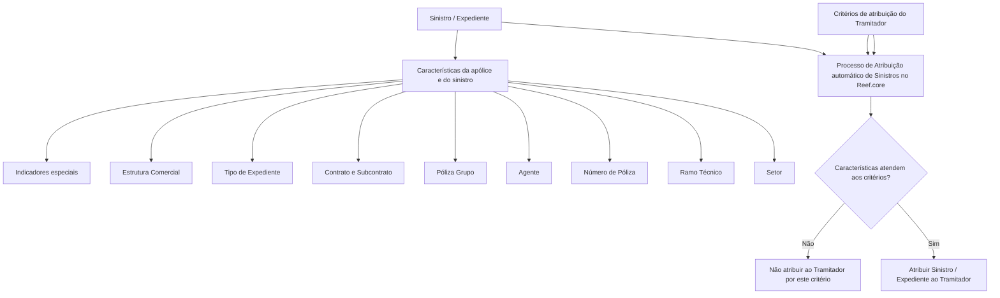

# Critérios de Atribuição de Sinistros/Expedientes do Tramitador no Reef.core

## 1. Metadados do Documento
- **Arquivo de Origem:** Não identificado no conteúdo fornecido
- **Tipo de Documento:** Manual Operacional
- **Domínio / Sistema:** Reef.core — Processo automático de atribuição de Sinistros/Expedientes
- **Público-Alvo:** Negócio, Operação e equipes responsáveis pela gestão de sinistros
- **Data/Versão Identificada:** Não identificada

---

## 2. Resumo Executivo & Contexto de Negócio

O documento descreve a operação para administrar os critérios de atribuição de Sinistros/Expedientes de um **Tramitador de Sinistros** no sistema Reef.core. A operação permite criar novos critérios, modificar critérios previamente registrados, complementá-los e removê-los.

Os critérios configurados definem quais Sinistros/Expedientes podem ser atribuídos automaticamente a um Tramitador. A atribuição pode ser especializada por características da estrutura de produtos, apólices, intermediários, contratos, estrutura comercial, tipo de expediente e condições específicas do sinistro.

O processo de atribuição automática utiliza os critérios cadastrados para verificar se um Sinistro/Expediente possui as características necessárias para ser destinado ao Tramitador correspondente. Alguns atributos aceitam valores genéricos, permitindo abranger todos os valores configurados para determinado domínio, enquanto valores específicos restringem a atribuição.

Também existem indicadores para controlar a atribuição de casos especiais, incluindo Sinistros/Expedientes em processo judicial, casos com perda total, ocorrências no exterior, clientes VIP e expedientes cujo contrário esteja segurado na MAPFRE.

O documento não detalha a prioridade entre critérios, o comportamento quando mais de um Tramitador atende aos mesmos critérios, métodos HTTP, contratos de integração, persistência de dados ou telas específicas da operação.

---

## 3. Arquitetura, Componentes & Tecnologias Envolvidas

### Componentes e conceitos identificados

| Componente / Conceito | Papel descrito no documento |
| :--- | :--- |
| Reef.core | Sistema que executa o Processo de Atribuição automático de Sinistros/Expedientes. |
| Processo de Atribuição automático de Sinistros | Processo que determina se Sinistros/Expedientes podem ser atribuídos a um Tramitador conforme os critérios configurados. |
| Tramitador de Sinistros | Responsável pela gestão de Sinistros/Expedientes atribuídos conforme critérios de especialização. |
| Estrutura de Produtos da Companhia | Fonte dos atributos Setor e Ramo Técnico. |
| Estrutura Comercial | Fonte das chaves de Primeiro, Segundo e Terceiro Nível. |
| Módulo de Juízos | Módulo relacionado a Sinistros/Expedientes que estejam em processo judicial. |
| MAPFRE | Organização mencionada na condição de contrário segurado pela MAPFRE. |



> **Nota de Análise:** O documento identifica o Reef.core e o Processo de Atribuição automático, mas não descreve componentes técnicos internos, APIs, bancos de dados, protocolos, ambientes, logs ou integrações externas.

---

## 4. Regras de Negócio, Especificações Funcionais & Processos

### Operações habilitadas

A operação de critérios de atribuição permite:

1. **Criar** novos critérios de atribuição para um Tramitador.
2. **Modificar** critérios de atribuição previamente registrados.
3. **Complementar** critérios de atribuição previamente registrados.
4. **Apagar** critérios de atribuição previamente registrados.

### Sequência de captura

O documento estabelece que os atributos são apresentados em sequência de captura da esquerda para a direita e de cima para baixo dentro do bloco de informação.

Caso não exista indicação expressa em contrário, os atributos são aplicáveis tanto a **Pessoas Físicas** quanto a **Pessoas Jurídicas**.

### Regras por critério de atribuição

#### Código do Tramitador
- O Código do Tramitador é herdado do Tramitador cujos critérios de atribuição estão sendo modificados.
- O documento não informa formato, tamanho, domínio de valores ou regra de validação do código.

#### Setor
- Identifica a chave do Setor na Estrutura de Produtos da Companhia.
- Permite que o Processo de Atribuição automático de Sinistros do Reef.core determine se Sinistros/Expedientes com essa característica podem ser atribuídos ao Tramitador.
- O valor genérico **9999** permite atribuir ao Tramitador Sinistros de todos os setores configurados no sistema.
- Um código específico de Setor restringe a atribuição a Sinistros daquele Setor.
- Combinações adequadas de critérios permitem atribuir ao Tramitador Sinistros de todos, vários ou um único Setor.

#### Ramo Técnico
- Identifica a chave do Ramo Técnico na Estrutura de Produtos da Companhia.
- Permite que o Processo de Atribuição automático de Sinistros do Reef.core determine se Sinistros/Expedientes com essa característica podem ser atribuídos ao Tramitador.
- O valor genérico **999** permite atribuir ao Tramitador Sinistros de todos os Ramos Técnicos configurados.
- Um código específico de Ramo Técnico restringe a atribuição a Sinistros daquele Ramo Técnico.

#### Número de Póliza
- Identifica a chave de uma Póliza.
- É utilizado quando, devido a características técnicas, características comerciais ou experiência do Tramitador, a entidade considera adequado que um Tramitador específico seja responsável pela gestão dos Sinistros e/ou Expedientes da Póliza.

#### Chave de Agente
- Identifica a chave do intermediário.
- Permite especializar as atividades de gestão do Tramitador.
- Permite atribuir ao Tramitador Sinistros/Expedientes de Pólizas intermediadas pelo Agente identificado.

#### Póliza Grupo
- Identifica o código de uma Póliza Grupo.
- Permite especializar as atividades de gestão do Tramitador.
- Permite atribuir ao Tramitador Sinistros/Expedientes de Pólizas associadas à Póliza Grupo.

#### Contrato
- Identifica o código de um Contrato.
- Permite que o Reef.core especialize as atividades de gestão do Tramitador.
- Permite atribuir ao Tramitador Sinistros/Expedientes de Pólizas associadas ao Contrato.

#### Subcontrato
- Identifica a chave de um Subcontrato.
- Permite que o Processo de Atribuição automático de Sinistros do Reef.core determine se Sinistros/Expedientes de Pólizas com essa característica podem ser atribuídos ao Tramitador.

#### Tipo de Expediente
- Identifica a chave de um tipo de expediente.
- Os exemplos citados são:
  - **DPM:** Daños Materiales Propios.
  - **RC:** Responsabilidad Civil.
  - **DAP:** Lesionados.
- O critério permite especializar a gestão do Tramitador.
- O valor genérico **ZZZ** permite atribuir ao Tramitador Sinistros de todos os Tipos de Expediente configurados.
- Um código específico restringe a atribuição ao Tipo de Expediente correspondente.

#### Chave do Primeiro Nível
- Contém o código que identifica o Primeiro Nível da Estrutura Comercial no sistema.
- Permite especializar a gestão do Tramitador.
- Permite atribuir Sinistros/Expedientes de Pólizas associadas a essa chave.

#### Chave do Segundo Nível
- Contém o código que identifica o Segundo Nível da Estrutura Comercial no sistema.
- Permite especializar a gestão do Tramitador.
- Permite atribuir Sinistros/Expedientes de Pólizas associadas a essa chave.

#### Chave do Terceiro Nível
- Contém o código que identifica o Terceiro Nível da Estrutura Comercial no sistema.
- Permite especializar a gestão do Tramitador.
- Permite atribuir Sinistros/Expedientes de Pólizas associadas a essa chave.

#### Sinistros/Expedientes em Juízos
- Quando ativado, permite atribuir ao Tramitador Sinistros e Expedientes que estejam em processo judicial.
- O documento associa essa condição ao módulo de Juízos.

#### Sinistros com Perda Total
- Quando ativado, permite atribuir ao Tramitador Sinistros e Expedientes identificados como perda total.

#### Sinistros ocorridos no Exterior
- Permite atribuir ao Tramitador Sinistros e Expedientes identificados como ocorridos no exterior.

#### Sinistros de Clientes VIP
- A ativação do indicador modula o Processo de Atribuição implementado no Reef.core.
- Permite atribuir ao Tramitador Sinistros e Expedientes pertencentes a Pólizas de Clientes VIP.

#### Sinistros/Expedientes com Contrário na MAPFRE
- Quando ativado, permite atribuir ao Tramitador Expedientes, normalmente de Pólizas de automóveis, cujo contrário também esteja segurado na MAPFRE.

> **Nota de Análise:** O documento não informa se os indicadores especiais são critérios inclusivos, exclusivos ou obrigatórios. Também não define a lógica de combinação entre Setor, Ramo Técnico, Póliza, Agente, Contrato, Estrutura Comercial e indicadores especiais.

---

## 5. Tabelas de Parâmetros, Ambientes e Estruturas de Dados

| Item / Parâmetro | Descrição / Função | Tipo / Valores / Formato | Ambiente / Observações |
| :--- | :--- | :--- | :--- |
| Código do Tramitador | Identifica o Tramitador cujos critérios estão sendo modificados. | Não especificado. | Herdado do Tramitador selecionado. |
| Setor | Chave do Setor da Estrutura de Produtos da Companhia para atribuição automática. | Código genérico: `9999`; código específico de Setor. | `9999` permite todos os setores configurados. |
| Ramo Técnico | Chave do Ramo Técnico da Estrutura de Produtos da Companhia para atribuição automática. | Código genérico: `999`; código específico de Ramo Técnico. | `999` permite todos os Ramos Técnicos configurados. |
| Número de Póliza | Identifica uma Póliza para especialização da gestão do Tramitador. | Não especificado. | Aplicável quando há características técnicas/comerciais específicas ou experiência do Tramitador. |
| Chave de Agente | Identifica o intermediário das Pólizas cujos Sinistros/Expedientes podem ser atribuídos. | Não especificado. | Especializa a gestão por Agente. |
| Póliza Grupo | Identifica a Póliza Grupo cujas Pólizas associadas podem ser consideradas. | Não especificado. | Especializa a gestão por grupo de Pólizas. |
| Contrato | Identifica um Contrato cujas Pólizas associadas podem ser consideradas. | Não especificado. | Especializa a gestão por Contrato. |
| Subcontrato | Identifica um Subcontrato cujas Pólizas podem ser consideradas. | Não especificado. | Avaliado pelo Processo de Atribuição automático. |
| Tipo de Expediente | Identifica o tipo de expediente a ser tratado pelo Tramitador. | Valor genérico: `ZZZ`; exemplos: `DPM`, `RC`, `DAP`. | `ZZZ` permite todos os tipos de expediente configurados. |
| Chave do Primeiro Nível | Identifica o Primeiro Nível da Estrutura Comercial. | Não especificado. | Especializa a gestão por Estrutura Comercial. |
| Chave do Segundo Nível | Identifica o Segundo Nível da Estrutura Comercial. | Não especificado. | Especializa a gestão por Estrutura Comercial. |
| Chave do Terceiro Nível | Identifica o Terceiro Nível da Estrutura Comercial. | Não especificado. | Especializa a gestão por Estrutura Comercial. |
| Sinistros/Expedientes em Juízos | Controla a atribuição de casos em processo judicial. | Campo de ativação; valores não detalhados. | Relacionado ao módulo de Juízos. |
| Sinistros com Perda Total | Controla a atribuição de casos identificados como perda total. | Campo de ativação; valores não detalhados. | Não há detalhamento adicional. |
| Sinistros ocorridos no Exterior | Controla a atribuição de casos ocorridos no exterior. | Campo de ativação; valores não detalhados. | Não há detalhamento adicional. |
| Sinistros de Clientes VIP | Controla a atribuição de casos vinculados a Pólizas de Clientes VIP. | Campo de ativação; valores não detalhados. | Modula o Processo de Atribuição no Reef.core. |
| Contrário na MAPFRE | Controla a atribuição de Expedientes cujo contrário esteja segurado na MAPFRE. | Campo de ativação; valores não detalhados. | Normalmente aplicável a Pólizas de automóveis. |

---

## 6. Bateria de Perguntas & Respostas para RAG (FAQ Sintético)

### P1: Qual é o objetivo da operação de critérios de atribuição de Sinistros do Tramitador?
**R:** A operação permite criar, modificar, complementar e apagar critérios de atribuição de Sinistros/Expedientes previamente registrados para um Tramitador de Sinistros. Esses critérios são utilizados pelo Processo de Atribuição automático do Reef.core para determinar quais Sinistros/Expedientes podem ser atribuídos ao Tramitador.

### P2: O que acontece quando o Setor é configurado com o código 9999?
**R:** O código genérico `9999` no campo Setor permite atribuir ao Tramitador Sinistros de todos os setores configurados no sistema. Quando é informado o código de um Setor específico, a atribuição considera exclusivamente Sinistros daquele Setor.

### P3: Qual é o valor genérico para o Ramo Técnico e qual é seu efeito?
**R:** O valor genérico do campo Ramo Técnico é `999`. Esse valor permite atribuir ao Tramitador Sinistros de todos os Ramos Técnicos configurados no sistema. Um código específico limita a atribuição aos Sinistros do Ramo Técnico correspondente.

### P4: Como o Número de Póliza é utilizado nos critérios de atribuição?
**R:** O Número de Póliza identifica uma Póliza cujas características técnicas, comerciais ou relacionadas à experiência do Tramitador justificam que um Tramitador específico seja responsável pela gestão dos respectivos Sinistros e/ou Expedientes.

### P5: Qual é a finalidade da Chave de Agente?
**R:** A Chave de Agente identifica o intermediário da Póliza e permite especializar a gestão do Tramitador. Dessa forma, Sinistros/Expedientes de Pólizas intermediadas pelo Agente identificado podem ser atribuídos ao Tramitador.

### P6: O que representa o valor ZZZ no Tipo de Expediente?
**R:** O valor genérico `ZZZ` permite atribuir ao Tramitador Sinistros de todos os Tipos de Expediente configurados no sistema. Caso seja informado um código específico, a atribuição considera exclusivamente Sinistros daquele Tipo de Expediente.

### P7: Quais exemplos de Tipo de Expediente são citados no documento?
**R:** O documento cita `DPM` para Daños Materiales Propios, `RC` para Responsabilidad Civil e `DAP` para Lesionados. Esses tipos permitem especializar a gestão do Tramitador.

### P8: Como a Estrutura Comercial influencia a atribuição de Sinistros/Expedientes?
**R:** As chaves de Primeiro, Segundo e Terceiro Nível identificam níveis da Estrutura Comercial no sistema. Cada uma permite especializar a gestão do Tramitador e atribuir Sinistros/Expedientes de Pólizas associadas à respectiva chave.

### P9: Como habilitar a atribuição de Sinistros/Expedientes em processo judicial?
**R:** É necessário ativar o campo “Se contemplan los Siniestros/Expedientes en Juicios”. Com esse campo ativado, o Tramitador pode receber Sinistros e Expedientes que estejam em processo judicial no módulo de Juízos.

### P10: O que controla a opção de Sinistros com Perda Total?
**R:** Quando o campo de Sinistros com Perda Total é ativado, o Tramitador pode receber Sinistros e Expedientes identificados como perda total.

### P11: Qual é o efeito da ativação de Sinistros de Clientes VIP?
**R:** A ativação do indicador de Clientes VIP modula o Processo de Atribuição implementado no Reef.core e permite atribuir ao Tramitador Sinistros e Expedientes pertencentes a Pólizas de Clientes VIP.

### P12: Quando um Expediente com contrário na MAPFRE pode ser atribuído ao Tramitador?
**R:** Quando o campo “Se contemplan los Siniestros/Expedientes con Contrario en MAPFRE” está ativado, podem ser atribuídos ao Tramitador Expedientes, normalmente de Pólizas de automóveis, cujo contrário também esteja segurado na MAPFRE.

---

## 7. Glossário de Termos, Siglas & Conceitos-Chave

- **Reef.core:** Sistema que implementa o Processo de Atribuição automático de Sinistros/Expedientes mencionado no documento.
- **Tramitador:** Responsável pela gestão de Sinistros/Expedientes atribuídos conforme critérios configurados.
- **Sinistro:** Ocorrência tratada no contexto de seguros e considerada pelo Processo de Atribuição.
- **Expediente:** Registro ou caso de gestão associado ao processo de Sinistros.
- **Setor:** Chave da Estrutura de Produtos da Companhia utilizada como critério de atribuição.
- **Ramo Técnico:** Chave da Estrutura de Produtos da Companhia utilizada como critério de atribuição.
- **Póliza:** Apólice identificada por uma chave ou número.
- **Póliza Grupo:** Póliza cujo código permite considerar Pólizas associadas para especialização da gestão.
- **Agente:** Intermediário identificado por chave e associado a Pólizas.
- **Contrato:** Código utilizado para considerar Pólizas associadas na especialização da gestão.
- **Subcontrato:** Chave utilizada pelo Processo de Atribuição automático para considerar Pólizas com essa característica.
- **DPM:** Daños Materiales Propios.
- **RC:** Responsabilidad Civil.
- **DAP:** Lesionados.
- **VIP:** Classificação de cliente citada para Pólizas de Clientes VIP; o documento não expande a sigla.
- **MAPFRE:** Organização citada como seguradora do contrário em determinados Expedientes.
- **Módulo de Juízos:** Módulo relacionado a Sinistros/Expedientes em processo judicial.

---

## 8. Notas Críticas, Riscos & Limitações

- O documento não detalha a lógica de precedência, desempate ou priorização quando vários critérios ou Tramitadores puderem corresponder ao mesmo Sinistro/Expediente.
- O documento não informa se múltiplos critérios são combinados por lógica AND, OR ou outra regra de avaliação.
- Não foram identificados detalhes sobre métodos HTTP, contratos JSON, APIs, URLs, autenticação, permissões, logs, bancos de dados ou ambientes.
- Não foram identificadas regras de formato, obrigatoriedade, cardinalidade ou validação para códigos de Tramitador, Póliza, Agente, Contrato, Subcontrato e níveis comerciais.
- Os campos relacionados a Juízos, Perda Total, Exterior, Clientes VIP e Contrário na MAPFRE são descritos como campos de ativação, mas os valores técnicos aceitos não são especificados.
- O documento menciona a sequência de captura dos campos, mas a extração textual não preserva integralmente a disposição visual da tela.
- A referência a “Conselho” aparece no conteúdo bruto sem explicação funcional adicional.

---

## 9. Conteúdo Bruto Estruturado (Referência Fiel)

```text
--- [PÁGINA 1 DE 4] ---

MODIFICAR los Criterios de Asignación de
Siniestros del Tramitador
Objetivo
Esta Operación permite Modificar, Complementar y Borrar los criterios de asignación de
Siniestros/Expedientes del Tramitador de Siniestros registrados previamente, además de Crear
nuevos criterios de asignación.
Acciones habilitadas
 CREAR ( )
 MODIFICAR ( )
 BORRAR ( )
Criterios de asignación
 /
 RS
Inicio Soluciones APIs Documentación Zeus
ES


--- [PÁGINA 2 DE 4] ---

De Izquierda a Derecha y de Arriba hacia Abajo, los siguientes atributos marcan la secuencia de
captura de los Campos en este Bloque de Información.
Si no se especifica o indica expresamente, los Atributos se emplearán tanto en Personas Físicas
como en Personas Jurídicas.
Código del Tramitador
Este dato hereda el código del Tramitador cuyos criterios de asignación se están modificando.
Sector (  )
Este campo identifica la clave del Sector de la Estructura de Productos de la Compañía para que el
Proceso de Asignación automático de Siniestros de Reef.core determine si los siniestros/expedientes
con esta característica puedan serle asignados al Tramitador.
Utilizando el valor genérico en este campo (código 9999) el sistema permite asignar al tramitador
siniestros de todos los sectores configurados en el sistema o bien, al utilizar el código de un sector
en concreto de los existentes, considerar la asignación de siniestros exclusivamente de este.
De esta manera y realizando las combinaciones adecuadas, al Tramitador se le podrán asignar
siniestros de todos, de varios o de un único Sector.
Ramo Técnico (  )
Este campo identifica la clave del Ramo Técnico de la Estructura de Productos de la Compañía para
que el Proceso de Asignación automático de Siniestros de Reef.core determine si los
siniestros/expedientes con esta característica puedan serle asignados al Tramitador.
Utilizando el valor genérico en este atributo (código 999) el sistema permite asignar al tramitador
siniestros de todos los ramos técnicos configurados en el sistema o bien, al utilizar el código de un
ramo técnico en particular, considerar la asignación de siniestros exclusivamente de este.
Número de Póliza ( )
Este campo identifica la clave de una Póliza en la que por sus especiales características técnicas o
comerciales o por la experiencia del Tramitador, la entidad considere adecuado sea un Tramitador
determinado quien se encargue y responsabilice de la Gestión de sus Siniestros y/o expedientes.
Clave de Agente (   )
Consejo:
Consejo:


--- [PÁGINA 3 DE 4] ---

Este campo identifica la clave del intermediario, clave que permitirá 'especializar' las labores de
Gestión del Tramitador para que los siniestros/expedientes de las pólizas intermediadas por este
Agente le puedan ser asignados.
Póliza Grupo (  )
Este dato identifica el Código de una póliza Grupo, código que permitirá 'especializar' las labores de
Gestión del Tramitador para que los siniestros/expedientes de las pólizas asociadas a la póliza grupo
le puedan ser asignados.
Contrato (  )
Esta otro campo identifica el código de un Contrato, código que permite a Reef.core 'especializar' las
labores de Gestión del Tramitador para que los siniestros/expedientes de las pólizas asociadas a
dicho Contrato le puedan ser asignados.
Subcontrato (  )
Este campo identifica la clave de un Subcontrato para que el Proceso de Asignación automático de
Siniestros de Reef.core determine si los siniestros/expedientes de las pólizas que tengan esta
característica puedan serle asignados al Tramitador.
Tipo de Expediente (  )
Esta campo identifica la clave de un 'tipo de expediente' determinado (DPM - Daños Materiales
Propios,RC - Responsabilidad Civil, DAP - Lesionados,...) que permite especializar la gestión del
Tramitador.
Utilizando el valor genérico en este atributo (código ZZZ) el sistema permite asignar al tramitador
siniestros de todos los tipos de Expedientes configurados en el sistema o bien, al utilizar el código
de un tipo de expediente en particular, considerar la asignación de siniestros exclusivamente de
este.
Clave del Primer Nivel (  )
Este dato contiene el código por el que se identifica el Primer Nivel de la Estructura Comercial en el
Sistema, clave que permite 'especializar' las labores de Gestión del Tramitador para que los
siniestros/expedientes de las pólizas asociadas a dicha Clave puedan serle asignados.
Clave del Segundo Nivel (  )
Este dato contiene el código por el que se identificará el Segundo Nivel de la Estructura Comercial
en el Sistema que permite 'especializar' las labores de Gestión del Tramitador para que los
Consejo:


--- [PÁGINA 4 DE 4] ---

siniestros/expedientes de las pólizas asociadas a dicha Clave le sean asignados.
Clave del Tercer Nivel (  )
Este campo contiene el código por el que se identificará el Tercer Nivel de la Estructura Comercial
en el Sistema que permite 'especializar' las labores de Gestión del Tramitador para que los
siniestros/expedientes de las pólizas asociadas a dicha Clave puedan serle asignados.
Se contemplan los Siniestros/Expedientes en Juicios ( )
Si se activa este campo al Tramitador se le podrán asignar los Siniestros y Expedientes que estén en
proceso Judicial (módulo de Juicios).
Se contemplan los Siniestros con Pérdida Total ( )
De igual forma, si se activa este campo al Tramitador se le podrán asignar los Siniestros y
Expedientes que estén identificados como pérdida total.
Se contemplan los Siniestros acaecidos en el Extranjero ( )
Además, se pueden asignar al Tramitador los Siniestros y Expedientes que estén identificados como
que hayan ocurrido en el Extranjero.
Se contemplan los Siniestros de Clientes VIP ( )
La activación de este dato modulará el Proceso de Asignación implementado en Reef.core
permitiendo que al Tramitador se le puedan asignar los Siniestros y Expedientes que pertenezcan a
pólizas de Clientes VIP.
Se contemplan los Siniestros/Expedientes con Contrario en MAPFRE ( )
Por último, si se activa este campo al Tramitador se le podrán asignar Expedientes (normalmente de
Pólizas de automóviles) cuyo Contrario esté a su vez asegurado en MAPFRE.
```
