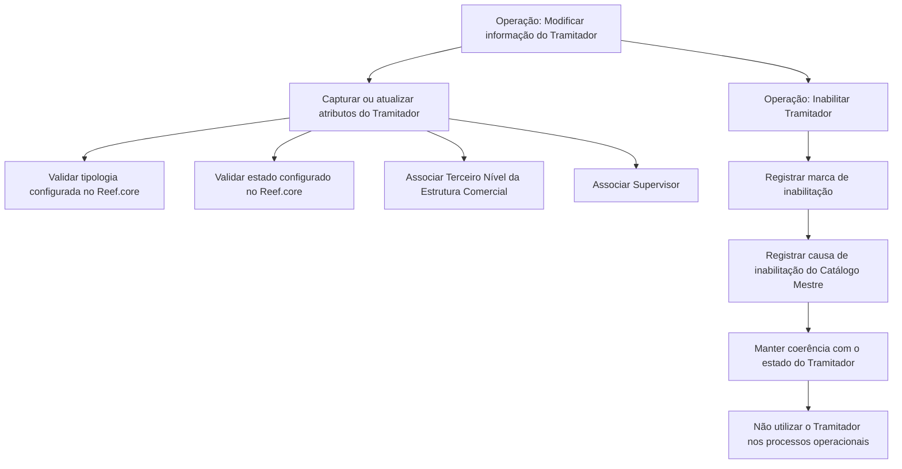

# Modificação e Inabilitação de Tramitador de Sinistros no Reef.core

## 1. Metadados do Documento
- **Arquivo de Origem:** `Não informado`
- **Tipo de Documento:** Especificação Funcional
- **Domínio / Sistema:** Reef.core — Gestão de Sinistros e Prestações
- **Público-Alvo:** Desenvolvedores, Analistas Funcionais, Operação e Negócio
- **Data/Versão Identificada:** Não identificada

---

## 2. Resumo Executivo & Contexto de Negócio

O documento descreve a operação para modificar as informações previamente registradas de um **Tramitador de Siniestros** (tramitador de sinistros) e, adicionalmente, inabilitar esse profissional no sistema Reef.core. As ações habilitadas são explicitamente **MODIFICAR** e **INHABILITAR**.

A especificação apresenta os atributos do bloco “Datos Tramitador”, cuja sequência de captura deve ser considerada da esquerda para a direita e de cima para baixo. Salvo indicação expressa em contrário, os atributos aplicam-se tanto a pessoas físicas quanto a pessoas jurídicas.

O tramitador é identificado por um código de usuário e possui tipologia, vínculo com o terceiro nível da estrutura comercial, supervisor, estado, capacidade máxima de expedientes e permissões operacionais específicas. Parte dos atributos depende de catálogos e configurações existentes no Reef.core, como a tipologia, o estado e a causa de inabilitação.

A inabilitação altera o uso operacional do tramitador: a partir desse momento, o tramitador de sinistros não deve ser empregado, contemplado ou considerado nos processos operacionais da entidade. A marca de inabilitação, a causa informada e o estado do tramitador devem permanecer coerentes entre si.

Também são descritos comportamentos relacionados à gestão de expedientes. O sistema mantém a quantidade de expedientes pendentes atribuídos ao tramitador atualizada quando um expediente é aberto, terminado, atribuído ou reatribuído. O documento ainda prevê uma configuração que altera a visualização de consequências em sinistros atribuídos, exibindo perguntas associadas em vez de descrições.

---

## 3. Arquitetura, Componentes & Tecnologias Envolvidas

O documento cita o sistema **Reef.core** como o sistema no qual são configurados tipos de tramitador, estados de tramitador e comportamentos operacionais relacionados à gestão de sinistros e expedientes.

Os componentes funcionais identificados são:

| Componente / Conceito | Descrição sustentada pelo documento |
| :--- | :--- |
| Reef.core | Sistema que contém configurações de tipologia e estado do tramitador, além de comportamentos relacionados à gestão de sinistros e prestações. |
| Tramitador de Siniestros | Usuário responsável por gerir sinistros e expedientes atribuídos. |
| Catálogo de Tramitadores | Catálogo que apresenta a tipologia do tramitador. |
| Estrutura Comercial | Estrutura que contém o terceiro nível, associado à oficina à qual o tramitador está atribuído. |
| Catálogo Mestre do Sistema | Catálogo que define causas de inabilitação. |
| Planes de Tramitación | Planos de tramitação nos quais pode ser configurado o trabalho com a data de controle. |
| Processo de Gestão de Sinistros e Prestações | Processo para o qual a exibição de perguntas sobre consequências pode servir de guia à tomada de decisão do tramitador. |

O documento não detalha APIs, métodos HTTP, contratos JSON, bases de dados, protocolos, integrações externas, servidores ou ambientes de execução.



---

## 4. Regras de Negócio, Especificações Funcionais & Processos

### 4.1 Operações habilitadas

A operação permite duas ações:

1. **MODIFICAR:** alterar informações previamente registradas do tramitador de sinistros.
2. **INHABILITAR:** tornar o tramitador inabilitado no sistema.

### 4.2 Aplicabilidade dos atributos

Caso não exista indicação ou especificação expressa diferente, os atributos do bloco de informações devem ser empregados tanto para:

- Pessoas físicas.
- Pessoas jurídicas.

### 4.3 Identificação e classificação do tramitador

- O **Código de Usuário do Tramitador** contém o código de usuário utilizado pelo tramitador para identificar-se ao conectar-se ao sistema.
- A **Tipologia do Tramitador** é obtida no Catálogo de Tramitadores.
- A tipologia deve corresponder a um dos tipos possíveis configurados para o Reef.core.
- O **Terceiro Nível** corresponde ao código do terceiro nível da Estrutura Comercial, identificado como a oficina à qual o tramitador está atribuído.
- O **Código do Supervisor** identifica o supervisor atribuído ao tramitador.
- O **Estado do Tramitador** registra a situação do tramitador na data de captura das informações.
- O estado deve corresponder a um dos estados possíveis configurados no Reef.core.

### 4.4 Inabilitação do tramitador

A marca de **Inhabilitación** informa ao sistema que o tramitador de sinistros está inabilitado. Após a inabilitação:

- O tramitador não deve ser empregado nos processos operacionais da entidade.
- O tramitador não deve ser contemplado nos processos operacionais da entidade.
- O tramitador não deve ser considerado nos processos operacionais da entidade.

Quando o tramitador estiver inabilitado:

- O campo **Causa de Inhabilitación** deve conter o código de uma causa de inabilitação.
- A causa deve estar definida no catálogo mestre do sistema.
- A marca de inabilitação deve estar em consonância com o estado do tramitador.
- O valor da causa de inabilitação também deve estar em consonância com o estado do tramitador.

### 4.5 Perguntas associadas às consequências

A ativação do campo **Pregunta Consecuencias?** altera o comportamento do Reef.core para os sinistros atribuídos ao tramitador:

- Em vez de exibir as descrições das consequências, o Reef.core exibe as possíveis perguntas associadas às consequências.
- Conforme a expertise do tramitador, a ativação pode servir como guia para a tomada de decisões no Processo de Gestão de Sinistros e Prestações.

### 4.6 Gestão de expedientes atribuídos

O **Número de Expedientes Asignados** apresenta o número de expedientes pendentes atribuídos a um tramitador.

O conteúdo desse dado é atualizado e modificado sempre que ocorre uma das seguintes situações:

1. Abertura de um expediente.
2. Finalização de um expediente.
3. Atribuição de um expediente.
4. Reatribuição de um expediente.

A atualização deve respeitar os critérios de atribuição de sinistros/expedientes considerados e configurados no sistema para os tramitadores.

O **Número Máximo de Expedientes Asignados** define a quantidade máxima de expedientes ativos e pendentes que um tramitador pode gerir simultaneamente.

### 4.7 Modificação da data de controle

O campo **Modifica Fecha de Control** indica se o tramitador está capacitado ou não para modificar a data de controle durante a gestão de sinistros e expedientes.

Essa capacidade somente é aplicável quando, no nível da companhia, tenha sido indicado que os Planes de Tramitación trabalharão com a Fecha de Control.

---

## 5. Tabelas de Parâmetros, Ambientes e Estruturas de Dados

| Item / Parâmetro | Descrição / Função | Tipo / Valores / Formato | Ambiente / Observações |
| :--- | :--- | :--- | :--- |
| Ação MODIFICAR | Permite modificar informações previamente registradas do tramitador de sinistros. | Ação operacional | Operação habilitada no documento. |
| Ação INHABILITAR | Permite inabilitar o tramitador de sinistros. | Ação operacional | Após a inabilitação, o tramitador não deve ser usado, contemplado ou considerado operacionalmente. |
| Código de Usuário do Tramitador | Código utilizado pelo tramitador para identificar-se ao conectar-se ao sistema. | Código de usuário | Não há formato detalhado. |
| Tipologia do Tramitador | Apresenta a tipologia do tramitador no Catálogo de Tramitadores. | Um dos tipos configurados | Deve corresponder a uma tipologia configurada para Reef.core. |
| Terceiro Nível | Código do terceiro nível da Estrutura Comercial, identificado como oficina. | Código | Representa a unidade à qual o tramitador está atribuído. |
| Código do Supervisor | Código do supervisor atribuído ao tramitador. | Código | Não há formato detalhado. |
| Estado do Tramitador | Registra o estado do tramitador na data de captura das informações. | Um dos estados configurados | Deve corresponder a um estado configurado no Reef.core. |
| Inhabilitación | Indica que o tramitador está inabilitado no sistema. | Marca / indicador | Deve ser coerente com o estado do tramitador. |
| Causa de Inhabilitación | Código da causa de inabilitação. | Código de catálogo | Obrigatório no caso de tramitador inabilitado; definido no catálogo mestre do sistema; deve ser coerente com o estado. |
| Pregunta Consecuencias? | Altera a exibição de consequências nos sinistros atribuídos ao tramitador. | Campo de ativação | Quando ativado, exibe perguntas associadas às consequências em vez de suas descrições. |
| Número de Expedientes Asignados | Mostra a quantidade de expedientes pendentes atribuídos ao tramitador. | Número | Atualizado quando há abertura, finalização, atribuição ou reatribuição de expediente. |
| Número Máximo de Expedientes Asignados | Define o máximo de expedientes ativos e pendentes gerenciáveis simultaneamente. | Número | Limite operacional do tramitador. |
| Modifica Fecha de Control | Indica se o tramitador pode modificar a data de controle na gestão de sinistros/expedientes. | Campo de capacidade / permissão | Aplicável somente se a companhia tiver indicado o uso de Fecha de Control nos Planes de Tramitación. |

**Nota de Análise:** o documento não informa URLs, ambientes, servidores, caminhos de log, tipos de dados técnicos, obrigatoriedade de preenchimento, valores permitidos concretos ou contratos de integração.

---

## 6. Bateria de Perguntas & Respostas para RAG (FAQ Sintético)

### P1: Qual é o objetivo da operação de modificação do tramitador no Reef.core?
**R:** A operação permite modificar informações previamente registradas de um Tramitador de Siniestros e também inabilitá-lo. As ações habilitadas explicitamente são MODIFICAR e INHABILITAR.

### P2: Quais entidades podem utilizar os atributos descritos para o tramitador?
**R:** Se não houver especificação ou indicação expressa diferente, os atributos descritos devem ser empregados tanto para pessoas físicas quanto para pessoas jurídicas.

### P3: Como o tramitador se identifica ao conectar-se ao sistema?
**R:** O tramitador identifica-se por meio do Código de Usuário do Tramitador, campo que contém o código de usuário utilizado na conexão ao sistema.

### P4: Quais validações existem para a tipologia e o estado do tramitador?
**R:** A Tipologia do Tramitador deve ser um dos tipos configurados para o Reef.core. O Estado do Tramitador também deve corresponder a um dos estados possíveis configurados no Reef.core.

### P5: O que representa o Terceiro Nível atribuído ao tramitador?
**R:** O Terceiro Nível é o código do terceiro nível da Estrutura Comercial, identificado no documento como a oficina à qual o tramitador está atribuído.

### P6: Qual é a consequência operacional de inabilitar um tramitador?
**R:** A inabilitação informa ao sistema que o Tramitador de Siniestros está inabilitado. A partir desse momento, o tramitador não deve ser empregado, contemplado ou considerado nos processos operacionais da entidade.

### P7: Como a causa de inabilitação deve ser preenchida e validada?
**R:** Quando o tramitador estiver inabilitado, o campo Causa de Inhabilitación deve conter o código de uma causa definida no catálogo mestre do sistema. Tanto a marca de inabilitação quanto a causa informada devem estar em consonância com o estado do tramitador.

### P8: O que muda quando o campo “Pregunta Consecuencias?” é ativado?
**R:** Quando o campo é ativado, o Reef.core passa a exibir as possíveis perguntas associadas às consequências nos sinistros atribuídos ao tramitador, em vez de mostrar as descrições dessas consequências. O comportamento pode apoiar a tomada de decisão no Processo de Gestão de Sinistros e Prestações.

### P9: Quando o Número de Expedientes Asignados é atualizado?
**R:** O número é atualizado e modificado sempre que um expediente é aberto, terminado, atribuído ou reatribuído, de acordo com os critérios de atribuição de sinistros e expedientes configurados no sistema para os tramitadores.

### P10: O que limita a quantidade de expedientes gerenciados simultaneamente por um tramitador?
**R:** O campo Número Máximo de Expedientes Asignados identifica a quantidade máxima de expedientes ativos e pendentes que o tramitador pode gerir ao mesmo tempo.

### P11: Em que condição o tramitador pode modificar a Fecha de Control?
**R:** O campo Modifica Fecha de Control identifica se o tramitador está capacitado a modificar a data de controle durante a gestão de sinistros e expedientes. Essa capacidade depende de a companhia ter indicado que os Planes de Tramitación trabalharão com a Fecha de Control.

---

## 7. Glossário de Termos, Siglas & Conceitos-Chave

- **Reef.core:** Sistema no qual são configurados tipos e estados de tramitador, além de comportamentos relacionados à gestão de sinistros e prestações.
- **Tramitador de Siniestros:** Profissional ou usuário que gere sinistros e expedientes atribuídos.
- **Catálogo de Tramitadores:** Catálogo que apresenta a tipologia do tramitador.
- **Tipologia do Tramitador:** Classificação do tramitador que deve pertencer a um dos tipos configurados para o Reef.core.
- **Terceiro Nível:** Código do terceiro nível da Estrutura Comercial, identificado como oficina.
- **Estrutura Comercial:** Estrutura organizacional à qual o tramitador pode ser atribuído.
- **Supervisor:** Responsável associado ao tramitador por meio de seu código.
- **Inhabilitación:** Condição que informa que o tramitador está inabilitado no sistema.
- **Causa de Inhabilitación:** Código de causa de inabilitação definido no catálogo mestre do sistema.
- **Expediente:** Registro de sinistro cuja abertura, finalização, atribuição ou reatribuição influencia a contagem de expedientes atribuídos ao tramitador.
- **Fecha de Control:** Data de controle que o tramitador pode ou não estar capacitado a modificar.
- **Planes de Tramitación:** Planos nos quais a companhia pode indicar o uso da Fecha de Control.
- **Proceso de Gestión de Siniestros y Prestaciones:** Processo de gestão de sinistros e prestações apoiado, entre outros elementos, pela exibição de perguntas associadas às consequências.

---

## 8. Notas Críticas, Riscos & Limitações

- A tipologia e o estado do tramitador dependem de valores previamente configurados no Reef.core; o documento não lista os tipos ou estados disponíveis.
- A inabilitação exige coerência entre a marca de inabilitação, a causa de inabilitação e o estado do tramitador. Inconsistências entre esses atributos representam risco de integridade funcional.
- O documento determina que um tramitador inabilitado não deve participar dos processos operacionais, mas não detalha mecanismos técnicos de bloqueio, permissões, validações de interface ou regras de reatribuição de expedientes já existentes.
- A contagem de expedientes depende dos critérios de atribuição configurados no sistema, mas tais critérios não são definidos no conteúdo fornecido.
- A permissão para modificar a Fecha de Control depende de uma configuração no nível da companhia e dos Planes de Tramitación; o documento não descreve como essa configuração é administrada.
- O documento não informa integrações, APIs, contratos de dados, persistência, logs, ambientes, URLs, perfis de acesso ou tratamento de erros.
- **Nota de Análise:** o documento cita o Reef.core, o Catálogo de Tramitadores e o catálogo mestre do sistema, porém não detalha métodos técnicos, interfaces ou contratos de integração entre esses elementos.

---

## 9. Conteúdo Bruto Estruturado (Referência Fiel)

```text
--- [PÁGINA 1 DE 3] ---

MODIFICAR Información específica del
Tramitador
Objetivo
Esta Operación permite Modificar la información del Tramitador de Siniestros registrada previamente
además de poder Inhabilitarlo.
Acciones habilitadas
 MODIFICAR ( )
 INHABILITAR ( )
Datos Tramitador
De Izquierda a Derecha y de Arriba hacia Abajo, los siguientes atributos marcan la secuencia de
captura de los Campos en este Bloque de Información.
 /
 RS
Inicio Soluciones APIs Documentación Zeus
ES


--- [PÁGINA 2 DE 3] ---

Si no se especifica o indica expresamente, los Atributos se emplearán tanto en Personas Físicas
como en Personas Jurídicas.
Código de Usuario del Tramitador (  )
Este campo del bloque de información contiene el código del usuario con el que el Tramitador se va a
identificar al conectarse al sistema.
Tipología del Tramitador (  )
Esta propiedad del Catálogo de Tramitadores muestra la Tipología del mismo, tipología que tiene que
tener uno de los posibles tipos configurados para Reef.core.
Tercer Nivel (  )
Este dato es el código del Tercer Nivel de la Estructura Comercial (oficina) al que está asignado el
Tramitador.
Código del Supervisor (  )
Este dato contiene el código del Supervisor que tendrá asignado el Tramitador.
Estado del Tramitador (  )
Este campo registra el estado en el que se encuentra el Tramitador a la fecha de captura de su
información, estado que tiene que tener uno de los posibles estados configurados en Reef.core.
Inhabilitación ( )
Este Campo le indica al Sistema que el Tramitador de Siniestros está inhabilitado en el Sistema por
lo que a partir del momento de su inhabilitación no debería ser empleado, contemplado o
considerado en los procesos operativos de la entidad.
Causa de Inhabilitación (   )
En el supuesto que el Tramitador estuviera Inhabilitado, este campo va a contener el código de una
causa de Inhabilitación definida en el catálogo maestro del Sistema.
Tanto la marca de inhabilitación como el valor de la causa de inhabilitación del Tramitador deben
estar en consonancia con el valor que indica el estado de tramitador.
Pregunta Consecuencias? ( )
Consejo:


--- [PÁGINA 3 DE 3] ---

La activación de este campo hace que el comportamiento de Reef.core varíe para que en los
siniestros que tenga asignados el Tramitador se visualicen las posibles preguntas asociadas a las
consecuencias en vez de mostrar las descripciones de las mismas.
De acuerdo con el expertise del Tramitador, la activación de este campo le puede servir de guía
en la toma de decisiones del Proceso de Gestión de Siniestros y Prestaciones.
Número de Expedientes Asignados
Este dato muestra el número de expedientes pendientes que tiene asignado un Tramitador,
sabiendo que cada vez que se abre, se termina, se asigna o se reasigna un expediente, se actualiza
y modifica su contenido (Todo ello de acuerdo con los criterios de asignación de
siniestros/expedientes que se hayan considerado y configurado en el sistema para los tramitadores).
Número Máximo de Expedientes Asignados ( )
Este campo identifica el número máximo de expedientes activos y pendientes que podrá tener
gestionando el tramitador al mismo tiempo.
Modifica Fecha de Control ( )
Este campo identifica si el Tramitador está o no capacitado para modificar la fecha de control en la
gestión de los siniestros/expedientes (siempre y cuando se haya indicado a nivel de compañía que
en los Planes de Tramitación se vaya a trabajar con la Fecha de Control).
Consejo:
```
