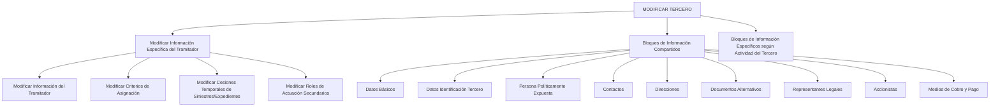

# Operação Modificar Tramitador de Sinistros — Processo e Estruturas de Informação

## 1. Metadados do Documento
- **Arquivo de Origem:** Não identificado
- **Tipo de Documento:** Procedimento
- **Domínio / Sistema:** Operação de modificação de Tramitador de Sinistros
- **Público-Alvo:** Operação, Negócio e usuários do sistema
- **Data/Versão Identificada:** Não identificada

---

## 2. Resumo Executivo & Contexto de Negócio

O documento descreve a operação **Modificar Tramitador**, destinada a complementar, modificar e/ou inabilitar informações associadas a um Tramitador de Sinistros. A alteração pode ocorrer em blocos ou estruturas de dados que contenham e agrupem informações do Tramitador de Sinistros.

A operação distingue blocos de informação compartilhados, acessíveis no processo **Modificar Tercero**, e blocos específicos relacionados à atividade do terceiro. Entre as informações específicas do Tramitador estão dados próprios, critérios de atribuição de sinistros ou expedientes, cessões temporárias e papéis de atuação secundários.

A obrigatoriedade e a habilitação de campos podem variar conforme o código de atividade do terceiro, o tipo de terceiro — Pessoa Física ou Pessoa Jurídica — e personalizações implementadas na aplicação. Portanto, o comportamento de preenchimento não é uniforme para todos os registros.

A ordem de captura dos dados em blocos de informação pode variar segundo o critério utilizado pelo usuário no sistema. O documento não detalha os campos individuais, métodos, contratos, validações específicas ou efeitos técnicos de cada opção de modificação.

---

## 3. Arquitetura, Componentes & Tecnologias Envolvidas

O documento não descreve tecnologias, APIs, microsserviços, bancos de dados, URLs de ambiente ou infraestrutura. Os componentes funcionais identificados são:

- Operação **Modificar Tramitador**.
- Processo **Modificar Tercero**.
- Blocos de informação compartilhados.
- Blocos de informação específicos conforme a atividade do terceiro.
- Processo **Modificar Información Específica del Tramitador**.
- Critérios de atribuição de sinistros/expedientes.
- Cessões temporárias de sinistros/expedientes.
- Papéis de atuação secundários.



---

## 4. Regras de Negócio, Especificações Funcionais & Processos

1. A operação permite **complementar**, **modificar** e/ou **inabilitar** informações do Tramitador de Sinistros.
2. As alterações podem afetar qualquer bloco ou estrutura de dados que contenha e agrupe informações do Tramitador de Sinistros.
3. A obrigatoriedade e/ou habilitação de campos nos blocos ou estruturas de informação compartilhada pode variar conforme o **código de atividade do terceiro**.
4. A obrigatoriedade e/ou habilitação de campos também pode variar quando o terceiro é **Pessoa Física** ou **Pessoa Jurídica**.
5. Personalizações implementadas podem afetar o comportamento da aplicação quanto à obrigatoriedade do registro dos dados do terceiro.
6. A ordem de captura dos dados nos blocos de informação pode variar conforme o critério seguido pelo usuário no sistema.
7. O processo de modificação pode envolver:
   - Dados básicos.
   - Dados de identificação do terceiro.
   - Pessoa Politicamente Exposta.
   - Contatos.
   - Endereços.
   - Documentos alternativos.
   - Representantes legais.
   - Acionistas.
   - Meios de cobrança e pagamento.
   - Informações específicas de acordo com a atividade do terceiro.
8. A modificação de informações específicas do Tramitador pode abranger:
   - Informação do Tramitador de Sinistros.
   - Critérios de atribuição de sinistros/expedientes.
   - Cessões temporárias de sinistros/expedientes.
   - Papéis de atuação secundários.

---

## 5. Tabelas de Parâmetros, Ambientes e Estruturas de Dados

| Item / Parâmetro | Descrição / Função | Tipo / Valores / Formato | Ambiente / Observações |
| :--- | :--- | :--- | :--- |
| Operação Modificar Tramitador | Complementar, modificar e/ou inabilitar informações do Tramitador de Sinistros | Operação funcional | Pode atuar em blocos ou estruturas que contenham informações do Tramitador |
| Código de atividade do terceiro | Critério que pode alterar obrigatoriedade e/ou habilitação de campos | Código de atividade | Regras específicas não detalhadas |
| Tipo de terceiro | Critério que pode alterar obrigatoriedade e/ou habilitação de campos | Pessoa Física ou Pessoa Jurídica | Regras específicas não detalhadas |
| Personalizações | Implementações que podem afetar o comportamento da aplicação | Personalizações da aplicação | Podem afetar obrigatoriedade no registro dos dados do terceiro |
| Ordem de captura dos dados | Sequência de preenchimento dos blocos de informação | Critério do usuário | Pode variar no sistema |
| Datos Básicos | Bloco de informação compartilhada | Bloco de informação | Associado a MODIFICAR TERCERO |
| Datos Identificación Tercero | Bloco de informação compartilhada | Bloco de informação | Associado a MODIFICAR TERCERO |
| Persona Políticamente Expuesta | Bloco de informação compartilhada | Bloco de informação | Associado a MODIFICAR TERCERO |
| Contactos | Bloco de informação compartilhada | Bloco de informação | Associado a MODIFICAR TERCERO |
| Direcciones | Bloco de informação compartilhada | Bloco de informação | Associado a MODIFICAR TERCERO |
| Documentos Alternativos | Bloco de informação compartilhada | Bloco de informação | Associado a MODIFICAR TERCERO |
| Representantes Legales | Bloco de informação compartilhada | Bloco de informação | Associado a MODIFICAR TERCERO |
| Accionistas | Bloco de informação compartilhada | Bloco de informação | Associado a MODIFICAR TERCERO |
| Medios de Cobro y Pago | Bloco de informação compartilhada | Bloco de informação | Associado a MODIFICAR TERCERO |
| Informação do Tramitador | Informação específica do Tramitador de Sinistros | Bloco de informação específica | Pode ser modificada |
| Critérios de atribuição | Regras ou dados de atribuição de sinistros/expedientes | Informação específica | O conteúdo dos critérios não é detalhado |
| Cessões temporárias | Cessões temporárias de sinistros/expedientes | Informação específica | Regras e duração não detalhadas |
| Papéis de atuação secundários | Papéis secundários vinculados ao Tramitador | Informação específica | Papéis permitidos não detalhados |

---

## 6. Bateria de Perguntas & Respostas para RAG (FAQ Sintético)

### P1: Em que consiste a operação Modificar Tramitador?
**R:** A operação consiste em complementar, modificar e/ou inabilitar a informação do Tramitador de Sinistros em qualquer bloco ou estrutura de dados que contenha e agrupe essas informações.

### P2: Quais fatores podem alterar a obrigatoriedade ou habilitação de campos?
**R:** A obrigatoriedade e/ou habilitação de campos pode variar conforme o código de atividade do terceiro, o tipo de terceiro — Pessoa Física ou Pessoa Jurídica — e as personalizações implementadas na aplicação.

### P3: As personalizações da aplicação influenciam o cadastro do terceiro?
**R:** Sim. As personalizações que possam ter sido implementadas podem afetar o comportamento da aplicação em relação à obrigatoriedade de registro dos dados do terceiro.

### P4: A ordem de preenchimento dos blocos de informação é fixa?
**R:** Não. O documento informa que a ordem de captura dos dados nos diferentes blocos de informação pode variar segundo o critério seguido pelo usuário no sistema.

### P5: Quais blocos de informação compartilhada podem ser modificados no processo Modificar Tercero?
**R:** Os blocos listados são Datos Básicos, Datos Identificación Tercero, Persona Políticamente Expuesta, Contactos, Direcciones, Documentos Alternativos, Representantes Legales, Accionistas e Medios de Cobro y Pago.

### P6: Quais informações específicas do Tramitador podem ser modificadas?
**R:** Podem ser modificadas a informação do Tramitador de Sinistros, os critérios de atribuição de sinistros/expedientes, as cessões temporárias de sinistros/expedientes e os papéis de atuação secundários.

### P7: O documento define os campos obrigatórios para cada código de atividade?
**R:** Não. O documento afirma que a obrigatoriedade e/ou habilitação pode variar segundo o código de atividade do terceiro, mas não apresenta os campos, códigos de atividade ou regras detalhadas.

### P8: O documento especifica quais papéis de atuação secundários estão disponíveis?
**R:** Não. O documento menciona a possibilidade de modificar papéis de atuação secundários, porém não lista os papéis existentes nem as regras para sua atribuição.

### P9: O documento detalha critérios de atribuição de sinistros ou expedientes?
**R:** Não. O documento lista a modificação de critérios de atribuição de sinistros/expedientes como uma função, mas não descreve critérios, condições ou algoritmos de atribuição.

### P10: Existem detalhes técnicos sobre APIs, métodos HTTP ou contratos de integração?
**R:** Não. O conteúdo apresentado não detalha APIs, métodos HTTP, contratos JSON, tecnologias, ambientes, servidores ou integrações técnicas.

---

## 7. Glossário de Termos, Siglas & Conceitos-Chave

- **Tramitador de Sinistros:** Entidade cujas informações podem ser complementadas, modificadas ou inabilitadas na operação descrita.
- **Tercero:** Terceiro associado ao processo de modificação e aos blocos de informação compartilhada.
- **Persona Física:** Tipo de terceiro mencionado como fator que pode alterar a obrigatoriedade e/ou habilitação de campos.
- **Persona Jurídica:** Tipo de terceiro mencionado como fator que pode alterar a obrigatoriedade e/ou habilitação de campos.
- **Persona Políticamente Expuesta:** Bloco de informação compartilhada listado no processo MODIFICAR TERCERO.
- **Siniestros/Expedientes:** Elementos associados aos critérios de atribuição e às cessões temporárias que podem ser modificadas.
- **Cesiones Temporales:** Cessões temporárias de sinistros/expedientes que podem ser modificadas.
- **Roles de Actuación Secundarios:** Papéis de atuação secundários que podem ser modificados.

---

## 8. Notas Críticas, Riscos & Limitações

- **Nota de Análise:** O documento não identifica o arquivo de origem, data, versão, autor ou sistema corporativo específico.
- **Nota de Análise:** O documento não detalha os campos disponíveis em cada bloco de informação.
- **Nota de Análise:** Não há especificação de regras concretas por código de atividade, Pessoa Física ou Pessoa Jurídica.
- **Nota de Análise:** As personalizações podem alterar a obrigatoriedade de campos; portanto, o comportamento operacional pode variar entre implementações.
- **Nota de Análise:** Não são descritos métodos HTTP, contratos JSON, APIs, fluxos de integração, URLs, ambientes, autenticação ou rotas de log.
- **Risco Operacional:** A variação na ordem de captura de dados segundo o critério do usuário pode gerar procedimentos operacionais não uniformes.
- **Risco de Governança:** A ausência de detalhamento sobre personalizações dificulta determinar previamente quais campos serão obrigatórios ou habilitados em uma instalação específica.

---

## 9. Conteúdo Bruto Estruturado (Referência Fiel)

```text
--- [PÁGINA 1 DE 3] ---

OPERACIÓN MODIFICAR Tramitador
¿En que consiste?
Esta operación consiste en Complementar, Modificar y/o Inhabilitar la información del Tramitador
de Siniestros en cualquiera de los bloques o estructuras de datos que la contienen y agrupan.
Premisas
La obligatoriedad y/o la habilitación de los campos en el registro de los datos de cada uno de
los bloques o estructuras de información compartidas puede variar de acuerdo con el código de
actividad del Tercero:
La obligatoriedad y/o la habilitación de los campos en el registro de los datos de cada uno de
los bloques o estructuras de información pueden variar si el tipo de Tercero es una Persona
Física o una Persona Jurídica:
Las personalizaciones que se hubieran podido implementar a su vez pueden afectar el
comportamiento de la aplicación en relación con la obligatoriedad en el registro de los Datos del
Tercero.
Ejemplo:
Ejemplo:
 / 
 RS
Inicio Soluciones APIs Documentación Zeus
ES


--- [PÁGINA 2 DE 3] ---

Por último, el orden de captura de los datos en los distintos bloques de Información puede
variar de acuerdo con el criterio seguido por el Usuario en el Sistema.
Proceso
MODIFICAR
TERCERO
Modificar Información
Específica del Tramitador
Bloques de Información Compartidos (MODIFICAR TERCERO)
 Datos Básicos ( )
 Datos Identificación Tercero ( )
 Persona Políticamente Expuesta(   )
 Contactos (   )
 Direcciones (   )
 Documentos Alternativos (   )
 Representantes Legales (   )
 Accionistas (   )
 Medios de Cobro y Pago (   )
Bloques de Información Específicos de acuerdo con la
Actividad del Tercero.
MODIFICAR INFORMACIÓN
ESPECÍFICA DEL TRAMITADOR
Modificar Información
del Tramitador
Modificar Criterios de Asignación
de Siniestros/Expedientes
Modificar Cesiones Temporales de
Siniestros/Expedientes
Modificar Roles de
Actuación Secundarios
 Modificar Información del Tramitador de Siniestros (   )
 Modificar Criterios de Asignación (   )


--- [PÁGINA 3 DE 3] ---

Modificar Cesiones Temporales de Siniestros/Expedientes (   )
 Modificar roles de Actuación Secundarios (  )
```
