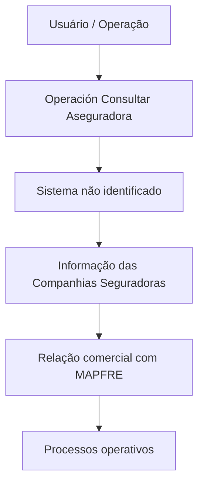

# Operación Consultar Aseguradora — Consulta de Companhias Seguradoras MAPFRE

## 1. Metadados do Documento
- **Arquivo de Origem:** Não identificado
- **Tipo de Documento:** Procedimento
- **Domínio / Sistema:** MAPFRE — Operación Consultar Aseguradora
- **Público-Alvo:** Operação, Negócio
- **Data/Versão Identificada:** Não identificada

---

## 2. Resumo Executivo & Contexto de Negócio

O documento descreve a operação **“Consultar Aseguradora”**, destinada à consulta, no Sistema, de informações sobre companhias seguradoras.

A consulta abrange companhias seguradoras com as quais a entidade **MAPFRE** mantém relação comercial. O texto informa que essa relação pode ocorrer em qualquer um dos processos operativos da entidade.

O conteúdo fornecido não detalha telas, campos de consulta, critérios de pesquisa, permissões, métodos de integração, contratos de API ou resultados retornados pela operação.

---

## 3. Arquitetura, Componentes & Tecnologias Envolvidas

Componentes e referências explicitamente mencionados:

- **Sistema:** local onde a consulta é realizada; o nome não foi informado.
- **MAPFRE:** entidade que possui relação comercial com as companhias seguradoras.
- **Compañías Aseguradoras:** entidades consultadas pela operação.
- **Operación Consultar Aseguradora:** operação funcional descrita.
- **Soluciones, APIs, Documentación, Zeus:** termos presentes no conteúdo bruto, sem explicação funcional adicional.
- **RS / ES:** siglas ou identificadores presentes no conteúdo bruto, sem definição disponível.



> **Nota de Análise:** O documento não especifica a arquitetura técnica, tecnologias, APIs, métodos HTTP, ambientes, bancos de dados ou contratos de integração.

---

## 4. Regras de Negócio, Especificações Funcionais & Processos

1. A operação denominada **“Consultar Aseguradora”** permite consultar informações de companhias seguradoras.
2. A consulta é realizada em um Sistema não identificado no conteúdo.
3. As companhias seguradoras consultadas são aquelas com as quais a entidade MAPFRE possui relação comercial.
4. A relação comercial pode existir em qualquer processo operativo da entidade MAPFRE.
5. O documento não estabelece filtros, critérios de elegibilidade, regras de validação, campos obrigatórios, exceções ou sequência operacional detalhada.

---

## 5. Tabelas de Parâmetros, Ambientes e Estruturas de Dados

| Item / Parâmetro | Descrição / Função | Tipo / Valores / Formato | Ambiente / Observações |
| :--- | :--- | :--- | :--- |
| Operación Consultar Aseguradora | Operação para consultar informações de companhias seguradoras. | Operação funcional | Sistema não identificado |
| Compañías Aseguradoras | Companhias cujas informações podem ser consultadas. | Entidades comerciais | Devem possuir relação comercial com MAPFRE |
| MAPFRE | Entidade com a qual as companhias seguradoras mantêm relação comercial. | Entidade corporativa | Aplicável a qualquer processo operativo |
| Sistema | Local lógico onde a operação de consulta é executada. | Não especificado | Nome, tecnologia e ambiente não informados |
| Soluciones | Termo listado no conteúdo bruto. | Não especificado | Sem detalhamento adicional |
| APIs | Termo listado no conteúdo bruto. | Não especificado | Não há endpoints, métodos ou contratos descritos |
| Documentación | Termo listado no conteúdo bruto. | Não especificado | Sem detalhamento adicional |
| Zeus | Termo listado no conteúdo bruto. | Não especificado | Sem detalhamento adicional |
| RS | Sigla ou identificador presente no conteúdo. | Não especificado | Significado não informado |
| ES | Sigla ou identificador presente no conteúdo. | Não especificado | Significado não informado |

---

## 6. Bateria de Perguntas & Respostas para RAG (FAQ Sintético)

### P1: Qual é a finalidade da operação “Consultar Aseguradora”?
**R:** A operação “Consultar Aseguradora” permite consultar, no Sistema, informações sobre companhias seguradoras que possuem relação comercial com a entidade MAPFRE.

### P2: Quais companhias seguradoras podem ser consultadas?
**R:** Podem ser consultadas as companhias seguradoras com as quais a entidade MAPFRE mantém uma relação comercial em qualquer um de seus processos operativos.

### P3: A operação “Consultar Aseguradora” é destinada ao cadastro de seguradoras?
**R:** Não. O conteúdo disponível descreve exclusivamente uma operação de consulta de informações. Não há indicação de cadastro, alteração, exclusão ou manutenção de dados.

### P4: Em qual sistema a consulta de seguradoras é realizada?
**R:** A consulta é realizada em um “Sistema”, conforme o texto original. O documento não identifica o nome, ambiente, tecnologia ou URL desse Sistema.

### P5: A relação comercial com MAPFRE precisa estar vinculada a um processo específico?
**R:** Não. O documento informa que a relação comercial pode existir em qualquer um dos processos operativos da entidade MAPFRE.

### P6: Quais dados de uma companhia seguradora são retornados pela consulta?
**R:** O documento informa somente que a operação permite consultar informações das companhias seguradoras. Os campos, atributos e formato da resposta não são detalhados.

### P7: O documento define APIs ou endpoints para a operação “Consultar Aseguradora”?
**R:** Não. Embora o termo “APIs” apareça no conteúdo bruto, o documento não apresenta endpoints, métodos HTTP, URLs, autenticação ou contratos de requisição e resposta.

### P8: O documento define regras de validação para a consulta?
**R:** Não. Não foram identificadas regras de validação, filtros, parâmetros obrigatórios, critérios de busca ou condições de erro.

### P9: O que significa a sigla “RS” no documento?
**R:** O significado de “RS” não é definido no conteúdo disponibilizado. A sigla é apresentada isoladamente no texto bruto.

### P10: O que é “Zeus” no contexto da operação?
**R:** “Zeus” é mencionado no conteúdo bruto, mas não recebe definição funcional, técnica ou arquitetural adicional.

---

## 7. Glossário de Termos, Siglas & Conceitos-Chave

- **Aseguradora:** Companhia seguradora consultada pela operação.
- **MAPFRE:** Entidade mencionada como possuidora de relação comercial com companhias seguradoras.
- **Operación Consultar Aseguradora:** Operação que permite consultar informações de companhias seguradoras no Sistema.
- **Processos operativos:** Processos operacionais da entidade MAPFRE; o documento não detalha quais são esses processos.
- **Sistema:** Ambiente ou aplicação em que a operação de consulta é executada; não identificado nominalmente.
- **APIs:** Termo presente no conteúdo bruto, sem definição ou detalhamento técnico.
- **RS:** Sigla presente no conteúdo bruto; significado não identificado.
- **ES:** Sigla presente no conteúdo bruto; significado não identificado.
- **Zeus:** Termo presente no conteúdo bruto; significado não identificado.

---

## 8. Notas Críticas, Riscos & Limitações

- O nome do arquivo de origem não foi disponibilizado.
- O Sistema onde a consulta é realizada não foi identificado.
- Não há descrição de campos pesquisáveis, campos retornados, filtros ou ordenação.
- Não há especificação de autenticação, autorização, perfis de acesso ou matriz de permissões.
- Não há detalhes de APIs, endpoints, métodos HTTP, contratos JSON, URLs ou ambientes.
- Os termos **Soluciones**, **APIs**, **Documentación**, **Zeus**, **RS** e **ES** aparecem sem contextualização adicional.
- **Nota de Análise:** O documento descreve a finalidade da operação, mas não detalha o comportamento operacional ou técnico necessário para implementação, suporte ou integração.

---

## 9. Conteúdo Bruto Estruturado (Referência Fiel)

```text
--- [PÁGINA 1 DE 1] ---

OPERACIÓN CONSULTAR Aseguradora
Esta operación permite consultar en el Sistema la Información de las Compañías Aseguradoras con
las que la entidad MAPFRE tiene una relación comercial en cualquiera de sus procesos operativos.
 / 
 RS
Inicio Soluciones APIs Documentación Zeus
ES
```
