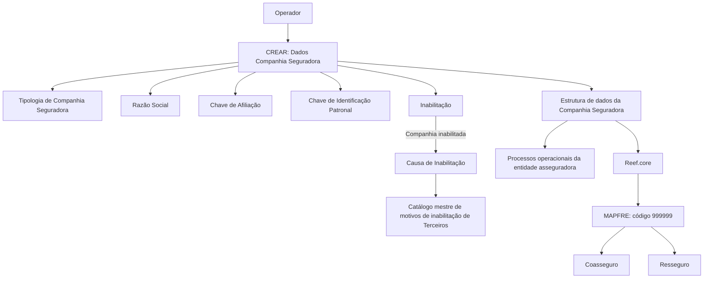

# Cadastro de Informações Específicas para Companhia Seguradora no Reef.core

## 1. Metadados do Documento
- **Arquivo de Origem:** `Não informado`
- **Tipo de Documento:** `Manual Operacional`
- **Domínio / Sistema:** `Reef.core / Companhia Seguradora / Coasseguro e Resseguro`
- **Público-Alvo:** `Operação, Negócio e Desenvolvedores`
- **Data/Versão Identificada:** `Não identificada`

---

## 2. Resumo Executivo & Contexto de Negócio

O documento descreve a criação de informações específicas para uma Companhia Seguradora em uma estrutura de dados corporativa. O objetivo declarado é identificar e classificar informações operacionais da Companhia Seguradora, permitindo que os processos da entidade asseguradora considerem ou não um Terceiro conforme a necessidade operacional.

O sistema Reef.core identifica a companhia MAPFRE pelo código `999999`. O documento estabelece que essa identificação é necessária para o funcionamento correto dos processos de Coasseguro e Resseguro.

A funcionalidade possui a ação habilitada `CREAR` e apresenta uma sequência de captura de atributos no bloco de informações “Dados Companhia Seguradora”. Os atributos abrangem tipologia geográfica e de afiliação, razão social, regras de retenção, identificação patronal e condição de inabilitação.

O documento não detalha métodos HTTP, contratos JSON, persistência de dados, permissões de acesso, telas, integrações técnicas ou regras de validação além das descritas para os campos.

---

## 3. Arquitetura, Componentes & Tecnologias Envolvidas

| Componente / Termo | Papel descrito no documento |
| :--- | :--- |
| Reef.core | Sistema que identifica a companhia MAPFRE com o código `999999`. |
| Estrutura de dados | Estrutura usada para capturar, identificar e classificar informações operacionais da Companhia Seguradora. |
| Companhia Seguradora | Entidade cadastrada e classificada para uso em processos operacionais. |
| Terceiro | Entidade cuja consideração nos processos pode depender das informações capturadas. |
| Coasseguro | Processo cujo funcionamento correto depende da identificação da MAPFRE no Reef.core. |
| Resseguro | Processo cujo funcionamento correto depende da identificação da MAPFRE no Reef.core. |
| Catálogo mestre de motivos de inabilitação de Terceiros | Catálogo que contém os códigos de causa de inabilitação. |

> **Nota de Análise:** O documento identifica o Reef.core e os processos de Coasseguro e Resseguro, mas não detalha interfaces, serviços, APIs, bancos de dados ou mecanismos técnicos de integração.

---

## 4. Regras de Negócio, Especificações Funcionais & Processos

1. A captura das informações na estrutura de dados atende à necessidade de identificar e classificar informações de âmbito operacional da Companhia Seguradora.
2. As informações capturadas permitem contemplar ou não um Terceiro nos processos da entidade asseguradora que demandem essa decisão.
3. O Reef.core deve identificar a companhia MAPFRE pelo código `999999` para o funcionamento correto dos processos de Coasseguro e Resseguro.
4. A ação habilitada explicitamente no documento é `CREAR`.
5. A sequência de captura dos atributos do bloco “Dados Companhia Seguradora” é indicada como da esquerda para a direita e de cima para baixo.
6. A Tipologia de Companhia Seguradora classifica geograficamente a companhia como local ou estrangeira e informa se existe afiliação local.
7. Quando o idioma da definição é espanhol, os valores da Tipologia de Companhia Seguradora são `AL`, `NL`, `AE` e `NE`.
8. A Razão Social deve indicar o nome pelo qual a entidade ou sociedade mercantil está registrada local e legalmente.
9. A Chave de Afiliação identifica se a companhia deve aplicar retenções.
10. Quando o idioma da definição é espanhol, os valores da Chave de Afiliação são `RE`, `NR` e `OT`.
11. A Chave de Identificação Patronal identifica, no catálogo de Companhias Seguradoras, a chave de identificação patronal conforme a legislação do país onde a companhia está localizada.
12. A Inabilitação informa ao sistema que a Companhia Seguradora está inabilitada e que essa condição deve ser contemplada nos processos operacionais da entidade.
13. Quando a Companhia Seguradora for inabilitada, a Causa de Inabilitação deve conter um código de causa definido no catálogo mestre de motivos de inabilitação de Terceiros do sistema.

---

## 5. Tabelas de Parâmetros, Ambientes e Estruturas de Dados

| Item / Parâmetro | Descrição / Função | Tipo / Valores / Formato | Ambiente / Observações |
| :--- | :--- | :--- | :--- |
| Ação habilitada | Criação de informações específicas da Companhia Seguradora. | `CREAR` | Nenhum ambiente informado. |
| Código MAPFRE | Código usado pelo Reef.core para identificar a companhia MAPFRE. | `999999` | Necessário para Coasseguro e Resseguro. |
| Tipologia de Companhia Seguradora | Classifica geograficamente a companhia e sua condição de afiliação local. | `AL`, `NL`, `AE`, `NE` | Valores apresentados para definição em espanhol. |
| `AL` | Companhia afiliada e local. | Afiliada (Local) | Tipologia de Companhia Seguradora. |
| `NL` | Companhia não afiliada e local. | No Afiliada (Local) | Tipologia de Companhia Seguradora. |
| `AE` | Companhia afiliada e estrangeira. | Afiliada (Estrangeira) | Tipologia de Companhia Seguradora. |
| `NE` | Companhia não afiliada e estrangeira. | No Afiliada (Estrangeira) | Tipologia de Companhia Seguradora. |
| Razão Social | Nome legal e localmente registrado da entidade ou sociedade mercantil. | Texto; formato não especificado | Documento não define tamanho, obrigatoriedade ou validação. |
| Chave de Afiliação | Indica se a companhia deve aplicar retenções. | `RE`, `NR`, `OT` | Valores apresentados para definição em espanhol. |
| `RE` | Indica retenção. | Retenção | Chave de Afiliação. |
| `NR` | Indica não retenção. | Não Retenção | Chave de Afiliação. |
| `OT` | Indica outros. | Outros | Chave de Afiliação. |
| Chave de Identificação Patronal | Identifica a chave patronal no catálogo de Companhias Seguradoras. | Formato não especificado | Deve observar a legislação do país da companhia. |
| Inabilitação | Informa que a Companhia Seguradora está inabilitada no sistema. | Valor/formato não especificado | Deve ser considerado nos processos operacionais. |
| Causa de Inabilitação | Código da causa aplicável quando a companhia é inabilitada. | Código do catálogo mestre | Origem: catálogo mestre de motivos de inabilitação de Terceiros. |

---

## 6. Bateria de Perguntas & Respostas para RAG (FAQ Sintético)

### P1: Qual é o objetivo da estrutura de dados de Companhia Seguradora?
**R:** A estrutura de dados permite identificar e classificar informações operacionais da Companhia Seguradora para que os processos da entidade asseguradora possam contemplar ou não um Terceiro conforme a necessidade.

### P2: Qual código o Reef.core utiliza para identificar a MAPFRE?
**R:** O Reef.core identifica a companhia MAPFRE pelo código `999999`.

### P3: Por que o código `999999` da MAPFRE é importante no Reef.core?
**R:** O documento estabelece que o código `999999` é necessário para o funcionamento correto dos processos de Coasseguro e Resseguro.

### P4: Qual ação está habilitada para os Dados Companhia Seguradora?
**R:** A ação habilitada explicitamente é `CREAR`.

### P5: O que a Tipologia de Companhia Seguradora classifica?
**R:** A Tipologia de Companhia Seguradora classifica a companhia geograficamente, indicando se é local ou estrangeira e se possui ou não afiliação local.

### P6: Quais são os valores de Tipologia de Companhia Seguradora quando a definição está em espanhol?
**R:** Os valores são `AL` para Afiliada (Local), `NL` para No Afiliada (Local), `AE` para Afiliada (Estrangeira) e `NE` para No Afiliada (Estrangeira).

### P7: Qual informação deve ser registrada no campo Razão Social?
**R:** O campo Razão Social deve conter o nome pelo qual a entidade ou sociedade mercantil está registrada local e legalmente.

### P8: Para que serve a Chave de Afiliação?
**R:** A Chave de Afiliação serve para identificar se a Companhia Seguradora deve ou não aplicar retenções.

### P9: Quais são os valores da Chave de Afiliação em espanhol?
**R:** Os valores são `RE` para Retenção, `NR` para No Retenção e `OT` para Outros.

### P10: Qual é a finalidade da Chave de Identificação Patronal?
**R:** A Chave de Identificação Patronal identifica, no catálogo de Companhias Seguradoras, a chave patronal de acordo com a legislação do país onde a companhia está localizada.

### P11: O que significa inabilitar uma Companhia Seguradora?
**R:** A Inabilitação informa ao sistema que a Companhia Seguradora está inabilitada. Os processos operacionais da entidade asseguradora devem considerar essa condição.

### P12: De onde vem o código da Causa de Inabilitação?
**R:** O código da Causa de Inabilitação é definido no catálogo mestre de motivos de inabilitação de Terceiros do sistema.

---

## 7. Glossário de Termos, Siglas & Conceitos-Chave

- **Reef.core:** Sistema citado como responsável por identificar a companhia MAPFRE com o código `999999`.
- **MAPFRE:** Companhia identificada no Reef.core pelo código `999999`.
- **Coasseguro:** Processo citado como dependente da identificação correta da MAPFRE no Reef.core.
- **Resseguro:** Processo citado como dependente da identificação correta da MAPFRE no Reef.core.
- **Terceiro:** Entidade que pode ser contemplada ou não nos processos da entidade asseguradora.
- **Razão Social:** Nome com o qual uma entidade ou sociedade mercantil está registrada local e legalmente.
- **Chave de Afiliação:** Atributo que indica a aplicação ou não de retenções pela companhia.
- **Chave de Identificação Patronal:** Identificador patronal associado à legislação do país da Companhia Seguradora.
- **Inabilitação:** Condição que informa que a Companhia Seguradora está inabilitada no sistema.
- **Causa de Inabilitação:** Código de motivo de inabilitação definido no catálogo mestre de Terceiros.
- **AL:** Afiliada (Local).
- **NL:** No Afiliada (Local).
- **AE:** Afiliada (Estrangeira).
- **NE:** No Afiliada (Estrangeira).
- **RE:** Retenção.
- **NR:** No Retenção.
- **OT:** Outros.

---

## 8. Notas Críticas, Riscos & Limitações

- O documento não identifica o arquivo de origem, data, versão, autor ou ambiente.
- Não há detalhamento dos campos obrigatórios, tipos técnicos, tamanhos, máscaras, mensagens de erro ou validações.
- Não são especificadas regras para impedir combinações inválidas entre Tipologia de Companhia Seguradora, Chave de Afiliação e Inabilitação.
- Não há detalhamento de como os processos de Coasseguro e Resseguro consomem o código `999999`.
- O documento cita a sequência visual de captura dos campos, mas a extração disponível não preserva integralmente o layout original.
- Há artefatos de navegação na extração bruta, como “Inicio Soluciones APIs Documentación Zeus”, sem relação funcional explicitada com o cadastro.
