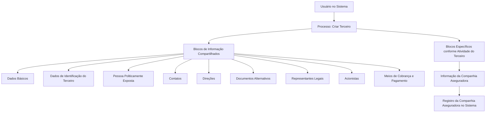

# Operação Criar Companhia Aseguradora no Sistema MAPFRE

## 1. Metadados do Documento
- **Arquivo de Origem:** `Não identificado`
- **Tipo de Documento:** `Procedimento`
- **Domínio / Sistema:** `Registro de Terceiros — Companhia Aseguradora / MAPFRE`
- **Público-Alvo:** `Usuários operacionais, analistas funcionais e equipes de suporte`
- **Data/Versão Identificada:** `Não identificada`

---

## 2. Resumo Executivo & Contexto de Negócio

O documento descreve a operação **Criar Companhia Aseguradora**, destinada ao registro, no Sistema, das informações de companhias seguradoras com as quais a entidade MAPFRE possui relação comercial em qualquer processo operacional.

O processo está inserido no cadastro de **Terceiro**. A criação da informação da Companhia Aseguradora utiliza blocos de informação compartilhados pelo processo **Criar Terceiro** e um bloco específico denominado **Informação da Companhia Aseguradora**.

A obrigatoriedade e a habilitação dos campos não são fixas para todos os registros. O documento estabelece que esse comportamento pode variar conforme o código de atividade do Terceiro, conforme o Terceiro seja Pessoa Física ou Pessoa Jurídica e conforme personalizações implementadas na aplicação.

A sequência de captura das informações também não é rigidamente determinada pelo procedimento: o usuário pode definir a ordem de preenchimento dos diferentes blocos de informação no Sistema.

---

## 3. Arquitetura, Componentes & Tecnologias Envolvidas

O conteúdo apresenta um fluxo funcional de cadastro, sem detalhar arquitetura de infraestrutura, interfaces técnicas, métodos HTTP, contratos JSON, banco de dados, microsserviços ou tecnologias de implementação.

Componentes e entidades citados:

| Componente / Entidade | Papel identificado |
| :--- | :--- |
| MAPFRE | Entidade que mantém relação comercial com as companhias seguradoras registradas. |
| Sistema | Aplicação na qual ocorre o registro de informações da Companhia Aseguradora. |
| Terceiro | Entidade de cadastro utilizada como base para a operação de criação. |
| Companhia Aseguradora | Tipo de informação específica criada dentro do cadastro de Terceiro. |
| Blocos de Informação Compartilhados | Conjunto de blocos reutilizados pelo processo Criar Terceiro. |
| Blocos de Informação Específicos | Informações aplicáveis de acordo com a atividade do Terceiro. |
| Informação da Companhia Aseguradora | Bloco específico destinado às informações da companhia seguradora. |



> **Nota de Análise:** O documento menciona elementos de interface como “Inicio”, “Soluciones”, “APIs”, “Documentación” e “Zeus”, mas não define sua função, integração ou relação técnica com o procedimento de cadastro.

---

## 4. Regras de Negócio, Especificações Funcionais & Processos

### Finalidade da operação

A operação **Criar Companhia Aseguradora** permite registrar no Sistema as informações das companhias seguradoras com as quais a entidade MAPFRE possui relação comercial em qualquer um de seus processos operacionais.

### Regras de obrigatoriedade e habilitação

1. A obrigatoriedade e/ou habilitação dos campos de cada bloco ou estrutura de informação compartilhada pode variar de acordo com o **código de atividade do Terceiro**.
2. A obrigatoriedade e/ou habilitação dos campos de cada bloco ou estrutura de informação pode variar quando o tipo de Terceiro for:
   - Pessoa Física;
   - Pessoa Jurídica.
3. Personalizações implementadas podem afetar o comportamento da aplicação em relação à obrigatoriedade do registro dos dados do Terceiro.
4. O documento não especifica quais campos são obrigatórios, quais regras de personalização existem, quais códigos de atividade estão disponíveis ou como as regras são configuradas.
5. O usuário pode variar a ordem de captura dos dados nos diferentes blocos de informação, conforme o critério seguido no Sistema.

### Processo funcional

1. Iniciar o processo **Criar Terceiro**.
2. Criar a informação da Companhia Aseguradora.
3. Registrar os dados nos blocos de informação compartilhados aplicáveis.
4. Registrar os dados nos blocos de informação específicos de acordo com a atividade do Terceiro.
5. Preencher o bloco **Informação da Companhia Aseguradora**.
6. Respeitar as condições de obrigatoriedade e habilitação determinadas pelo código de atividade, tipo de Terceiro e personalizações existentes na aplicação.

### Blocos de informação compartilhados

- Dados Básicos.
- Dados de Identificação do Terceiro.
- Pessoa Politicamente Exposta.
- Contatos.
- Direções.
- Documentos Alternativos.
- Representantes Legais.
- Acionistas.
- Meios de Cobrança e Pagamento.

### Bloco específico

- Informação da Companhia Aseguradora.

> **Nota de Análise:** O documento não detalha campos internos, formatos aceitos, validações específicas, regras de persistência, mensagens de erro, aprovações, nem critérios de conclusão do cadastro.

---

## 5. Tabelas de Parâmetros, Ambientes e Estruturas de Dados

| Item / Parâmetro | Descrição / Função | Tipo / Valores / Formato | Ambiente / Observações |
| :--- | :--- | :--- | :--- |
| Operação Criar Companhia Aseguradora | Registra no Sistema informações de companhias seguradoras relacionadas comercialmente à MAPFRE. | Operação de cadastro. | Não há ambiente identificado. |
| Terceiro | Entidade utilizada no processo de criação das informações. | Cadastro de Terceiro. | Pode ser Pessoa Física ou Pessoa Jurídica. |
| Código de atividade do Terceiro | Pode influenciar a obrigatoriedade e/ou habilitação dos campos. | Código não detalhado. | O documento não lista códigos nem seus efeitos. |
| Tipo de Terceiro | Pode alterar obrigatoriedade e/ou habilitação de campos. | Pessoa Física; Pessoa Jurídica. | Não há detalhamento de regras por tipo. |
| Personalizações | Podem afetar a obrigatoriedade de registro dos dados do Terceiro. | Não detalhado. | Não há descrição das personalizações existentes. |
| Ordem de captura | Sequência de preenchimento dos blocos de informação. | Definida conforme critério do usuário no Sistema. | Não há ordem obrigatória informada. |
| Dados Básicos | Bloco de informação compartilhado do processo Criar Terceiro. | Campos não detalhados. | Aplicabilidade e obrigatoriedade podem variar. |
| Dados de Identificação do Terceiro | Bloco de informação compartilhado do processo Criar Terceiro. | Campos não detalhados. | Aplicabilidade e obrigatoriedade podem variar. |
| Pessoa Politicamente Exposta | Bloco de informação compartilhado do processo Criar Terceiro. | Campos não detalhados. | Aplicabilidade e obrigatoriedade podem variar. |
| Contatos | Bloco de informação compartilhado do processo Criar Terceiro. | Campos não detalhados. | Aplicabilidade e obrigatoriedade podem variar. |
| Direções | Bloco de informação compartilhado do processo Criar Terceiro. | Campos não detalhados. | Aplicabilidade e obrigatoriedade podem variar. |
| Documentos Alternativos | Bloco de informação compartilhado do processo Criar Terceiro. | Campos não detalhados. | Aplicabilidade e obrigatoriedade podem variar. |
| Representantes Legais | Bloco de informação compartilhado do processo Criar Terceiro. | Campos não detalhados. | Aplicabilidade e obrigatoriedade podem variar. |
| Acionistas | Bloco de informação compartilhado do processo Criar Terceiro. | Campos não detalhados. | Aplicabilidade e obrigatoriedade podem variar. |
| Meios de Cobrança e Pagamento | Bloco de informação compartilhado do processo Criar Terceiro. | Campos não detalhados. | Aplicabilidade e obrigatoriedade podem variar. |
| Informação da Companhia Aseguradora | Bloco específico referente à atividade do Terceiro. | Campos não detalhados. | Associado à criação da Companhia Aseguradora. |

---

## 6. Bateria de Perguntas & Respostas para RAG (FAQ Sintético)

### P1: Qual é o objetivo da operação Criar Companhia Aseguradora?
**R:** A operação Criar Companhia Aseguradora permite registrar no Sistema as informações das companhias seguradoras com as quais a entidade MAPFRE mantém relação comercial em qualquer processo operacional.

### P2: Em qual processo de cadastro a criação de uma Companhia Aseguradora está inserida?
**R:** A criação da Companhia Aseguradora está inserida no processo **Criar Terceiro**. O procedimento utiliza blocos de informação compartilhados desse processo e o bloco específico Informação da Companhia Aseguradora.

### P3: Quais fatores podem alterar a obrigatoriedade dos campos no cadastro de Terceiro?
**R:** A obrigatoriedade e/ou habilitação dos campos pode variar conforme o código de atividade do Terceiro, conforme o tipo de Terceiro seja Pessoa Física ou Pessoa Jurídica e conforme personalizações implementadas na aplicação.

### P4: O documento informa quais campos são obrigatórios para registrar uma Companhia Aseguradora?
**R:** Não. O documento informa que a obrigatoriedade pode variar, mas não relaciona campos obrigatórios, campos opcionais, códigos de atividade ou regras concretas de validação.

### P5: Quais blocos de informação compartilhados podem ser usados no processo Criar Terceiro?
**R:** O documento lista Dados Básicos, Dados de Identificação do Terceiro, Pessoa Politicamente Exposta, Contatos, Direções, Documentos Alternativos, Representantes Legais, Acionistas e Meios de Cobrança e Pagamento.

### P6: Qual bloco contém as informações específicas da Companhia Aseguradora?
**R:** O bloco específico é denominado **Informação da Companhia Aseguradora**. O documento o apresenta como parte dos blocos de informação específicos de acordo com a atividade do Terceiro.

### P7: A ordem de preenchimento dos blocos de informação é fixa?
**R:** Não. O documento estabelece que a ordem de captura dos dados nos diferentes blocos de informação pode variar de acordo com o critério seguido pelo usuário no Sistema.

### P8: O cadastro de Companhia Aseguradora pode ser afetado por personalizações?
**R:** Sim. O documento afirma que personalizações implementadas podem afetar o comportamento da aplicação em relação à obrigatoriedade de registro dos dados do Terceiro.

### P9: O procedimento diferencia regras para Pessoa Física e Pessoa Jurídica?
**R:** Sim. O documento informa que a obrigatoriedade e/ou habilitação dos campos pode variar caso o tipo de Terceiro seja Pessoa Física ou Pessoa Jurídica. Contudo, não detalha as diferenças entre os dois tipos.

### P10: O documento descreve APIs, métodos HTTP ou contratos de integração para a criação de Companhia Aseguradora?
**R:** Não. Embora o texto extraído contenha a palavra “APIs” como elemento de navegação, o documento não descreve APIs, endpoints, métodos HTTP, payloads, contratos JSON ou integrações técnicas.

---

## 7. Glossário de Termos, Siglas & Conceitos-Chave

- **MAPFRE:** Entidade mencionada como possuidora de relação comercial com as companhias seguradoras registradas.
- **Terceiro:** Entidade de cadastro utilizada para criar as informações da Companhia Aseguradora.
- **Companhia Aseguradora:** Organização seguradora cujas informações são registradas no Sistema.
- **Código de atividade do Terceiro:** Código que pode influenciar a obrigatoriedade e/ou habilitação de campos no cadastro.
- **Pessoa Física:** Tipo de Terceiro citado como fator que pode alterar regras de obrigatoriedade ou habilitação.
- **Pessoa Jurídica:** Tipo de Terceiro citado como fator que pode alterar regras de obrigatoriedade ou habilitação.
- **Pessoa Politicamente Exposta:** Bloco de informação compartilhado listado no processo Criar Terceiro.
- **Blocos de Informação Compartilhados:** Estruturas de informação reutilizadas no processo Criar Terceiro.
- **Blocos de Informação Específicos:** Estruturas de informação aplicáveis conforme a atividade do Terceiro.
- **Informação da Companhia Aseguradora:** Bloco específico associado à criação de uma Companhia Aseguradora.

---

## 8. Notas Críticas, Riscos & Limitações

- O documento não identifica arquivo de origem, autoria, data, versão, ambiente ou URL de acesso ao Sistema.
- O documento não detalha os campos presentes em cada bloco de informação.
- Não há matriz de obrigatoriedade por código de atividade, tipo de Terceiro ou personalização.
- Não há especificação de regras de validação, mensagens de erro, permissões, perfis de acesso ou etapas de aprovação.
- Não são fornecidos detalhes de APIs, integrações, microsserviços, infraestrutura, banco de dados ou tecnologias utilizadas.
- A possibilidade de personalizações afetarem a obrigatoriedade do cadastro representa uma dependência relevante de configuração da aplicação.
- A flexibilidade da ordem de captura pode exigir orientação operacional adicional para assegurar consistência no preenchimento dos blocos.
- **Nota de Análise:** O documento lista a operação e os blocos envolvidos, mas não fornece detalhamento adicional sobre o conteúdo de cada bloco ou sobre o comportamento específico de cada configuração possível.

---

## 9. Conteúdo Bruto Estruturado (Referência Fiel)

```text
--- [PÁGINA 1 DE 2] ---

OPERACIÓN CREAR Compañía Aseguradora
¿En que consiste?
Esta operación permite registrar en el Sistema la Información de las Compañías Aseguradoras con
las que la entidad MAPFRE tiene una relación comercial en cualquiera de sus procesos operativos.
Premisas
La obligatoriedad y/o la habilitación de los campos en el registro de los datos de cada uno de
los bloques o estructuras de información compartidas puede variar de acuerdo con el código de
actividad del Tercero:
La obligatoriedad y/o la habilitación de los campos en el registro de los datos de cada uno de
los bloques o estructuras de información pueden variar si el tipo de Tercero es una Persona
Física o una Persona Jurídica:
Las personalizaciones que se hubieran podido implementar a su vez pueden afectar el
comportamiento de la aplicación en relación con la obligatoriedad en el registro de los Datos del
Tercero.
Ejemplo:
Ejemplo:
 / 
 RS
Inicio Soluciones APIs Documentación Zeus
ES


--- [PÁGINA 2 DE 2] ---

Por último, el orden de captura de los datos en los distintos bloques de Información puede
variar de acuerdo con el criterio seguido por el Usuario en el Sistema.
Proceso
CREAR
TERCERO
Crear Información de la
Compañía Aseguradora
Bloques de Información Compartidos (CREAR TERCERO)
 Datos Básicos ( )
 Datos Identificación del Tercero ( )
 Persona Políticamente Expuesta ( )
 Contactos ( )
 Direcciones ( )
 Documentos Alternativos ( )
 Representantes Legales ( )
 Accionistas ( )
 Medios de Cobro y Pago ( )
Bloques de Información Específicos de acuerdo con la
Actividad del Tercero.
 Información de la Compañía Aseguradora ( )
```
