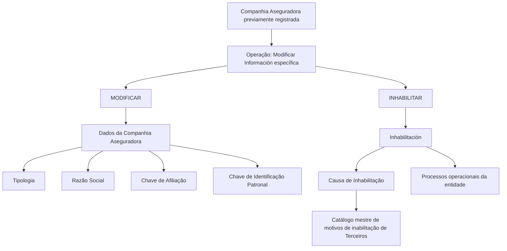

# Modificar Información Específica de la Compañía Aseguradora

## 1. Metadados do Documento
- **Arquivo de Origem:** Não identificado no conteúdo fornecido.
- **Tipo de Documento:** Especificação Funcional.
- **Domínio / Sistema:** Cadastro de Compañías Aseguradoras / Sistema.
- **Público-Alvo:** Analistas funcionais, desenvolvedores e operação.
- **Data/Versão Identificada:** Não identificada.

---

## 2. Resumo Executivo & Contexto de Negócio

O documento descreve a operação **Modificar Información específica de la Compañía Aseguradora**, destinada a complementar e alterar informações de uma companhia seguradora previamente registrada no Sistema. A operação também permite inabilitar uma companhia seguradora.

As ações explicitamente habilitadas são **MODIFICAR** e **INHABILITAR**. A manutenção das informações ocorre no bloco **Datos Compañía Aseguradora**, cuja sequência de captura dos atributos é definida da esquerda para a direita e de cima para baixo.

A classificação da companhia seguradora abrange sua condição geográfica e de afiliação local: companhia local ou estrangeira, afiliada ou não afiliada localmente. O documento também define campos relacionados à razão social, aplicação de retenções, identificação patronal e inabilitação.

Quando uma companhia seguradora é inabilitada, o Sistema deve considerar essa condição nos processos operacionais da entidade. A causa da inabilitação deve ser registrada por meio de um código pertencente ao catálogo mestre de motivos de inabilitação de terceiros do Sistema.

---

## 3. Arquitetura, Componentes & Tecnologias Envolvidas

O conteúdo não descreve arquitetura técnica, microsserviços, integrações, bancos de dados, protocolos, APIs, tecnologias ou ambientes de execução. Os componentes funcionais identificados são:

- Operação **Modificar Información específica de la Compañía Aseguradora**.
- Bloco de informações **Datos Compañía Aseguradora**.
- Catálogo de **Compañías Aseguradoras**.
- Catálogo mestre de motivos de inabilitação de terceiros do Sistema.
- Processos operacionais da entidade.



> **Nota de Análise:** O documento não detalha interfaces, métodos HTTP, contratos de integração, persistência de dados ou comportamento técnico do Sistema além das funções e atributos apresentados.

---

## 4. Regras de Negócio, Especificações Funcionais & Processos

### Operação disponível

A operação permite complementar e modificar informações de uma companhia seguradora que já tenha sido previamente registrada. A operação também permite inabilitar essa companhia seguradora.

### Ações habilitadas

1. **MODIFICAR:** ação destinada a complementar ou alterar informações da companhia seguradora registrada.
2. **INHABILITAR:** ação destinada a registrar que a companhia seguradora está inabilitada no Sistema.

### Sequência de captura de dados

No bloco **Datos Compañía Aseguradora**, a sequência de captura dos campos deve seguir a ordem:

1. Da esquerda para a direita.
2. De cima para baixo.

### Tipologia de Compañía Aseguradora

O campo **Tipología de Compañía Aseguradora** classifica a companhia seguradora geograficamente. A classificação permite determinar:

- Se a companhia é local ou estrangeira.
- Se a companhia é afiliada localmente ou não.

Quando o idioma empregado na definição for espanhol, os valores informados são:

- **AL:** Afiliada (Local).
- **NL:** No Afiliada (Local).
- **AE:** Afiliada (Extranjera).
- **NE:** No Afiliada (Extranjera).

### Razón Social

O campo **Razón Social** indica o nome sob o qual a entidade ou sociedade mercantil está registrada local e legalmente.

### Clave de Afiliación

O atributo **Clave de Afiliación** identifica se a companhia seguradora deve aplicar retenções.

Quando o idioma empregado na definição for espanhol, os valores informados são:

- **RE:** Retención.
- **NR:** No Retención.
- **OT:** Otros.

### Clave de Identificación Patronal

O campo **Clave de Identificación Patronal** identifica, no catálogo de companhias seguradoras, a chave de identificação patronal conforme a legislação do país onde a companhia está localizada.

### Inhabilitación

A propriedade **Inhabilitación** informa ao Sistema que a companhia seguradora está inabilitada. Essa condição deve ser contemplada nos processos operacionais da entidade.

### Causa de Inhabilitación

Caso a companhia seguradora seja inabilitada, o campo **Causa de Inhabilitación** deve conter o código de uma causa de inabilitação definida no catálogo mestre de motivos de inabilitação de terceiros do Sistema.

---

## 5. Tabelas de Parâmetros, Ambientes e Estruturas de Dados

| Item / Parâmetro | Descrição / Função | Tipo / Valores / Formato | Ambiente / Observações |
| :--- | :--- | :--- | :--- |
| MODIFICAR | Complementar e modificar informações de companhia seguradora previamente registrada. | Ação habilitada. | Aplicável à operação de modificação da companhia seguradora. |
| INHABILITAR | Registrar que a companhia seguradora está inabilitada no Sistema. | Ação habilitada. | A condição deve ser contemplada pelos processos operacionais da entidade. |
| Tipología de Compañía Aseguradora | Classificar geograficamente a companhia seguradora e identificar sua afiliação local. | AL, NL, AE, NE. | Valores apresentados para definição em espanhol. |
| AL | Afiliada (Local). | Código de tipologia. | Companhia local afiliada. |
| NL | No Afiliada (Local). | Código de tipologia. | Companhia local não afiliada. |
| AE | Afiliada (Extranjera). | Código de tipologia. | Companhia estrangeira afiliada. |
| NE | No Afiliada (Extranjera). | Código de tipologia. | Companhia estrangeira não afiliada. |
| Razón Social | Nome pelo qual a entidade ou sociedade mercantil está registrada local e legalmente. | Campo textual; formato não detalhado. | Não há restrições adicionais descritas. |
| Clave de Afiliación | Identificar se a companhia seguradora deve aplicar retenções. | RE, NR, OT. | Valores apresentados para definição em espanhol. |
| RE | Retención. | Código de chave de afiliação. | Indica retenção. |
| NR | No Retención. | Código de chave de afiliação. | Indica ausência de retenção. |
| OT | Otros. | Código de chave de afiliação. | O documento não detalha os casos abrangidos por “Otros”. |
| Clave de Identificación Patronal | Identificar a chave de identificação patronal no catálogo de companhias seguradoras. | Campo; formato não detalhado. | Deve respeitar a legislação do país onde a companhia está localizada. |
| Inhabilitación | Informar ao Sistema que a companhia seguradora está inabilitada. | Propriedade; valores/formato não detalhados. | Deve ser considerada nos processos operacionais da entidade. |
| Causa de Inhabilitación | Registrar o código da causa de inabilitação. | Código do catálogo mestre de motivos de inabilitação de terceiros. | Aplicável quando a companhia seguradora for inabilitada. |
| Catálogo maestro de motivos de inhabilitación de Terceros | Fonte dos códigos de causa de inabilitação. | Catálogo mestre. | O documento não apresenta os códigos nem a estrutura desse catálogo. |

---

## 6. Bateria de Perguntas & Respostas para RAG (FAQ Sintético)

### P1: Qual é o objetivo da operação “Modificar Información específica de la Compañía Aseguradora”?
**R:** A operação permite complementar e modificar as informações de uma companhia seguradora previamente registrada no Sistema, além de permitir a inabilitação dessa companhia seguradora.

### P2: Quais ações estão habilitadas para a companhia seguradora?
**R:** O documento habilita as ações **MODIFICAR** e **INHABILITAR**. MODIFICAR permite complementar ou alterar dados previamente registrados; INHABILITAR registra que a companhia seguradora está inabilitada no Sistema.

### P3: Em qual sequência os dados da companhia seguradora devem ser capturados?
**R:** No bloco **Datos Compañía Aseguradora**, os atributos devem ser capturados da esquerda para a direita e de cima para baixo.

### P4: O que o campo “Tipología de Compañía Aseguradora” classifica?
**R:** O campo classifica geograficamente a companhia seguradora, permitindo identificar se ela é local ou estrangeira e se é ou não afiliada localmente.

### P5: Quais são os valores de tipologia para companhias seguradoras quando a definição está em espanhol?
**R:** Os valores são **AL** para Afiliada (Local), **NL** para No Afiliada (Local), **AE** para Afiliada (Extranjera) e **NE** para No Afiliada (Extranjera).

### P6: Qual é a finalidade do campo “Razón Social”?
**R:** O campo indica o nome pelo qual a entidade ou sociedade mercantil está registrada local e legalmente.

### P7: Para que serve a “Clave de Afiliación”?
**R:** A Clave de Afiliación serve para identificar se a companhia seguradora deve ou não aplicar retenções.

### P8: Quais valores são definidos para a “Clave de Afiliación” em espanhol?
**R:** Os valores definidos são **RE** para Retención, **NR** para No Retención e **OT** para Otros. O documento não detalha os critérios de uso do valor OT.

### P9: Qual é a função da “Clave de Identificación Patronal”?
**R:** A Clave de Identificación Patronal permite identificar, no catálogo de companhias seguradoras, a chave de identificação patronal conforme a legislação do país em que a companhia está localizada.

### P10: O que ocorre quando uma companhia seguradora é inabilitada?
**R:** A propriedade Inhabilitación informa ao Sistema que a companhia seguradora está inabilitada. Essa condição deve ser considerada nos processos operacionais da entidade.

### P11: Como deve ser preenchida a causa de inabilitação?
**R:** Quando a companhia seguradora for inabilitada, a Causa de Inhabilitación deve conter um código definido no catálogo mestre de motivos de inabilitação de terceiros do Sistema.

### P12: O documento especifica os métodos de API ou contratos técnicos da operação?
**R:** Não. O documento descreve ações, campos e regras funcionais, mas não apresenta métodos HTTP, endpoints, contratos JSON, tecnologias, integrações ou detalhes de implementação técnica.

---

## 7. Glossário de Termos, Siglas & Conceitos-Chave

- **AL:** Afiliada (Local).
- **NL:** No Afiliada (Local).
- **AE:** Afiliada (Extranjera).
- **NE:** No Afiliada (Extranjera).
- **RE:** Retención.
- **NR:** No Retención.
- **OT:** Otros.
- **Compañía Aseguradora:** Entidade seguradora cujas informações podem ser complementadas, modificadas ou inabilitadas no Sistema.
- **Razón Social:** Nome sob o qual uma entidade ou sociedade mercantil está registrada local e legalmente.
- **Clave de Afiliación:** Atributo usado para identificar se a companhia seguradora deve aplicar retenções.
- **Clave de Identificación Patronal:** Chave de identificação patronal associada à companhia seguradora conforme a legislação de seu país.
- **Inhabilitación:** Propriedade que indica que a companhia seguradora está inabilitada no Sistema.
- **Causa de Inhabilitación:** Código que representa o motivo de inabilitação da companhia seguradora.
- **Catálogo maestro de motivos de inhabilitación de Terceros:** Catálogo mestre do Sistema que define os códigos de causas de inabilitação de terceiros.

---

## 8. Notas Críticas, Riscos & Limitações

- O documento não identifica o arquivo de origem, versão, data, autor ou responsável pelo conteúdo.
- O documento não especifica valores permitidos, obrigatoriedade, tamanho, formato ou validações técnicas para **Razón Social**, **Clave de Identificación Patronal**, **Inhabilitación** e **Causa de Inhabilitación**.
- O valor **OT — Otros** da Clave de Afiliación é listado, mas não possui explicação adicional.
- O documento cita o catálogo mestre de motivos de inabilitação de terceiros, mas não apresenta sua estrutura, códigos ou regras de seleção.
- O documento determina que a inabilitação deve ser considerada nos processos operacionais, mas não detalha quais processos são impactados nem o comportamento esperado.
- Não há detalhamento de arquitetura, integrações, permissões, auditoria, APIs, persistência ou tratamento de erros.

---

## 9. Conteúdo Bruto Estruturado (Referência Fiel)

```text
--- [PÁGINA 1 DE 2] ---

MODIFICAR Información específica de la
Compañía Aseguradora
Objetivo
Esta Operación permite Complementar y Modificar la información de la Compañía Aseguradora
registrada previamente además de poder Inhabilitarla.
Acciones habilitadas
 MODIFICAR ( )
 INHABILITAR ( )
Datos Compañía Aseguradora
De Izquierda a Derecha y de Arriba hacia Abajo, los siguientes atributos marcan la secuencia de
captura de los Campos en este Bloque de Información.
Tipología de Compañía Aseguradora (  )
Este campo clasifica a la Compañía Aseguradora identificándola geográficamente para conocer si es
una Compañía Local o Extranjera y si está o no afiliada localmente.
 /
 RS
Inicio Soluciones APIs Documentación Zeus
ES


--- [PÁGINA 2 DE 2] ---

Si el idioma empleado en la definición es el español, sus valores serían...
(AL) Afiliada (Local)
(NL) No Afiliada (Local)
(AE) Afiliada (Extranjera)
(NE) No Afiliada (Extranjera)
Razón Social ( )
Este campo indicará el nombre con que la entidad o sociedad mercantil está registrada local y
legalmente.
Clave de Afiliación (  )
Este atributo sirve para identificar si la compañía tiene o no que aplicar retenciones
Si el idioma empleado en la definición es el español, sus valores serían...
(RE) Retención
(NR) No Retención
(OT) Otros
Clave de Identificación Patronal ( )
Este campo sirve para identificar en el catálogo de Compañías Aseguradoras la clave de
identificación patronal de acuerdo con la legislación del país en el que se ubica la compañía.
Inhabilitación ( )
Esta propiedad le indica al Sistema que la compañía aseguradora está inhabilitada en el Sistema por
lo que este hecho debería ser contemplado en los procesos operativos de la entidad.
Causa de Inhabilitación (   )
En el supuesto que se inhabilitara a la Compañía Aseguradora, este dato contendrá el código de una
causa de inhabilitación definida en el catálogo maestro de motivos de inhabilitación de Terceros del
Sistema.
```
