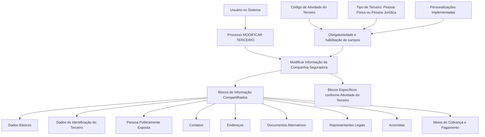

# Operação Modificar Companhia Seguradora — Processo e Blocos de Informação

## 1. Metadados do Documento
- **Arquivo de Origem:** Não informado
- **Tipo de Documento:** Procedimento
- **Domínio / Sistema:** Gestão de Terceiros / Companhia Seguradora
- **Público-Alvo:** Usuários do sistema, Operação e Negócio
- **Data/Versão Identificada:** Não identificada

---

## 2. Resumo Executivo & Contexto de Negócio

O documento descreve a operação **“Modificar Companhia Seguradora”**, destinada a complementar, modificar e/ou inabilitar informações de uma Companhia Seguradora. A alteração pode ocorrer em qualquer bloco ou estrutura de dados que contenha e agrupe os dados da Companhia Seguradora.

A operação está inserida no processo **MODIFICAR TERCEIRO**. Nesse processo, a Companhia Seguradora é tratada como um Terceiro cujas informações estão organizadas em blocos compartilhados e em blocos específicos associados à atividade do Terceiro.

A obrigatoriedade e a habilitação dos campos podem variar conforme o código de atividade do Terceiro. O comportamento dos campos também pode variar conforme o Terceiro seja uma **Pessoa Física** ou uma **Pessoa Jurídica**.

O documento também estabelece que personalizações implementadas no sistema podem afetar a obrigatoriedade de preenchimento dos dados do Terceiro. Além disso, a ordem de captura dos dados nos blocos de informação pode variar conforme o critério seguido pelo usuário no sistema.

---

## 3. Arquitetura, Componentes & Tecnologias Envolvidas

O documento não descreve arquitetura técnica, microsserviços, bancos de dados, integrações, protocolos, tecnologias, URLs operacionais ou ambientes. O conteúdo apresentado concentra-se no fluxo funcional de alteração de informações de uma Companhia Seguradora no processo de modificação de Terceiros.

Os componentes funcionais identificados são:

- Processo **MODIFICAR TERCEIRO**.
- Operação **Modificar Informação da Companhia Seguradora**.
- Blocos de Informação Compartilhados.
- Blocos de Informação Específicos conforme a atividade do Terceiro.
- Critérios de obrigatoriedade e habilitação de campos.
- Personalizações que podem alterar o comportamento de preenchimento.



> **Nota de Análise:** O documento não detalha telas, campos individuais, contratos de integração, métodos HTTP, persistência de dados ou regras específicas de validação por bloco.

---

## 4. Regras de Negócio, Especificações Funcionais & Processos

### Objetivo da operação

A operação permite:

1. Complementar informações da Companhia Seguradora.
2. Modificar informações existentes da Companhia Seguradora.
3. Inabilitar informações da Companhia Seguradora.
4. Executar as alterações em qualquer bloco ou estrutura de dados que contenha e agrupe informações da Companhia Seguradora.

### Regras de obrigatoriedade e habilitação

1. A obrigatoriedade e/ou habilitação dos campos em cada bloco ou estrutura de informação compartilhada pode variar conforme o **código de atividade do Terceiro**.
2. A obrigatoriedade e/ou habilitação dos campos pode variar quando o tipo de Terceiro é:
   - Pessoa Física.
   - Pessoa Jurídica.
3. Personalizações implementadas podem afetar o comportamento da aplicação em relação à obrigatoriedade de registro dos Dados do Terceiro.
4. A ordem de captura dos dados nos diferentes blocos de informação pode variar conforme o critério adotado pelo usuário no sistema.

### Fluxo funcional identificado

1. O usuário acessa o processo **MODIFICAR TERCEIRO**.
2. O usuário seleciona a ação de modificar informações da Companhia Seguradora.
3. O usuário pode atuar nos blocos de informação compartilhados.
4. O usuário pode atuar em blocos de informação específicos, definidos conforme a atividade do Terceiro.
5. O preenchimento, a habilitação e a obrigatoriedade dos campos dependem do código de atividade, do tipo de Terceiro e de possíveis personalizações da aplicação.
6. A sequência de captura e alteração das informações não é fixa; ela pode variar conforme o critério do usuário.

---

## 5. Tabelas de Parâmetros, Ambientes e Estruturas de Dados

| Item / Parâmetro | Descrição / Função | Tipo / Valores / Formato | Ambiente / Observações |
| :--- | :--- | :--- | :--- |
| Operação | Complementar, modificar e/ou inabilitar informações da Companhia Seguradora | Operação funcional | Pode ser aplicada em blocos ou estruturas que contenham dados da Companhia Seguradora |
| Processo | Processo no qual ocorre a alteração da Companhia Seguradora | `MODIFICAR TERCEIRO` | Identificado explicitamente no documento |
| Código de atividade do Terceiro | Critério que pode alterar a obrigatoriedade e/ou habilitação de campos | Código de atividade | O documento não especifica códigos ou valores permitidos |
| Tipo de Terceiro | Critério que pode alterar a obrigatoriedade e/ou habilitação de campos | Pessoa Física ou Pessoa Jurídica | Não são descritas regras específicas para cada tipo |
| Personalizações | Implementações que podem afetar o comportamento da aplicação | Personalizações da aplicação | Podem afetar a obrigatoriedade no registro dos Dados do Terceiro |
| Ordem de captura | Sequência de preenchimento dos blocos de informação | Variável | Pode variar conforme o critério seguido pelo usuário |
| Dados Básicos | Bloco de Informação Compartilhado | Bloco de dados | Disponível no processo MODIFICAR TERCEIRO |
| Dados de Identificação do Terceiro | Bloco de Informação Compartilhado | Bloco de dados | Disponível no processo MODIFICAR TERCEIRO |
| Pessoa Politicamente Exposta | Bloco de Informação Compartilhado | Bloco de dados | O documento não detalha campos ou critérios |
| Contatos | Bloco de Informação Compartilhado | Bloco de dados | O documento não detalha campos ou critérios |
| Endereços | Bloco de Informação Compartilhado | Bloco de dados | O documento não detalha campos ou critérios |
| Documentos Alternativos | Bloco de Informação Compartilhado | Bloco de dados | O documento não detalha campos ou critérios |
| Representantes Legais | Bloco de Informação Compartilhado | Bloco de dados | O documento não detalha campos ou critérios |
| Acionistas | Bloco de Informação Compartilhado | Bloco de dados | O documento não detalha campos ou critérios |
| Meios de Cobrança e Pagamento | Bloco de Informação Compartilhado | Bloco de dados | O documento não detalha campos ou critérios |
| Blocos específicos por atividade | Estruturas de informação associadas à atividade do Terceiro | Blocos de dados específicos | Não detalhados no documento |

---

## 6. Bateria de Perguntas & Respostas para RAG (FAQ Sintético)

### P1: Em que consiste a operação Modificar Companhia Seguradora?
**R:** A operação consiste em complementar, modificar e/ou inabilitar informações da Companhia Seguradora em qualquer bloco ou estrutura de dados que contenha e agrupe essas informações.

### P2: Em qual processo a operação de modificação da Companhia Seguradora está localizada?
**R:** A operação está localizada no processo **MODIFICAR TERCEIRO**, no qual é possível modificar as informações da Companhia Seguradora.

### P3: Quais fatores podem alterar a obrigatoriedade dos campos da Companhia Seguradora?
**R:** A obrigatoriedade dos campos pode variar conforme o código de atividade do Terceiro, o tipo de Terceiro — Pessoa Física ou Pessoa Jurídica — e as personalizações implementadas na aplicação.

### P4: O tipo de Terceiro interfere nos campos disponíveis ou obrigatórios?
**R:** Sim. O documento informa que a obrigatoriedade e/ou habilitação dos campos pode variar se o tipo de Terceiro for Pessoa Física ou Pessoa Jurídica. Não são detalhadas as diferenças específicas por tipo.

### P5: Quais blocos de informação compartilhados podem ser alterados no processo MODIFICAR TERCEIRO?
**R:** Os blocos compartilhados listados são: Dados Básicos, Dados de Identificação do Terceiro, Pessoa Politicamente Exposta, Contatos, Endereços, Documentos Alternativos, Representantes Legais, Acionistas e Meios de Cobrança e Pagamento.

### P6: É possível modificar informações específicas da atividade do Terceiro?
**R:** Sim. O documento prevê blocos de informação específicos de acordo com a atividade do Terceiro, além dos blocos de informação compartilhados.

### P7: A ordem de preenchimento dos blocos de informação é obrigatória?
**R:** Não. O documento informa que a ordem de captura dos dados nos diferentes blocos de informação pode variar conforme o critério seguido pelo usuário no sistema.

### P8: O que as personalizações da aplicação podem afetar?
**R:** As personalizações implementadas podem afetar o comportamento da aplicação relacionado à obrigatoriedade do registro dos Dados do Terceiro.

### P9: O documento define quais campos existem em Dados Básicos ou Contatos?
**R:** Não. O documento apenas lista Dados Básicos e Contatos como blocos de informação compartilhados, sem detalhar os campos internos, formatos ou validações desses blocos.

### P10: O documento descreve integrações técnicas ou APIs para modificar a Companhia Seguradora?
**R:** Não. O conteúdo não apresenta métodos HTTP, contratos JSON, endpoints, integrações, URLs técnicas ou detalhes de APIs relacionados à modificação da Companhia Seguradora.

---

## 7. Glossário de Termos, Siglas & Conceitos-Chave

- **Companhia Seguradora:** Entidade cujas informações podem ser complementadas, modificadas ou inabilitadas no processo descrito.
- **Terceiro:** Entidade associada ao processo **MODIFICAR TERCEIRO**; a Companhia Seguradora é tratada no contexto de suas informações como Terceiro.
- **MODIFICAR TERCEIRO:** Processo no qual são modificadas informações da Companhia Seguradora e seus blocos de informação.
- **Blocos de Informação Compartilhados:** Estruturas de dados listadas como Dados Básicos, Dados de Identificação do Terceiro, Pessoa Politicamente Exposta, Contatos, Endereços, Documentos Alternativos, Representantes Legais, Acionistas e Meios de Cobrança e Pagamento.
- **Blocos de Informação Específicos:** Estruturas de informação definidas de acordo com a atividade do Terceiro.
- **Pessoa Física:** Tipo de Terceiro que pode influenciar a obrigatoriedade e/ou habilitação dos campos.
- **Pessoa Jurídica:** Tipo de Terceiro que pode influenciar a obrigatoriedade e/ou habilitação dos campos.
- **Pessoa Politicamente Exposta:** Bloco de Informação Compartilhado listado no processo; o documento não apresenta definição adicional.
- **Personalizações:** Implementações que podem afetar a obrigatoriedade de registro dos Dados do Terceiro.

---

## 8. Notas Críticas, Riscos & Limitações

- O documento não identifica arquivo de origem, data, versão, autor ou responsável.
- O documento não detalha os campos internos de cada bloco de informação.
- O documento não fornece valores, códigos ou regras específicas para o código de atividade do Terceiro.
- O documento não define quais campos são obrigatórios ou habilitados para Pessoa Física e Pessoa Jurídica.
- O documento informa que personalizações podem alterar a obrigatoriedade, mas não descreve quais personalizações existem nem seus efeitos.
- O documento não detalha critérios de inabilitação, validações, permissões, auditoria, tratamento de erro ou confirmação de alterações.
- O documento não apresenta informações de arquitetura técnica, APIs, integrações, ambientes, servidores, logs ou contratos de dados.
- **Nota de Análise:** A flexibilidade na ordem de captura e a influência de personalizações podem gerar comportamentos diferentes entre contextos de uso, sem que o documento forneça uma matriz de regras para padronização.

---

## 9. Conteúdo Bruto Estruturado (Referência Fiel)

```text
--- [PÁGINA 1 DE 2] ---

OPERACIÓN MODIFICAR Compañía
Aseguradora
¿En que consiste?
Esta operación consiste en Complementar, Modificar y/o Inhabilitar la información de la Compañía
Aseguradora en cualquiera de los bloques o estructuras de datos que la contienen y agrupan.
Premisas
La obligatoriedad y/o la habilitación de los campos en el registro de los datos de cada uno de
los bloques o estructuras de información compartidas puede variar de acuerdo con el código de
actividad del Tercero:
La obligatoriedad y/o la habilitación de los campos en el registro de los datos de cada uno de
los bloques o estructuras de información pueden variar si el tipo de Tercero es una Persona
Física o una Persona Jurídica:
Las personalizaciones que se hubieran podido implementar a su vez pueden afectar el
comportamiento de la aplicación en relación con la obligatoriedad en el registro de los Datos del
Tercero.
Ejemplo:
Ejemplo:
 / 
 RS
Inicio Soluciones APIs Documentación Zeus
ES


--- [PÁGINA 2 DE 2] ---

Por último, el orden de captura de los datos en los distintos bloques de Información puede
variar de acuerdo con el criterio seguido por el Usuario en el Sistema.
Proceso
MODIFICAR
TERCERO
Modificar Información de la
Compañía Aseguradora
Bloques de Información Compartidos (MODIFICAR TERCERO)
 Datos Básicos ( )
 Datos Identificación Tercero ( )
 Persona Políticamente Expuesta(   )
 Contactos (   )
 Direcciones (   )
 Documentos Alternativos (   )
 Representantes Legales (   )
 Accionistas (   )
 Medios de Cobro y Pago (   )
Bloques de Información Específicos de acuerdo con la
Actividad del Tercero.
 Modificar Información de la Compañía Aseguradora(  )
```
