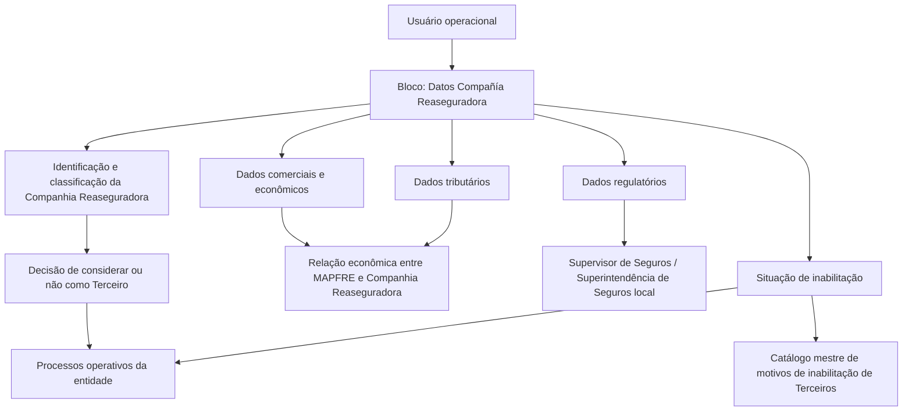

# Cadastro de Informações Específicas da Companhia Reaseguradora

## 1. Metadados do Documento
- **Arquivo de Origem:** `Não identificado — conteúdo bruto fornecido na solicitação`
- **Tipo de Documento:** `Especificação Técnica`
- **Domínio / Sistema:** `Cadastro operacional de Companhia Reaseguradora / MAPFRE`
- **Público-Alvo:** `Analistas funcionais, desenvolvedores, operação e negócio`
- **Data/Versão Identificada:** `Não identificada`

---

## 2. Resumo Executivo & Contexto de Negócio

O documento especifica a criação de informações para uma Companhia Reaseguradora em uma estrutura de dados corporativa. O objetivo declarado é identificar e classificar informações de âmbito operacional da Companhia Reaseguradora para que a entidade Aseguradora possa decidir se essa companhia deve ou não ser considerada como Terceiro nos processos que demandem essa classificação.

A ação explicitamente habilitada é **CREAR**, indicando que o conteúdo descreve a sequência de captura de atributos no bloco de informação denominado **Datos Compañía Reaseguradora**. A sequência de preenchimento é definida como da esquerda para a direita e de cima para baixo.

Os atributos cobrem classificação geográfica e de afiliação, identificação comercial, rating, corretagem, origem, vigência da relação comercial, tributação, condições econômicas, capital, identificação regulatória e situação de habilitação no sistema. Esses dados sustentam processos operacionais e econômicos envolvendo a entidade MAPFRE e a Companhia Reaseguradora.

O documento não apresenta contratos de APIs, métodos HTTP, persistência, tipos técnicos de dados, validações obrigatórias, regras de cálculo, perfis de acesso, ambientes ou integrações técnicas. A especificação disponível concentra-se na finalidade funcional e na descrição semântica dos campos.

---

## 3. Arquitetura, Componentes & Tecnologias Envolvidas

Os elementos funcionais explicitamente citados são:

- **Companhia Reaseguradora:** entidade cujas informações operacionais, comerciais, tributárias e regulatórias são cadastradas.
- **Entidade Aseguradora:** entidade que utiliza a classificação da Companhia Reaseguradora como Terceiro nos processos aplicáveis.
- **MAPFRE:** entidade mencionada como parte da relação comercial e das operações econômicas com a Companhia Reaseguradora.
- **Dados Compañía Reaseguradora:** bloco de informação que concentra os atributos de cadastro.
- **Sistema:** ambiente lógico que deve considerar a condição de inabilitação da Companhia Reaseguradora nos processos operacionais.
- **Catálogo mestre de motivos de inabilitação de Terceiros do Sistema:** catálogo de origem para a causa de inabilitação.



**Nota de Análise:** o documento não identifica tecnologias, bancos de dados, microsserviços, URLs, APIs, protocolos, ambientes, servidores ou mecanismos de integração.

---

## 4. Regras de Negócio, Especificações Funcionais & Processos

### 4.1 Finalidade funcional

1. A estrutura de dados deve capturar informações operacionais da Companhia Reaseguradora.
2. As informações capturadas devem permitir identificar e classificar a Companhia Reaseguradora.
3. A classificação deve permitir que a entidade Aseguradora considere ou não a Companhia Reaseguradora como Terceiro nos processos que exijam essa condição.
4. A ação habilitada apresentada no documento é **CREAR**.

### 4.2 Sequência de captura

A sequência de captura dos atributos no bloco **Datos Compañía Reaseguradora** deve seguir a orientação apresentada no documento:

1. Da esquerda para a direita.
2. De cima para baixo.

### 4.3 Classificação geográfica e de afiliação

O atributo **Tipología de Compañía Reaseguradora** classifica a Companhia Reaseguradora geograficamente. A classificação permite determinar:

- Se a companhia é local ou estrangeira.
- Se a companhia está ou não afiliada localmente.

Quando o idioma de definição for espanhol, os valores apresentados são:

- `(AL) Afiliada (Local)`
- `(NL) No Afiliada (Local)`
- `(AE) Afiliada (Extranjera)`
- `(NE) No Afiliada (Extranjera)`

### 4.4 Identificação, relacionamento e informações econômicas

- **Nombre Abreviado de la Compañía Reaseguradora:** armazena o nome curto ou abreviado que identifica a Companhia Reaseguradora.
- **Código de Rating:** determina o código de rating atribuído à Companhia Reaseguradora.
- **Código de Broker de Seguros:** quando aplicável, identifica o principal Broker de Seguros com o qual a Companhia Reaseguradora opera habitualmente.
- **País de Origen:** identifica o país no qual a entidade reaseguradora foi constituída.
- **Fecha de Efecto:** determina a data de efeito que estabelece a relação entre a companhia MAPFRE e a Companhia Reaseguradora.
- **Fecha de Vencimiento:** determina a data de vencimento que distingue o fim da relação comercial entre a companhia MAPFRE e a Companhia Reaseguradora.
- **Plan de Pago:** identifica a temporalidade a considerar na relação econômica com a Companhia Reaseguradora.
- **Capital suscrito:** contém o capital subscrito pela Companhia Reaseguradora.

### 4.5 Tributação

- **Impuesto sobre Intereses de los Depósitos de Reaseguro:** contém o código de imposto aplicável aos juros gerados pelos depósitos de resseguro.
- **Código de Impuesto sobre la Renta:** contém o código de imposto que a entidade MAPFRE aplicará como retenção nas operações econômicas com a Companhia Reaseguradora.

### 4.6 Identificação regulatória

- **Clave en la Superintendencia:** identifica a chave atribuída à Companhia Reaseguradora perante o Supervisor de Seguros ou a Superintendência de Seguros local.

### 4.7 Inabilitação

1. A propriedade **Inhabilitación** indica ao Sistema que a Companhia Reaseguradora está inabilitada.
2. A inabilitação deve ser considerada nos processos operativos da entidade.
3. Caso a Companhia Reaseguradora seja inabilitada, o campo **Causa de Inhabilitación** deve conter o código de uma das causas definidas no catálogo mestre de motivos de inabilitação de Terceiros do Sistema.

**Nota de Análise:** o documento não informa quais processos operativos devem bloquear, alertar ou alterar o comportamento diante de uma Companhia Reaseguradora inabilitada.

---

## 5. Tabelas de Parâmetros, Ambientes e Estruturas de Dados

| Item / Parâmetro | Descrição / Função | Tipo / Valores / Formato | Ambiente / Observações |
| :--- | :--- | :--- | :--- |
| Ação habilitada | Permite a criação de informações específicas para a Companhia Reaseguradora. | `CREAR` | O documento não descreve ações de alteração, consulta ou exclusão. |
| Dados Compañía Reaseguradora | Bloco de informação que reúne os atributos de cadastro. | Estrutura de dados; tipo técnico não informado. | A captura segue a ordem da esquerda para a direita e de cima para baixo. |
| Tipología de Compañía Reaseguradora | Classifica geograficamente a companhia e identifica se é local ou estrangeira, bem como se possui afiliação local. | Códigos em espanhol: `AL`, `NL`, `AE`, `NE`. | `AL`: Afiliada (Local); `NL`: No Afiliada (Local); `AE`: Afiliada (Extranjera); `NE`: No Afiliada (Extranjera). |
| Nombre Abreviado de la Compañía Reaseguradora | Armazena o nome curto ou abreviado identificador da Companhia Reaseguradora. | Formato não informado. | Nenhuma regra de tamanho ou unicidade é apresentada. |
| Código de Rating | Determina o código de rating atribuído à Companhia Reaseguradora. | Código; domínio de valores não informado. | A escala, a origem e a entidade responsável pelo rating não são detalhadas. |
| Código de Broker de Seguros | Quando aplicável, identifica o principal Broker de Seguros com o qual a Companhia Reaseguradora opera habitualmente. | Código; domínio de valores não informado. | A expressão “si es procedente” indica aplicabilidade condicional, sem critério adicional especificado. |
| País de Origen | Identifica o país em que a entidade reaseguradora foi constituída. | País; formato/catálogo não informado. | Não é informado se utiliza código de país, nome ou catálogo externo. |
| Fecha de Efecto | Define a data de efeito que estabelece a relação entre MAPFRE e a Companhia Reaseguradora. | Data; formato não informado. | Associada ao início da relação entre as entidades. |
| Fecha de Vencimiento | Define a data de vencimento que distingue o fim da relação comercial entre MAPFRE e a Companhia Reaseguradora. | Data; formato não informado. | Associada ao término da relação comercial. |
| Impuesto sobre Intereses de los Depósitos de Reaseguro | Contém o código de imposto aplicável aos juros gerados pelos depósitos de resseguro. | Código de imposto; domínio de valores não informado. | Aplicável aos juros de depósitos de resseguro. |
| Código de Impuesto sobre la Renta | Contém o código de imposto que MAPFRE aplicará como retenção nas operações econômicas com a Companhia Reaseguradora. | Código de imposto; domínio de valores não informado. | Aplicável às operações econômicas entre MAPFRE e a Companhia Reaseguradora. |
| Plan de Pago | Identifica a temporalidade a considerar na relação econômica com a Companhia Reaseguradora. | Plano/temporalidade; formato não informado. | O documento não lista periodicidades possíveis. |
| Capital suscrito | Contém o capital subscrito pela Companhia Reaseguradora. | Valor de capital; moeda, precisão e formato não informados. | Nenhuma regra de cálculo é especificada. |
| Clave en la Superintendencia | Identifica a chave da Companhia Reaseguradora para o Supervisor de Seguros ou a Superintendência de Seguros local. | Chave/código; formato não informado. | Relacionada ao órgão supervisor local. |
| Inhabilitación | Informa ao Sistema que a Companhia Reaseguradora está inabilitada. | Propriedade; valores técnicos não informados. | A condição deve ser considerada nos processos operativos da entidade. |
| Causa de Inhabilitación | Registra o código de uma causa de inabilitação quando a Companhia Reaseguradora for inabilitada. | Código proveniente de catálogo mestre. | Deve referenciar o catálogo mestre de motivos de inabilitação de Terceiros do Sistema. |

---

## 6. Bateria de Perguntas & Respostas para RAG (FAQ Sintético)

### P1: Qual é o objetivo do cadastro de informações da Companhia Reaseguradora?
**R:** O objetivo é identificar e classificar informações de âmbito operacional da Companhia Reaseguradora para permitir que a entidade Aseguradora considere ou não essa companhia como Terceiro nos processos que exijam essa classificação.

### P2: Qual ação está habilitada no documento para as informações da Companhia Reaseguradora?
**R:** A ação explicitamente habilitada é `CREAR`. O documento não descreve ações de alteração, consulta, exclusão ou aprovação.

### P3: Em que ordem os atributos do bloco Datos Compañía Reaseguradora devem ser capturados?
**R:** Os atributos devem ser capturados da esquerda para a direita e de cima para baixo, conforme a sequência indicada para o bloco Datos Compañía Reaseguradora.

### P4: Como a Tipología de Compañía Reaseguradora classifica uma companhia?
**R:** A Tipología de Compañía Reaseguradora classifica a companhia geograficamente para identificar se ela é local ou estrangeira e se está ou não afiliada localmente. Em espanhol, os valores apresentados são `AL` para Afiliada Local, `NL` para No Afiliada Local, `AE` para Afiliada Extranjera e `NE` para No Afiliada Extranjera.

### P5: Qual dado identifica o principal corretor relacionado à Companhia Reaseguradora?
**R:** O campo Código de Broker de Seguros identifica, quando aplicável, o principal Broker de Seguros com o qual a Companhia Reaseguradora opera habitualmente.

### P6: Quais campos definem o período de relacionamento entre MAPFRE e a Companhia Reaseguradora?
**R:** A Fecha de Efecto estabelece a relação entre a companhia MAPFRE e a Companhia Reaseguradora. A Fecha de Vencimiento distingue o fim da relação comercial entre as duas entidades.

### P7: Como os impostos sobre operações de resseguro são representados no cadastro?
**R:** O Impuesto sobre Intereses de los Depósitos de Reaseguro contém o código de imposto aplicável aos juros gerados pelos depósitos de resseguro. O Código de Impuesto sobre la Renta contém o código de imposto que MAPFRE aplicará como retenção nas operações econômicas com a Companhia Reaseguradora.

### P8: O que representa o Plan de Pago da Companhia Reaseguradora?
**R:** O Plan de Pago identifica a temporalidade que deve ser considerada na relação econômica com a Companhia Reaseguradora. O documento não informa quais temporalidades ou periodicidades podem ser selecionadas.

### P9: Para que serve a Clave en la Superintendencia?
**R:** A Clave en la Superintendencia identifica a chave atribuída à Companhia Reaseguradora perante o Supervisor de Seguros ou a Superintendência de Seguros local.

### P10: O que acontece quando uma Companhia Reaseguradora está inabilitada?
**R:** A propriedade Inhabilitación informa ao Sistema que a Companhia Reaseguradora está inabilitada. Essa condição deve ser considerada nos processos operativos da entidade, embora o documento não detalhe quais ações operacionais específicas devem ocorrer.

### P11: Qual é a origem permitida para a Causa de Inhabilitación?
**R:** Quando a Companhia Reaseguradora for inabilitada, a Causa de Inhabilitación deve conter o código de uma das causas definidas no catálogo mestre de motivos de inabilitação de Terceiros do Sistema.

### P12: O documento define tipos técnicos, formatos de data ou catálogos de valores para todos os campos?
**R:** Não. O documento descreve a finalidade funcional dos campos, mas não especifica tipos técnicos, formatos de data, tamanhos, obrigatoriedade, catálogos completos, regras de validação ou contratos de integração.

---

## 7. Glossário de Termos, Siglas & Conceitos-Chave

- **MAPFRE:** entidade mencionada como participante da relação comercial e das operações econômicas com a Companhia Reaseguradora.
- **Companhia Reaseguradora:** entidade cujo cadastro operacional, comercial, tributário, regulatório e de habilitação é descrito no documento.
- **Entidade Aseguradora:** entidade que pode considerar ou não a Companhia Reaseguradora como Terceiro em seus processos.
- **Terceiro:** classificação que pode ser aplicada à Companhia Reaseguradora nos processos da entidade Aseguradora que assim o demandem.
- **Broker de Seguros:** corretor de seguros principal com o qual a Companhia Reaseguradora opera habitualmente, quando aplicável.
- **Rating:** código de classificação de rating atribuído à Companhia Reaseguradora.
- **Depósitos de Reaseguro:** depósitos cujos juros podem receber aplicação de imposto.
- **Impuesto sobre la Renta:** imposto aplicado como retenção por MAPFRE em operações econômicas com a Companhia Reaseguradora.
- **Plan de Pago:** temporalidade aplicável à relação econômica com a Companhia Reaseguradora.
- **Capital suscrito:** capital subscrito pela Companhia Reaseguradora.
- **Superintendencia:** Supervisor de Seguros ou Superintendência de Seguros local perante a qual a Companhia Reaseguradora possui uma chave identificadora.
- **Inhabilitación:** condição que indica que a Companhia Reaseguradora está inabilitada no Sistema.
- **Catálogo maestro:** catálogo mestre de motivos de inabilitação de Terceiros do Sistema.
- **AL:** `Afiliada (Local)`.
- **NL:** `No Afiliada (Local)`.
- **AE:** `Afiliada (Extranjera)`.
- **NE:** `No Afiliada (Extranjera)`.

---

## 8. Notas Críticas, Riscos & Limitações

- O documento apresenta a ação `CREAR`, mas não especifica operações de atualização, consulta, exclusão, aprovação ou auditoria.
- Não foram identificados tipos técnicos, formatos, tamanhos máximos, campos obrigatórios, validações de consistência, regras de unicidade ou mensagens de erro.
- Não há especificação de tecnologia, aplicação, API, microsserviço, banco de dados, URL, ambiente, servidor, porta ou rota de log.
- A expressão “si es procedente” para o Código de Broker de Seguros demonstra uma condição de aplicabilidade, mas o critério que determina essa aplicabilidade não é detalhado.
- A propriedade Inhabilitación deve ser contemplada nos processos operativos, porém o documento não determina se a condição gera bloqueio, alerta, impedimento de transação ou outra ação.
- O documento cita o catálogo mestre de motivos de inabilitação de Terceiros, mas não lista os códigos nem descreve a governança desse catálogo.
- Moeda, precisão, unidade e critérios de validação do Capital suscrito não são informados.
- Os formatos de Fecha de Efecto e Fecha de Vencimiento não são especificados.
- **Nota de Análise:** o material fornecido descreve atributos funcionais de cadastro, sem detalhamento adicional sobre implementação técnica ou integração sistêmica.

---

## 9. Conteúdo Bruto Estruturado (Referência Fiel)

```text
--- [PÁGINA 1 DE 3] ---

CREAR Información específica para la
Compañía Reaseguradora
Objetivo
La captura de la información en esta Estructura de datos obedece a la necesidad de identificar y
clasificar la información de ámbito operativo de la Compañía Reaseguradora para poder
contemplarla o no como Tercero en los procesos de la entidad Aseguradora que así lo demanden.
Acciones habilitadas
 CREAR ( )
Datos Compañía Reaseguradora
De Izquierda a Derecha y de Arriba hacia Abajo, los siguientes atributos marcan la secuencia de
captura en este Bloque de Información.
Tipología de Compañía Reaseguradora (  )
 / 
 RS
Inicio Soluciones APIs Documentación Zeus
ES


--- [PÁGINA 2 DE 3] ---

Este campo clasifica a la Compañía Reaseguradora identificándola geográficamente para conocer si
es una compañía local o extranjera y si está o no afiliada localmente.
Si el idioma empleado en la definición es el español, sus valores serían...
(AL) Afiliada (Local)
(NL) No Afiliada (Local)
(AE) Afiliada (Extranjera)
(NE) No Afiliada (Extranjera)
Nombre Abreviado de la Compañía Reaseguradora ( )
Este Dato contiene el nombre corto o abreviado que identificará a la compañía reaseguradora.
Código de Rating (  )
Este dato determina el código de rating que tiene asignado la compañía reaseguradora.
Código de Broker de Seguros (  )
Este dato si es procedente identificará al principal Broker de Seguros con el que habitualmente opera
la compañía reaseguradora.
País de Origen (  )
Este dato identifica el País Origen en el que se constituyó la entidad reaseguradora.
Fecha de Efecto ( )
Este campo determina la fecha de efecto que establece la relación entre la compañía MAPFRE y la
compañía reaseguradora.
Fecha de Vencimiento ( )
Este campo determina la fecha de vencimiento que distingue el fin de la relación comercial entre la
compañía MAPFRE y la compañía reaseguradora.
Impuesto sobre Intereses de los Depósitos de Reaseguro (  )
Este Dato contiene el código de Impuesto que se va a aplicar sobre los intereses generados por los
depósitos del reaseguro.
Código de Impuesto sobre la Renta (  )
Este Dato contiene el código de Impuesto que la entidad MAPFRE va a aplicar como retención en las
operaciones económicas con la reaseguradora.


--- [PÁGINA 3 DE 3] ---

Plan de Pago (  )
Este Dato identifica la temporalidad que se debe considerar en la relación económica con la
compañía reaseguradora.
Capital suscrito ( )
Este Dato contiene el Capital suscrito por la compañía reaseguradora.
Clave en la Superintendencia ( )
Este dato identifica la clave que tiene la compañía reaseguradora para el Supervisor de
Seguros/Superintendencia de Seguros local.
Inhabilitación ( )
Esta propiedad le indica al Sistema que la compañía reaseguradora está inhabilitada en el Sistema
por lo que este hecho debería ser contemplado en los procesos operativos de la entidad.
Causa de Inhabilitación (  )
En el supuesto que se inhabilitara a la Compañía reaseguradora, este campo contendrá el código de
una de las causas de inhabilitación definidas en el catálogo maestro de motivos de inhabilitación de
Terceros del Sistema.
```
