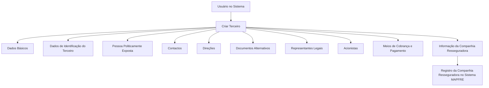
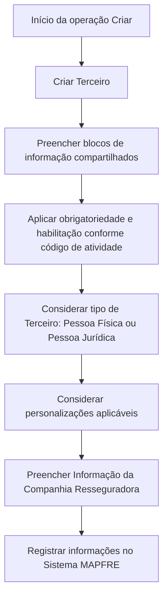

# Operação Criar Companhia Resseguradora — Registro de Terceiro no Sistema MAPFRE

## 1. Metadados do Documento
- **Arquivo de Origem:** Não identificado
- **Tipo de Documento:** Procedimento
- **Domínio / Sistema:** MAPFRE — operação de cadastro de Companhia Resseguradora
- **Público-Alvo:** Operação, Negócio, Analistas Funcionais
- **Data/Versão Identificada:** Não identificada

---

## 2. Resumo Executivo & Contexto de Negócio

O documento descreve a operação **Criar Companhia Resseguradora**, destinada ao registro, no sistema, das informações de companhias resseguradoras com as quais a entidade MAPFRE mantém relação comercial em processos operacionais.

O cadastro da Companhia Resseguradora é composto por blocos de informação compartilhados pela operação **Criar Terceiro** e por um bloco específico denominado **Informação da Companhia Resseguradora**. A estrutura do processo evidencia que uma Companhia Resseguradora é tratada como um tipo de Terceiro dentro do sistema.

A obrigatoriedade e a habilitação dos campos podem variar conforme o código de atividade do Terceiro e conforme o Terceiro seja uma Pessoa Física ou uma Pessoa Jurídica. Personalizações implementadas também podem alterar o comportamento da aplicação relativo à obrigatoriedade dos dados do Terceiro.

O documento informa ainda que a ordem de preenchimento dos blocos de informação pode variar conforme o critério adotado pelo usuário no sistema. Não são detalhados métodos de persistência, contratos de integração, URLs, tecnologias, regras de validação por campo ou fluxos de aprovação.

---

## 3. Arquitetura, Componentes & Tecnologias Envolvidas

Os componentes funcionais identificados são:

- **Sistema MAPFRE:** sistema no qual a Companhia Resseguradora é registrada.
- **Operação Criar Terceiro:** operação que disponibiliza blocos de informação compartilhados.
- **Operação Criar Companhia Resseguradora:** processo específico para criar as informações da Companhia Resseguradora.
- **Blocos de Informação Compartilhados:** estruturas de cadastro reutilizadas na operação Criar Terceiro.
- **Informação da Companhia Resseguradora:** bloco específico vinculado à atividade do Terceiro.



> **Nota de Análise:** O documento descreve blocos funcionais de cadastro, mas não detalha componentes técnicos, bancos de dados, APIs, protocolos, métodos HTTP, contratos JSON, ambientes ou tecnologias de implementação.

---

## 4. Regras de Negócio, Especificações Funcionais & Processos

### Objetivo operacional

A operação permite registrar no sistema as informações das Companhias Resseguradoras com as quais a entidade MAPFRE possui relação comercial em qualquer um de seus processos operacionais.

### Premissas de preenchimento

1. A obrigatoriedade e/ou habilitação dos campos de cada bloco ou estrutura de informação compartilhada pode variar de acordo com o **código de atividade do Terceiro**.
2. A obrigatoriedade e/ou habilitação dos campos pode variar conforme o tipo de Terceiro seja:
   - Pessoa Física;
   - Pessoa Jurídica.
3. Personalizações implementadas podem afetar o comportamento da aplicação quanto à obrigatoriedade de registro dos Dados do Terceiro.
4. A ordem de captura das informações nos diferentes blocos pode variar conforme o critério seguido pelo usuário no sistema.
5. O processo de criação da Companhia Resseguradora utiliza blocos de informação compartilhados da operação **Criar Terceiro**.
6. O processo inclui um bloco de informação específico de acordo com a atividade do Terceiro: **Informação da Companhia Resseguradora**.

### Fluxo funcional identificado



> **Nota de Análise:** O documento não especifica quais campos são obrigatórios para cada código de atividade, quais personalizações existem, quais validações devem ser aplicadas nem quais critérios identificam uma Companhia Resseguradora como Pessoa Física ou Pessoa Jurídica.

---

## 5. Tabelas de Parâmetros, Ambientes e Estruturas de Dados

| Item / Parâmetro | Descrição / Função | Tipo / Valores / Formato | Ambiente / Observações |
| :--- | :--- | :--- | :--- |
| Companhia Resseguradora | Entidade cujas informações são registradas no sistema MAPFRE. | Terceiro | Mantém relação comercial com a entidade MAPFRE. |
| Operação Criar Terceiro | Operação que reúne os blocos de informação compartilhados utilizados no cadastro. | Processo operacional | Usada como base para a criação da Companhia Resseguradora. |
| Código de atividade do Terceiro | Critério que pode alterar a obrigatoriedade ou habilitação de campos. | Código não detalhado | Valores e regras associadas não informados. |
| Tipo de Terceiro | Critério que pode alterar a obrigatoriedade ou habilitação dos campos. | Pessoa Física ou Pessoa Jurídica | O documento não associa campos específicos a cada tipo. |
| Personalizações | Implementações que podem modificar o comportamento da aplicação sobre a obrigatoriedade dos dados. | Não detalhado | Escopo, responsáveis e regras não informados. |
| Dados Básicos | Bloco de informação compartilhado no processo Criar Terceiro. | Bloco de cadastro | Campos internos não detalhados. |
| Dados de Identificação do Terceiro | Bloco de informação compartilhado no processo Criar Terceiro. | Bloco de cadastro | Campos internos não detalhados. |
| Pessoa Politicamente Exposta | Bloco de informação compartilhado no processo Criar Terceiro. | Bloco de cadastro | Critérios de classificação não detalhados. |
| Contactos | Bloco de informação compartilhado no processo Criar Terceiro. | Bloco de cadastro | Campos internos não detalhados. |
| Direções | Bloco de informação compartilhado no processo Criar Terceiro. | Bloco de cadastro | Campos internos não detalhados. |
| Documentos Alternativos | Bloco de informação compartilhado no processo Criar Terceiro. | Bloco de cadastro | Tipos documentais não detalhados. |
| Representantes Legais | Bloco de informação compartilhado no processo Criar Terceiro. | Bloco de cadastro | Critérios e campos não detalhados. |
| Acionistas | Bloco de informação compartilhado no processo Criar Terceiro. | Bloco de cadastro | Critérios e campos não detalhados. |
| Meios de Cobrança e Pagamento | Bloco de informação compartilhado no processo Criar Terceiro. | Bloco de cadastro | Métodos, contas e regras não detalhados. |
| Informação da Companhia Resseguradora | Bloco específico da atividade do Terceiro. | Bloco de informação específico | Campos e regras de preenchimento não detalhados. |

---

## 6. Bateria de Perguntas & Respostas para RAG (FAQ Sintético)

### P1: Qual é o objetivo da operação Criar Companhia Resseguradora?
**R:** A operação Criar Companhia Resseguradora permite registrar no sistema as informações de companhias resseguradoras com as quais a entidade MAPFRE possui uma relação comercial em qualquer um de seus processos operacionais.

### P2: A Companhia Resseguradora é cadastrada como qual tipo de entidade no sistema?
**R:** A Companhia Resseguradora é tratada no processo como um Terceiro, pois o fluxo utiliza a operação Criar Terceiro e seus blocos de informação compartilhados.

### P3: Quais fatores podem alterar a obrigatoriedade dos campos do cadastro?
**R:** A obrigatoriedade e a habilitação dos campos podem variar conforme o código de atividade do Terceiro, o tipo de Terceiro — Pessoa Física ou Pessoa Jurídica — e as personalizações que tenham sido implementadas na aplicação.

### P4: A ordem de preenchimento dos blocos de informação é fixa?
**R:** Não. O documento informa que a ordem de captura dos dados nos distintos blocos de informação pode variar conforme o critério seguido pelo usuário no sistema.

### P5: Quais blocos compartilhados fazem parte da operação Criar Terceiro?
**R:** Os blocos compartilhados listados são Dados Básicos, Dados de Identificação do Terceiro, Pessoa Politicamente Exposta, Contactos, Direções, Documentos Alternativos, Representantes Legais, Acionistas e Meios de Cobrança e Pagamento.

### P6: Qual bloco é específico para o cadastro de uma Companhia Resseguradora?
**R:** O bloco específico indicado no processo é Informação da Companhia Resseguradora, classificado como uma estrutura de informação específica de acordo com a atividade do Terceiro.

### P7: O documento define quais campos devem ser preenchidos para Pessoa Física e Pessoa Jurídica?
**R:** Não. O documento apenas informa que a obrigatoriedade e/ou habilitação dos campos pode variar se o Terceiro for uma Pessoa Física ou uma Pessoa Jurídica, sem detalhar os campos aplicáveis em cada caso.

### P8: O documento especifica regras detalhadas para o código de atividade do Terceiro?
**R:** Não. O texto afirma que o código de atividade do Terceiro pode influenciar a obrigatoriedade e a habilitação dos campos, mas não informa códigos, valores, mapeamentos ou regras específicas.

### P9: Personalizações podem modificar o comportamento do cadastro?
**R:** Sim. O documento afirma que personalizações implementadas podem afetar o comportamento da aplicação em relação à obrigatoriedade do registro dos Dados do Terceiro.

### P10: O documento descreve APIs ou contratos de integração para criar uma Companhia Resseguradora?
**R:** Não. Não há descrição de APIs, métodos HTTP, contratos JSON, URLs, endpoints, serviços técnicos ou mecanismos de integração.

---

## 7. Glossário de Termos, Siglas & Conceitos-Chave

- **MAPFRE:** Entidade mencionada como possuidora de relação comercial com as Companhias Resseguradoras registradas no sistema.
- **Terceiro:** Entidade cadastrada por meio da operação Criar Terceiro; a Companhia Resseguradora é tratada como Terceiro no processo apresentado.
- **Companhia Resseguradora:** Companhia cuja informação é registrada no sistema devido à sua relação comercial com a entidade MAPFRE.
- **Código de atividade do Terceiro:** Critério que pode determinar variações na obrigatoriedade e na habilitação dos campos de cadastro.
- **Pessoa Física:** Tipo de Terceiro que pode influenciar a obrigatoriedade e habilitação dos campos.
- **Pessoa Jurídica:** Tipo de Terceiro que pode influenciar a obrigatoriedade e habilitação dos campos.
- **Pessoa Politicamente Exposta:** Bloco de informação compartilhado da operação Criar Terceiro.
- **Blocos de Informação Compartilhados:** Estruturas de informação reutilizadas na operação Criar Terceiro.
- **Blocos de Informação Específicos:** Estruturas de informação aplicáveis conforme a atividade do Terceiro.
- **Personalizações:** Implementações que podem alterar o comportamento da aplicação referente à obrigatoriedade do registro dos dados.

---

## 8. Notas Críticas, Riscos & Limitações

- O documento não identifica o nome do arquivo, data, versão, autor ou responsável pelo procedimento.
- O documento não detalha os campos internos de nenhum bloco de informação.
- Não há definição dos códigos de atividade do Terceiro nem do efeito de cada código sobre os campos.
- Não há matriz de obrigatoriedade por tipo de Terceiro, Pessoa Física ou Pessoa Jurídica.
- As personalizações são mencionadas, porém não são descritas ou catalogadas.
- Não há critérios de validação, mensagens de erro, regras de aprovação, persistência ou auditoria.
- Não há especificação de integrações, APIs, métodos HTTP, contratos de dados, URLs, ambientes ou rotas de log.
- A possibilidade de o usuário escolher a ordem de captura dos blocos exige que a operação suporte variações na sequência de preenchimento; o documento não informa como o sistema controla dependências entre blocos.

---

## 9. Conteúdo Bruto Estruturado (Referência Fiel)

```text
--- [PÁGINA 1 DE 2] ---

OPERACIÓN CREAR Compañía Reaseguradora
¿En que consiste?
Esta operación permite registrar en el Sistema la Información de las Compañías Reaseguradoras
con las que la entidad MAPFRE tiene una relación comercial en cualquiera de sus procesos
operativos.
Premisas
La obligatoriedad y/o la habilitación de los campos en el registro de los datos de cada uno de
los bloques o estructuras de información compartidas puede variar de acuerdo con el código de
actividad del Tercero:
La obligatoriedad y/o la habilitación de los campos en el registro de los datos de cada uno de
los bloques o estructuras de información pueden variar si el tipo de Tercero es una Persona
Física o una Persona Jurídica:
Las personalizaciones que se hubieran podido implementar a su vez pueden afectar el
comportamiento de la aplicación en relación con la obligatoriedad en el registro de los Datos del
Tercero.
Ejemplo:
Ejemplo:
 /
 RS
Inicio Soluciones APIs Documentación Zeus
ES

--- [PÁGINA 2 DE 2] ---

Por último, el orden de captura de los datos en los distintos bloques de Información puede
variar de acuerdo con el criterio seguido por el Usuario en el Sistema.
Proceso
CREAR
TERCERO
Crear Información de la
Compañía Reaseguradora
Bloques de Información Compartidos (CREAR TERCERO)
 Datos Básicos ( )
 Datos Identificación del Tercero ( )
 Persona Políticamente Expuesta ( )
 Contactos ( )
 Direcciones ( )
 Documentos Alternativos ( )
 Representantes Legales ( )
 Accionistas ( )
 Medios de Cobro y Pago ( )
Bloques de Información Específicos de acuerdo con la
Actividad del Tercero.
 Información de la Compañía Reaseguradora( )
```
